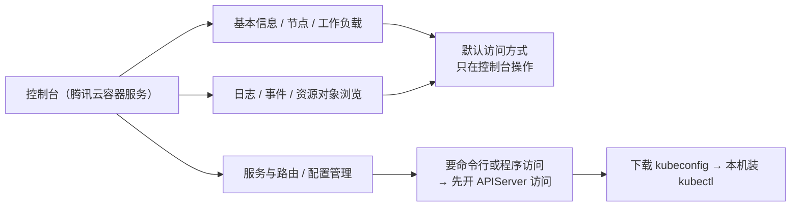
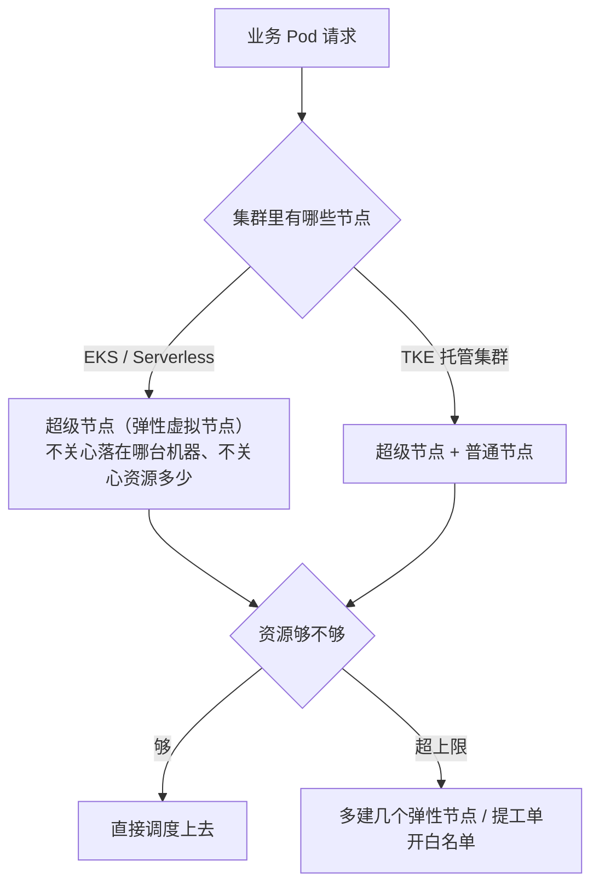
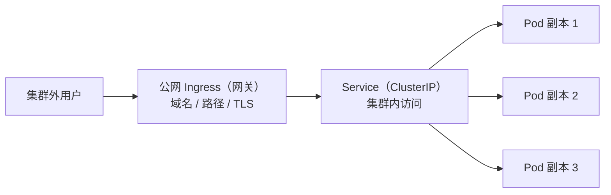

# Kubernetes 认证考点: 集群与服务的管理和配置 —— 控制台十块内容、APIServer 访问开关与 kubeconfig

**镜像部署完只是第一步。这一节沿腾讯云容器服务的集群页面走一遍，把"集群管理"这一整块拆开看：基本信息、超级节点、命名空间、工作负载、服务与路由、配置管理、授权管理、存储、组件管理、日志与事件、资源对象浏览。**

结论先给：**页面上大多数东西都能找到命令行对照物，真正卡人的只有一处 —— APIServer 访问开关。默认集群不开放任何访问入口，只能在控制台点；一旦要用 kubectl 或程序访问，就要在"基本信息"里打开内网（或外网）访问，把 kubeconfig 下载到本机、装好 kubectl、配好环境变量（或指定 KUBECONFIG）才能管这个集群。其余各栏本质都是 K8s 资源对象的可视化表单：工作负载选 Deployment/StatefulSet/CronJob、服务路由用 Service（集群内）+ Ingress（集群外）、配置用 ConfigMap（明文）/ Secret（加密）、权限用角色加绑定、排障看日志和 Events。**

## 纲要

- 为什么不用再单独部署 dashboard
- 集群基本信息：哪些字段才真正有用（重点：APIServer 访问开关）
- 打开访问之后：kubeconfig 与 kubectl 怎么用
- 超级节点与普通节点
- 命名空间与工作负载的类型怎么选
- 服务与路由：Service 类型对比与 Ingress
- 配置管理：ConfigMap 与 Secret 的分工
- 授权、存储、组件管理
- 日志与事件：排障的两个入口
- 资源对象浏览：别被资源数量吓住

## 为什么不用再单独部署 dashboard

**腾讯云的容器服务控制台本身已经覆盖了 dashboard 的大部分能力（工作负载、服务、配置、日志、事件都能看和改），所以不必再像自建集群那样额外部署一个 dashboard 的 K8s 扩展组件 —— 少部署一个组件，就少一个需要升级和排障的面。**



## 集群基本信息：哪些字段才真正有用

**进到集群页面看到的"基本信息"里有集群 ID、版本、部署类型、地域、网络、网段等一堆信息。字段本身只是声明，真正决定"我能不能从外面操作这个集群"的是下面这一项：APIServer 信息。**

| 基本信息项 | 说明 | 值不值得关注 |
| --- | --- | --- |
| **集群 ID** | 集群唯一标识，日志、工单、跨云资源关联都靠它 | 排障时能提供 |
| **版本** | K8s 版本号（如 1.22），决定 API 与特性门控 | 要，升级和兼容都看它 |
| **部署类型** | 托管集群 / Serverless（EKS 只有超级节点，TKE 还有普通节点） | 要，决定后面怎么扩 |
| **地域 / 可用区** | 集群机器所在的地域与可用区（如广州、香港一区二区） | 要，跨地域访问有延迟与费用 |
| **网络 / VPC** | 集群所在的虚拟私有云与子网 | 要，涉及内网互通 |
| **网段** | 容器网络地址（Pod 网段）、Service 地址段（如 192.168 或改过的 10 段） | **要，和云上其他网段冲突时就得改** |
| **APIServer 信息** | **访问地址与访问开关** | **最关键** |

**APIServer 访问开关的三档状态，选错就是踩坑：**

| 状态 | 谁能访问 | 风险 | 什么时候用 |
| --- | --- | --- | --- |
| **默认（什么都不开）** | **只能进腾讯云控制台点** | **无，但没法自动化** | **只做演示、只点鼠标** |
| **只开内网访问** | **同一 VPC / 同网段机器上的程序或 kubectl** | **可控，要访问得先有一台内网机器** | **日常开发、CI、程序调用（推荐）** |
| **开外网访问** | ** anywhere 能连到公网地址的人** | **高，等于把整个集群出口暴露在公网** | **本地笔记本要直接连时临时开，用完关掉** |

开启之后页面会给出权限查看，并且出现可下载的配置信息 —— **把这份配置（kubeconfig）下载到需要访问的机器上**，页面给的写法就是：客户端方式需要在主机上配一个环境变量，然后就能用命令管理集群；程序方式调用时同样要用这份 kubeconfig。

```text
腾讯云容器服务 → 集群 → 集群管理页（以 EKS / TKE 为例）
├── 基本信息                        ← 集群 ID / 版本 / 部署类型 / 地域 / 网络 / 网段
│   ├── APIServer 访问开关          ← 默认没开；程序或 kubectl 访问必须开内网或外网
│   │   └── 开启后：可见权限 + 下载 kubeconfig
│   └── kubeconfig 下载到本地机器    ← 复制到需要访问的机器，配环境变量 / 指定 KUBECONFIG
├── 节点                            ← EKS：超级节点；TKE：超级节点 + 普通节点
├── 命名空间                        ← 已建好 helloworld（业务）+ default / kube-system / kube-public
├── 工作负载                        ← Deployment（无状态）/ StatefulSet（有状态）/ CronJob（定时任务）
├── 服务与路由                      ← Service（集群内）+ Ingress（集群外，相当于网关）
├── 配置管理                        ← ConfigMap（key-value 明文）/ Secret（加密保存）
├── 授权管理                        ← 角色与权限 + 绑定（访问控制）
├── 存储                            ← 挂载磁盘（本演示没用到）
├── 组件管理                        ← 自己按需加组件
├── 日志                            ← 页面直接查容器 / Pod / 服务
├── 事件                            ← 指定某个 deployment 看事件（分配资源、挂掉、重启等）
└── 资源对象浏览                    ← K8s 资源很多，核心常用的就 node / pod / service
```

## 打开访问之后：kubeconfig 与 kubectl 怎么用

**kubeconfig 就是"我该连哪个集群、连的是谁（证书）、用哪个上下文"这三件事的配置文件。下载下来放到需要访问的那台机器上，装好 kubectl，配好环境变量（或每次指定），就能执行管理命令了。**

```bash
# ① 放置 kubeconfig（控制台下载的那一份）
mkdir -p ~/.kube && mv kubeconfig.tencentcloud.yaml ~/.kube/config

# ② 指定用哪份配置（多集群时更好用，不用改默认文件）
export KUBECONFIG=/path/to/kubeconfig.tencentcloud.yaml

# ③ 验证连上了没（能列出节点就说明 APIServer 访问开着、kubeconfig 对）
kubectl get nodes
kubectl get pods -n kube-system
```

程序访问同理：调用的时候也需要这份 kubeconfig（client-go 默认按 `KUBECONFIG` 环境变量和 `~/.kube/config` 找配置，找不到就报连不上）。

## 超级节点与普通节点

**EKS 里面只有超级节点，TKE 里面既有超级节点也有普通节点。超级节点是一个弹性的虚拟节点：** 具体落在哪台机器上不用管、资源是多是少也不用太关心，只要不超过这个弹性节点的资源上限就行。

- **规模小**：一个超级节点就能装下，别自己去做机器级别的规划；
- **规模大**：在同一个地方多建几个弹性节点就可以，每个弹性节点能支持的规模都很大；
- **真超过上限**：提工单跟云厂商的技术提需求，开白名单扩容即可，不用自己采购机器。



## 命名空间与工作负载的类型怎么选

**命名空间这一栏就是之前自己创建过的 helloworld；下面"工作负载"里是几种资源类型。**

| 工作负载类型 | 适用场景 | 对应 K8s 资源 | 选择理由 |
| --- | --- | --- | --- |
| **无状态服务** | 普通业务服务、可以随便重建的 | **Deployment** | **副本随便换、滚动更新好做，最常用** |
| **有状态服务** | 需要稳定名字、稳定存储、启动顺序的 | **StatefulSet** | **名字固定（pod-0/pod-1）、共享存储不共享副本** |
| **定时任务** | 定时跑一次就结束的任务 | **CronJob / Job** | **到点跑、跑完就结束，不需要长期在线** |

**自动伸缩**也在这一栏配置：之前讲过 HPA 的原理，这里还可以配"定时任务伸缩性"—— 按秒级、按 cron 任务的方式在指定时间把副本数拉上去（秒杀前扩容、每日高峰扩容这种强周期场景，比纯指标 HPA 更直接）。

## 服务与路由：Service 类型对比与 Ingress

**"服务与路由"这一栏里我们之前已经配置过服务。** 服务（Service）本身就是把服务暴露出来的一种方式，但它有好几种类型；**Ingress 相当于配一个网关，把服务对外暴露出去。**

| 方式 | 暴露范围 | 典型类型 | 什么时候用 |
| --- | --- | --- | --- |
| **Service（集群内）** | **只在集群内部可访问** | **ClusterIP（默认）** | **集群内服务互相调用（后面讲集群内调用就用它）** |
| **Service（节点暴露）** | **每台节点都可访问** | **NodePort** | **不想配网关、图简单时的临时方案** |
| **Service（负载均衡）** | **走云上负载均衡器** | **LoadBalancer** | **让云厂商帮你挂一个 LB** |
| **Ingress（网关）** | **从集群外进来** | **Ingress / 公网 Ingress** | **正式对外暴露 HTTP/HTTPS 服务，路径路由、域名、TLS 都靠它** |

**这一栏专门把 Ingress 单独拎出来是有原因的：Service 主要用来做集群内的访问，Ingress 是给集群外访问的；腾讯云里直接用公网 Ingress 会更容易一些** —— 不用自己再去挂负载均衡、配转发规则，控制台把这套东西封装好了。



## 配置管理：ConfigMap 与 Secret 的分工

**配置管理栏里有 ConfigMap 和 Secret 两种。**

| 项 | ConfigMap | Secret |
| --- | --- | --- |
| **形态** | **key-value 形式** | **key-value 形式，整体加密保存** |
| **谁读** | **集群内的 Pod 直接读到这个配置** | **同样能被集群内读，但内容加密存储** |
| **适用** | **普通配置（开关、文案、参数）** | **密码、证书、密钥、token** |
| **在本节课** | **直接在这个地方配，集群里就能读到** | **有些需要加密的内容写在小程序里也不太合适，就写到 Secret 里** |

**多做部署、多集群的场景下这一栏的价值才真正体现出来：同一个镜像要部署到不同集群、不同环境，配置各不相同，把配置从镜像里抽出来放到 ConfigMap，镜像只管一份，不同集群挂不同的配置就行了 —— 这比为每个环境打一个镜像省事得多，也比把配置写死在进程参数里更容易改。**

## 授权、存储、组件管理

- **授权管理**：去配置一些角色和权限，访问控制的时候把这些角色和权限绑定上去，安全性和访问控制这一块就更好一点 —— 控制台对应的是 RBAC（Role/ClusterRole + RoleBinding/ClusterRoleBinding）；
- **存储**：挂载一些磁盘。这一块本次演示没有用到，也就跳过了（真用到时就是 PVC/PV 与/storage 类的挂载）；
- **组件管理**：其实就是自己按需加一些组件，在这个地方勾选安装即可（控制台就是你做选型的地方，装完后面也都还能看得到）。

## 日志与事件：排障的两个入口

**日志这一块在页面上就可以直接去查容器里面、Pod 里面、服务等等的信息**。刚才进到工作负载里看具体一个服务、一个 Pod，也能看到这些日志信息。**事件也是同样：可以指定一个 deployment，查看相应的事件 —— 当它出现异常时，比如说等待资源分配、它挂掉了、重启了等等，这些异常都会打出来。**

| 入口 | 能看到什么 | 典型问题 |
| --- | --- | --- |
| **日志（Logs）** | **容器 stdout/stderr 的实时与历史输出** | **程序自己的报错、panic、请求日志** |
| **事件（Events）** | **K8s 层面的动作记录：等待资源分配、调度失败、拉镜像失败、OOMKilled、重启、驱逐** | **"容器为什么起不来"这类与业务代码无关的问题** |

**一句话分工：程序说它自己怎么了看日志，K8s 说这个 Pod 怎么了看事件。排障时先看 Events 缩小范围（是调度/拉镜像/资源的问题，还是进程自己退出的），再看 Logs 看业务报错。**

## 资源对象浏览：别被资源数量吓住

**最下面这个"资源对象浏览"里就很多了 —— K8s 里的资源特别多，我们要学要掌握的东西就特别多；但真正核心的、真正常用的其实没多少，像 node、pod、service 这几个用得最多，其他的用得比较少，真的用到了再看就好了。**

```text
K8s 资源（资源对象浏览里能看到的绝大部分）
├── 核心少而常用：node / pod / service / deployment / namespace
├── 配置与存储：configmap / secret / volume / pvc
├── 鉴权与策略：serviceaccount / role / clusterrole / binding / pdb / networkpolicy
├── 集群层面：node / namespace / apiservice
└── 扩展：crd / 自定义资源
# 真正日常打交道的就前三行里的那几个，其余用到再查
```

云上还有其他一些功能：**镜像仓库**这一节我们已经用到了（推镜像到 TCR）；还有**服务网格**，规模大了之后可以考虑选择这种形式，它比自己搭网关、配 proxy 这一类东西更容易配置一些。

## API 速览

| 配置 / 资源 | 作用 | 关键字段或动作 | 控制台位置 |
| --- | --- | --- | --- |
| **APIServer 访问开关** | **决定能否用 kubectl / 程序访问集群** | **内网 / 外网；不开就只能用控制台** | 基本信息 |
| **kubeconfig** | **集群地址 + 证书 + 上下文** | **下载到访问机器，配环境变量** | 基本信息 → 下载 |
| **超级节点** | **弹性虚拟节点，不关心落点与资源** | **超上限就多建 / 提工单开白名单** | 节点 |
| **Namespace** | **业务资源边界** | **helloworld（我们建的）** | 命名空间 |
| **Deployment** | **无状态服务** | **replicas、镜像、env、resources、HPA** | 工作负载 |
| **StatefulSet** | **有状态服务** | **稳定名字 + 稳定存储** | 工作负载 |
| **CronJob / Job** | **定时任务** | **schedule（cron 表达式）** | 工作负载 |
| **HPA / 定时伸缩** | **副本自动伸缩** | **指标伸缩、cron 定时伸缩** | 工作负载 → 自动伸缩 |
| **Service** | **集群内访问 / 暴露端口** | **ClusterIP、NodePort、LoadBalancer** | 服务与路由 |
| **Ingress** | **集群外访问（相当于网关）** | **公网 Ingress 在云上最容易配** | 服务与路由 |
| **ConfigMap** | **明文 key-value 配置** | **集群内可读，多环境多集群易实现** | 配置管理 |
| **Secret** | **加密保存的配置** | **密码、证书等敏感项** | 配置管理 |
| **角色与绑定** | **访问控制** | **角色 + 权限 + binding** | 授权管理 |
| **日志 / 事件** | **排障两个入口** | **Events 看 K8s 动作，Logs 看业务输出** | 日志 / 事件 |

## Demo 示例

把控制台上点的每一步，用命令行原样复述一遍：

```bash
# ① 基本信息对应什么：看集群与 kubeconfig 上下文
kubectl get nodes -o wide
kubectl version
kubectl config current-context
kubectl config get-clusters

# ② 命名空间（控制台上建好的 helloworld）
kubectl get ns
kubectl get ns helloworld

# ③ 工作负载三类都在哪
kubectl get deploy -n helloworld        # 无状态
kubectl get sts -n helloworld           # 有状态
kubectl get cronjob -n helloworld       # 定时任务

# ④ 服务与路由：Service（集群内）+ Ingress（集群外）
kubectl get svc -n helloworld
kubectl get ingress -n helloworld
kubectl get endpoints -n helloworld     # Endpoints 空 = 没选到 Pod

# ⑤ 配置管理：ConfigMap 与 Secret
kubectl get cm -n helloworld -o yaml
kubectl get secret -n helloworld -o yaml | head   # 看到的是加密后的内容

# ⑥ 授权管理
kubectl get role,clusterrole -n helloworld
kubectl get rolebinding,clusterrolebinding -n helloworld

# ⑦ 排障：先事件后日志
kubectl describe deploy/helloworld -n helloworld | tail -20
# 先给变量赋值，例如：POD=$(kubectl get pod -n helloworld -o jsonpath='{.items[0].metadata.name}')
kubectl describe pod $POD -n helloworld | grep -A5 -i events
kubectl logs -f $POD -n helloworld
kubectl logs $POD -n helloworld --previous    # 上一次崩溃的输出
```

一次典型的"起不来"排障顺序：

```text
kubectl get pod            → 状态不是 Running？
  ├─ Pending               → 看 Events：调度失败 / 资源不足（对应控制台"等待资源分配"）
  ├─ ImagePullBackOff      → 镜像名或凭证错（对应控制台要下的镜像拉取凭证）
  ├─ CrashLoopBackOff      → 容器起完就退 → kubectl logs --previous
  └─ Running 但连不上      → kubectl get endpoints（selector 与 Pod 标签对不上）→ 看 Service
```

## 总结

1. **不用额外部署 dashboard**：**腾讯云容器服务的可视化已经很完善，工作负载、服务、配置、日志、事件在控制台都能看能改，不必再像自建集群那样部署一个 dashboard 扩展，少一个组件就少一处要升级要排障的地方**；
2. **基本信息里真正关键的是 APIServer 信息**：**默认集群的访问什么都没开，只能在云端控制台操作；程序要调用至少要开内网访问，开外网访问也可以但风险更高（等于把集群暴露出去）；开启之后能查看到权限，还能把 kubeconfig 这份配置信息下载到本地机器上**；
3. **kubeconfig + kubectl 才能命令行管理**：**把配置下载到需要访问的机器上，客户端方式要配主机上的一个环境变量（或指定 KUBECONFIG），程序访问调用时同样要用这份配置，装好 kubectl 之后就能用命令管理这个集群了**；
4. **超级节点是弹性虚拟节点**：**EKS 里只有超级节点，TKE 里还有普通节点；超级节点不知道具体部署在哪个机器上、资源多少也不用太关心，只要不超过弹性节点的资源上限就行；规模大就多建几个，弹性节点支持规模很大，超过上限提工单开白名单即可**；
5. **命名空间与工作负载的类型**：**命名空间是我们之前建过的 helloworld；工作负载里有几种资源类型 —— Deployment 用于无状态服务、StatefulSet 适于有状态服务、还有定时任务类型；自动伸缩就是之前讲过原理的 HPA，也可以配按定时任务（cron 任务）的方式做伸缩性配置**；
6. **服务与路由的选择**：**Service 已经配置过，它是把服务暴露出来的一种方式，但有好几种类型，主要用在内网集群内访问；Ingress 相当于配一个网关把服务对外暴露，Ingress 主要是集群外访问，腾讯云里用公网 Ingress 会更容易一点，所以这一栏专门把它拎出来**；
7. **配置管理用 ConfigMap 和 Secret**：**ConfigMap 就是 key-value 的形式，直接配好集群里就能读到；如果还有好多部署在不同集群、不同集群有各自不同的配置，这样实现起来比较容易；Secret 也一样能帮我们加密保存，小程序里不太合适写的内容就写到 Secret 里，既省事又更安全**；
8. **授权、存储、组件管理**：**授权管理是配置一些角色和权限，访问控制时把这些角色和权限绑定上去，安全性和访问控制更好；存储是挂载磁盘，本演示没用到就跳过了；组件管理就是自己按需加组件，在这个地方勾选即可**；
9. **日志和事件是两个排障入口**：**日志在页面上直接能查容器里、Pod 里、服务这些的信息；事件可以指定一个 deployment 看相应事件，等待资源分配、挂掉、重启这类异常都会打出来 —— 异常先查事件缩小范围，再看日志定位业务报错**；
10. **资源对象浏览不用被吓住**：**K8s 资源非常多，但真正核心、真正常用的没多少，像 node、pod、service 这几个，其他用得少，真用到了再看；云上还有镜像仓库（已经用到）和服务网格（规模大时可选，比网关 proxy 更容易配置）**。

