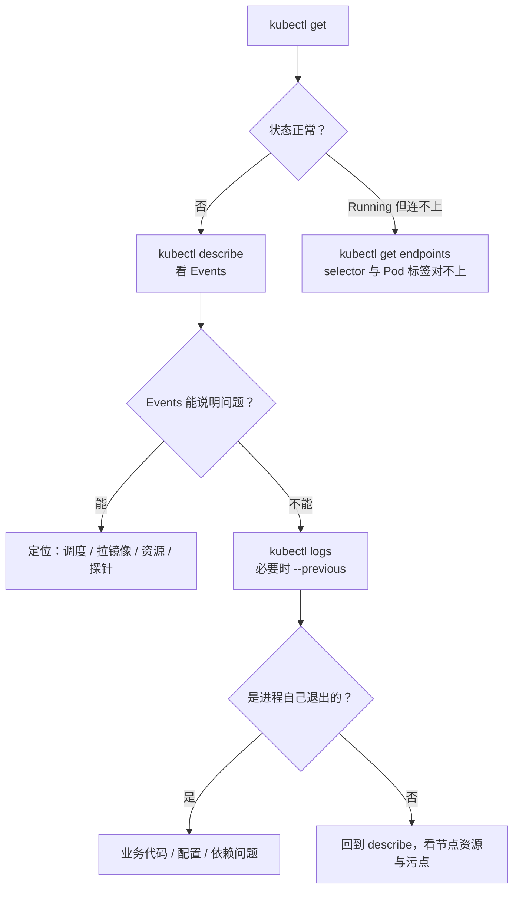

# Kubernetes 认证考点: 动手实践 —— 用命令行管理集群，以及 kubectl 分析 Pod 异常的标准排障路径

**这一节本来是留给动手时间的作业：除了控制台页面操作之外，命令行下怎么管理集群 —— 添加节点、对 node / service / deployment / pod / logs 的操作，以及 Pod 报错时怎么排查。**

结论先给：**这一节刻意不给"标准答案"，因为它考的是肌肉记忆而不是信息采集。真正值钱的是两件事：① 把 node / service / deployment / pod 这四类对象的日常命令练到不用想；② 把"Pod 起不来"拆成一条固定路径 —— `get` 看状态 → `describe` 看 Events → `logs`（必要时 `--previous`）看进程输出 → 再对不上就查 Service/Endpoints 与节点资源。按这条路径走一遍，绝大多数 Pod 异常都能在两分钟内定位到是调度、拉镜像、资源还是进程本身的问题。**

## 纲要

- 作业要练什么：两类任务
- kubectl 命令地图：node / service / deployment / pod / logs
- 添加节点这条命令
- Pod 异常的四步排查路径
- 排障顺序背后的判据
- 把命令练成肌肉记忆的练习方式

## 作业要练什么

**前面的视频里讲到过、用到过的命令，以及一些需要自己稍微查一下文档才能用的命令，都在这次作业范围里。**

| 任务 | 要求 | 难度 |
| --- | --- | --- |
| **A. 命令行管理集群** | **除了控制台页面操作，在命令行下如何管理集群（添加节点、对 node / service / deployment / pod / logs 的管理）** | **熟** |
| **B. 分析 Pod 异常** | **当 Pod 报错了要怎么排查问题 —— 工作或学习中一定会遇到 Pod 异常，这个技能必须掌握** | **要查文档 / 要练** |

**参考答案后面会发布，但更希望自己动手实践一遍：不论遇到多少困难还是多顺利，都是自己的收获，印象也会更深。**

## kubectl 命令地图

**node、service、deployment、pod 是 K8s 集群里经常接触的对象，所以要对它们的操作足够熟练。**

```text
kubectl 命令地图（每个对象都按「看 → 看细节 → 改 → 看结果」四步）
├── node
│   ├── kubectl get nodes -o wide                    # 节点是否 Ready、版本、内网 IP
│   ├── kubectl describe node <node>                 # 节点资源、污点、Conditions
│   └── kubectl cordon / drain / uncordon <node>     # 隔离 / 排空 / 恢复（加节点后常用）
├── service
│   ├── kubectl get svc [-n ns]                      # 类型、ClusterIP、端口
│   ├── kubectl describe svc <svc>                   # selector、Endpoints
│   └── kubectl get endpoints <svc>                  # 有没有挂上 Pod（空 = 连不上）
├── deployment
│   ├── kubectl get deploy [-n ns]                   # 期望/当前/可用副本数
│   ├── kubectl describe deploy <deploy>             # 事件与滚动更新进度
│   ├── kubectl set image deploy/<n> <容器>=<镜像>:<tag>   # 改镜像触发更新
│   ├── kubectl scale deploy/<n> --replicas=3        # 手动扩副本
│   └── kubectl rollout status / undo deploy/<n>     # 看进度 / 回滚
├── pod
│   ├── kubectl get pods [-n ns] -o wide             # 状态、节点、IP
│   ├── kubectl describe pod <pod>                   # 状态变更、Events（关键）
│   ├── kubectl logs <pod> [-c 容器]                 # 容器输出
│   └── kubectl exec -it <pod> -- /bin/sh           # 进容器
└── logs（通用）
    ├── kubectl logs -f <pod>                        # 跟随
    ├── kubectl logs <pod> --previous                # 上一次（崩溃前）的输出
    └── kubectl logs -l app=<name> --all-containers  # 按标签批量看
```



## 添加节点这条命令

**"添加节点"对应的就是集群节点管理：新机器加入后（云上控制台加节点，或自建 kubeadm 的 join），用命令看它有没有进来、有没有 Ready。**

```bash
# 先给变量赋值，例如：NODE=$(kubectl get node -o jsonpath='{.items[0].metadata.name}')
# 新节点进来之后第一件事：看见了吗、Ready 了吗
kubectl get nodes
kubectl get nodes -o wide

# 某个节点不正常时的细节（Conditions 里 Ready=False 的原因就在这里）
kubectl describe node $NODE | grep -A5 -i conditions

# 节点准备好了但上面一个 Pod 都跑不了 → 检查是不是不可调度
kubectl describe node $NODE | grep -i -E "taint|uncordon"
```

## Pod 异常的四步排查路径

**工作中或者学习过程中一定会遇到 Pod 异常，所以这个技能必须掌握。Pod 报错的排查建议固定成四步，不要每次临场发挥：**

```text
① kubectl get pod <pod> -o wide
   读到状态：Pending / ContainerCreating / ImagePullBackOff / CrashLoopBackOff
   / OOMKilled / Evicted / Terminating / Running 但 Readiness 失败

② kubectl describe pod <pod>
   读 Events（最后 20 行），这里会写清楚 K8s 到底在等什么、为什么失败：
   - FailedScheduling       → 节点不够 / 亲和或污点不满足 / 没节点可调度
   - ImagePullBackOff       → 镜像不存在、没凭证（私有仓库）或 tag 写错
   - FailedCreatePodSandBox → 运行时（containerd）或网络插件问题
   - Back-off restarting    → 容器退出后被反复拉起
   - OOMKilled              → 超过 limit.memory，先加内存上限再看

③ kubectl logs <pod> [--previous] [-c 容器]
   进程自己说的话：panic、配置读不到、连不上数据库、端口已被占用
   --previous 是排查 CrashLoopBackOff 的关键（当前容器已经空了，只剩上一次的输出）

④ 还不对劲 → 往上游查
   kubectl get endpoints <svc>        # Service 有没有选到这个 Pod
   kubectl get deploy <n> -o yaml | grep -A5 image   # 镜像名/版本对不对
   kubectl top pod <pod>              # 资源是不是被打满
```

## 排障顺序背后的判据

**为什么是这个顺序，而不是一上来就 `logs`：**

| 现象 | 先查什么 | 依据 |
| --- | --- | --- |
| **`Pending`** | **Events（`FailedScheduling`）** | **还没到进程那一层，容器根本没起，logs 一定空** |
| **`ImagePullBackOff`** | **describe 里的 Events + 镜像名/凭证** | **卡在拉镜像阶段，与业务代码无关** |
| **`CrashLoopBackOff`** | **先 `logs --previous`** | **容器反复退出，当前输出已被清空，只能看上一次** |
| **`OOMKilled`** | **resources.limit.memory 与实际需求** | **K8s 主动杀掉的，日志里多半只有被杀的提示** |
| **`Running` 但访问不通** | **`kubectl get endpoints`** | **Pod 起来了但没挂到 Service 上（selector 标签对不上）** |
| **`Evicted`** | **节点状态（`describe node`）** | **节点压力大触发驱逐，要先解决节点资源** |

**一句话：Events 讲"K8s 对这个 Pod 做了什么"，logs 讲"容器里发生了什么"。多数时候先看 Events 就能砍掉一大半可能性，剩下再进容器看输出。**

## 把命令练成肌肉记忆

**这类作业没有捷径，就是反复做。给自己一个最小练习闭环：部署 → 看状态 → 故意弄坏 → 排查。**

```bash
# ① 正常部署（这一步先做熟）
kubectl create ns demo
kubectl create deployment nginx --image=nginx:1.21 -n demo
kubectl scale deployment nginx --replicas=3 -n demo
kubectl get pods -n demo -o wide

# ② 故意弄坏几种，看自己能不能两步定位
#    a) 镜像写错 → 预期 ImagePullBackOff
kubectl set image deployment nginx nginx=nginx:notexist -n demo
kubectl get pods -n demo
# 先给变量赋值，例如：POD=$(kubectl get pod -n demo -o jsonpath='{.items[0].metadata.name}')；PENDING_POD=$(kubectl get pod -n demo --field-selector status.phase=Pending -o jsonpath='{.items[0].metadata.name}')
kubectl describe pod $POD -n demo | tail -15

#    b) 改一个压根选不上的 selector → 看 Endpoints 变空
kubectl get endpoints -n demo

#    c) 把副本数调到超过节点资源 → 预期 Pending（FailedScheduling）
kubectl scale deployment nginx --replicas=200 -n demo
kubectl get pods -n demo | grep Pending
kubectl describe pod $PENDING_POD -n demo | grep -A5 -i events
```

## API 速览

| 命令 | 作用 | 什么时候用 |
| --- | --- | --- |
| **`kubectl get nodes`** | **看节点是否 Ready** | **加了新节点、节点异常时** |
| **`kubectl get pods -o wide`** | **看状态与所在节点** | **排障第一步** |
| **`kubectl describe pod`** | **Events + 状态变更历史** | **定位"为什么起不来"** |
| **`kubectl logs [--previous]`** | **容器输出 / 上一次崩溃输出** | **`CrashLoopBackOff` 必用 `--previous`** |
| **`kubectl get endpoints`** | **Service 挂了哪些 Pod** | **Running 但连不上** |
| **`kubectl describe node`** | **Conditions、污点、资源** | **`Evicted` / 节点压力** |
| **`kubectl exec -it pod -- sh`** | **进容器** | **进去跑 client、看目录、手动复现** |
| **`kubectl exec ... -- env`** | **看容器环境变量** | **确认 ConfigMap/Secret 注入对不对** |

## Demo 示例

一次"Pod 起不来"的完整命令行复现（把控制台上的点击操作全部翻译成命令）：

```bash
# Step 1 看全局
kubectl get deploy,rs,pod,svc -n helloworld

# Step 2 落到具体 Pod，拿状态与节点
POD=$(kubectl get pod -n helloworld -o jsonpath='{.items[0].metadata.name}')
kubectl get pod $POD -n helloworld -o wide

# Step 3 Events（这一步通常就够了）
kubectl describe pod $POD -n helloworld | tail -20

# Step 4 进程输出；CrashLoopBackOff 一定要加 --previous
kubectl logs $POD -n helloworld
kubectl logs $POD -n helloworld --previous

# Step 5 对外链路：Service 有没有选到它
kubectl get svc -n helloworld
kubectl get endpoints -n helloworld

# Step 6 集群内自测（进容器跑客户端，和前面控制台验证同一件事）
kubectl exec -it $POD -n helloworld -- /bin/sh -c "cd /code && ./greeter_client"
```

排障时最容易被忽略的两条：

```bash
# ① Current 容器没输出 ≠ 没有问题，崩溃前的输出只在 --previous 里
kubectl logs $POD --previous

# ② Pod 是 Running 不代表能服务（就绪探针没过就不会进 Endpoints）
kubectl get pod $POD -n helloworld -o jsonpath='{.status.containerStatuses[0].ready}'
kubectl describe pod $POD -n helloworld | grep -i -A3 readiness
```

## 总结

1. **这次作业是留给动手时间的**：**除了控制台页面操作之外，命令行下如何管理集群，比如添加节点、以及对 node、service、deployment、pod、logs 的管理 —— 这些都是 K8s 集群中经常接触到的对象，所以需要对它们的操作足够熟练**；
2. **第二类任务是分析 Pod 异常**：**当 Pod 报错了要怎么来排查问题 —— 工作或者学习过程中一定会遇到 Pod 异常，所以这个技能也是必须掌握的**；
3. **参考答案会后面发布，但更希望自己先动手**：**不论遇到多少困难还是多顺利，都是自己的收获，也会有更加深刻的印象**；
4. **练熟的判据是"不用想"**：**一个命令能记住，前提是它每周都用。把 get / describe / logs / exec / endpoints 这五条路径练成肌肉记忆，比背下三四十个 flag 有用**；
5. **固定排障路径四步**：**`get` 看状态 → `describe` 读 Events → `logs --previous` 读进程输出 → 再往上查 endpoints 与节点资源。Events 讲 K8s 做了什么，logs 讲容器里发生了什么，先看 Events 能砍掉一大半可能性**；
6. **状态与结论的对应关系**：**Pending 查调度、ImagePullBackOff 查镜像名与凭证、CrashLoopBackOff 查 `--previous`、OOMKilled 查内存 limit、Running 但连不上查 Endpoints/selector、Evicted 查节点压力**；
7. **练习闭环**：**部署 → 看状态 → 故意弄坏（错的镜像、对的但选不上的 selector、超资源的副本数）→ 用固定路径定位。做坏三遍，比看十遍视频记得牢。**

