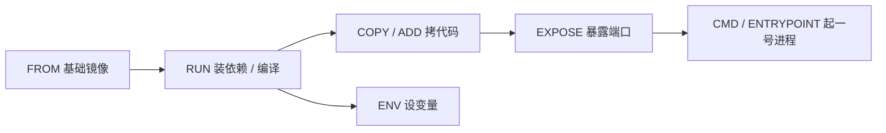

# Kubernetes 认证考点: 镜像仓库与 Dockerfile 的使用和管理 —— 常用指令、多阶段构建、按代码管理 Dockerfile 与仓库规划

**前面已经把多个文件写了一遍、也成功制作并上传到了容器注册中心，但讲得比较粗略。这一节回过头把三件事讲细：Dockerfile 里经常使用的命令有哪些、它们的含义是什么、怎么用；Dockerfile 文件的管理；镜像仓库的管理。**

结论先给：**Dockerfile 真正常用的指令其实就十来个 —— 最常写的是 FROM、RUN、CMD、EXPOSE，接着是 ENV、ADD、COPY、ENTRYPOINT，用得相对少一点的是 VOLUME、USER、WORKDIR、ARG，剩下的查文档即可。** 其中有三个坑最值得记住：**① 跨平台编译必须显式指定平台（M1 编出来的镜像放到 amd64 服务器上直接 exec format error）；② RUN 命令一长就容易写错，把它挪到脚本文件里执行；③ CMD/ENTRYPOINT 是容器的一号进程，退了容器就退了，Dockerfile 至少要指定其中一个。** 管理层面只有一条主线：**把 Dockerfile 和它依赖的本地文件目录当代码一样管起来（开发→构建→验证→提交代码仓库→上传镜像→部署→测试），目录按"镜像分类名 + 镜像名 + 版本"命名，仓库按命名空间/仓库名/tag 规划，历史版本该删就删（真需要能重建）。**

## 纲要

- Dockerfile 指令的四个梯队
- FROM：仓库、版本、摘要与平台
- AS 与多阶段构建
- RUN：为什么要把命令放进脚本文件
- CMD：容器的 1 号进程与三种写法
- EXPOSE：暴露端口与运行时覆盖
- ENV：构建时与运行时都能用的变量
- ADD 与 COPY：一个够用，一个更强
- ENTRYPOINT：与 CMD 的关系与覆盖规则
- VOLUME / USER / WORKDIR / ARG：用得少但会踩
- Dockerfile 怎么管：按代码管理
- 目录命名与镜像仓库规划
- 镜像大小、历史版本清理与云厂商能力

## Dockerfile 指令的四个梯队

**最常看到的是 FROM、RUN、CMD、EXPOSE；用得还挺多的是 ENV、ADD、COPY、ENTRYPOINT；相对用得少一点的是 VOLUME、USER、WORKDIR、ARG 这一组；还有一些不常见的，自己看文档就好了。**

| 梯队 | 指令 |
| --- | --- |
| **最常看到** | **FROM、RUN、CMD、EXPOSE** |
| **用得挺多** | **ENV、ADD、COPY、ENTRYPOINT** |
| **相对少用** | **VOLUME、USER、WORKDIR、ARG** |
| **不常见** | **查官方文档即可** |



## FROM：仓库、版本、摘要与平台

**FROM 是第一个也是最常用的指令，平时写就是"FROM 一个仓库 一个版本"。仓库可能带一个很长的域名地址，不带的话默认就会从 Docker Hub（docker.com）上面去下载。**

| 写法 | 含义 |
| --- | --- |
| **FROM nginx** | **基础仓库不带域名 → 默认从 Docker Hub 拉** |
| **FROM nginx:1.21** | **带 tag，指定版本** |
| **FROM nginx@sha256:...** | **指定摘要（digest），锁死不可变** |
| **FROM registry.cn-hangzhou.aliyuncs.com/.../base:3.16** | **带域名的私有仓库地址** |

**两个要注意的地方：**

1. **版本不写默认就是 latest** —— 这在生产上是个隐患，最好每次都写死（或写 digest）；
2. **一定要能指定运行的平台**：linux/amd64、linux/arm64 或者 windows。**用 M1 芯片的 MacBook 开发时，默认编出来的是 arm64 产物，放到 amd64 的服务器上运行会直接报 `exec format error`；反过来在 Windows 上编出来是 Windows 产物，放到 Linux 容器里跑同样有问题。** 解决办法就是构建时显式指定平台（详见后面 Demo 里的 `--platform linux/amd64`）。

## AS 与多阶段构建

**还有 `AS` 这条指令：它能创建出一个临时的镜像出来，比如在当前这步里创建出一个叫 `sourcecode` 的临时镜像，里面会有一个文件。实际工作里可能会在这个镜像里去拉代码、完成基础软件的安装或者编译这个过程；然后下面再有一个镜像，这个镜像有一个 COPY、下面会有一个 FROM —— 直接引用上一个镜像里生成的文件。**

**这种用法不算多，但多阶段构建（在多个环境里完成操作）确实会用到它：编译阶段装一堆编译工具、产出一个二进制；运行阶段只 FROM 一个极小的运行时镜像，把编译产物 COPY 过来，工具链全不带走，镜像体积一下就小了。**

```dockerfile
# 阶段一：编译（FROM ... AS builder）
FROM golang:1.19 AS builder
WORKDIR /src
COPY . .
RUN CGO_ENABLED=0 GOOS=linux go build -o /out/server .

# 阶段二：运行（只拿产物）
FROM alpine:3.16
WORKDIR /code
COPY --from=builder /out/server /code/server     # ← 直接从上一阶段拿文件
EXPOSE 50051
CMD ["./server"]
```

## RUN：为什么要把命令放进脚本文件

**RUN 用得特别多，自己写一个 shell 脚本都需要把 RUN 放到前面，后面写需要的脚本。如果脚本非常多、很复杂，这么写在 Dockerfile 里其实很容易写错 —— 所以还是建议把它放到一个 shell 脚本文件里面，在 Dockerfile 里只需要 RUN 去执行这一个文件就好了。**

```text
# 不推荐：一长串 && 既是缓存粒度失控，也容易打错字
RUN apt-get update && apt-get install -y \
      gcc make git curl \
      && ldconfig \
      && rm -rf /var/lib/apt/lists/*

# 推荐：装依赖的活儿交给脚本，Dockerfile 只留下一行
COPY scripts/install-deps.sh /tmp/
RUN bash /tmp/install-deps.sh
```

## CMD：容器的 1 号进程

**镜像运行起来、启动容器时，就会执行 CMD 这样的命令 —— 它是一个 1 号进程，必须是一个服务类的进程；如果这个 1 号进程终止了，整个容器也就终止了。**

**CMD 有两种（或者说三种）用法：**

| 形式 | 写法 | 说明 |
| --- | --- | --- |
| **exec 形式** | **`CMD ["./server"]`** | **JSON 数组，直接 exec，无 shell 包装（推荐）** |
| **shell 形式** | **`CMD ./server &`** | **走 `/bin/sh -c`，支持 shell 语法但 PID 1 是 shell** |
| **只作参数传给 ENTRYPOINT** | **`CMD ["--config","/etc/app.yaml"]`** | **ENTRYPOINT 定命令，CMD 给默认参数** |

**复杂启动命令同样建议放到一个脚本里做。** 判断标准很简单：这个镜像 `docker run` 起来之后，它应该像"一个服务"而不是"一个会退出的命令"—— 所以 CMD 后面一般是常驻进程（我们的 greeter_server 就是监听 50051 的那个服务）。

## EXPOSE：暴露端口与运行时覆盖

**EXPOSE 可以把容器内的端口暴露出来 —— 比如我们在容器里会启动一个 supervisord 服务、会监听 80 端口，就可以用一个 EXPOSE 把它暴露出来，同样可以把协议也带上；要暴露多个就写多行 EXPOSE。同样的，在容器启动时用 `docker run` 这个命令去启动一个容器，也可以去覆盖或者指定这样的一个暴露端口。**

| 写法 | 含义 |
| --- | --- |
| **`EXPOSE 80`** | **暴露 80** |
| **`EXPOSE 80/tcp`** | **带协议** |
| **`EXPOSE 80 443`** | **多行 / 多个端口** |
| **`docker run -p 8080:80`** | **运行时覆盖宿主机映射** |

## ENV：构建时与运行时都能用的变量

**ENV 可以去设置容器的这个变量，这个环境变量既可以在镜像构建的时候使用，也可以在容器运行起来之后再使用它 —— 和我们 Linux 里的 export 很像。**

```dockerfile
ENV ENV_NAME=dev          # 构建时写入镜像，运行后容器里也能 echo $ENV_NAME
ENV PATH=$PATH:/code      # 想让 /code 下的程序能直接敲命令时用得上
```

## ADD 与 COPY：一个够用，一个更强

**ADD 的指令是把 SRC 复制新文件、目录或者远程文件 URL，并添加到镜像的文件系统上 —— 不管从本地也好、远程也好，把文件复制到镜像里面来。如果 SRC 是一个 URL，它会下载到这个目标地址来；如果 SRC 是本地的压缩文件，它还会自动解压到目标目录里面。像解压、下载这两个 COPY 是不支持的，ADD 还可以下载 git 仓库，不过这种用得不太多。**

**COPY 和 ADD 很像，都是复制文件、目录到镜像里来；但 COPY 这个命令更简单一点也更纯粹一些，所以平时使用还是建议用 COPY。**

| 能力 | **ADD** | **COPY** |
| --- | --- | --- |
| **复制本地文件/目录** | ✅ | ✅ |
| **复制远程 URL（下载）** | ✅ | ❌ |
| **本地压缩文件自动解压** | ✅ | ❌ |
| **下载 git 仓库** | ✅（但很少用） | ❌ |
| **多阶段构建跨阶段取文件 `--from=`** | ✅ | ✅（更常用） |
| **建议** | — | **用 COPY；ADD 的复杂功能（解压/下载）其实可以用 RUN 执行脚本自己实现** |

```dockerfile
FROM alpine:3.16
COPY --from=builder /out/server /code/server   # 多阶段：从上一阶段直接拿产物
COPY config/app.yaml /code/config/             # 普通拷贝推荐用 COPY
```

## ENTRYPOINT：与 CMD 的关系与覆盖规则

**ENTRYPOINT 跟前面的 CMD 有点相似，都是可以定义容器启动时的执行命令，用法也是类似的，有 exec 形式和 shell 形式。`docker run` 也可以指定 `--entrypoint` 把 Dockerfile 里之前那个覆盖掉。Dockerfile 里应该至少要指定 CMD 或者 ENTRYPOINT 命令之一，如果没有的话这个镜像做完之后是没法运行的。**

| 场景 | 行为 |
| --- | --- |
| **只写 ENTRYPOINT** | **容器启动就执行它** |
| **只写 CMD** | **容器启动执行它** |
| **两个都写** | **ENTRYPOINT 定可执行程序，CMD 作为它的默认参数** |
| **`docker run <image>` 带参数** | **有参数来运行容器的话，CMD 会被重写** |
| **`docker run --entrypoint xxx`** | **覆盖掉 Dockerfile 里定义的 ENTRYPOINT** |

**官方文档里有一张表专门说明 CMD 与 ENTRYPOINT 同时存在、只存在一个时的交互关系，真用到的具体那张表看一眼就好。**

```dockerfile
ENTRYPOINT ["/code/entry.sh"]     # 定程序
CMD ["--mode", "server"]          # 默认参数（可被 docker run 覆盖）
```

## 用得少但会踩的四个

- **VOLUME**：挂载一个磁盘（声明式的数据卷挂载点）；
- **USER**：创建一个用户、用户组，之后以这个身份跑进程（权限收小一点更安全）；
- **WORKDIR**：定义当前镜像和容器的当前工作目录。"像 WORKDIR 写了多次 abc/def，那最后的结果其实是进入到最后那一个目录里面来" —— 写的时候小心一点，多写几次就是多层嵌套，实际工程中不会这么用；
- **ARG**：参数形式跟 ENV 很像，**但它这个只是在镜像制作的时候才有用**（构建时传 `--build-arg`，运行后容器里读不到）。

## Dockerfile 怎么管：按代码管理

**如果只是学习性写一两个 Dockerfile 文件，当然不需要怎么管理，毕竟太少了；如果团队中有好几个 Dockerfile，那就需要小心管理了，包括这个文件同时它还可能依赖很多本地的文件和目录，这些都需要一起管理起来。**

**镜像不可能是一次性的 —— 会遇到功能升级、系统漏洞需要修复等等情况，甚至会有镜像被无意删除的时候，这就需要找到原始的 Dockerfile 和依赖文件目录，再次构建出一样的镜像，或者在原来基础之上做修改和更新。如果没有把这些文件目录都一起管理起来，遇到上面这种情况就麻烦了。**

**怎么管？其实把这些文件按照代码管理一样来做就好了：开发、构建、验证、提交代码仓库、上传容器镜像到注册中心、服务部署、测试 —— 和代码管理系统开发一样的流程。有代码仓库帮我们把文件保存起来，还有历史版本可以查看对比，甚至还可以多人协作。**

```text
代码仓库（Git）里的镜像工程目录
├── Dockerfile                 ← 按代码一样提交、有版本、可对比
├── Makefile / build.sh        ← RUN 里执行的脚本（别把长命令堆在 Dockerfile 里）
├── scripts/
│   ├── install-deps.sh        ← 装依赖（RUN bash scripts/install-deps.sh）
│   └── entry.sh               ← 复杂启动命令放脚本
├── config/
│   └── app.yaml                ← 一起提交的本地依赖文件
├── src/                        ← 源码（多阶段构建里被 COPY 进去的）
└── README.md                   ← 这个镜像干嘛的、版本怎么打、谁维护
```

## 目录命名与镜像仓库规划

**关于文件管理，建议目录名称的格式为"镜像分类名称" —— 可以按照操作系统、环境、业务、框架、开发语言等分类，再加镜像名称和版本。不要觉得这么定义目录还挺麻烦，实际上基础镜像并没有那么多，大部分都是服务镜像，而服务镜像的差异都是在源码环节，所以把差异点提炼一下，也没有太多镜像了。**

```text
镜像分类维度（选几个拼起来就够，别一次想全）
├── 按操作系统    alpine / centos / ubuntu
├── 按环境        dev / test / prod
├── 按业务        业务线或系统名
├── 按框架        gin / grpc / springboot
└── 按开发语言    go / java / node
# 组合示例：<os>-<lang>-<service>/<service>:<version>
```

**镜像仓库的管理，目的也是为了给服务部署提供方便，所以要规划好仓库的存储目录和规模、存储路径，包括命名空间和仓库名称以及版本名称 —— 和 Dockerfile 目录只是服务的镜像版本会更多。这个 tag 名称可以和每次发布的版本名称一样，或者是代码提交给仓库时的 tag 名称。**

| 规划项 | 建议 |
| --- | --- |
| **命名空间** | **按团队 / 业务划分，权限能收在一处** |
| **仓库名** | **对应一个服务镜像（一个服务一个仓库）** |
| **tag** | **用发布版本号，或代码提交时的 tag 名；别乱用 latest** |
| **本地目录** | **镜像分类名 + 镜像名 + 版本，与仓库名对应得上** |

## 镜像大小、历史版本清理与云厂商能力

**还要多关注一下镜像大小：很小的镜像也是有几十兆，大部分业务的基础镜像就会有上百兆，如果镜像大小超过一两个 G 就要小心了 —— 因为镜像太大会带来推送、拉取的耗时过长，也就影响服务部署启动的速度；另外镜像越大占用的存储空间也越大，这也是一项成本开支。**

- **因此随着版本不断增加、历史版本基本上已经不会再使用了，就可以考虑把这些不会再用到的镜像及时删除了**；
- **当然如果有一天真的需要用了，也可以从代码仓库或者 Dockerfile 重新构建一个一样的镜像出来 —— 前提条件是做好了代码管理以及 Dockerfile 管理。**（这就是前面为什么必须"按代码管理"的根本原因）；
- **云厂商提供的容器注册中心（TCR 这类）还额外提供了不少实用功能：多地备份、异地同步、镜像的安全扫描、K8s 集群节点的镜像缓存等。** 把云原生这些产品服务用起来，不仅可以提高研发效率、降低成本，也能提高服务的稳定性、可靠性和安全性。

## API 速览

| 指令 | 作用 | 关键注意点 |
| --- | --- | --- |
| **FROM** | **指定基础镜像** | **不带域名默认 Docker Hub；不写 tag 默认 latest；跨平台要显式指定平台** |
| **AS** | **给构建阶段命名** | **多阶段构建里 `COPY --from=<name>` 的来源** |
| **RUN** | **构建期执行命令** | **命令多、复杂就放脚本文件里执行** |
| **CMD** | **容器启动命令（1 号进程）** | **必须是服务类进程，退了容器就退了；会作为 ENTRYPOINT 的默认参数；`docker run` 带参会重写** |
| **ENTRYPOINT** | **容器启动可执行程序** | **exec/shell 两种形式；`--entrypoint` 可覆盖；与 CMD 至少写一个** |
| **EXPOSE** | **声明暴露端口** | **可带协议、可多行；`docker run -p` 可覆盖** |
| **ENV** | **设置环境变量** | **构建时 + 运行时都能用** |
| **ARG** | **构建参数** | **只在镜像制作时有效，运行后读不到** |
| **ADD** | **复制/下载/自动解压** | **COPY 不支持下载与解压；功能强但不建议滥用** |
| **COPY** | **复制文件/目录** | **更简单纯粹，优先用它；支持 `--from` 多阶段跨阶段取文件** |
| **VOLUME** | **挂载磁盘** | **声明数据卷** |
| **USER** | **指定运行用户** | **权限最小化** |
| **WORKDIR** | **设置工作目录** | **写多次就是多层嵌套，最后落在最后一个目录** |
| **LABEL** | **镜像元信息** | 便于筛选与说明 |

## Demo 示例

一个"能直接跑"的最小可用 Dockerfile，把上面几条常用指令串起来（对应前面 helloworld 服务）：

```bash
# ① 先在 M1 上交叉编译出 Linux amd64 产物（否则放服务器报 exec format error）
GOOS=linux GOARCH=amd64 CGO_ENABLED=0 go build -o greeter_server ./server
```

```dockerfile
# ② Dockerfile
FROM alpine:3.16                      # 不带域名 → Docker Hub；写死版本不用 latest
RUN apk update && apk add bash        # 太干净的 alpine 里连 bash 都没有
RUN mkdir -p /code

COPY greeter_server /code/            # 优先用 COPY（ADD 只有下载/解压需求才用）
COPY config/ /code/config/            # 依赖文件必须一起提交/一起 COPY
ENV ENV_NAME=prod                     # 构建时写进镜像，运行后容器里也能读

WORKDIR /code                         # 进入容器默认就在这个目录
EXPOSE 50051                          # 暴露 gRPC 默认端口（协议可写 50051/tcp）
CMD ["./greeter_server"]              # 1 号进程 = 常驻服务，不能直接退
```

```bash
# ③ 构建：三参数一个都不能少
# 先给变量赋值，例如：NS=helloworld
docker build -f Dockerfile \
  --network host \
  --platform linux/amd64 \
  -t ccr.ccs.tencentyun.com/$NS/helloworld:v1 .

# ④ 本地跑起来验证（宿主同网段直接连 50051）
docker run --rm -p 50051:50051 --name hw ccr.ccs.tencentyun.com/$NS/helloworld:v1

# ⑤ 推到注册中心，供 K8s 拉取
docker login ccr.ccs.tencentyun.com
docker push ccr.ccs.tencentyun.com/$NS/helloworld:v1
```

排障对照：

```bash
# 先给变量赋值，例如：CONTAINER=web；IMAGE=ccr.ccs.tencentyun.com/fan/helloworld:v1
# 镜像起不来 → 看 1 号进程是不是退了
docker logs $CONTAINER
docker run --rm --entrypoint /bin/sh $IMAGE      # 覆盖 ENTRYPOINT 进去看
docker run --rm --entrypoint /bin/sh $IMAGE -c "ls /code"

# 编译产物放错机器 → exec format error，说明忘了 --platform linux/amd64
docker build --platform linux/amd64 ...
```

## 总结

1. **Dockerfile 常用指令其实就十来个**：**最常看到的是 FROM、RUN、CMD、EXPOSE；用得挺多的是 ENV、ADD、COPY、ENTRYPOINT；相对少一点的是 VOLUME、USER、WORKDIR、ARG；不常见的查文档就好，写两个就都会了，不必把它想得多难多神秘**；
2. **FROM 的三种形态**：**平时用的就是 FROM 一个仓库一个版本；仓库可能带一个很长的域名地址，不带的话默认从 docker.com 上拉；可以指定 tag 也可以指定摘要（digest），不指定默认就是 latest 版本**；
3. **跨平台编译是硬坑**：**FROM 还能指定运行平台（linux/amd64、linux/arm64 或者 windows）；M1 芯片默认编出来的是 arm64 产物，放到服务器上运行会报错，在 Windows 上编出来也一样有坑，所以构建时要显式指定平台**；
4. **AS 与多阶段构建**：**AS 能创建出一个临时的镜像（比如叫 sourcecode），在里面拉代码、装基础软件、完成编译；下面再有一个镜像 COPY 一个 FROM 直接引用上一个镜像里生成的文件——多阶段构建不是常用写法，但需要在多个环境里完成操作时还是会用到**；
5. **RUN 要放脚本文件**：**RUN 用得特别多，脚本多且复杂时直接写在 Dockerfile 里很容易写错，建议放到一个 shell 脚本文件里，然后 RUN 只负责执行这一个文件**；
6. **CMD 是 1 号进程**：**镜像运行启动容器时就执行 CMD，它必须是一个服务类进程，1 号进程一旦终止整个容器也就终止；有 executable（exec）和 shell 两种形式，还可以只作为参数传给 ENTRYPOINT，复杂启动命令一样建议放进脚本**；
7. **EXPOSE 与 ENV**：**EXPOSE 把容器内端口暴露出来（可以带协议、多行写，`docker run` 启动时还能覆盖）；ENV 设置容器变量，构建时能用、容器跑起来之后也还能用，和我们 Linux 里的 export 很像**；
8. **ADD 与 COPY 怎么选**：**ADD 能把 SRC（本地文件/目录/远程 URL）加进镜像，SRC 是 URL 会下载、本地是压缩文件会自动解压、还能拉 git 仓库（用得不多），这些 COPY 都不支持；COPY 更简单更纯粹，平时建议用 COPY，ADD 那点复杂功能其实用 RUN 执行脚本也能实现。COPY 还支持 `--from`，多阶段构建时把前面阶段生成的文件直接拿来用**；
9. **ENTRYPOINT 与 CMD 的关系**：**用法类似（都有 exec / shell 形式），`docker run` 可以指定 --entrypoint 把 Dockerfile 里那个覆盖掉；Dockerfile 里至少指定 CMD 或 ENTRYPOINT 之一，都没有这个镜像做完就没法运行；CMD 作为 ENTRYPOINT 的默认参数，运行时带参数会把 CMD 重写，官方文档里有一张表讲它们的交互关系**；
10. **四个用得少的**：**VOLUME 挂磁盘；USER 创建用户用户组；WORKDIR 定义工作目录（写了多次 abc 最后就进到最后一个目录，小心写法）；ARG 跟 ENV 很像但只在镜像制作时有效**；
11. **Dockerfile 必须按代码管理**：**一两个不用管，团队里好几个就要小心了，而且它可能依赖很多本地文件和目录都要一起管；镜像不是一次性的，会升级、会修漏洞、也可能被误删，没有管理就只能重建不回来。按代码管理就是走开发→构建→验证→提交代码仓库→上传镜像注册中心→服务部署→测试这条和代码一样的流程，有历史版本可查对比，还能多人协作**；
12. **目录与仓库的命名**：**目录名称格式建议"镜像分类名（按操作系统/环境/业务/框架/开发语言）+ 镜像名 + 版本"；基础镜像没那么多，服务镜像的差异主要在源码环节，差异点提炼一下没多少。仓库规划好存储目录与规模、命名空间、仓库名、版本名，tag 名称和每次发布的版本一致或者用代码提交时的 tag**；
13. **镜像大小与历史版本**：**小镜像几十兆，业务基础镜像上百兆，超过一两个 G 就要小心 —— 推送拉取耗时长会直接影响部署启动速度，占用存储也是成本；历史版本基本不再用就及时删，真需要时能从代码仓库或 Dockerfile 重新构建出来，前提是代码管理和 Dockerfile 管理做好了**；
14. **云厂商注册中心的附加能力**：**多地备份、异地同步、镜像安全扫描、K8s 集群节点的镜像缓存等，用起来既提效率又降成本，还能提升稳定性、可靠性和安全性**。

