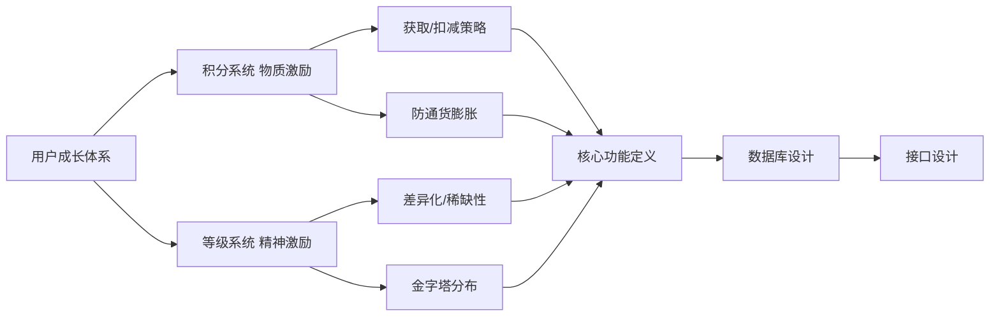

# 用户成长体系设计：本章导学

从这一章开始，咱们正式进入**项目实战环节**。这次的实战项目是"用户成长体系"——它本身是一个庞大而复杂的体系，课程不可能面面俱到，只能把最常见、最典型的应用提炼出来讲。所以本章聚焦在成长体系中的 **积分系统** 和 **等级系统** 两块。

在动手写代码之前，第一步永远是**需求调研与系统设计**。需求调研这部分日常工作中你一定经常和产品、运营同学讨论，所以本章略过，直接基于经验**假设使用场景**来设计系统。

## 纲要

- 实战项目定位：用户成长体系中的"积分 + 等级"子系统
- 为什么先学成熟方案：借鉴业界已验证的设计，少走弯路
- 积分系统设计：定义是什么、能做什么、怎么获取/扣减、防通胀策略
- 等级系统设计：身份认同、差异化稀缺性、特权与金字塔分布
- 核心功能定义：驱动详细设计（数据库设计 + 接口设计）
- 数据库设计先行：提炼数据模型 → 定义关键字段 → 建表 → 搭开发环境

## 两大子系统对照

| 子系统 | 激励类型 | 回答的核心问题 | 关键设计点 |
| --- | --- | --- | --- |
| 积分系统 | 物质激励（虚拟货币） | 是什么 / 能做什么 / 怎么获取与扣减 | 防通货膨胀、兑换规则 |
| 等级系统 | 精神激励（身份标签） | 如何体现差异化与稀缺性 | 金字塔分布、核心用户特权 |
## 为什么从"成熟方案"学起

开始具体设计前，本章先带大家了解**常见的用户成长体系设计**。业界已经有很多成熟方案，我们可以直接参照使用，不必闭门造车。但请注意：实际工作中不需要实验所有种类的成长体系，**按需选择合适的即可**，完全照抄反而可能"弄得不伦不类"。



## 积分系统与等级系统的设计要点

课程挑选了**用户积分**和**用户等级**这两种最典型、也最容易被人接受的方案来实战，原因很简单：它们覆盖最广、认知成本最低。

**积分系统（物质激励）**的设计要回答：

- 积分是什么、能做什么、要注意什么、如何工作；
- 怎么获取、怎么扣减；
- 策略性定义——**怎么避免通货膨胀**、怎么兑换等。

**等级系统（精神激励 / 身份认同）**的设计要回答：

- 等级如何体现差异化与稀缺性，才有更高的认同和吸引力；
- 在人群分布上，更高等级用户数量应呈**指数递减的金字塔模型**；
- 对**付费的高等级用户**要特别照顾——他们是最核心、最有价值的用户，可设计差异化特权、定制礼品或特价。

> 一句话区分：积分是"虚拟货币"（物质激励，受成本预算约束），等级是"身份标签"（精神激励，靠稀缺性驱动）。

## 从设计到详细实现

把积分和等级"是什么、能做什么、注意什么"定义清楚后，就要落到**核心功能**上。这些功能会直接驱动详细设计，包括：

1. **数据库设计**：定义系统要用到的数据表，以及各自的关键字段；
2. **接口设计**：定义对外暴露的服务接口；
3. **建表与环境搭建**：有了数据表，就能建立数据表、搭建系统开发环境，把数据层、服务层的通用代码实现出来（具体实现放到下一章）。

数据库设计的具体做法是：先提炼系统中的**数据模型**（哪些数据要保存、它们之间关联是否完整），模型定下来后再丰富字段就顺理成章。即便设计阶段有遗漏或偏差，后续开发过程也能不断调整优化——**不必在设计阶段追求完美**，毕竟产品需求本身也在变，设计时预留变化余地即可。

## 取舍与扩展

鉴于课程章节限制，用户积分等级系统涉及的内容会有所取舍，更多扩展能力无法在课程中一一呈现。但学完本章，你对系统设计与开发有了更深的掌握后，完全有能力**独立设计开发这些扩展能力**。

```dir
本章设计路径
├── 需求调研（略，与产品/运营协作）
├── 成熟方案调研
│   ├── 业界成长体系案例
│   └── 按需选型，避免照抄
├── 积分系统设计
│   ├── 定义/作用/策略
│   └── 获取/扣减/防通胀
├── 等级系统设计
│   ├── 差异化/稀缺性
│   └── 金字塔/付费特权
└── 详细设计
    ├── 核心功能定义
    ├── 数据库设计（数据模型→字段→建表）
    └── 接口设计 → 开发环境搭建
```

## 总结

本章导学把"用户积分等级系统"的设计框架立起来了：

1. **实战定位明确**：从庞大成长体系中提炼出最典型的"积分 + 等级"子系统；
2. **先学成熟方案**：借鉴业界设计并按需选型，少走弯路但不照抄；
3. **积分是物质激励**：重点在获取/扣减策略与防通货膨胀；
4. **等级是精神激励**：靠差异化、稀缺性、金字塔分布驱动，付费高等级用户要重点照顾；
5. **设计落地三步**：核心功能定义 → 数据库设计 → 接口设计；
6. **模型先行、留有余地**：先提炼数据模型再补字段，设计阶段不必追求完美，后续可迭代。
