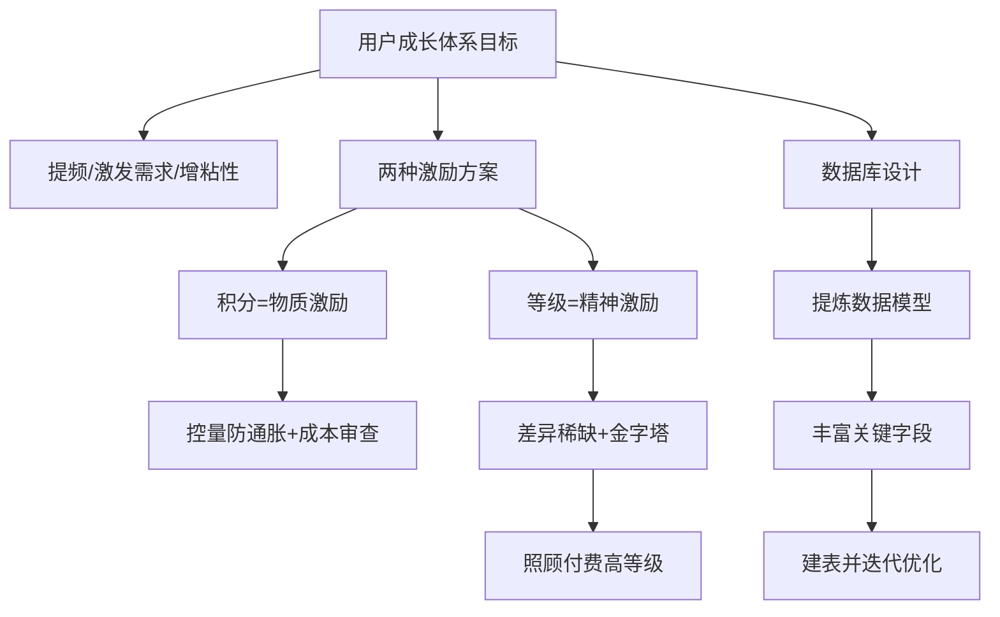

# 用户成长体系与积分等级系统设计：本章小结

关于用户成长体系的设计，最后来做个简单的小结。本章先了解了用户成长体系的**作用与目标、主要使用场景**，也把互联网上一些成熟案例讲了一遍——它们形式各异，但目标一致：**提高用户操作频率、激发用户需求、增加产品停留与粘性**。这些成熟的成长体系设计，咱们完全可以参照着用，当然也要结合自身情况做调整，完全照猫画虎可能弄得不伦不类。

## 纲要

- 成长体系共性目标：提频、激发需求、增粘性与停留
- 两种典型实战方案：积分系统（物质激励）+ 等级系统（精神激励）
- 积分设计要点：控制发放与流通，防通胀，按成本预算审查核查
- 等级设计要点：身份认同、差异化稀缺性、金字塔分布、照顾付费用户
- 数据库设计方法：先提炼数据模型，再补字段，允许迭代
- 开放讨论：成长体系该"简单化"还是"复杂化"？

## 两种激励的底层逻辑

课程选了**用户积分**和**用户等级**两种最典型、最易接受的方案来实战，并分别对它们做了详细讲解。

| 维度 | 积分系统 | 等级系统 |
| --- | --- | --- |
| 激励类型 | 物质激励（虚拟货币） | 精神激励（身份认同） |
| 设计核心 | 控制发放与流通、防通胀 | 差异化、稀缺性 |
| 运营约束 | 受成本预算约束，需事前审查 + 事后核查 | 高等级人数应呈金字塔递减 |
| 重点人群 | 全体用户 | 付费高等级用户需特别照顾 |

**积分作为物质激励**：一定要注意控制**发放数量**和**流通数量**，不能出现严重的通货膨胀。积分本质是虚拟货币，也是一种运营成本，必须按成本预算进行**事前审查**和**事后核查**。

**等级作为精神激励**：是一种身份认同，必须具有**差异化**和**稀缺性**，才有更高的认同感和吸引力。在人群分布上，更高等级的用户数量一定呈**指数递减的金字塔模型**；其中**付费用户等级**是产品最核心、最有价值的用户，需要设计不一样的特权功能、定制礼品或差异化特价商品。

## 数据库设计：先模型，后字段

讲完系统设计，接下来是详细的数据库设计。正确姿势是：

1. **先提炼数据模型**：哪些数据要保存？它们之间的关联是否完整、完善？能否满足所有产品功能需求？
2. **再丰富字段**：模型立住之后，补充字段就容易多了；
3. **允许不完美**：设计阶段有遗漏或偏差很正常，后续开发过程可以不断调整优化，**不必追求一步到位**——产品需求本身也在变，设计时预留变化余地即可。



## 一个留给大家的思考

章末抛出一个讨论题：**用户成长体系，你支持简单化处理，还是复杂化处理？** 看完本章全部内容，相信大家已经有了自己的答案。无论倾向哪边，关键是贴合业务实际——体系是为业务目标服务的，不是越复杂越好，也不是越简单越省事。

```dir
本章收口
├── 成长体系目标
│   ├── 提频 / 激发需求
│   └── 增粘性 / 停留
├── 实战两方案
│   ├── 积分：控量防通胀
│   └── 等级：稀缺差异化
└── 数据库设计
    ├── 提炼数据模型
    ├── 补充关键字段
    └── 允许迭代优化
```

## 总结

本章把"用户积分等级系统"的设计思想收拢了：

1. **目标一致**：无论哪种成长体系，都是为了提频、激发需求、增粘性；
2. **双激励组合**：积分（物质）+ 等级（精神），覆盖最广、最易接受；
3. **积分重控量**：严控发放与流通、防通胀，按成本预算审查核查；
4. **等级重稀缺**：差异化 + 金字塔分布，付费高等级用户重点照顾；
5. **数据库先模型后字段**：关联完整 > 字段完美，设计阶段允许迭代；
6. **留思考题**：成长体系该简单还是复杂，答案要贴合业务而非教条。
