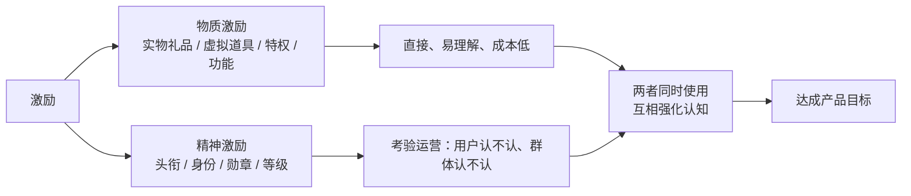
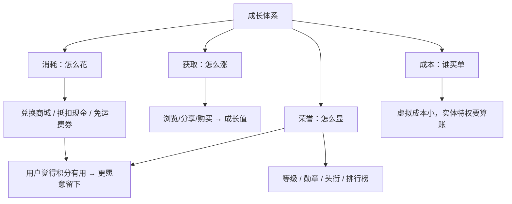

# Kubernetes 认证考点: 常见的用户成长体系设计 —— 激励的分类、产品目标、腾讯/阿里/京东案例与积分消耗渠道

**这一节讲的是常见的用户成长体系设计。它有时候也叫积分体系、金币体系或者用户激励体系。**

结论先给：**用户成长体系是一套虚拟体系，各公司、各平台、各业务都可以定义自己的一套 —— 就像公司内的职级（初级、中级、高级、架构师、专家、资深专家），是企业自己定的、只在公司内生效，别的公司不一定认可（腾讯的专家在行业里认可度就很高，不知名初创公司的 title 就没法让人信服）。** 把它放回我们的产品上就变成：**这套体系只有我们平台的用户会用，能认可它的人越多，它的影响力才越大，所以"设计好一套成长体系"和"运营好平台产品业务"是同样重要、相辅相成的。成长体系的核心是激励，激励分物质（实物礼品、虚拟道具、特权、功能）和精神（头衔、身份、勋章、等级）；物质激励直接、易接受、是"花小钱办大事"，精神激励更考验运营（用户认不认、用户群体之间认不认），所以实战里两类一起用、互相强化。** 更关键的是：**成长体系不只是为了激励用户，它的目的是达成产品目标 —— 提高粘性、让用户更多依赖我们、吸引更多用户关注和使用，方向落在"提高用户高频操作"和"激发用户更多需求"上（浏览/评论/点赞/收藏/分享里频率最高的是浏览，所以先留人；分享要重点引导）。**

## 纲要

- 什么是用户成长体系：它就是产品里的"职级"
- 核心是激励：物质激励与精神激励
- 为什么必须激励：强刚需是例外，产品目标才是目的
- 激励方向：高频操作与激发需求
- 成长体系的常见形式
- 案例一：腾讯（QQ 等级、会员、钻类特权）
- 案例二：阿里（淘宝币、芝麻信用）
- 案例三：京东（PLUS 会员、铜银金钻等级、有效期衰减）
- 案例四：积分与兑换商城
- 从案例里抽出来的四条设计准则
- 工程侧：成长值怎么落地
- API 速览、Demo 示例与总结

## 什么是用户成长体系：它就是产品里的"职级"

**它是一套虚拟的体系，各个公司的不同平台、不同产品、不同业务可能都会定义自己的用户成长体系。**

```text
公司内的职级（企业自定义，只在公司内部生效）
├── 初级工程师 → 中级工程师 → 高级工程师
└── 架构师 → 专家 → 资深专家
    └── 知名公司（如腾讯）的专家 title 在行业内认可度很高
        不知名初创公司的"技术专家"头衔，别人未必买账

产品内的成长体系（只有本平台用户看得到）
├── 范围更小：只对本平台产品的用户生效
└── 影响更大：认可这套体系的人越多，它的影响力就越大
```

**所以结论很直白：设计好一套成长体系，和运营好我们的平台、产品、业务是同样重要的，两者相辅相成。**

## 核心是激励：物质激励与精神激励

**成长体系的核心是激励。对强烈刚需的产品来说，即使不激励用户也会主动使用（比如微信）；但我们 99% 的产品做不到这一点。激励分两类：**

| 类型 | 内容 | 用户侧 | 产品侧 |
| --- | --- | --- | --- |
| **物质激励** | **实物礼品、虚拟道具、特权、功能** | **非常直接，也最容易理解和接受** | **典型的花小钱办大事** |
| **精神激励** | **虚拟头衔、身份、勋章、等级** | **没那么容易理解和接受** | **非常考验产品运营能力：你给的头衔/身份/勋章/等级，用户认不认？用户群体之间认不认？这就变得非常关键** |

**所以很多时候用户成长体系会把这两类激励一起使用，互相强化和巩固用户的认知。**



## 为什么必须激励：强刚需是例外，产品目标才是目的

**设计的体系也不仅仅是为了激励用户，更多目的还是为了达成我们的产品目标：提高用户粘性，让用户更多依赖我们的产品，吸引更多的用户关注和使用我们的产品。**

- **强刚需的特例**：即使是像 QQ 这样曾经同样强大的产品，也有多种知名的用户成长体系；微信这种 99% 产品做不到刚需的典型，反而不太需要靠它；
- **激励的具体方向**：**提高用户的高频操作，激发用户更多的需求**；
- **落到社区/电商这类产品**：用户没有非常多的高频操作、用户需求不那么强烈，**就非常适合引入用户成长体系，用它激励用户提高操作频率、增强用户需求**。

## 激励方向：高频操作与激发需求

**用户浏览、评论、点赞、收藏、分享这么多动作，频率最高的肯定是浏览 —— 先让用户不要离开产品，可以浏览更多的文章，这是高频操作；看完文章之后还希望用户能把文章分享给更多人看，所以分享会被作为更加重点的任务。**

```text
动作 → 频率 → 设计权重
浏览   ★★★★★   ← 最高频：先留人，让用户看更多文章
分享   ★★★★☆   ← 重点任务：把文章分享给更多人（重点引导）
评论   ★★★☆☆   ← 表达与沉淀内容
点赞   ★★★☆☆   ← 低成本正反馈
收藏   ★★☆☆☆   ← 回流入口
```

**要特别强调的是：引导用户去完成这些任务的设计，必须与用户需求、产品功能、业务目标结合起来 —— 用户成长体系的设计不仅仅是为了达成业务目标，同样也要考虑用户需求。**

## 成长体系的常见形式

**用户成长体系的形式有很多：积分、虚拟货币、成长值、经验值、等级、身份、特权、成就、勋章、排行榜、虚拟道具，甚至是新产品发布的体验先后顺序。**

| 形式 | 典型载体 | 用户能感知到什么 |
| --- | --- | --- |
| **积分 / 虚拟币** | 淘宝币、京东币、移动积分 | **能花、但不如现金自由** |
| **成长值 / 经验值** | qq 等级、成长等级 | **我用了多久** |
| **等级** | 铜/银/金/钻、VIP/SVIP | **我在这个平台的位置** |
| **身份 / 头衔** | 会员、专家、守护者 | **我属于哪一层** |
| **特权 / 功能** | 免运费、专享价、免押金 | **这层能多干什么** |
| **勋章 / 成就** | 达成类标记 | **我做过什么** |
| **排行榜** | 周榜、月榜、好友榜 | **我比别人强多少** |
| **虚拟道具** | 装扮、表情、皮肤 | **能不能拿出去展示** |
| **体验先后顺序** | 新功能内测资格 | **我能不能抢先试** |

## 案例一：腾讯（QQ 等级 → QQ 会员 → VIP/SVIP → 各种钻）

**腾讯在国内拥有最丰富的产品矩阵，也拥有最多的用户，很多产品月活用户过亿（微信、QQ、视频、音乐、新闻、游戏、体育）。在这些产品里能看到的成长体系：**

- **最知名的是 QQ 等级**，后来又有了 **QQ 会员**，还有 **VIP、SVIP**；
- **视频、音乐、游戏等很多产品出来一堆"钻"（黄钻、绿钻……），记都记不住是什么会员、什么等级**；
- **有些等级是免费就能得到的用户等级，更多还是需要充值才能成为会员的特权身份**；
- **成为会员之后还会再分成长等级，不同等级象征着用户的产品忠诚度和使用时长，还对应不同的产品特权和差异化功能**；
- **腾讯产品中绝大部分激励都是虚拟形式的，很少涉及实物礼品 —— 毕竟产品业务太多、服务都很好用，哪怕虚拟服务也很有价值。**

## 案例二：阿里（淘宝币 + 芝麻信用）

- **淘宝币**：购物之后会有淘宝币，参加活动也会有一些；**这些虚拟的淘宝币在支付的时候可以按照一定比例抵扣一部分现金**；
- **芝麻信用**：影响力就比较大，它体现了个人信用等级，**在很多产品功能上能给到特权支持：买东西先使用后付费、租车住酒店免押金、信用额度更高、甚至办理签证免面试**；
- **关键差别**：**这类体系不只是提供线上服务便利，还能绑定到实体中的很多服务，于是它的影响力也就更大了。**

## 案例三：京东（PLUS 付费会员 + 铜银金钻免费等级）

| 层 | 怎么来 | 成长值口径 | 特权 |
| --- | --- | --- | --- |
| **京东 PLUS** | **付费会员** | — | **免运费、会员特价等绑定了有价值的产品特权** |
| **铜牌会员** | **免费，按购物数量区分** | **按购物的支付金额计算成长值** | 基础 |
| **银牌 / 金牌 / 钻石** | **购物越多越往上** | **同上（支付金额）** | **设置了有效期，到期之后会衰减** |
| **银牌以上额外特权** | — | — | **免运费门槛、不同售后运费免单、生日礼包、专享礼包、贵宾专线、免运费券等** |

**从这里能看出来：这些用户等级不只在体现它的稀有性，更体现在它所附加的价值 —— 对应的产品特权是否有意义、给到的奖励礼品等是否有吸引力。**

## 案例四：积分与兑换商城

**前面讲了这么多案例，还遗漏了最大的一类用户成长体系，那就是虚拟币（有的也叫积分，只是名字不同）。它的特点是可以用来消费，但又不像现金一样自由消费 —— 于是就会出现一个兑换商城：由商家提供有限的实物礼品或者虚拟道具，价值或高或低，兑换时可能还会附加一些限制条件，这样就把虚拟币、积分等消耗掉了。**

```text
积分/虚拟币体系（以肯德基、中国移动、360、光大银行为例）
├── 获取
│   ├── 肯德基：会员购物后获得"微金"
│   ├── 中国移动：通过话费支出得到积分
│   └── 360 / 光大银行：在活动任务中获取
├── 消耗渠道 = 兑换商城
│   ├── 肯德基微金 → 微金商城（换食品，也可以换别的商品）
│   ├── 中国移动积分 → 积分商城（换流量和礼品）
│   └── 360 / 光大银行 → 积分商城（换礼品）
└── 兑换商城并不是一个完整的电商系统
    └── 它只是局限在用户积分系统之下的一个"积分消耗渠道"
        目标：用这里的礼品吸引用户，让用户的积分体现出价值
              → 用户重视自己的积分 → 保持用户与产品的联系
```

**这条链路是设计上最容易漏的一环：只发不花的积分一定会在某天变成负债（财务和法务视角），所以"消耗渠道"和"获取渠道"一样重要。**

## 从案例里抽出来的四条设计准则



1. **等级要有附加价值，不只是稀有性** —— 铜银金钻、VIP/SVIP 能换来什么特权，比"我升了一级"本身重要得多；
2. **有有效期与衰减机制** —— 银牌以上设有效期、到期衰减，既控制成本，也逼用户回来续命；
3. **一定要有消耗渠道，且最好不止一条** —— 兑换商城是最小可用的一套，抵扣现金、免运费券是更直接的一类；
4. **能绑定实体服务就绑** —— 芝麻信用之所以影响力大，是因为它连上了租赁、酒店、签证这类线下场景，线上便利 + 线下便利，用户感知完全不同。

## 工程侧：成长值怎么落地

**把这四件事落到存储上，其实就是一张"事件 → 成长值 → 等级"的表。**

```text
用户成长体系（最小可落地结构）
├── user_points        # 积分/成长值余额
│   ├── user_id
│   ├── points_total   # 累计获得（只增）
│   └── points_left    # 剩余可用（消耗后减少）
├── points_rule        # 规则：什么动作给多少
│   ├── biz_type       # browse / share / comment / like
│   └── delta
├── points_record      # 流水：可追溯、可对账
│   ├── user_id / biz_type / delta / remain / ref_id / created_at
└── user_level         # 等级快照（由成长值换算）
    ├── user_id / level / expire_at
```

```go
package main

import (
	"fmt"
	"sort"
)

// 规则表：动作 -> 成长值增量（对应 points_rule）
var rule = map[string]int{
	"browse": 1,
	"share":  5,
	"comment": 3,
	"like":   1,
	"collect": 2,
}

// 等级阈值：由高到低判定（对应 user_level 换算）
var levels = []struct {
	name  string
	min   int
}{
	{"钻石", 10000},
	{"金牌", 5000},
	{"银牌", 2000},
	{"铜牌", 0},
}

// Account 就是 user_points 那一行内存版
type Account struct {
	Total int // 累计获得
	Left  int // 剩余可用
	Level string
}

func (a *Account) Earn(biz string) int {
	d, ok := rule[biz]
	if !ok || d <= 0 {
		return 0
	}
	a.Total += d
	a.Left += d
	a.syncLevel()
	return d
}

// Consume 只在余额够的时候扣，返回是否成功（对应兑换商城下账）
func (a *Account) Consume(n int) bool {
	if n > a.Left {
		return false
	}
	a.Left -= n
	return true
}

// 等级换算：取第一个满足阈值的等级（越高越靠前）
func (a *Account) syncLevel() {
	type pair struct {
		name string
		min  int
	}
	ps := make([]pair, 0, len(levels))
	for _, l := range levels {
		ps = append(ps, pair{l.name, l.min})
	}
	sort.Slice(ps, func(i, j int) bool { return ps[i].min > ps[j].min })
	a.Level = ps[len(ps)-1].name // 默认最低
	for _, p := range ps {
		if a.Total >= p.min {
			a.Level = p.name
			break
		}
	}
}

func main() {
	a := &Account{}
	for _, biz := range []string{"browse", "browse", "share", "comment", "collect", "like"} {
		fmt.Printf("%-8s +%2d → total=%d left=%d\n", biz, a.Earn(biz), a.Total, a.Left)
	}
	fmt.Println("等级:", a.Level)
	fmt.Println("尝试兑换 5000 礼品:", a.Consume(5000), "剩余:", a.Left)
	fmt.Println("尝试兑换 999999:", a.Consume(999999), "剩余:", a.Left)
}
```

## API 速览

| 概念 / 对象 | 作用 | 关键设计点 |
| --- | --- | --- |
| **成长体系** | **产品的虚拟激励体系（也叫积分/金币/用户激励体系）** | **只有本平台用户认，认可的人越多越有效** |
| **物质激励** | **实物礼品、虚拟道具、特权、功能** | **直接、易接受、花小钱办大事** |
| **精神激励** | **头衔、身份、勋章、等级** | **考验运营，用户群体之间认不认是关键** |
| **产品目标** | **提高粘性、增加依赖、吸引更多用户** | **方向 = 提高高频操作 + 激发更多需求** |
| **高频操作** | **浏览 > 分享 > 评论/点赞 > 收藏** | **先留人（浏览），再重点引导分享** |
| **积分 / 虚拟币** | **能消费但不能像现金自由消费** | **必须有兑换商城这类消耗渠道** |
| **兑换商城** | **积分系统之下的一个消耗渠道** | **不是完整电商，目标是让积分体现价值、保持联系** |
| **等级有效期与衰减** | **银牌以上设有效期、到期衰减** | **控成本 + 逼回流** |

## Demo 示例

把前面各家的做法折算成一张"设计清单"，给自己产品打分：

```text
设计清单（逐项打勾）
├── 获取渠道：浏览/分享/评论/点赞/收藏/购买 各给多少成长值？
├── 消耗渠道：兑换商城 / 抵扣现金 / 免运费券 / 虚拟道具，至少两条
├── 荣誉展示：等级、勋章、头衔、排行榜，用户在哪里看得到
├── 特权绑定：这层等级具体能多干什么（免运费 / 免押金 / 优先体验）
├── 有效期：高级等级要不要设有效期与衰减？
├── 成本控制：虚拟成本多少，实体礼品与免单的敞口多大？
├── 周期复盘：活动任务怎么排，才能把高频操作顶上去
└── 需求对齐：这些设计是不是同时满足了用户需求和产品功能业务目标
```

验证方式也很朴素：**看自己常用的产品有没有引入成长体系、有没有提高用户的操作频率、有没有激发用户的需求，从而提高了用户粘性、达成了业务目标。**

## 总结

1. **用户成长体系是什么**：**有时候也会叫做积分体系、金币体系或者用户激励体系；它是一套虚拟的体系，各个公司的不同平台、不同产品、不同业务可能都会定义自己的一套**；
2. **它就像公司内的职级**：**初级工程师、中级工程师、高级工程师、架构师、专家、资深专家 —— 公司内的职级是企业定义的，只在具体公司内生效，行业内其他公司不一定认可（腾讯的专家在行业内认可度还是很高，不知名初创公司技术专家的 title 可能也没法让人信服）。回到用户成长体系，它只有我们平台产品业务中的用户会使用，能认可这套体系的人越多，它的影响力才会更大**；
3. **设计和运营是同样重要的**：**设计好一套成长体系和运营好我们的平台、产品、业务是同样重要的，两者是相辅相成的；用户成长体系的核心是激励**；
4. **强刚需是例外**：**对于强烈刚需的产品，即使不激励用户也会主动使用（比如微信），我们百分之九十九的产品没法做到这样；即使像以前同样强大的 QQ，也是有多种知名的用户成长体系**；
5. **两类激励要一起用**：**物质激励就是给用户一些实物礼品、虚拟道具、特权、功能一类的激励，非常直接也最容易理解和接受，对产品来说是花小钱办大事的典型方案；精神激励没有物质激励那么容易理解和接受，更考验产品运营能力（给用户的虚拟头衔、身份、勋章、等级，用户认不认、用户群体之间认不认非常关键）；所以很多时候两套会一起用，互相强化和巩固用户的认知**；
6. **目的不是激励，是达成产品目标**：**设计的体系不仅仅是为了激励用户，更多目的是达成产品目标 —— 提高用户粘性、更多依赖我们的产品、吸引更多用户关注和使用；激励的方向是提高用户的高频操作、激发用户更多的需求**；
7. **高频动作的优先级**：**用户浏览、评论、点赞、收藏、分享这么多动作，频率最高的肯定是浏览 —— 希望用户不要离开产品、可以浏览更多文章（这就是高频操作）；看完文章还希望能分享给更多人看，所以会把分享作为更加重点的任务；引导用户完成这些任务的设计要与用户需求、产品功能、业务目标结合起来**；
8. **适用面**：**对于社区电商类的平台和产品，用户没有非常多的高频操作、用户需求不那么强烈，就非常适合引入用户成长体系，激励用户提高操作频率、增强用户需求**；
9. **常见形式很多**：**积分、虚拟货币、成长值、经验值、等级、身份、特权、成就、勋章、排行榜、虚拟道具，甚至是新产品发布的体验先后顺序**；
10. **腾讯的做法**：**QQ 等级、QQ 会员、VIP/SVIP，视频音乐游戏一堆钻（黄钻绿钻），有免费可得的等级也有充值会员的特权身份，成为会员后还有成长等级象征忠诚度和使用时长、配不同特权和差异化功能；腾讯绝大部分激励都是虚拟形式，很少涉及实物礼品**；
11. **阿里的做法**：**淘宝币（购物或参加活动得到，支付时按比例抵扣现金）；芝麻信用体现个人信用等级，先使用后付费、租车住酒店免押金、信用额度更高、办签证免面试 —— 因为它不只是线上便利，还绑定了实体服务，影响力就更大**；
12. **京东的做法**：**购物得虚拟币、支付时按兑换比例抵扣现金；京东 PLUS 是付费会员（免运费、会员特价等有价特权）；免费的铜牌/银牌/金牌/钻石按购物数量区分，成长值都按支付的购物金额计算；银牌金牌钻石还设了有效期、到期会衰减，配免运费门槛、售后免单、生日礼包、专享礼包、贵宾专线、免运费券等特权**；
13. **等级的价值在附加价值**：**这些用户等级不只体现稀有性，更体现在所附加的价值 —— 对应产品特权是否有意义、给到的奖励礼品是否有吸引力**；
14. **积分与兑换商城**：**虚拟币（也叫积分）可以用来消费，但不能像现金一样自由消费，于是就有兑换商城，由商家提供有限的实物礼品或虚拟道具、价值或高或低、兑换可能还附限制条件，把积分消耗掉（肯德基微金→微金商城、中国移动话费积分→积分商城换流量礼品、360 与光大银行积分类似）；兑换商城并不是完整电商系统，只是积分系统之下的一个积分消耗渠道，目标是用礼品吸引用户、让积分体现价值、让用户重视积分、保持用户与产品的联系**；
15. **落地建议**：**获取、消耗、荣誉、成本四件事一起设计；积分只发不花迟早变成负债，消耗渠道和获取渠道一样重要；等级要带附加特权、高级别设有效期与衰减来控制成本并逼回流；能延伸到本地实体服务（免押金、免面试、体验优先权）的成长体系，影响力会比纯线上大一个量级。**

