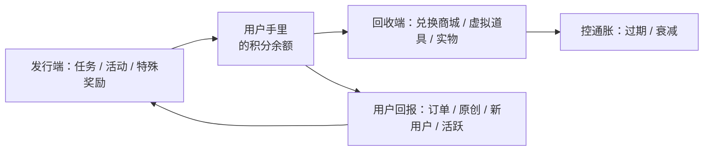
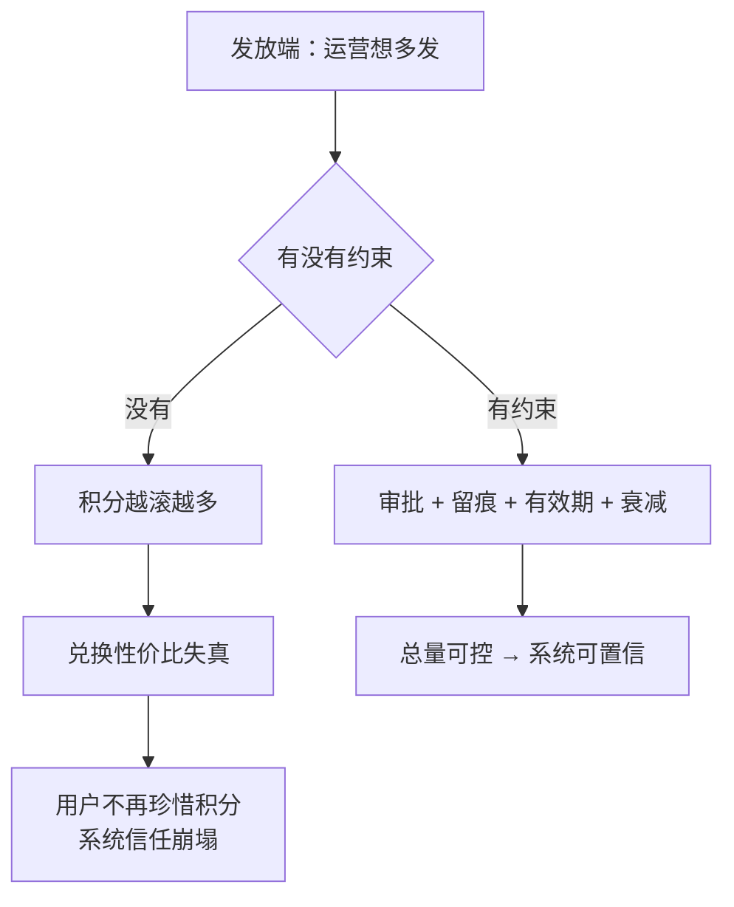

# Kubernetes 认证考点: 用户积分的作用和设计 —— 虚拟货币、发放与回收渠道、通胀控制与四个系统功能

**这一节讲用户积分的作用和设计。前面讲过用户成长体系，这一节把其中"积分"这一块拆细。**

结论先给：**用户积分本质上就是一种虚拟货币 —— 哪怕强势如 Q 币，也只是虚拟货币，不允许与真实货币交易。作为虚拟货币，它是产品业务方发给用户的一种物质激励：除了奖励性的发放，一定要有地方回收（兑换商城）。** 于是整个设计回到两件事：**① 定价策略 —— 积分发放的数量、兑换商品时的定价，最后都要根据产品业务的投入成本反推（什么操作、什么任务给多少奖励？兑换成实际货币价值是多少？没有严格核算，虚拟币很容易超发，因为运营总有不计后果发奖励去拉漂亮数据的冲动）；② 用户拿到积分要给出回报 —— 更多订单、更多原创文章、更多新用户注册、更高活跃度，所以要把这些目标定义成任务去引导。** **最后一条是成败关键：一定要控制通胀。像央行发现货币一样，发放端每个任务动作都要严格审批、详细留痕；再保险一点，给积分加一个过期选项，或者用周期性衰减，这两者都是系统提供的强制性回收策略，能快速大量回收已发出的积分。**

## 纲要

- 积分的本质：它就是虚拟货币
- 定价策略：从投入成本反推奖励
- 发积分是为了换什么：任务体系
- 实时反馈：让用户感知到自己的行为变化
- 成败关键：通胀
- 控制通胀的三道闸：审批留痕、过期、衰减
- 积分发放的三条渠道
- 积分回收的三条渠道
- 四条策略设计
- 积分系统的四个功能
- 工程落地：数据模型与代码骨架
- API 速览、Demo 示例与总结

## 积分的本质：它就是虚拟货币

**前面也有讲到过，用户积分本质上就是一种虚拟货币，哪怕是那么强势的 Q 币，也只能是作为虚拟货币，不允许与真实货币进行交易。**

作为虚拟货币，就是产品业务方发给用户的一种物资（物质）激励。**既然是货币，就有发行和回收两端：除了奖励性的发放，当然也需要有地方可以回收 —— 这就是前面讲过的积分兑换商城。通过积分这种虚拟货币来激励用户，也需要注意数量，所以要注意定价策略。**



## 定价策略：从投入成本反推奖励

**定价策略有两件事：一是积分发放的数量，二是兑换商品时的定价。最后一定要根据产品业务的投入成本来反推 —— 具体什么操作、什么任务可以给到多少奖励？这个奖励的数量兑换成实际的货币价值是多少？**

**如果没有严格的成本核算，虚拟币很容易就会出现超发 —— 因为运营总是有不计后果地给用户奖励、以拉动运营数据更漂亮的冲动。**

```text
成本核算的算式
├── 单次奖励成本 = 积分数量 × (兑换定价 / 积分单价)
├── 单用户日成本 = Σ 各任务限发额度 × 单次奖励成本
├── 全站日成本上限 = 期望 DAU × 单用户日成本上限
└── 反推：给"上限的预算"倒着定每个任务的积分额度和限发条数
```

**换句话说：先定这个月能为积分花多少钱，再倒推能发多少个积分、那些积分能兑换什么。倒着推不出结果，就是定价没做。**

## 发积分是为了换什么：任务体系

**用户得到了积分，我们希望可以得到一些回报 —— 比如希望有更多的订单、有更多原创文章、希望有更多新用户注册、希望有更多用户活跃度。那么针对这些方面就可以定义出来一些任务，鼓励用户来完成这些任务，以达到我们希望的结果。**

```text
目标 → 任务 → 积分
├── 更多订单          → 下单任务 / 复购任务
├── 更多原创文章      → 发布文章任务（+ 防刷：一天最多 N 篇）
├── 更多新用户注册    → 邀请任务 / 分享任务
└── 更多活跃度        → 每日登录 / 浏览 / 评论 / 点赞 / 收藏
```

## 实时反馈：让用户感知到自己的行为变化

**而这些任务和操作需要实时的反馈给用户，让用户可以马上感知到当前的操作是什么、具体的任务是什么、当前的完成进度是怎样的 —— 所以在产品设计上还需要为用户成长体系增加很多的引导，让用户可以更好地感知到自己的行为所带来的变化。**

| 反馈点 | 要告诉用户什么 | 做法 |
| --- | --- | --- |
| **做之前** | **这个任务给多少积分、怎么算完成** | **任务卡片写清规则** |
| **做之时** | **当前进度（还差几次/还差多少）** | **进度条、计数** |
| **做之后** | **刚得了多少积分、余额变成多少** | **+N 提示、余额刷新** |
| **到期时** | **哪些要过期、什么时候衰减** | **提前推送、规则公告** |

## 成败关键：通胀

**最后，作为积分系统的成败，关键一定要控制好通胀。就像前面讲的，运营一定会希望更多地发放积分，毕竟是虚拟货币、自己又有发行权，没有约束的话很快就会出现通胀，整个积分系统也就崩溃了。**



## 控制通胀的三道闸

**第一道闸（源头）：限制每一个积分发放的任务动作都要严格审批，需要有详细的记录留存，以备后续的审查 —— 就像央行发行货币一样严谨。**

**第二、三道闸（兜底）：为了保险起见，还是建议给积分系统增加一个过期的选项。积分增加了有效期，哪怕出现通胀，短期一段时间之后一部分积分过期了，后续的积分发放不再那么多，通胀也就会降下来；或者使用周期性衰减的方法，一段时间就扣除部分积分。不论是积分过期还是衰减，都是系统提供了一种强制性回收策略，可以快速、大量地回收已经发出去的积分，可以比较安全有效地控制积分的通胀。**

| 手段 | 机制 | 优点 | 代价 |
| --- | --- | --- | --- |
| **严格审批 + 留痕** | **每个发放动作审批、明细留存可审查** | **源头控量，最干净** | 流程重，运营抱怨 |
| **有效期（定时过期）** | **发放后 N 个月没用就清零** | **一次性大量回收，简单** | **用户能否接受要提前告知，不能随意改规则** |
| **周期衰减** | **每年 1 月 1 日自动扣一部分** | **持续回收，节奏可控** | 需要定时任务与规则透明 |

## 积分发放的三条渠道

**积分系统主要作为用户成长体系中的物质激励。积分的发放有这些渠道：**

| 渠道 | 怎么发 | 特点 |
| --- | --- | --- |
| **① 活动** | **各类运营活动可以通过积分作为奖励发放出去** | **要成本意识 —— 积分也是一种成本支出，不是白送的流量** |
| **② 用户日常行为** | **把日常行为定义为任务，用户完成任务就得到相应奖励** | **比较固定的奖励，用户也有稳定的预期；时间久了就形成一些用户操作习惯** |
| **③ 特殊奖励** | **这一类可能只会预留给管理员来使用** | **不需要每次做活动都像做活动一样申请积分预算；但同样要把控发放数量、有明细记录可审查，不能因为"特殊"就成了系统漏洞，发出过量积分导致系统失控** |

## 积分回收的三条渠道

**积分回收的首选是虚拟道具 —— 这类虚拟道具同样是咱们自己产品中生成的，所以它的价值、数量也是咱们自己可以控制的（比如游戏中的点券、一个月的产品会员）。虚拟道具的接受程度主要还是看用户是否有强烈的需求。如果是不玩游戏的用户，他就不需要游戏点券，而丰富的食物兑换对用户来说就更加友好 —— 只是这些食物就是实打实的成本，毕竟这些实物也是需要花钱采购的。最后就是前面讲过的积分的过期和衰减策略，可以一次性大量把积分回收了。至于用户是否能接受这么粗暴的行为，那也要提前告知，不能随意更改规则。**

```text
回收渠道排序（成本由低到高）
├── ① 自产虚拟道具（游戏点券 / 会员 / 装扮 / 数字宠物）
│      自产 ⇒ 价值与数量完全可控，成本 ≈ 0，首选
├── ② 积分过期与衰减（定时清零 / 周期扣除）
│      系统强制造回收，成本 0，但要提前公告
└── ③ 实物兑换（食物 / 玩偶 / T 恤 / 纪念册）
       需要真金白银采购，成本实打实，控制好兑换定价
```

## 四条策略设计

**1. 限发策略。** **比如用户发布一篇文章就奖励一定数量积分，那是不是用户发布一百篇文章就奖励一百次积分呢？所以在这里需要设置一个时间周期 —— 比如一天最多发布三篇文章是给奖励的，再多就不会有积分奖励了，这样至少保证积分的发放不会出现被刷爆的情况。**

**2. 按产品功能发放策略。** **不要设置太多的发放点，只是对一些重要的产品功能才给到奖励。因为设置太多了，也会让用户很头疼、理解成本上升。**

**3. 兑换（实物）策略。** **给到用户可以兑换的东西，尽量是和咱们产品有关联性的东西：虚拟道具像游戏点券、数字宠物等等，只要是咱们自己可以生成的虚拟道具就最好不过了；另外就是能够体现咱们产品特色的一些东西，像定制的玩偶、卡通形象、T 恤衫、纪念册等，带着咱们的产品特色也是一种变相的营销。**

**4. 过期衰减策略。** **可以设计为定时过期，比如发放一年还没有使用就过期；另外就是设计成周期性的衰减，比如每年一月一日自动衰减、扣除一些积分。有了上面这些策略，不论是在积分发放端还是在积分回收端，都可以很好地控制积分的总量，不至于出现严重的通货膨胀，也可以更好地控制成本 —— 正是所谓的花小钱办大事。**

## 积分系统的四个功能

**有了前面的讲解，积分系统应该比较清楚了，功能可以定义成四类：**

1. **发放积分的功能** —— **通过单次任务的接口来给用户发放积分；这个发放接口还需要处理每日限额，以避免单个用户一天内发放太多的积分**；
2. **扣减积分** —— **主要就是兑换扣减，不管是实物还是道具兑换，直接扣减相应的积分就好了**；
3. **惩罚扣减** —— **比如有些人恶意评论，管理员就可以执行惩罚扣减**；
4. **系统自动化的处理** —— **积分过期和衰减的功能，包括积分的过期清零和积分的周期衰减**。

**把这几项功能实现了，一个基本的用户积分系统也就成型了；再结合实际场景做一些调整也是很常见的，还是要具体情况具体分析，适合自己的业务场景才是最重要的。**

## 工程落地：数据模型与代码骨架

```text
积分系统的数据模型（最小可用）
├── points_account      账户
│   ├── user_id
│   ├── total_earned    # 累计获得（对账用）
│   └── balance         # 当前可用（= total_earned - 已扣减 - 已过期）
├── points_rule         规则（限发策略在这里）
│   ├── biz_type        # publish / invite / login / share
│   ├── per_award       # 单次奖励
│   └── daily_limit     # 每日上限（对应"一天最多三篇"）
├── points_ledger       流水（发放留痕、可审查）
│   ├── user_id / biz_type / delta / balance_after / ref_id
│   └── created_at / expire_at      ← 过期时间写进流水，衰减才查得到
├── points_exchange     兑换订单（回收）
│   └── user_id / sku_id / cost / status / created_at
└── points_penalty      惩罚扣减
    └── user_id / reason(恶意评论) / delta / operator
```

```go
package main

import (
	"errors"
	"fmt"
	"time"
)

// Rule 对应 points_rule：单次奖励 + 每日限额（限发策略）
type Rule struct {
	BizType    string
	PerAward   int
	DailyLimit int
}

var rules = map[string]Rule{
	"publish": {"publish", 10, 30}, // 一天最多 3 篇 × 10 分 = 30
	"invite":  {"invite", 50, 100},
	"share":   {"share", 5, 20},
}

// Ledger 对应 points_ledger：一条发放留痕，带过期时间
type Ledger struct {
	UserID    string
	BizType   string
	Delta     int
	CreatedAt time.Time
	ExpireAt  time.Time
}

// Account 对应 points_account
type Account struct {
	UserID string
	Total  int // 累计获得
	Left   int // 当前可用
	Today  map[string]int
	Ledger []Ledger
}

func NewAccount(uid string) *Account {
	return &Account{UserID: uid, Today: map[string]int{}}
}

// Earn 发放积分：走单次任务接口，内部做每日限额（防刷爆的核心）
func (a *Account) Earn(biz string, now time.Time) (int, error) {
	r, ok := rules[biz]
	if !ok {
		return 0, errors.New("未知任务类型")
	}
	if a.Today[biz] >= r.DailyLimit {
		return 0, fmt.Errorf("%s 今日已达上限 %d，不再发放", biz, r.DailyLimit)
	}
	d := r.PerAward
	a.Today[biz] += d
	a.Total += d
	a.Left += d
	// expire：一年未使用即清零（对应定时过期策略）
	a.Ledger = append(a.Ledger, Ledger{
		UserID: a.UserID, BizType: biz, Delta: d,
		CreatedAt: now, ExpireAt: now.AddDate(1, 0, 0),
	})
	return d, nil
}

// Consume 扣减：道具或实物兑换统一走这里
func (a *Account) Consume(n int) error {
	if n <= 0 {
		return errors.New("扣减值必须为正")
	}
	if n > a.Left {
		return errors.New("积分不足")
	}
	a.Left -= n
	return nil
}

// Penalty 惩罚扣减：管理员对恶意评论执行
func (a *Account) Penalty(n int, reason string) error {
	if n > a.Left {
		return errors.New("余额不足，无法惩罚")
	}
	a.Left -= n
	_ = reason // 留痕时写入 points_penalty
	return nil
}

// Expire 过期清零：把已过期流水从可用余额里抹掉（回收端）
func (a *Account) Expire(now time.Time) int {
	expired := 0
	kept := a.Ledger[:0]
	for _, l := range a.Ledger {
		if now.After(l.ExpireAt) {
			expired += l.Delta
			continue
		}
		kept = append(kept, l)
	}
	a.Ledger = kept
	a.Left -= expired
	if a.Left < 0 {
		a.Left = 0
	}
	return expired
}

func main() {
	a := NewAccount("u1001")
	now := time.Now()

	// 连发 5 篇：前 3 次正常，第 4、5 次被每日限额挡住
	for i := 1; i <= 5; i++ {
		d, err := a.Earn("publish", now)
		if err != nil {
			fmt.Printf("第%d篇: 拒绝（%v）\n", i, err)
			continue
		}
		fmt.Printf("第%d篇: +%d 分，当前可用 %d\n", i, d, a.Left)
	}

	// 回收：兑换一个自产虚拟道具
	if err := a.Consume(15); err != nil {
		fmt.Println("兑换失败:", err)
	}
	fmt.Println("兑换后可用:", a.Left)

	// 过期：一年零一天的那一刻，过期的积分被强制回收
	expired := a.Expire(now.AddDate(1, 1, 1))
	fmt.Println("过期回收:", expired, "剩余可用:", a.Left)
}
```

## API 速览

| 功能 / 概念 | 作用 | 关键设计点 |
| --- | --- | --- |
| **积分（虚拟货币）** | **产品业务方发给用户的物质激励** | **不能与真实货币自由交易** |
| **发放接口** | **单次任务发积分** | **必须处理每日限额，防单用户刷爆** |
| **扣减** | **兑换扣减（实物/道具通用）** | **直接扣，走统一入口** |
| **惩罚扣减** | **管理员对恶意行为扣分** | **要有理由与操作人留痕** |
| **过期清零** | **定时过期（如一年未用）** | **提前告知，不能随意改规则** |
| **周期衰减** | **每年某日自动扣一部分** | **持续回收，节奏可控** |
| **限发策略** | **一天最多 N 次给奖励** | **从源头防刷** |
| **发放渠道** | **活动 / 日常任务 / 特殊奖励** | **特殊奖励也要留痕可审查** |
| **回收渠道** | **自产虚拟道具 / 过期衰减 / 实物** | **优先自产虚拟道具，成本可控** |

## Demo 示例

把"限发 + 回收 + 过期"串成一次完整流程：

```text
① 用户发布第 1 篇 → 接口 +10 分，余额 10，流水记 expire_at = 今天+1年
② 发布第 2、3 篇  → 各 +10，余额 30
③ 发布第 4 篇     → 接口返回"今日已达上限 30"，不发放（限发策略生效）
④ 用户兑换会员卡  → Consume(15)，余额 15（回收端：自产虚拟道具，成本近乎 0）
⑤ 管理员判恶意评论 → Penalty(5)，余额 10（惩罚扣减）
⑥ 一年零一天后系统跑过期任务 → 过期清零，剩余有效积分被回收（通胀兜底）
```

排查积分问题的三条线索：

```sql
# ① 用户积分对不上：看流水，不要看余额
select sum(delta) from points_ledger where user_id = ? and delta > 0;
select balance from points_account where user_id = ?;

# ② 怀疑被刷：按天、按任务类型看发放量
select date(created_at), biz_type, sum(delta)
from points_ledger where delta > 0 group by 1, 2 order by 3 desc limit 10;

# ③ 疑似通胀：看全站流通中的有效积分趋势
select date(created_at), sum(delta) from points_ledger where delta > 0 group by 1;
```

## 总结

1. **积分的本质就是虚拟货币**：**哪怕是那么强势的 Q 币，也只能是作为虚拟货币，不允许与真实货币进行交易。作为虚拟货币，就是产品业务方发给用户的一种物质激励 —— 除了奖励性的发放，当然也需要有地方可以回收（就是前面讲过的积分兑换商城）**；
2. **用虚拟货币激励要注意数量，要注意定价策略**：**一是积分发放的数量，二是兑换商品时的定价，最后一定要根据产品业务的投入成本来反推具体什么操作、什么任务能给到多少奖励、这个奖励数量兑换成实际的货币价值是多少；如果没有严格的成本核算，虚拟币很容易就会出现超发，因为运营总是有不计后果地给用户奖励、以拉动运营数据更漂亮的冲动**；
3. **发积分是要换回报的**：**用户得到了积分，我们也希望得到一些回报，比如希望有更多订单、更多原创文章、更多新用户注册、更多用户活跃度；针对这些方面就可以定义出来任务、鼓励用户来完成，以达到我们希望的结果**；
4. **任务要实时反馈**：**这些任务和操作需要实时反馈给用户，让用户马上感知到当前操作是什么、具体任务是什么、当前完成进度是怎样的，所以产品设计上还需要为用户成长体系增加很多引导，让用户更好地感知到自己的行为所带来的变化**；
5. **成败关键是通胀**：**作为积分系统的成败，关键一定要控制好通胀。运营一定会希望更多地发放积分，毕竟是虚拟货币、自己又有发行权，没有约束的话很快就会出现通胀，整个积分系统也就崩溃了**；
6. **三道闸**：**首先在源头上需要限制每一个积分发放的任务动作都要严格审批、有详细的记录留存以备后续审查，就像央行发行货币一样严谨；为了保险起见还是建议给积分系统增加一个过期选项，积分有了有效期，哪怕出现通胀，短期一段时间之后一部分积分过期、后续发放不再那么多，通胀也就会降下来；或者使用周期性衰减的方法，一段时间就扣除部分积分。过期也好、衰减也好，都是系统提供的一种强制性回收策略，可以快速大量地回收已经发出去的积分，安全有效地控制通胀**；
7. **发放渠道有三条**：**一是活动，各类运营活动可以通过积分作为奖励发放出去，当然也要有成本意识，因为积分也是一种成本支出；二是用户日常行为，把这些行为定义为任务，用户完成任务就可以得到相应奖励，这种比较固定、用户也有稳定预期，时间久了也就会形成一些用户操作习惯；三是特殊奖励，这一类可能只预留给管理员使用，不需要每次做活动都像做活动一样申请积分预算，但同样要把握发放的数量、需要有明细记录可以审查，不能因为这是特殊奖励就成了一个系统漏洞，过量发出积分导致系统失控**；
8. **回收渠道有三条**：**首选是虚拟道具，这类虚拟道具同样是咱们产品中生成的，价值数量都是自己可以控制的，像游戏点券、一个月的产品会员，接受程度主要看用户有没有强烈需求；如果是不玩游戏的用户就不需要游戏点券，而丰富的食物兑换对用户更友好，只是食物是实打实的成本、需要花钱采购；最后就是积分的过期和衰减策略，可以一次性大量把积分回收，至于用户能否接受这么粗暴的行为，要提前告知，不能随意更改规则**；
9. **限发策略**：**比如用户发布一篇文章就奖励一定数量积分，那发布一百篇文章是不是就奖励一百次？所以要设置一个时间周期，比如一天最多发布三篇文章才给奖励、再多就没有积分奖励，至少保证积分发放不会出现被刷爆的情况**；
10. **按功能发放与兑换策略**：**不要设置太多发放点，只在一些重要的产品功能上给奖励，太多会让用户头疼、理解成本上升；给到用户可以兑换的东西尽量和产品有关联性，游戏点券、数字宠物这类自产的虚拟道具最好，定制玩偶、卡通形象、T 恤衫、纪念册这类带产品特色的东西也是一种变相的营销**；
11. **过期衰减策略**：**可以设计为定时过期（比如发放一年还没使用就过期），也可以设计成周期性的衰减（比如每年一月一日自动衰减、扣除一些积分）；有了这些策略，发放端和回收端都能控制积分总量，不至于严重通胀，也能控制成本，正是花小钱办大事**；
12. **积分系统的四个功能**：**一是发放积分的功能，通过单次任务的接口给用户发放，接口还要处理每日限额以避免单个用户一天内发放太多；二是扣减积分，主要是兑换扣减，不管实物还是道具兑换都直接扣减相应积分；三是惩罚扣减，比如有人恶意评论，管理员可以执行惩罚扣减；四是系统自动化处理，积分过期和衰减的功能，包括过期清零和周期衰减。这些功能实现完一个基本的用户积分系统就成型了，再结合实际场景做调整也很常见，适合自己的业务场景最重要。**

