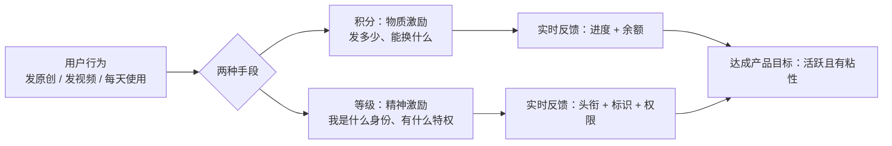
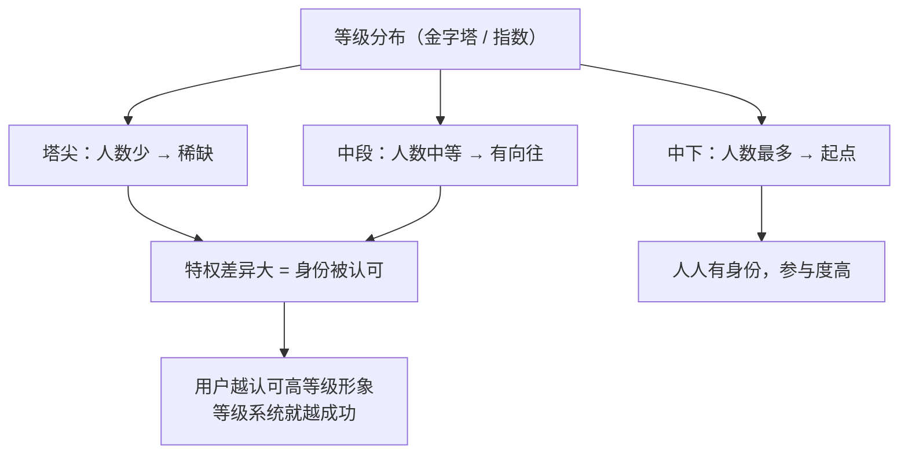

# Kubernetes 认证考点: 用户等级的作用和设计 —— 精神激励、免费与付费获取、指数成长曲线、金字塔分布与过期失效

**这一节讲用户等级的作用和设计，同样属于用户体系的一部分，和用户积分有很多相似之处，也有一些差异。**

结论先给：**用户等级更多属于精神激励，是用户的一个社群身份 —— 不同身份除了 title 不一样，还一定要有产品特权或展示标识上的差异化，要能突出高等级的优势；用户越是认可高等级的形象，这个等级就越成功。** 它有两条获取路径：**免费的门槛低、参与度高，每个注册用户都可以拥有；付费的则可以过滤并沉淀出核心优质用户，拉拢和维护好这部分人 —— 互联网产品大部分用户都是免费使用，只有极少数是付费用户，一个愿意充值买等级的用户一定要重点关照。** 三处最容易做错的地方：**① 成长曲线必须是指数级难度（低等级容易达成、越高越难），否则几个月就触到天花板，成长空间就没了；② 高级别的特权要给期限，到期可以降下来，没有特权和明显差异化的等级才做成永久的；③ 等级要结合稀缺性和差异性来规划分布 —— 符合金字塔模型，少部分人在上、大部分人在中下，越往上难度越大人数越少，并且要让用户每天都能长一点、规则提前明示不黑箱。**

## 纲要

- 等级与积分：一个精神、一个物质
- 获取方式：免费、付费、活动与日常任务
- 成长曲线：为什么必须是指数级难度
- 尊贵感从哪来：特权 + 期限
- 分布：金字塔模型与稀缺性
- 长期规划与稳定预期
- 等级系统的三个功能
- 工程落地：数据模型与代码
- API 速览、Demo 示例与总结

## 等级与积分：一个精神、一个物质

**用户等级和前面讲过的用户积分有很多相似之处，也有一些差异。**

| 维度 | **用户积分** | **用户等级** |
| --- | --- | --- |
| **激励类型** | **物质激励** | **精神激励** |
| **形态** | **虚拟货币，可花** | **社群身份，可展示** |
| **用户感知** | **我攒了多少** | **我是谁** |
| **核心风险** | **超发 / 通胀** | **很快就到天花板 / 没有尊贵感** |
| **达成方式** | **任务得积分、兑换消耗** | **成长值累积、活动或充值获取** |
| **两者关系** | **两种不同手段，可以互相强化认知** | |

**引入用户等级系统，同样也是希望能够鼓励用户的特定行为，并且能给用户实时反馈，激励用户完成我们期望的任务（比如写原创的文章、高质量视频等）—— 这一点和用户积分是一样的，只是两种不同的手段而已。**



## 获取方式：免费、付费、活动与日常任务

**用户等级的获取可以是免费的，也可以是付费的：**

| 获取方式 | 门槛 | 作用 | 适合谁 |
| --- | --- | --- | --- |
| **免费** | **门槛低，用户参与度高，每个注册用户都可以拥有** | **普适，人人有身份** | **大盘用户** |
| **付费（充值购买）** | **要花钱** | **过滤并沉淀出核心优质用户，拉拢和维护这部分优质用户（这部分更重要的原因是：这部分用户是少数的）** | **核心层** |
| **活动奖励** | **参与活动给相应等级成长** | **拉活跃、拉参与** | **运营手段** |
| **日常任务奖励** | **完成任务给等级成长，和积分获取方式一样** | **形成日常习惯** | **养成** |

**付费这条路的真正价值在"可区分"：因为这部分用户是少数的，而且通过用户等级可以更好地区分，也就可以做到更精准的用户运营、效率更高。互联网产品大部分用户都是免费使用，只有极少数才是付费用户 —— 所以一个用户愿意充值购买一个用户等级，这类用户一定要重点关照和维护。**

## 成长曲线：为什么必须是指数级难度

**和积分类似，也需要注意控制用户等级的上限，不能很快让用户触达等级系统的天花板，那样就失去了它的成长空间。所以用户等级成长需要设计为指数级难度的增长：低等级很容易达成，越是往高的等级就越难达成。**

```text
成长值门槛（指数级：每级要求翻倍还多）
Lv.1   0      ← 注册即得，人人有
Lv.2   100    ← 几天就能到
Lv.3   300
Lv.4   1000
Lv.5   3000
Lv.6   10000  ← 需要持续积累
Lv.7   30000
Lv.8   100000 ← 少数人的领域
# 线性门槛（100/300/500/700…）的问题：活跃用户三个月全部打满，之后系统失效
```

**判断一条曲线合不合格，看两件事：①  Median（中位）用户半年后停在哪一级 —— 停在中低段才说明分布正常；② 最高级要多久能到 —— 以年为单位，不是以月为单位。**

## 尊贵感从哪来：特权 + 期限

**为了凸显出等级的尊贵或者差异化，给到的一些产品特权也需要控制一下它的期限 —— 也就是说需要给用户等级加上期限，尤其是较高的等级，到期之后它也是可以降下来的。如果用户等级没有特权和明显的差异化，那么也可以设计为永久性的等级，不需要涉及过期策略。**

```text
等级的两条腿
├── 特权（差异化）        —— 越高等级能用的功能/服务越不一样
│   └── 差异越大 → 等级价值越显眼
└── 期限（尊贵感）        —— 高等级到期会掉
    ├── 有特权 + 有期限 ⇒ 需要维护，尊贵感强
    └── 没特权 + 无期限 ⇒ 做成永久等级，省掉过期策略
```

| 组合 | 设计 |
| --- | --- |
| **高等级有实质特权** | **加期限，到期降级** |
| **纯头衔、无特权差异** | **做成永久等级，不需要过期策略** |
| **介于两者之间** | **等级永久、特权定期（特权单独续期）** |

## 分布：金字塔模型与稀缺性

**说到底用户等级还是用户的一个身份象征。这个等级想要得到大家的认可，就需要有足够的稀缺性以及差异性。所以在规划和设计等级系统的时候，需要做好用户等级的分布 —— 让少部分人成为等级的上部分，大部分人成为等级的中下部分。**

| 层级 | 人数 | 难度 | 特权强度 |
| --- | --- | --- | --- |
| **塔尖（Lv.7+）** | **极少** | **指数级后期** | **专属功能 / 定制周边** |
| **中上（Lv.5~6）** | **少** | **需要长期** | **会员价、每月礼包** |
| **中段（Lv.3~4）** | **中等** | **几周** | **基础特权、展示标识** |
| **中下（Lv.1~2）** | **大多数** | **注册即得 / 几天** | **无 / 弱** |



## 长期规划与稳定预期

**用户等级系统还需要有长久的规划，可以让用户有长期稳定的成长空间，而不会几个月就增长到等级的天花板 —— 所以设计时要考虑到用户可以每天成长，也就是鼓励用户每天来使用我们的产品和服务。还有就是需要有稳定的预期：需要提前把规则明确地展示出来，让用户清楚地知道用户等级系统的游戏规则，而不会黑箱操作、总是随意乱改。**

| 要求 | 做法 | 反例 |
| --- | --- | --- |
| **长期成长空间** | **指数门槛 + 每日小额成长值** | **线性门槛，三个月打满** |
| **鼓励每天使用** | **每日任务给成长值，日积月累** | **只有一次性大额任务** |
| **稳定预期** | **规则提前明示、版本化** | **临时改规则、黑箱调权重** |
| **可解释** | **用户能自己算：我还差多少到下一级** | **算不出来，只能猜** |

**最后的目标是用户活跃并且有粘性、离不开我们的产品和服务；用户等级系统设计得好，对用户的吸引力就越大，用户等级的认可度也就越高，也就可以更好地达到用户和产品的双赢。**

## 等级系统的三个功能

**要设计这个系统需要实现哪些基本的功能呢？**

1. **用户等级的获得和成长** —— **这是两个基本功能。有些等级系统是免费获得等级，那就不需要额外的等级获得功能；等级成长就像积分系统也需要有一个成长数值递增似的；注意设计好用户等级的层级数，有些无限增长的用户等级就可以设计成无限级，而更多的设计者会比较少的层级，每一个层级的成长值要求也会不一样**；
2. **等级特权定义** —— **为了给等级赋予差异性，还需要有等级特权定义的功能，可以是产品特权，也可以是礼品或者商品特价**；
3. **过期和失效** —— **可以给等级系统设计过期和失效的功能：过期是基于时间自动执行；而失效则是根据等级要求和规则，或者是自动、或者是手动来取消用户等级或者降低用户等级。**

```text
等级生命周期
   获得（注册 / 任务 / 活动 / 充值）
        ↓
   成长（成长值递增 → 升级 / 保级）
        ↓
   存续（享受特权，展示标识）
        ↓
   过期（基于时间自动执行，到期降级）
   失效（按规则自动，或管理员手动取消 / 降权）
```

## 工程落地：数据模型与代码

```text
等级系统的数据模型
├── user_level        用户等级快照
│   ├── user_id
│   ├── level         当前等级
│   ├── exp           当前等级内成长值（或累计成长值）
│   ├── level_from    本次等级起始时间（算保级期）
│   └── expire_at     过期时间（只有带期限的等级才写）
├── level_rule        层级定义（指数门槛 + 每级特权）
│   ├── level / min_exp / expired（是否带期限）
│   └── privileges    （JSON：会员价 / 每月礼包 / 专属功能）
├── level_exp_record  成长值流水（任务 / 活动 / 每日签到）
│   ├── user_id / biz_type / delta / created_at
└── level_log         降级与失效日志（过期、手动取消都留痕）
```

```go
package main

import (
	"fmt"
	"sort"
	"time"
)

// Level 对应 level_rule 的一层：指数门槛 + 是否带期限
type Level struct {
	Name    string
	MinExp  int
	Expired bool // true = 到期会降级
}

// 指数级难度：低等级容易，越高越难
var levelRules = []Level{
	{"Lv.1 新用户", 0, false},
	{"Lv.2 活跃", 100, false},
	{"Lv.3 资深", 300, false},
	{"Lv.4 达人", 1000, true},
	{"Lv.5 专家", 3000, true},
	{"Lv.6 大师", 10000, true},
	{"Lv.7 传说", 40000, true},
}

// UserLevel 对应 user_level
type UserLevel struct {
	Name    string
	Exp     int
	ExpireAt time.Time // 零值 = 永久等级
}

// Gain 成长：任务/活动/每日签到都走这里（指数门槛：跨级自动跳）
func (u *UserLevel) Gain(delta int) {
	if delta <= 0 {
		return
	}
	u.Exp += delta
	u.Name = calcLevel(u.Exp).Name
}

func calcLevel(exp int) Level {
	type kv struct {
		l Level
		i int
	}
	arr := make([]kv, 0, len(levelRules))
	for _, l := range levelRules {
		arr = append(arr, kv{l, l.MinExp})
	}
	sort.Slice(arr, func(i, j int) bool { return arr[i].i > arr[j].i })
	cur := levelRules[0]
	for _, p := range arr {
		if exp >= p.i {
			cur = p.l
			break
		}
	}
	return cur
}

// ExpireOnce 过期：基于时间自动执行，高等级到期降级（对应 level_log）
func ExpireOnce(u *UserLevel, now time.Time) bool {
	if !u.ExpireAt.IsZero() && now.After(u.ExpireAt) && u.Name != levelRules[0].Name {
		// 掉一级：回到上一层的门槛区间
		u.Name = levelRules[0].Name
		u.Exp = u.Exp / 10
		return true
	}
	return false
}

func main() {
	u := &UserLevel{Name: levelRules[0].Name}
	// 每天签到给一点成长值：小步快跑，鼓励每天使用
	for d := 1; d <= 60; d++ {
		u.Gain(30)
		if d%20 == 0 {
			fmt.Printf("第%2d天 → %s（exp=%d）\n", d, u.Name, u.Exp)
		}
	}

	// 高级别带期限：续费/保级到期后自动降级
	u.ExpireAt = time.Now().AddDate(0, 6, 0)
	fmt.Println("半年后处理过期:", ExpireOnce(u, u.ExpireAt.AddDate(0, 0, 1)), "→", u.Name)

	// 手动失效（按规则自动或管理员手动取消）
	for _, l := range levelRules {
		fmt.Printf("%-12s 门槛 %6d  %v\n", l.Name, l.MinExp, map[bool]string{true: "带期限", false: "永久"}[l.Expired])
	}
}
```

## API 速览

| 功能 / 概念 | 作用 | 关键设计点 |
| --- | --- | --- |
| **等级获取** | **注册 / 任务 / 活动 / 充值购买** | **充值获取要重点维护（少数优质用户）** |
| **等级成长** | **成长值递增 → 升层** | **层级数要设计好；可无限级也可少层级** |
| **指数成长曲线** | **低等级易、高等级难** | **防几个月打满天花板** |
| **等级特权定义** | **产品特权 / 礼品 / 商品特价** | **差异越大越显等级价值** |
| **过期** | **基于时间自动执行，到期降级** | **只对带特权的较高等级开启** |
| **失效** | **按规则自动或管理员手动取消/降权** | **要留痕** |
| **金字塔分布** | **少部分人上、大部分人中下** | **稀缺性 + 差异性 = 被认可** |
| **稳定预期** | **规则提前明示，不黑箱乱改** | **用户能自己算差多少** |

## Demo 示例

一次"从获取到可能降级"的完整流程：

```text
① 注册            → Lv.1 新用户（人人有，门槛 0）
② 每日签到 30 天  → 累计 900 成长值 → Lv.3 资深
③ 发 3 篇原创     → 再给成长值 → 跨到 Lv.4 达人
④ Lv.4 起带期限   → 记录 expire_at = 生效日 + 12 个月
⑤ 到期当天定时任务 → 过期执行，等级降回 Lv.3（带期限的高等级会自动掉）
⑥ 管理员判定违规  → 手动失效，取消等级（进 level_log 留痕）
⑦ 规则变更        → 新规则版本上线并公示，不追溯旧规则
```

排障与校验的三条：

```sql
# ① 分布是否合理（看人数是不是金字塔）
select level, count(*) from user_level group by level order by level;
# 期望：级别越高人数越少；若 Lv.7 人数和 Lv.1 一样多 → 曲线太松

# ② 天花板风险：看 Top 用户到最高级用了多久
select user_id, max(level), max(expire_at) from user_level group by user_id order by 2 desc limit 10;

# ③ 该降级没降级：查带期限等级里过期时间已过但状态还是高级的
select user_id, level, expire_at from user_level
where expire_at < now() and level >= 4;
```

## 总结

1. **等级属于精神激励**：**用户等级和前面讲过的用户积分有很多相似之处，也有一些差异；用户等级更多是属于精神激励，是用户的一个社群身份 —— 除了等级的 title 不一样，肯定还是要有一些产品特权或者展示标识上的差异化，需要能够突出用户等级高的优势，用户越是认可高等级的形象，这个用户等级就越成功**；
2. **目的和积分一样，只是手段不同**：**引入用户等级系统也是希望能够鼓励用户的特定行为、并且给用户实时反馈，激励用户完成期望的任务（比如写原创的文章、高质量视频等），这一点和用户积分是一样的，只是两种不同的手段而已**；
3. **免费的与付费的两种获取**：**用户等级的获取可以是免费的，也可以是付费的；免费的门槛低、用户参与度高，每个注册用户都可以拥有；付费的则可以过滤和沉淀出咱们的核心优质用户，拉拢和维护，这部分优质用户会更加重要（因为这部分用户是少数的，而且通过用户等级可以更好地区分，也就可以做到更加精准的用户运营、效率更高）**；
4. **付费用户要重点关照**：**互联网产品大部分用户都是免费使用，只有极少数才是付费用户；一个用户愿意充值购买一个用户等级，这类用户一定要重点关照和维护**；
5. **成长要指数级难度**：**和积分类似，也需要注意控制用户等级的上限，不能很快让用户触达等级系统的天花板，那样就失去了成长空间；所以用户等级成长需要设计为指数级难度的增长，低等级很容易达成，越是往高的等级就越难达成**；
6. **高等级要给期限**：**为了凸显等级的尊贵或者差异化，给到的产品特权也需要控制一下它的期限，也就是需要给用户等级加上期限，尤其是较高的等级，到期限之后它也是可以降下来的；如果用户等级没有特权和明显的差异化，那也可以设计为永久性的等级，不需要涉及过期策略**；
7. **等级系统的获取方式**：**等级系统主要是作为用户成长体系中的精神激励，获取和成长跟用户积分有类似的地方；首先是活动奖励，在用户参与一些活动时给予相应的等级成长；还有就是日常的任务奖励，都跟用户积分的获取方式一样，具体设置根据运营策略来定；另外还有一种不同获取方式，就是可以通过充值购买，这就能明显区别免费和付费用户的差异**；
8. **荣誉象征是最有意义的部分**：**等级是一个虚拟头衔，要赋予它荣誉象征才有意义，可能体现在展现形式上，或者是给到不同的特权功能、达到一定等级才能使用的功能和服务；这部分功能可能是用户等级最有意义的地方，功能和社会的差异性越大，也就越能体现出等级的价值**；
9. **也可以给实物奖励**：**用户等级除了精神激励，也可以提供一些实物奖励，比如礼品或者商品的特价、每月礼包或者会员价，这都是到处可见的用户等级差异化卖点**；
10. **稀缺性 + 差异性 + 金字塔分布**：**等级还是用户的一个身份象征，想要得到大家认可就需要足够的稀缺性以及差异性；所以规划时要做好用户等级的分布，让少部分人成为等级的上部分、大部分人成为等级的中下部分 —— 符合金字塔模型，低中高有明显的数量差异、呈现明显的指数分布，越往高等级难度越大人数越少**；
11. **长期规划与稳定预期**：**等级系统需要有长久的规划，让用户有长期稳定的成长空间，不会几个月就增长到天花板，所以设计时要考虑到用户可以每天成长（也就是鼓励每天使用产品和服务）；还要有稳定的预期，提前把规则明确展示出来，让用户清楚知道系统规则，不黑箱操作、不随意乱改。目标是用户活跃并且有粘性、离不开产品和服务，达到用户和产品的双赢**；
12. **三个功能**：**一是用户等级的获得和成长（两个基本功能，免费获得的等级就不需要额外获得功能，成长像积分系统需要成长数值递增，要注意设计好层级数：可以无限增长设计成无限级，更多设计者会比较少的层级，每层的成长值要求不一样）；二是等级特权定义的功能（为等级赋予差异性，可以是产品特权，也可以是礼品或者商品特价）；三是等级过期和失效的功能（过期基于时间自动执行，失效则是根据等级要求和规则，自动或手动来取消用户等级或者降低用户等级）**；
13. **落地口诀**：**积分管"我攒了多少、能换什么"，等级管"我是谁、有多少人羡慕"；积分怕通胀，等级怕天花板；积分要消耗渠道，等级要稀缺性和差异化；两套一起上，物质与精神互相强化，用户才会一直留在这个体系里。**

