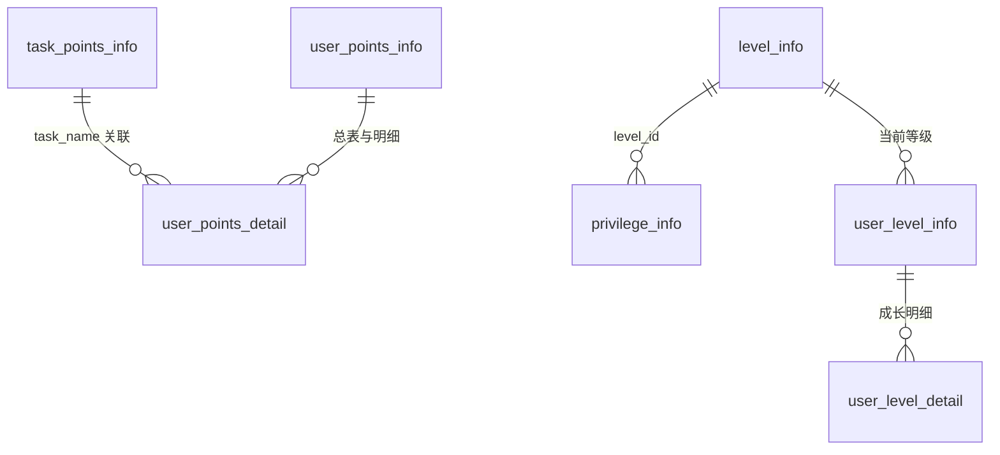

# Kubernetes 认证考点: 用户积分等级系统的详细数据库设计 —— 任务积分表、用户积分与明细、等级表、特权表

**前面已经把用户积分和等级系统的作用以及设计讲完，那么做数据库设计也就容易很多了。**

结论先给：**数据库设计的目的，是为了完成前面的功能，把数据都完整地保存起来，也能把数据之间的关系清晰地表现（表）出来。** 方法是先对系统的数据模型做提炼，看我们系统里会出现哪些数据模型，然后一张张定义。**积分系统这边：发放主要靠任务和活动（活动不在本系统里设计），所以要有一张"任务积分信息表"（任务名称唯一作为查找 key、每次发放积分数、每日限额、生效时间，积分数值可正可负可为零）；用户那边要"用户积分信息表"存总积分，还要"积分明细表"记每一次增减 —— 两个表缺一不可，明细是对账和用户"我到底怎么赚的"的依据。** **等级这边："等级信息表"定义等级名称、描述、成长数值与有效期，其中成长数值必须有序且连续（一级到二级不能有空缺区间）；"特权信息表"把等级、产品、功能、有效期串起来；"用户等级信息表"记当前等级、成长数值与到期时间，成长值够就升级、到期就降级，另外还要一张等级成长明细表（照积分明细照抄即可）。** 兑换商城、特价商品、礼品中心这类内容很多，可以作为独立的扩展系统设计，本课程这里略过。

## 纲要

- 设计目的与提炼方法
- 积分系统从"任务"开始：任务积分信息表
- 积分数值为正 / 负 / 零的三种语义
- 每日限额与生效时间
- 用户积分信息表与积分明细表：为什么必须两个
- 兑换商城：当作独立系统
- 等级信息表：成长数值有序且连续
- 有效期：等级到期时间怎么算出来
- 特权信息表：等级 × 产品 × 功能 × 时长
- 用户等级信息表与升级/降级
- 等级成长明细与周边扩展表
- 完整 ER 与总表清单
- DDL 示例
- API 速览、Demo 示例与总结

## 设计目的与提炼方法

**做详细的数据库设计，前面已经把用户积分和等级系统的作用以及设计完成，所以做数据库设计也就容易很多了。数据库设计的目的就是为了完成前面的功能，能够把数据都完整地保存起来，而且可以把数据之间的关系也清晰地表现（表）出来。**

```text
设计步骤
① 提炼数据模型：系统里会出现哪些"事物"
② 每个事物 → 一张主表（它有哪些属性）
③ 事物之间的"行为"（发放、消耗、升级） → 拆表还是记流水
④ 定字段类型、索引、唯一约束（哪些必须唯一、哪些必须有序）
⑤ 写 DDL，初始化数据库
```

## 积分系统从"任务"开始：任务积分信息表

**用户积分系统发放积分的方式，主要是通过活动和任务。活动不在咱们的系统设计中设计，而任务需要在这里定义，所以需要有任务积分信息表。**

**表里面需要定义：任务的名称、任务每次发放的积分数、每天的限额、任务的生效时间。这里的字段需要注意的地方：**

| 字段 | 含义 | 注意点 |
| --- | --- | --- |
| **任务名称** | **任务的标识** | **需要是唯一的，要作为 key 来查找对应的积分配置** |
| **每次发放积分数** | **完成一次任务给多少分** | **可正可负可为零（见下表）** |
| **每日限额** | **同一个用户在同一个任务上，每天最多可以发放积分的次数** | **限发策略落库的地方** |
| **生效时间** | **任务积分的生效开始时间** | **可以在具体任务上线前提前把配置设好，也利于系统提前加载数据、做好缓存** |

**积分数值的三种语义（这里最容易设计错）：**

| 每次发放积分数 | 含义 |
| --- | --- |
| **正数** | **说明是发放积分** |
| **负数** | **说明是扣减积分** |
| **为零** | **可以自由发放和扣减积分，由调用方来决定具体的使用，比如特殊的奖励或者兑换时的扣减** |

```sql
CREATE TABLE task_points_info (
    id            BIGINT       PRIMARY KEY AUTO_INCREMENT,
    task_name     VARCHAR(64)  NOT NULL UNIQUE,   -- 唯一，作为查找 key
    points        INT          NOT NULL DEFAULT 0, -- 正=发放 负=扣减 0=自由
    daily_limit   INT          NOT NULL DEFAULT 1, -- 同一用户同一任务每日上限次数
    effective_at  DATETIME     NOT NULL,           -- 生效开始时间（可提前配置、可预热缓存）
    created_at    DATETIME     NOT NULL DEFAULT CURRENT_TIMESTAMP,
    updated_at    DATETIME     NOT NULL DEFAULT CURRENT_TIMESTAMP
                                ON UPDATE CURRENT_TIMESTAMP,
    INDEX idx_effective_at (effective_at)
) COMMENT='任务积分配置表';
```

## 每日限额与生效时间

**每日限额对前面说过的"限量"：同一个用户在同一个任务上、每天最多发放积分的次数；生效时间可以定义任务积分的生效开始时间，这样就可以在具体任务上线前提前设置好相应的积分配置，也有利于系统提前加载数据、做好缓存。**

```text
发放时的计数口径（与 daily_limit 对齐）
├── 计数维度：user_id × task_name（同一用户同一任务）
├── 计数周期：自然日（当天 00:00 清零）
├── 超限处理：直接拒绝发放，不写明细
└── 落库方式：明细表 + 按 (user_id, task_name, day) 计数，或用计数器/缓存做日维度累加
```

## 用户积分信息表与积分明细表

**用户完成了任务、参与了任务或者参与了活动，获得了积分，需要给用户记录上相应的积分。所以需要有用户积分信息表，保存用户的总积分；除了总积分，也需要有用户的积分明细，每一次增加或者减少积分，都需要有详细的记录，让用户也明明白白地知道自己的积分是怎么增加的、是怎么减少的。这个数据表里面，同样也要把用户任务积分记录下来，而且要把积分获取时间记录下来。**

| 表 | 存什么 | 为什么必须有 |
| --- | --- | --- |
| **用户积分信息表** | **用户总积分（当前余额）** | **快速读，展示和扣减都看它** |
| **积分明细表** | **每一次增减的详细记录（含任务积分、获取时间）** | **对账、申诉、"我怎么少了 200 分"；余额坏了能追回** |

```sql
CREATE TABLE user_points_info (
    id         BIGINT      PRIMARY KEY AUTO_INCREMENT,
    user_id    BIGINT      NOT NULL UNIQUE,   -- 一人一行
    points     INT         NOT NULL DEFAULT 0, -- 总积分 / 可用余额
    updated_at DATETIME    NOT NULL DEFAULT CURRENT_TIMESTAMP
                ON UPDATE CURRENT_TIMESTAMP
) COMMENT='用户积分总表';

CREATE TABLE user_points_detail (
    id           BIGINT       PRIMARY KEY AUTO_INCREMENT,
    user_id      BIGINT       NOT NULL,
    task_name    VARCHAR(64)  NOT NULL,        -- 关联 task_points_info.task_name
    delta        INT          NOT NULL,        -- 正增负减
    remain       INT          NOT NULL,        -- 变动后余额
    biz_type     VARCHAR(32)  NOT NULL,        -- task/promotion/exchange/penalty
    ref_id       VARCHAR(64)  NOT NULL DEFAULT '', -- 业务单号（可空）
    got_at       DATETIME     NOT NULL,        -- 积分获取时间
    created_at   DATETIME     NOT NULL DEFAULT CURRENT_TIMESTAMP,
    KEY idx_user_time (user_id, got_at),
    KEY idx_task (task_name, got_at)
) COMMENT='用户积分明细（每一次增减都要记）';
```

## 兑换商城：当作独立系统

**除了用户的任务积分，这些数据的记录肯定还会有兑换商城的需求 —— 这部分的内容也很多，可以作为一个独立的系统来开发，咱们这里就简单略过；大家如果感兴趣，也可以考虑单独来讲一讲这类系统的设计和开发。虽然有商城的模型，但要求会低很多。**

```text
兑换商城（可选独立子系统）
├── exchange_goods    兑换商品（含所需积分数/限时/限兑数量）
├── exchange_order    兑换订单（用户、商品、消耗积分数、状态）
└── 校验：积分够不够 → 扣减（走 points=0 自由扣减的调用方）→ 记明细 → 生成订单
```

## 等级信息表：成长数值有序且连续

**接下来看用户等级系统的数据库设计，首先是等级信息表。表里面要定义系统中所要的等级，所以这里需要有等级名称、等级描述，还要有等级的成长数值和有效期。其中需要注意的地方是：所有的等级对应的成长数值需要是有序的，而且连续的 —— 等级一和等级二不能出现成长数值的空缺区间。**

**成长数值为什么必须连续有序：判等级时可以直接按成长值做区间匹配（取第一个满足 `min_exp <= 现有成长值` 的那条），中间一旦留空档，要么查不到等级，要么得写一堆特判。有效期是针对等级的时间限制：比如黄金会员有效期是一年，那么用户得到这个等级的时候，你就知道这个用户对应的等级到期时间了。**

```sql
CREATE TABLE level_info (
    id          BIGINT      PRIMARY KEY AUTO_INCREMENT,
    level_name  VARCHAR(64) NOT NULL,        -- 等级名称（如 黄金会员）
    description VARCHAR(255) NOT NULL DEFAULT '',
    min_exp     INT         NOT NULL,        -- 进入该等级所需成长数值
    expired     INT         NOT NULL DEFAULT 0, -- 有效期（天）；0=永久
    created_at  DATETIME    NOT NULL DEFAULT CURRENT_TIMESTAMP,
    UNIQUE KEY uk_level_name (level_name),
    KEY idx_min_exp (min_exp)               -- 有序连续，按成长值查等级全靠它
) COMMENT='等级信息表';

-- 期望的数据形态（注意连续，不允许 0/100/500/900/2000 这种留空档）
-- 1  Lv.1 新用户      0
-- 2  Lv.2 活跃        100
-- 3  Lv.3 资深        300
-- 4  Lv.4 达人        1000
-- 5  Lv.5 专家        3000
```

## 特权信息表：等级 × 产品 × 功能 × 时长

**每个等级都会有各自的产品特权。里面需要有一个特权信息表，里面要记入等级信息、产品信息、功能信息和有效期；等级信息对应的是等级信息表的 ID，产品和功能名称可以唯一标识某个具体的业务特权，有效期和等级的有效期类似，限制一个时长。**

```sql
CREATE TABLE privilege_info (
    id            BIGINT      PRIMARY KEY AUTO_INCREMENT,
    level_id      BIGINT      NOT NULL,             -- 对应 level_info.id
    product_name  VARCHAR(64) NOT NULL,             -- 产品
    feature_name  VARCHAR(64) NOT NULL,             -- 功能
    duration_days INT         NOT NULL DEFAULT 0,   -- 特权有效期（0=随等级）
    created_at    DATETIME    NOT NULL DEFAULT CURRENT_TIMESTAMP,
    UNIQUE KEY uk_level_feature (level_id, product_name, feature_name),
    KEY idx_level (level_id)
) COMMENT='等级特权信息表（等级 → 产品 → 功能 → 时长）';
```

## 用户等级信息表与升级 / 降级

**接下来就是用户相关的数据表了。用户等级信息表需要记录一下用户等级到期时间和成长数值。等级和成长数值有一定的相关性：当成长数值增加达到下一个更高等级时，就需要升级了；而到期时间会记录下当前的等级有效时间，到期就要降级了。**

| 字段 | 触发什么 |
| --- | --- |
| **成长数值增加 → 够到下一级门槛** | **升级（重新算到期时间）** |
| **到期时间到了** | **降级（按规则自动降，或管理员手动取消）** |

```sql
CREATE TABLE user_level_info (
    id         BIGINT     PRIMARY KEY AUTO_INCREMENT,
    user_id    BIGINT     NOT NULL UNIQUE,
    level_id   BIGINT     NOT NULL,        -- 当前等级（对应 level_info.id）
    exp        INT        NOT NULL DEFAULT 0, -- 用户当前成长数值
    expire_at  DATETIME   NULL,            -- 等级到期时间（NULL=永久）
    created_at DATETIME   NOT NULL DEFAULT CURRENT_TIMESTAMP,
    updated_at DATETIME   NOT NULL DEFAULT CURRENT_TIMESTAMP
                ON UPDATE CURRENT_TIMESTAMP,
    KEY idx_exp (exp)
) COMMENT='用户等级信息表（成长值升、到期降）';
```

## 等级成长明细与周边扩展表

**类似于积分明细，用户等级的成长也需要有一个明细的记录表 —— 和积分系统太相似了，这里就省略掉，有需要的话参照积分明细来设计和实现就好了。用户等级系统除了特权功能，可能还会涉及到特价商品和礼品中心的周边系统，也是根据实际情况和需要再来设计就可以了；和兑换商城类似，大家可以作为扩展的系统来设计，结合开发。**

```text
用户等级系统的周边（按需扩展，不必一次做全）
├── user_level_detail   等级成长明细（照 user_points_detail 抄一份）
├── level_privilege_grant  已发放的特权（起止时间，用于判当前是否仍生效）
├── goods_special         特价商品（等级限定 + 折扣）
└── gift_center           礼品中心（等级门槛 + 库存）
```

## 完整 ER 与总表清单



```text
用户积分 / 等级系统（表清单）
├── 配置层
│   ├── task_points_info    任务积分配置（名称唯一 / 每次积分 / 每日限额 / 生效时间）
│   └── level_info          等级（名称 / 描述 / 成长数值 / 有效期）
├── 资产层
│   ├── user_points_info    用户总积分（一人一行）
│   ├── user_points_detail  积分明细（每次增减 + 获取时间）
│   ├── user_level_info     用户等级（等级 / 成长值 / 到期时间）
│   └── user_level_detail   等级成长明细（可参照积分明细）
├── 特权层
│   └── privilege_info      特权（等级 / 产品 / 功能 / 时长）
└── 扩展（独立子系统）
    ├── 兑换商城：exchange_goods + exchange_order
    ├── 特价商品 / 礼品中心
    └── 活动系统（课程中不在本系统设计里）
```

## DDL 使用方式

**数据表创建的完整过程咱们就不看了 —— 实战项目的源代码中还会有完整的 DDL 语句，初始化数据库的时候也可以直接使用。**

```bash
# 初始化：直接执行项目里给出的 DDL
mysql -u root -p < sql/init_points_level.sql

# 也可以一条条建（字段含义见上面各表注释）
mysql -u root -p mydb -e "SHOW TABLES LIKE '%_info';"

# 上线前先灌配置（提前设置，利于预热缓存）
mysql -u root -p mydb -e "
INSERT INTO task_points_info(task_name, points, daily_limit, effective_at)
VALUES ('publish', 10, 3, NOW()), ('share', 5, 4, NOW());"
```

## API 速览

| 表 | 定位 | 关键约束 |
| --- | --- | --- |
| **task_points_info** | **任务积分配置** | **task_name 唯一；points 可正/负/零** |
| **user_points_info** | **用户总积分** | **user_id 唯一，读多写少** |
| **user_points_detail** | **积分流水** | **每一次增减都记，含获取时间** |
| **level_info** | **等级定义** | **min_exp 有序且连续，不能留空档** |
| **privilege_info** | **等级特权** | **level_id + 产品 + 功能唯一；带时长** |
| **user_level_info** | **用户等级快照** | **成长值升、到期降** |
| **user_level_detail** | **等级成长明细** | **照积分明细设计** |
| **兑换商城类** | **扩展子系统** | **要求比积分低很多，可独立开发** |

## Demo 示例

一条完整的"发放 → 记账 → 升级"数据走向：

```text
① 配置：task_points_info(task_name='publish', points=10, daily_limit=3, effective_at=...)
② 用户发第 1 篇：user_points_info.points 10→10（总表更新）
   记明细：user_points_detail(user_id=1, task_name='publish', delta=+10, remain=10, got_at=...)
③ 用户发第 4 篇：每日限额=3 已用满 → 拒绝发放，不记明细
④ 参与活动得特殊奖励：points=0 的配置由调用方自由发放 → delta 由业务传入
⑤ 兑换会员卡：走扣减 → delta=-50, remain=0（负数是扣减）
⑥ 成长值累积到 1000：user_level_info.exp 达标 → level_id 升到 Lv.4，算 expire_at = 生效日+365 天
⑦ 365 天定时任务扫 expire_at < now() → 降级（写 level_log 留痕）
```

对账常用的两条 SQL：

```sql
-- ① 总表与明细是否对得上（差了就是丢了流水）
select p.user_id, p.points as total, d.s as detail
from user_points_info p
join (select user_id, sum(delta) s from user_points_detail group by user_id) d
  on p.user_id = d.user_id
where p.points <> d.s;

-- ② 有没有生成不出的等级（成长值落在空档里）
select u.user_id, u.exp, u.level_id
from user_level_info u
where not exists (
    select 1 from level_info l where l.min_exp <= u.exp
);
```

## 总结

1. **设计从前面讲完的功能倒推**：**前面已经把用户积分和等级系统的作用以及设计完成，做数据库设计就容易很多；数据库设计的目的就是为了完成前面的功能，把数据都完整地保存起来，也能把数据之间的关系清晰地表现出来。数据表的定义需要对系统的数据模型进行提炼，看看咱们的系统中会出现哪些数据模型**；
2. **任务积分信息表是入口**：**用户积分系统发放积分的方式主要是通过活动和任务，活动不在咱们的系统设计中设计，而任务需要在这里定义，所以需要有任务积分信息表，里面定义任务的名称、任务每次发放的积分数、每天的限额、任务的生效时间**；
3. **任务名称唯一**：**这里的字段要注意 —— 任务名称需要是唯一的，要作为 key 来查找对应的积分配置**；
4. **积分数可正可负可为零**：**正数说明是发放积分，负数说明是扣减积分，而积分为零则说明可以自由发放和扣减积分，由调用方来决定具体的使用，比如特殊的奖励或者兑换时的扣减**；
5. **每日限额与生效时间**：**每日限额就是同一个用户在同一个任务上每天最多可以发放积分的次数；生效时间定义任务积分的生效开始时间，这样可以在具体任务上线之前就提前把相应的积分配置设置好，也有利于系统提前加载数据、做好缓存**；
6. **总积分和明细要分开**：**用户完成任务、参与任务或参与活动获得积分，需要给用户记录上相应的积分，所以需要有用户积分信息表保存用户的总积分；除了总积分也需要有用户的积分明细，每一次增加或者减少积分都要有详细记录，让用户也明明白白知道自己的积分是怎么增加、怎么减少的；这个表里面同样要把用户任务积分记录下来，还要把积分获取时间记录下来**；
7. **兑换商城可以独立成系统**：**除了任务积分，还会有兑换商城的需求，这部分内容也很多，可以作为一个独立的系统来开发，这里就简单略过 —— 虽然有商城的模型，但要求会低很多**；
8. **等级信息表的四个字段**：**等级信息表里面要定义系统中所要的等级，所以需要有等级名称、等级描述，还要有等级的成长数值和有效期**；
9. **成长数值必须有序且连续**：**所有等级对应的成长数值需要有序，而且连续 —— 等级一和等级二不能出现成长数值的空缺区间**；
10. **有效期决定到期时间**：**有效期是针对等级的时间限制，比如黄金会员有效期是一年，那么用户得到这个等级的时候，你就知道这个用户对应的等级到期时间了**；
11. **特权信息表串起等级、产品、功能、时长**：**每个等级都有各自的产品特权，需要有一个特权信息表，里面记入等级信息、产品信息、功能信息和有效期；等级信息对应的是等级信息表的 ID，产品和功能名称可以唯一标识某个具体的业务特权，有效期和等级的有效期类似，限制一个时长**；
12. **用户等级信息表管升级与降级**：**用户等级信息表需要记录用户等级到期时间和成长数值；等级和成长数值有一定的相关性，当成长数值增加达到下一个更高等级时就需要升级了，而到期时间会记录下当前等级的有效时间，到期就要降级了**；
13. **等级成长明细可参照积分明细**：**类似于积分明细，用户等级的成长也需要有一个明细的记录表，和积分系统太相似了，这里就省略掉，有需要的话参照积分明细来设计和实现就好**；
14. **周边按实际情况扩展**：**用户等级系统除了特权功能，可能还会涉及到特价商品和礼品中心的周边系统，按实际情况和需要再来设计；和兑换商城类似，可以作为扩展的系统来设计结合开发。至于数据表创建的完整过程就不看了，实战项目的源代码中还会有完整的 DDL 语句，初始化数据库的时候可以直接使用**。

