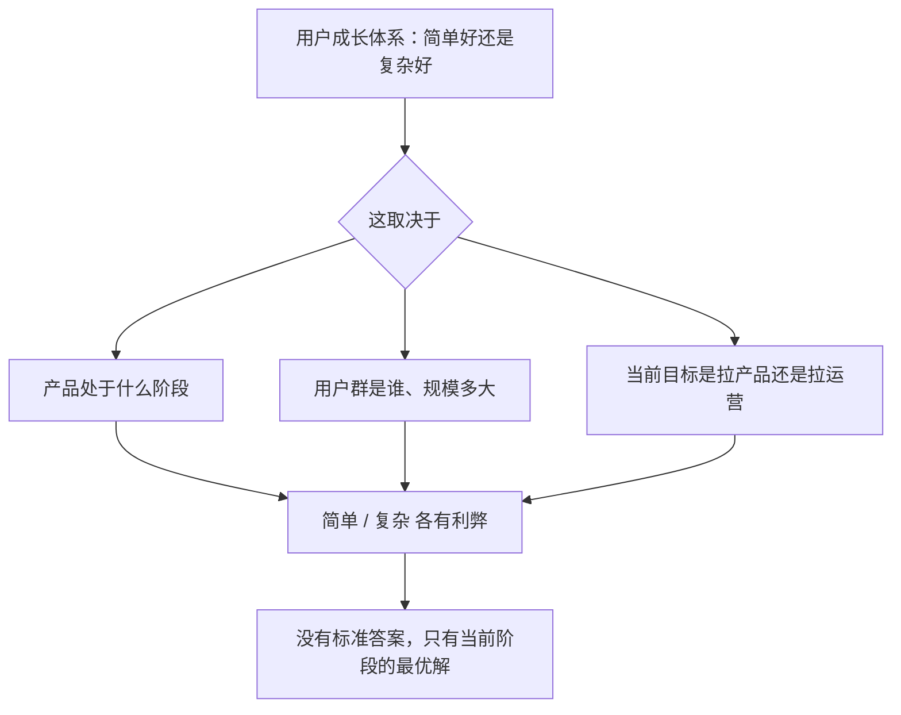
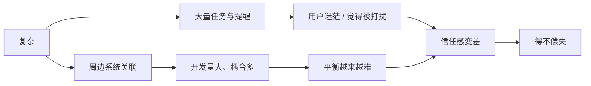

# Kubernetes 认证考点: 讨论 —— 用户成长体系是简单好还是复杂好，以及「前期做产品、后期做运营」的取舍

**这一节是一期讨论：用户成长体系是简单好还是复杂好？**

结论先给：**不同产品、不同场景、不同用户群，对成长体系的需求本来就不一样；引入积分、虚拟货币、成长值、经验值、等级、身份、特权、成就、勋章这些系统，是只用一种还是用多种，各有各的理由和弊端，所以这个问题没有标准答案 —— 但它有一个可操作的答案：按阶段选。** **简单的好处是抓住重点，把产品和开发的精力都放在产品上，用户理解也更容易，没有太多转换计算和思考，用户该做什么还是做什么、希望做什么还是做什么，附带的用户成长信息不突出也不抢眼，很少有干扰；但它的问题是这类体系现在貌似越来越少了。** **复杂的好处是可以面面俱到，把重点放在用户运营上，能和更多周边系统关联、用大量提醒让成长体系无处不在，给运营带来更多操作可能性；代价是用户会迷茫、甚至觉得被打扰，开发工作量更大、系统间关联更多，积分/等级/各子系统之间越来越难平衡，一旦出现通胀或者某些数字泛滥，整个体系的信任感就会很差，反倒是得不偿失。** 课程给出的建议很朴素：**综合考虑"专心做产品"还是"花更多精力做运营" —— 前期做产品，后期做运营。**

## 纲要

- 为什么没有标准答案
- 简单派：好处与隐忧
- 复杂派：好处与代价
- 复杂的五笔账
- 一个简单的决策框架
- 折中：一根主干 + 活动做增量
- 前期做产品，后期做运营
- API 速览、Demo 示例与总结

## 为什么没有标准答案

**面对这个讨论问题，相信大家都会有不同的想法和意见 —— 毕竟不同的产品、不同的场景、不同的用户群，对于用户成长体系的需求也会不一样。不论是引入积分、虚拟货币、成长值、经验值、等级、身份、特权、成就、勋章等系统，是只使用其中一种，还是使用多种，都会有各自的理由和弊端。**



## 简单派：好处与隐忧

**简单的好处：抓住重点，把产品和开发的精力都放在产品上；同样用户理解也会更加容易，没有太多转换计算和思考存在；这样的成长体系（用户该做什么还是做什么、希望做什么还是做什么），附带的成长信息不突出也不抢眼，很少有干扰。**

| 简单的好处 | 说明 |
| --- | --- |
| **抓住重点** | **把产品和开发的精力都放在产品上** |
| **用户理解容易** | **没有太多转换计算和思考存在** |
| **不干扰主流程** | **附带的用户成长信息不突出，也不抢眼，很少有干扰** |
| **成本低** | **少一张表、少一个子系统，就少一处要维护和报错的地方** |

**但隐忧也在这里：这样简单的成长体系貌似越来越少了。** —— 是不是很怀念古老的 QQ 等级：你有几个月亮、有没有太阳、挂机时长是多久？**即使是一开始如此简单的 QQ 战绩，后来也是越做越复杂，引入了太多的东西；现在已经很难去理解它了，估计也没什么人在意它了。**

```text
QQ 等级（一个真实的"简单 → 复杂"演化样本）
初期：几个太阳 / 一个月亮 + 挂机时长      ← 人人看得懂，算得清
后期：等级 + 会员 + VIP/SVIP + 各种钻
      + 成长等级 + 特权 + 勋章 + 排行榜    ← 引入太多东西
今天：已经很难去理解它，也没什么人在意它了
```

## 复杂派：好处与代价

**复杂的好处是可以做到面面俱到，把重点放在用户运营上：**

- **因为想要在很多地方都可以参与到用户运营中，所以系统就要和更多周边系统做关联**；
- **因为想要引导用户完成更多的活动任务，所以系统就会有很多的提醒，让系统无处不在，用户每时每刻都能触达到用户成长体系的方方面面**；
- **这样做当然是给用户运营带来了更多操作上的可能性。**

**代价同样清楚：**

- **也会让用户很迷茫，如果是不喜欢这个体系的用户，甚至会觉得被打扰到**；
- **同时系统越复杂，开发工作量也更大，系统之间的关联也会越多**；
- **不论是积分还是等级或者其他子系统，要做好平衡也会越来越难；一旦出现通胀或者某些数字泛滥，那么整个体系的信任感就会很差，反倒是得不偿失。**

## 复杂的五笔账

**把"复杂"拆成五笔账，它就不再是感觉问题，而是能算的问题：**

| 成本 | 从哪来 | 什么时候会爆 |
| --- | --- | --- |
| **开发工作量** | **子系统多、系统之间关联多** | **每次加一个玩法都要改多处** |
| **打扰成本** | **提醒多、系统无处不在** | **不喜欢的用户的流失** |
| **平衡难度** | **积分/等级/成就/勋章要互相平衡** | **运营加玩法时牵一发动全身** |
| **信任成本** | **通胀、数字泛滥** | **规则一改，用户不认了** |
| **理解成本** | **用户要算"我差多少"** | **转化与参与率反而下降** |



## 一个简单的决策框架

**所以还是要综合考虑一下：是专心做产品，还是花更多精力做运营。**

| 信号 | 更该偏向 |
| --- | --- |
| **产品还小、核心玩法没打磨好** | **简单，精力全给产品** |
| **用户增长靠的是功能本身（刚需）** | **简单，成长体系可有可无** |
| **社区/电商类、用户缺少高频操作** | **可以复杂一点，用它喂出高频动作** |
| **已有规模、核心玩法挖到头了** | **转向运营，用体系拉活跃** |
| **正在做多端/多业务复用一套成长** | **复杂，但要先把数据模型定死** |
| **团队就两三个人** | **简单，别先背一个子系统** |

## 折中：一根主干 + 活动做增量

**真要落地，比较稳的画法是"一条主干 + 一层活动外壳"：主干只留最少的几张表（积分/成长值、等级/特权），所有临时玩法都挂到活动上，活动结束就摘掉。**

```text
用户成长体系（折中形态）
├── 主干（长期维护，尽量少）
│   ├── 积分 / 成长值      ← 一个口径，别同时跑多套
│   └── 等级 / 特权        ← 成长值有序连续，特权带期限
└── 活动外壳（随时增删，不进主干）
    ├── 限时任务            ← 拉某个阶段的高频动作
    ├── 主题勋章            ← 造话题、做传播
    └── 新玩法试点          ← 验证过再考虑并入主干
# 判断标准：一个玩法如果 30 天后还留着，才值得进主干
```

## 前期做产品，后期做运营

**个人建议是：前期做产品，后期做运营。**

- **当产品还很小的时候，它自身的核心玩法都需要不断打磨，这时候的重点还是放在产品研发上面吧**；
- **如果产品已经具有一定规模，而且没有太多挖掘潜力和方向了，可以考虑把更多的精力放在用户运营上**；
- **而且运营的工作，也建议更多使用活动的形式 —— 不断地推出新的活动，既让用户有新鲜感，又会有很多事情可做；所以这时候又考验运营设计和开发新活动的能力了。**

```text
阶段一（小）：专心做产品
    核心玩法打磨 → 成长体系只做最简（如：浏览/发布 给积分，攒够升级）
阶段二（大）：转向运营
    核心玩法见顶 → 用活动不断推新，用成长体系承接活跃
    ↓
    考验：运营设计与开发"新活动"的能力
```

**你怎么看这个问题？用户成长体系，你是支持简单化还是复杂化？把自己的想法和答案写下来就好 —— 想清楚比选一边更重要。**

## API 速览

| 概念 | 简单方案 | 复杂方案 | 适用信号 |
| --- | --- | --- | --- |
| **激励形式** | **只用一种（如积分/等级）** | **多种（积分+等级+勋章+成就+排行榜）** | **人数少 → 简单；要精细化运营 → 复杂** |
| **提醒** | **几乎无，成长信息不抢眼** | **大量提醒，体系无处不在** | **产品驱动 → 无；运营驱动 → 有** |
| **周边系统关联** | **1~2 个** | **和更多周边系统关联** | **耦合越多，平衡越难** |
| **风险点** | **体系存在感弱，没人参与** | **通胀、数字泛滥、信任感崩** | **数字一旦泛滥就很难挽回** |
| **建议节奏** | **前期做产品** | **后期做运营** | **核心玩法打磨 vs 运营潜力见顶** |

## Demo 示例

给自己产品的成长体系站一次队，用这张清单打分：

```text
【简单度自查】
├── 用户能不能一句话说清"我怎么升级"？        能 → 1 分，不能 → 0 分
├── 一个运营能不能自己配玩法，不用改代码？      能 → 1 分，不能 → 0 分
├── 有几个提醒是"用户没做任何操作就弹出来的"？   ≤1 → 1 分，≥5 → 0 分
├── 积分和成长值是不是只有一个口径？            是 → 1 分，否 → 0 分
└── 总分 ≥3：当前可以保持简单；≤1：已经偏复杂，先拆活动

【复杂度自查】
├── 数一下：积分 / 等级 / 勋章 / 成就 / 排行榜 现在同时跑几套？   >2 套 → 该收敛
├── 最近一次改成长规则，改了几张表、几个子系统？                  ≥3 处 → 耦合过重
├── 最近有没有出现积分"只发不花"或数字明显泛滥？                 有 → 先修回收端
└── 最近三个月新增的玩法里，有多少在活动结束后被关掉了？           ≥ 一半 → 说明主干该收缩
```

## 总结

1. **这是一个没有标准答案的题**：**面对"用户成长体系是简单好还是复杂好"这个讨论问题，相信大家都会有各自不同的想法和意见 —— 不同的产品、不同的场景、不同的用户群，需求都会不一样；不论是引入积分、虚拟货币、成长值、经验值、等级、身份、特权、成就、勋章等系统，是只用一种还是使用多种，都各有各的理由和弊端**；
2. **简单的好处**：**抓住重点，把产品和开发的精力都放在产品上；用户理解也会更加容易，没有太多转换计算和思考存在；用户该做什么还是做什么、希望做什么还是做什么，附带的用户成长信息不突出也不抢眼，很少有干扰**；
3. **简单的隐忧**：**这样简单的用户成长体系貌似越来越少了 —— 是不是很怀念古老的 QQ 等级，你有几个月亮、有没有太阳、挂机时长是多久；即使一开始如此简单的 QQ 战绩，后来也是越做越复杂、引入了太多东西，现在已经很难去理解它，估计也没什么人在意它了**；
4. **复杂的好处**：**可以做到面面俱到，重点放在用户运营上；因为想在很多地方参与用户运营，系统就要和更多周边系统做关联；因为想引导用户完成更多活动任务，系统就会有很多提醒、让系统无处不在，用户每时每刻都能触达到成长体系的方方面面，这当然给用户运营带来了更多操作上的可能性**；
5. **复杂的代价**：**也会让用户很迷茫，不喜欢的甚至会觉得被打扰到；同时系统越复杂，开发工作量也更大、系统之间关联也更多；不管是积分还是等级或者其他子系统要做好平衡都会越来越难；一旦出现通胀或者某些数字泛滥，整个体系的信任感就会很差，反倒是得不偿失**；
6. **决策变量其实是"阶段"**：**所以还是要综合考虑一下 —— 是专心做产品，还是花更多精力做运营；一个粗暴的判断法是：核心玩法还在打磨就做产品，核心玩法挖到头了就做运营**；
7. **前期做产品，后期做运营**：**产品还小的时候，它自身的核心玩法都需要不断打磨，这时候重点还是放在产品研发上面；如果产品已经具有一定规模、而且没有太多挖掘潜力和方向了，可以考虑把更多精力放在用户运营上**；
8. **运营优先用活动形式**：**运营的工作建议更多使用活动的形式，不断推出新的活动，既让用户有新鲜感，又会有很多事情可做 —— 这时候又考验运营设计和开发新活动的能力了**；
9. **落地折中**：**一根主干（积分/成长值 + 等级/特权）+ 一层活动外壳（限时任务、主题勋章、新玩法试点）；一个玩法 30 天后还留着，才值得进主干，否则就让它随活动一起下线**；
10. **收尾问题**：**你自己怎么看？用户成长体系你是支持简单化还是复杂化 —— 支持哪一边不重要，能说出"我为什么在这个阶段选它"才重要。**

