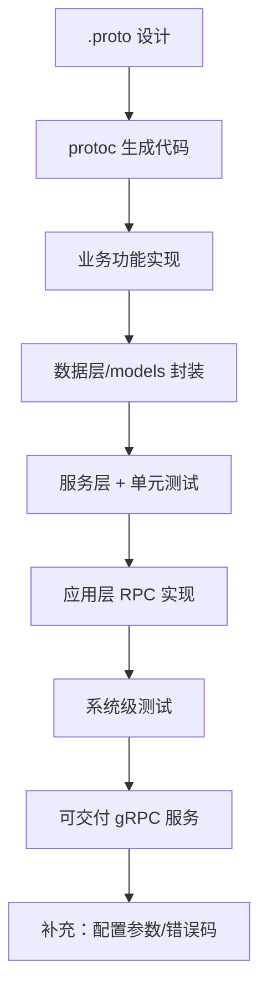

# gRPC 服务设计与开发全流程：本章小结

经过本章学习，是不是感觉设计和开发 gRPC 服务其实并不难？完成了咱们的实战项目——用户积分和等级系统之后，再让你做一个新的 gRPC 服务，还会觉得很难、还要花很多时间吗？如果还有点不自信、说不清楚，咱们就通过本章小结把整个过程快速回顾一遍。

## 纲要

- 全流程回顾：`.proto` 设计 → `protoc` 生成 → 业务功能 → 数据层/服务层 → 测试
- `.proto` 编写铁律：定义 service / RPC / message，字段序号不可随意改
- 代码生成：PB 代码 + 未实现服务骨架，继承即可实现
- 数据层：用 `xorm` 的 reverse 工具生成 models，封装配置与连接
- 测试双阶段：单元测试（单元级）+ 系统测试（客户端视角）
- 章末补充：gRPC 配置参数（ServerOption / DialOption）与错误码排查

## 全流程关键节点

| 阶段 | 关键动作 | 易错点 |
| --- | --- | --- |
| `.proto` 设计 | 定义 service / RPC / message | 字段序号（tag）勿随意改，否则兼容性崩 |
| 代码生成 | `protoc` 生成 PB + 未实现 stub | 继承 stub 实现，勿改生成物 |
| 数据层 | xorm reverse 生成 models | 连接与配置统一封装 |
| 测试 | 单元测试 + 系统级测试 | 核心方法先单测再拼装 |
## 第一步：设计与编写 `.proto` 文件

最先要做的是设计和编写 `.proto` 文件。在里面先定义 **service**，再在 service 里定义 **RPC 方法**；每个 RPC 方法都有一个**输入消息**和一个**输出消息**。接着定义这些消息的所有字段，整份 `.proto` 就基本完成了。

> **关键铁律**：后续修改时**不要随便改动消息中字段的序号（tag）**，否则会出现严重的兼容性问题（旧客户端读不到新字段、新老数据错位）。

有了 `.proto`，通过 `protoc` 命令行工具就能轻松把服务里的 PB 代码和 gRPC 代码自动生成出来。生成的代码包含咱们定义的全部 PB 消息、全部 service 和 RPC 方法，并且同时生成了一个**未实现的服务**（service stub）。后面自己编写 gRPC 服务时，**继承这个未实现的服务**即可。

## 第二步：补全业务功能与数据层

通过 `.proto` 生成好 gRPC 服务之后，还需要完成用户积分等级系统的**自身业务功能**，所以要有对数据的操作。这里可以用 **xorm 的 reverse 工具**快速生成数据表的 models 文件，再把项目的配置信息以及数据库连接实例封装实现好。接着就能针对一个个数据表，完成它们的数据层、服务层代码封装。

## 第三步：单元测试保可靠

为了保证系统代码的可靠性，咱们还对服务层的**一些方法编写了单元测试**，一个个验证通过才算完成。以后大家开发中也要记得：**对核心代码进行单元测试**。

```bash
# 运行单元测试（Go 示意）
go test ./internal/service/... -v

# 用 buf 等工具管理 protobuf（示意，非必须）
# buf generate
```

## 第四步：应用层与系统级测试

完成数据处理后，还要处理业务逻辑——这些放在**应用层**。应用层代码主要完成前面设计的几个 gRPC 远程方法，需要处理参数、业务逻辑和返回消息。这个过程既有数据库交互，也有消息与模型对象的转换处理。

应用层开发完成后，再次对整个系统做了一次**完整测试**：可以成功启动服务端程序，同时客户端程序也能正常请求到服务端，并且返回值与预期一致——这就是要做的验证工作，确认开发的用户积分等级系统能按预期提供 gRPC 服务。



## 章末补充：配置参数与常见错误

本章最后两段补充了 gRPC 的常见配置参数和一些常见问题：

- **配置参数**：服务端用到的 `ServerOption`、客户端用到的 `DialOption`。最好的学习掌握方法是从源码里看它们的小例子，课程里也有介绍，很容易使用；
- **常见错误**：重点关注 gRPC 的**错误码**，理解每个错误码的含义，同时把程序的错误信息记录完整——这样遇到问题时排查分析会容易很多。

```dir
gRPC 开发全流程
├── .proto 设计（service/RPC/message）
├── protoc 生成（PB + 未实现服务）
├── 业务功能
│   ├── xorm reverse 生成 models
│   └── 配置与连接封装
├── 测试
│   ├── 服务层单元测试
│   └── 应用层系统测试（客户端视角）
└── 补充
    ├── ServerOption / DialOption
    └── 错误码 + 完整日志
```

## 总结

本章把"从零实现一个 gRPC 服务"的完整链路收口了：

1. **`.proto` 先行**：service → RPC → message，字段序号改了会破坏兼容；
2. **`protoc` 生成**：产出 PB 代码 + 未实现服务骨架，继承它来写实现；
3. **数据层自动化**：xorm reverse 生成 models，封装配置与连接，再逐表封装；
4. **单元测试保底**：核心方法先测通，可靠性才有底气；
5. **应用层收口**：实现全部 RPC 方法，完成参数/逻辑/消息转换；
6. **双补充打底**：`ServerOption`/`DialOption` 配置 + 错误码与完整日志，是排障利器。
