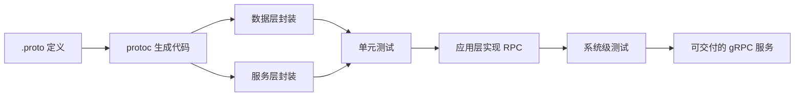

# 用 gRPC 实现用户积分等级系统：本章导学

上一章咱们完成了用户成长体系的**系统设计**部分，接下来要一步一步把这个系统的 **gRPC 服务**实现出来。前面深入学习 gRPC 时，咱们通过源码讲过 gRPC 的小例子——完成一个 gRPC 服务的步骤你还记得吗？不记得也没关系，本章实战就是再来一遍，把印象踩实。

## 纲要

- 实战目标：把"用户积分和等级系统"落地为一个可服务的 gRPC 服务
- 第一步：设计编写 `.proto` 文件，定义 service / RPC / 消息
- 第二步：用 `protoc` 生成 PB 代码与服务端/客户端骨架
- 第三步：封装数据层与服务层（高复用，可移植到其他项目）
- 第四步：编写单元测试，先小后大提升可靠性
- 第五步：实现应用层，完成全部 RPC 方法并做系统级测试
- 补充内容：gRPC 配置参数与常见错误码排查

## gRPC 服务开发五步

| 步骤 | 工作 | 产出 |
| --- | --- | --- |
| 1 | 设计编写 `.proto` | service / RPC / message 定义 |
| 2 | `protoc` 生成代码 | PB 代码 + 未实现服务骨架 |
| 3 | 封装数据层 / 服务层 | 可复用数据访问与业务逻辑 |
| 4 | 编写单元测试 | 单元级可靠性保障 |
| 5 | 实现应用层 + 系统测试 | 可交付的 gRPC 服务 |
## gRPC 服务开发的基本步骤

实现 gRPC 服务，第一步是**设计和编写 `.proto` 文件**。这个文件要定义服务里所有的远程方法，以及这些方法对应的请求消息和响应消息。写好之后，用 `protoc` 命令行工具就能把代码生成出来。接下来只需要编写**服务端程序**和**客户端程序**，就能把 gRPC 服务启动起来并验证。

但——仅仅把服务启动运行起来是远远不够的，业务逻辑仍要像普通项目一样一点点完善：

```bash
# 1) 用 protoc 生成 Go 代码（示意，参数以所用语言/插件为准）
protoc --go_out=. --go_opt=paths=source_relative \
       --go-grpc_out=. --go-grpc_opt=paths=source_relative \
       user.proto
```

> 生成命令与插件参数因语言而异（Go / Java / Python 各不相同），**以你所用 gRPC 版本官方文档为准**。

## 分层封装与代码复用

有了 `.proto` 生成的骨架，接下来把**数据层**和**服务层**代码封装完成。这一步的封装逻辑在很多项目里高度相似，封装好之后，换到其他项目也能参照复用，复用性非常高。

封装完成后要养成一个好习惯：**编写单元测试**。单元测试比"整系统完整性测试"简单很多，但效率高出一截——再大的系统也是由一个个小单元组成的，把每个单元都测通过，拼成的大系统自然可靠得多。



## 应用层与最终测试

数据层、服务层就绪后，最后实现**应用层**：把用户积分等级系统的 gRPC 服务全部 RPC 方法写完，让它的消息数据都达到"可提供正式服务"的状态。

整个服务完成后，还要做**系统完整测试**——开发同学首先要对自己开发的结果负责，所以得自己先测通过才能交付。这里的测试和单元测试不同，是**站在调用方角度**来测的，因此需要自己编写 gRPC **客户端程序**来完成验证。

## 章末补充：配置参数与常见问题

除了实战项目的实现，本章末尾还有两段补充内容，属于很常见、工作中也常碰到的**基础知识**：

- **gRPC 配置参数**：服务端用到的 `ServerOption`、客户端用到的 `DialOption`。最好的掌握方法是从源码里看它们的小例子，课程里也有介绍，很容易上手；
- **gRPC 常见错误**：重点关注 gRPC 的**错误码**，理解每个错误码的含义，同时把程序的错误信息记录完整——这样遇到问题时排查分析会容易很多。

```dir
本章实战结构
├── .proto 设计
│   ├── service / RPC 定义
│   └── 请求/响应 message
├── 代码生成
│   └── protoc 生成 PB + 服务骨架
├── 分层封装
│   ├── 数据层
│   └── 服务层（高复用）
├── 测试
│   ├── 单元测试（单元级）
│   └── 系统测试（客户端视角）
└── 补充
    ├── ServerOption / DialOption
    └── 错误码与排查
```

## 总结

本章导学把"gRPC 服务开发的标准姿势"讲清楚了：

1. **先写 `.proto`**：定义 service、RPC 方法、请求/响应消息；
2. **`protoc` 生成**：一键产出 PB 代码与未实现的服务骨架，继承它即可；
3. **分层封装**：数据层 + 服务层，逻辑高度可复用、可移植；
4. **单元测试前置**：小单元先测通，大系统才可靠；
5. **应用层收口**：实现全部 RPC 方法，达到可正式服务状态；
6. **补充打底**：`ServerOption`/`DialOption` 配置 + 错误码排查，是工程化必备。
