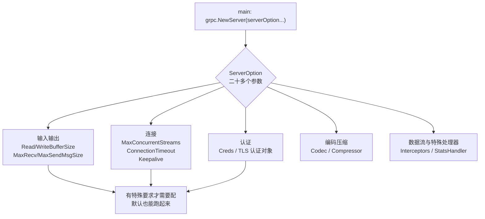

# Kubernetes 认证考点: gRPC 常见的配置参数说明 —— 服务端 ServerOption 与客户端 DialOption、TLS、keepalive、超时

**关于 gRPC 服务，这里再补充一些内容，来了解一下常见的配置参数说明。**

结论先给：**服务端 `main` 方法最开始的地方有一行 `grpc.NewServer`，它里面有个参数是 `ServerOption` —— 这就是 gRPC 服务的配置参数；进入 gRPC 源码可以看到这二十多个配置参数，主要是关于输入、输出、连接、编码、压缩、认证、数据流、特殊的处理器等。** **大部分情况下大家并不会注意到这里的配置参数，直接用默认也能跑起来；但当系统有特殊要求 —— 比如上传下载并发高、请求很高、有数据流的需求、要定义自己的处理器、要加载证书 —— 就会用到这些参数。** **客户端这一块同样有很多配置参数：建立连接时 `grpc.Dial` 方法的参数 `DialOption` 一共有三十多个（在 `grpc.DialOption` 的文件里很容易找到这些配置名称）。** 学习方法是**直接看源码注释**，那是最直接最准确的；**关于请求超时，gRPC 建议使用 `context.WithTimeout` 来实现，通过上下文来控制请求的超时 —— 这里关于 context 如何控制超时是非常细的一个知识点，建议额外花一点时间学习 Go 的 context 对象。**

## 纲要

- 从 grpc.NewServer 的 ServerOption 说起
- 服务端配置参数的八大类
- 服务端配置的实际代码
- 客户端的 DialOption
- 客户端配置的实际代码
- 超时必须用 context，而不是别的方式
- context 控制超时的四种用法
- 参数速查表：默认值与常见坑
- API 速览、Demo 示例与总结

## 从 grpc.NewServer 的 ServerOption 说起

**在服务端 main 方法中最开始的地方有一行代码 `grpc.NewServer`，里面有一个参数是 `ServerOption`，这就是 gRPC 服务的配置参数。进入到 grpc 的源码中，可以很清楚地看到这二十多个配置参数，主要关于：输入、输出、连接、编码、压缩、认证、数据流、特殊的处理器等。**



```text
grpc.NewServer(opts ...ServerOption) *Server
        ↓
ServerOption 覆盖的八大类（以 grpc-go 源码注释为准）
├── 输入输出   ReadBufferSize / WriteBufferSize / MaxRecvMsgSize / MaxSendMsgSize
├── 连接       ConnectionTimeout / MaxConcurrentStreams / Keepalive 系列
├── 编码压缩   Codec / Compressor / Decompressor / ContentSubtype
├── 认证       Creds(credentials.TransportCredentials) / PerRPCCredentials
├── 数据流     StreamInterceptor / MaxConcurrentStreams
├── 特殊处理器 UnaryInterceptor / StatsHandler / UnknownServiceHandler / InTapHandle
├── 反射/运维   ReflectionService / NumServerWorkers
└── 其他       DisableGenericStreaming / PreferTag 等
```

## 服务端配置参数的实际代码

**我们来看一些关于 `ServerOption` 的实际代码：第一行是加载本地的证书，创建了一个 TLS 认证对象；后面的 `grpc.Creds` 就用到了这个 TLS 认证对象；接下来定义了 `serverOption` 的数组，里面设置 `readBufferSize`、`writeBufferSize`、`keepalive` 参数、`maxConcurrentStreams`、`connectionTimeout`、拦截器等等参数。当然还有更多配置参数可以选择，参照示例代码自己实现一遍，各个参数的说明在源码中都有详细的英文注释 —— 其实看配置参数的名称也能理解大概含义了。**

```text
// 骨架示意（真实参数以 grpc-go 源码注释为准，此处省略 import 拼装）
cred, err := credentials.NewServerTLSFromFile("cert/server.pem", "cert/server.key")
if err != nil { log.Fatal(err) }        // ① 加载本地证书 → 创建 TLS 认证对象

var serverOption []grpc.ServerOption            // ② 定义 ServerOption 数组
serverOption = []grpc.ServerOption{
    grpc.Creds(cred),                            // 用上面创建的 TLS 认证对象
    grpc.ReadBufferSize(32 * 1024),              // 输入 buffer
    grpc.WriteBufferSize(32 * 1024),             // 输出 buffer
    grpc.MaxRecvMsgSize(10 * 1024 * 1024),       // 单条最大接收（默认 4MB）
    grpc.MaxSendMsgSize(10 * 1024 * 1024),
    grpc.MaxConcurrentStreams(1000),             // 单连接最大并发流
    grpc.ConnectionTimeout(10 * time.Second),    // 连接超时
    grpc.KeepaliveParams(keepalive.ServerParameters{   // keepalive 心跳参数
        Time:    30 * time.Second,
        Timeout: 5 * time.Second,
    }),
    grpc.KeepaliveEnforcementPolicy(keepalive.EnforcementPolicy{
        MinTime: 20 * time.Second,               // 客户端最少多久 ping 一次
    }),
    grpc.UnaryInterceptor(myUnaryInterceptor),   // 特殊处理器（拦截器）
}
s := grpc.NewServer(serverOption...)             // ③ 传进 NewServer
```

## 客户端的 DialOption

**除了 gRPC 服务端的 `ServerOption`，在客户端这一块也有很多配置参数：在客户端 main 方法中建立连接时，`grpc.Dial` 方法的参数 `DialOption` 一共有三十多个，在 `grpc.DialOption` 的文件里很容易找到这些配置名称。同样的，关于它的说明直接看源代码的注释是最直接和准确的 —— 如果实在理解不了一些配置参数，那可能是根本不需要使用它。**

```text
grpc.Dial(target, opts ...DialOption) (conn, error)
        ↓ 在建立 gRPC 连接的时候传入客户端参数
DialOption 覆盖的八大类
├── 认证       WithTransportCredentials / WithInsecure / WithPerRPCCredentials
├── 输入输出   WithReadBufferSize / WithWriteBufferSize / 消息大小上限系列
├── 连接       WithBlock / WithTimeout(内部) / WithKeepaliveParams / WithConnectParams
├── 负载均衡   WithBalancerName / WithDefaultServiceConfig / WithDisableBalancer
├── 拦截器     WithUnaryInterceptor / WithStreamInterceptor / WithChainUnaryInterceptor
├── 编码压缩   WithCodec / WithCompressor / WithDecompressor / WithContentSubtype
├── 重试/退出  WithDisableRetry / WithReturnConnectionError / WithWatchServiceConfig
└── 其他       WithUserAgent / WithAuthority / WithDialer / WithIdleTimeout
```

**它和前面的 `ServerOption` 使用类似：设置认证、输入输出、连接、数据流等，区别只是它是在 `grpc.Dial`（也就是建立 gRPC 连接）的时候传入这些客户端参数。**

```text
// 骨架示意：建立连接时传客户端参数
conn, err := grpc.Dial(addr,
    grpc.WithTransportCredentials(cred),    // 认证（与服务端 Creds 对应）
    grpc.WithReadBufferSize(32*1024),       // 输入输出
    grpc.WithWriteBufferSize(32*1024),
    grpc.WithDefaultCallOptions(            // 数据流 / 调用级参数
        grpc.MaxCallRecvMsgSize(10*1024*1024),
        grpc.MaxCallSendMsgSize(10*1024*1024),
    ),
    grpc.WithKeepaliveParams(keepalive.ClientParameters{
        Time:                10 * time.Second,
        Timeout:             3 * time.Second,
        PermitWithoutStream: true,
    }),
    grpc.WithBlock(),                       // 连接建立成功才返回（启动阶段常用）
)
```

## 超时必须用 context，而不是别的方式

**特别说明一下关于请求超时的处理：gRPC 建议使用 `context.WithTimeout` 来实现，通过上下文来控制请求的超时。这里关于 context 是如何控制超时的，也是非常细的一个知识点 —— 建议额外花一点时间学习 Go 的 context 对象。**

```text
为什么是 context 而不是"自己起个 goroutine sleep 后取消"
├── gRPC 的每一个 RPC 调用（UnaryRPC / Stream）都接收 ctx
├── 取消信号沿调用链向下传递：一次 RPC 超时 → 连接上的这次调用被取消
├── 取消会同时作用于：客户端等待、服务端 handler、底层 HTTP/2 流
└── 用 sleep + 标志位做不到的三件事：
    传播到服务端、复用一次取消、与 Done 通道统一
```

## context 控制超时的四种用法

**下面这段代码不依赖任何第三方库，用纯标准库的 context 把 gRPC 超时这件事的本质讲清楚：超时是一个"到点自动取消"的信号，谁在等谁就监听它的 Done。**

```go
package main

import (
	"context"
	"errors"
	"fmt"
	"time"
)

// rpcCall 模拟一次远程调用；真实场景里它可能是 c.cc.Invoke(...)
func rpcCall(ctx context.Context, payload string) error {
	select {
	case <-time.After(300 * time.Millisecond):
		fmt.Println("调用返回:", payload)
		return nil
	case <-ctx.Done():
		// 超时或被取消时，调用方立刻返回，不会干等
		return ctx.Err()
	}
}

// WithTimeout：gRPC 官方推荐的做法
func withTimeout() {
	ctx, cancel := context.WithTimeout(context.Background(), 100*time.Millisecond)
	defer cancel() // defer cancel() 必须写，否则定时器泄漏
	err := rpcCall(ctx, "say hello")
	fmt.Println("WithTimeout →", err) // context deadline exceeded
}

// WithCancel：手工取消（对应断连、业务逻辑提前放弃）
func withCancel() {
	ctx, cancel := context.WithCancel(context.Background())
	go func() {
		time.Sleep(50 * time.Millisecond)
		cancel() // 中途放弃，调用方立刻被唤醒
	}()
	fmt.Println("WithCancel →", rpcCall(ctx, "aborted"))
}

// WithValue：在上下文里带 luggage（权限、trace id）
func withValue() {
	ctx := context.WithValue(context.Background(), "trace-id", "abc123")
	if v, ok := ctx.Value("trace-id").(string); ok {
		fmt.Println("trace id =", v)
	}
	fmt.Println("WithValue →", rpcCall(context.Background(), "carry"))
}

// 超时 + 值 + 取消，三个一起用才是生产形态
func combined() {
	ctx, cancel := context.WithTimeout(context.Background(), 200*time.Millisecond)
	defer cancel()
	ctx = context.WithValue(ctx, "trace-id", "xyz")
	_ = errors.New("")
	_, _ = ctx, cancel
	fmt.Println("combined →", rpcCall(ctx, "full"))
}

func main() {
	withTimeout()
	withCancel()
	withValue()
	combined()
}
```

## 参数速查表：默认值与常见坑

| 参数 | 类别 | 常见默认值 | 什么时候要改 |
| --- | --- | --- | --- |
| **`MaxRecvMsgSize`** | **输入** | **默认 4MB** | **传大报文/批量数据时必须调，否则 `received message larger than max`** |
| **`MaxSendMsgSize`** | **输出** | **默认 math.MaxInt32（近似不限制）** | **配合接收端一起调** |
| **`ReadBufferSize` / `WriteBufferSize`** | **输入输出** | **默认 32KB 左右** | **高吞吐调大，能减半系统调用** |
| **`MaxConcurrentStreams`** | **连接/数据流** | **默认有上界（版本相关）** | **高并发服务端要放开，否则 `too many concurrent streams`** |
| **`ConnectionTimeout`** | **连接** | **默认 120s（服务端握手）** | **弱网环境缩短，快速失败** |
| **`KeepaliveParams（服务端）`** | **连接** | **默认 ping 间隔 2h** | **要更快发现死连接；配 `Timeout`** |
| **`KeepaliveEnforcementPolicy`** | **连接** | **默认不限制最小间隔** | **防客户端瞎 ping，设 `MinTime`** |
| **`Creds` / `WithTransportCredentials`** | **认证** | **默认不加密（insecure）** | **生产必须上 TLS，用证书文件创建 TLS 认证对象** |
| **`WithBlock`** | **客户端连接** | **默认 false（异步连接）** | **启动自检时用 true，之后别留着** |
| **`context.WithTimeout`** | **调用** | **不设则永不超时** | **每一次 RPC 都设，否则慢调用会拖垮整条链路** |

## API 速览

| 位置 | 配置项 | 作用 | 关键点 |
| --- | --- | --- | --- |
| **服务端** | **`grpc.NewServer(grpc.XxxServerOption...)`** | **服务侧配置** | **二十多个，看源码注释** |
| **服务端** | **`Creds` + TLS 认证对象** | **加载证书，启用 TLS** | **先 `NewServerTLSFromFile` 造对象，再 `grpc.Creds(obj)`** |
| **服务端** | **`serverOption` 数组** | **批量设置 readBuffer/keepalive/maxConcurrentStreams/connectionTimeout** | **数组化最清晰** |
| **客户端** | **`grpc.Dial(addr, grpc.WithXxx...)`** | **建立连接时传参** | **`DialOption` 三十多个** |
| **客户端** | **`WithTransportCredentials`** | **客户端认证，和服务端 Creds 对应** | — |
| **客户端** | **`WithDefaultCallOptions`** | **调用级：消息大小等** | — |
| **客户端** | **`WithBlock`** | **连上才返回** | **仅启动自检** |
| **通用** | **`context.WithTimeout`** | **控制请求超时** | **gRPC 官方推荐；要理解 context** |

## Demo 示例

把服务端和客户端的配置串起来跑一遍的自检脚本：

```bash
# ① 看服务端实际生效了哪些参数（源码注释是最好的文档）
grep -n "func MaxRecvMsgSize\|func MaxConcurrentStreams\|func KeepaliveParams" \
  $(go env GOMODCACHE)/google.golang.org/grpc*/server.go

# ② 客户端同理查 DialOption
grep -n "^func With" $(go env GOMODCACHE)/google.golang.org/grpc*/dialoptions.go | wc -l

# ③ 启动自检：WithBlock 保证连接真的建起来
#    连不上会一直等 / 报 connection error，而不是默默继续

# ④ 超时验证：给一次调用设 100ms，服务端故意 sleep 300ms
#    客户端预期拿到 context deadline exceeded
```

一次"上线后报错"的定位对照：

```text
received message larger than max  → MaxRecvMsgSize / MaxCallRecvMsgSize 没调大
too many concurrent streams       → MaxConcurrentStreams 太小
上下文 deadline 时有时无           → 有的调用没传 ctx / 没 WithTimeout
连接偶发假死                       → Keepalive 时间太长，没配 Timeout
生产环境裸奔能连通                 → 没配 Creds（insecure），线上要补 TLS
```

## 总结

1. **入口就在 grpc.NewServer**：**服务端 main 方法最开始的地方有一行代码 `grpc.NewServer`，里面有一个参数是 `ServerOption`，这就是 gRPC 服务的配置参数；进入 gRPC 源码中能看到这二十多个配置参数，主要是关于输入、输出、连接、编码、压缩、认证、数据流、特殊的处理器等**；
2. **大多数情况用默认就行**：**其实大部分情况下大家并不会注意到这里的配置参数，直接用默认也能运行起来；但当系统有特殊要求（比如上传下载并发高、请求很高等），比如有数据流的需求、要定义自己的处理器、加载证书等，就会用到这些参数配置**；
3. **服务端配置的实际写法**：**第一行是加载本地的证书、创建了一个 TLS 认证对象，后面的 `grpc.Creds` 就用到了这个 TLS 认证对象；接着定义 `serverOption` 的数组，里面设置 readBufferSize、readBufferSize、keepalive 参数、maxConcurrentStreams、connectionTimeout 等等参数；当然还有更多配置参数可以选择，参照示例代码自己实现一遍**；
4. **参数说明看源码注释最直接**：**关于各个参数的说明在源码中都有详细的注释（英文的），其实看配置参数的名称也能理解大概含义了**；
5. **客户端还有三十多个 DialOption**：**除了服务端的 ServerOption，客户端这一块也有很多配置参数：在客户端 main 方法中建立连接时，`grpc.Dial` 方法的参数 `DialOption` 一共有三十多个，在 `grpc.DialOption` 的文件里很容易找到这些配置名称；说明直接看源代码的注释是最直接准确的，实在理解不了某些配置参数的话，那可能是根本不需要使用它**；
6. **客户端参数的类别**：**跟前面 ServerOption 的使用类似，设置认证、输入输出、连接、数据流等，区别是它在 `grpc.Dial` 建立 gRPC 连接的时候传入这些客户端参数**；
7. **超时用 context.WithTimeout**：**特别说明一下关于请求超时的处理，gRPC 建议使用 `context.WithTimeout` 来实现，通过上下文来控制请求的超时；这里关于 context 是如何控制超时的也是非常细的一个知识点，建议额外花一点时间学习 Go 的 context 对象**；
8. **为什么不是自己起 goroutine 计时**：**context 的取消信号会沿调用链向下传播，一次 RPC 超时会同时作用于客户端等待、服务端 handler 和底层 HTTP/2 流；用 sleep 加标志位做不到"取消传到服务端"这一件事**；
9. **四个常用组合**：**`WithTimeout` 控超时（必须 `defer cancel()` 否则定时器泄漏）、`WithCancel` 中途放弃、`WithValue` 带 trace id 与权限、`WithTimeout + WithValue + WithCancel` 组合才是生产形态**；
10. **最容易踩的几个默认值**：**单条消息默认最大 4MB（传大报文要调 `MaxRecvMsgSize`/`MaxCallRecvMsgSize`）、服务端单连接并发流有上界（高并发要调 `MaxConcurrentStreams`）、默认不加密（生产要配 `Creds` 加载证书）、默认 ping 间隔很长（要配 `KeepaliveParams` 里的 `Time` 与 `Timeout`）、默认不设超时（每一次 RPC 都要用 context 设超时）**；
11. **学习方法**：**这一节只是提供了一个学习方法 —— 直接从源码的注释中看是最高效的；提供的示例代码也只是很简单的使用方法，有特殊需求时可以灵活使用更多配置参数。**

