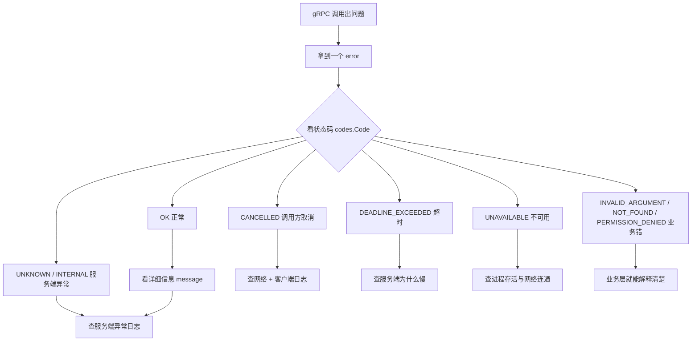

# Kubernetes 认证考点: gRPC 使用中的常见问题及解决方案 —— 十八种状态编码、默认 UNKNOWN 的坑与日志排障

**gRPC 服务在使用中肯定避免不了遇到一些问题。这一节把常见的一些问题整理总结一下，以后遇到了也就不慌了。**

结论先给：**遇到问题肯定是报错了，报错离不开错误信息 —— gRPC 错误信息中详细定义了十八种状态编码：`OK=0` 是默认的正常情况，其他十七种就是各种各样的异常情况。** 要记住几个最常用的：**`CANCELLED=1`（调用方取消了请求，可能是网络异常也可能是客户端异常，要排查网络问题和客户端请求日志里有没有异常中断）；`UNKNOWN=2`（服务端未知异常，服务端有报错但没指定具体状态编码 —— 这就是默认的 2，类似 HTTP 的 500，**所以不建议使用默认的 `UNKNOWN=2` 这种默认异常状态**）；`INTERNAL=13`（非常明确地告知是服务端内部异常，比 `UNKNOWN=2` 清晰明了）；`UNAVAILABLE=14`（服务端不可用，可能挂掉也可能网络不通）；`DEADLINE_EXCEEDED=4`（服务端超时，处理时间比请求超时更长，要分析为什么这么慢）。** 更根本的一条是：**遇到 gRPC 问题都要关注它的异常信息，同时需要服务端把详细的错误信息记录下来，以便通过分析错误日志找到具体原因；编程时一定要注意异常处理，养成把错误日志详细记录下来的好习惯 —— 必现的错误排查起来还比较容易，偶发异常如果没有日志，是非常难复现、排查和解决的。**

## 纲要

- 为什么先讲状态码
- 异常状态编码全景
- 最常用的那些码：看到它该查什么
- 默认 UNKNOWN=2 是个坏习惯
- INTERNAL=13 与 UNAVAILABLE=14 的区别
- 排查三段式：错误码 + 详细信息 + 服务端日志
- 必现错误与偶发错误
- 工程侧：错误码怎么带出去、日志记什么
- API 速览、Demo 示例与总结

## 为什么先讲状态码



## 异常状态编码全景

**在 gRPC 的错误信息中详细定义了十八种状态编码，`OK=0` 是默认的正常情况，其他十七种就是各种各样的异常情况。**

| 码 | 名称 | 含义 | 谁的问题 |
| --- | --- | --- | --- |
| **0** | **`OK`** | **默认正常** | — |
| **1** | **`CANCELLED`** | **调用方取消了请求（网络异常或客户端异常）** | **客户端 / 网络** |
| **2** | **`UNKNOWN`** | **服务端访问的未知异常，服务端有报错但没指定具体状态** | **服务端（不推荐出现）** |
| **3** | **`INVALID_ARGUMENT`** | **参数处理时发现问题** | **调用方入参** |
| **4** | **`DEADLINE_EXCEEDED`** | **服务端超时，处理时间比设置的请求超时更长** | **服务端性能 / 容量** |
| **5** | **`NOT_FOUND`** | **查询的数据为空** | **业务** |
| **6** | **`ALREADY_EXISTS`** | **重复的数据冲突** | **业务** |
| **7** | **`PERMISSION_DENIED`** | **操作没有权限** | **鉴权** |
| **8** | **`RESOURCE_EXHAUSTED`** | **连接数、并发数太高，直接中断请求** | **容量 / 限流** |
| **9** | **`FAILED_PRECONDITION`** | **前置条件不满足** | **业务** |
| **13** | **`INTERNAL`** | **服务端内部异常（比 UNKNOWN 清晰）** | **服务端** |
| **14** | **`UNAVAILABLE`** | **服务端不可用（挂掉 / 网络不通）** | **部署 / 网络** |
| **15/16** | **`DATA_LOSS` / `UNAUTHENTICATED`** | **数据丢失 / 未认证** | **存储 / 认证** |

**其他还有 ABORTED=10、OUT_OF_RANGE=11 等，完整列表直接看 codes 包源码。**

## 最常用的那些码：看到它该查什么

**像 `CANCELLED=1`，这是调用方取消了请求，可能是网络异常，也可能是客户端出现异常了 —— 出现这种情况需要排查网络问题，同时排查客户端的请求日志是否有异常中断请求的日志信息。**

| 看到的状态码 | 第一反应 | 具体查什么 |
| --- | --- | --- |
| **`CANCELLED=1`** | **调用方自己撤了** | **客户端日志：是不是主动取消、超时前取消、断线重连** |
| **`UNKNOWN=2`** | **服务端没说清楚** | **服务端错误日志：是不是 panic / 未包装的 error 直接 return** |
| **`INVALID_ARGUMENT=3`** | **传参不对** | **请求体的字段校验、必填项、类型转换** |
| **`DEADLINE_EXCEEDED=4`** | **太慢了** | **慢在哪：SQL、下游调用、锁竞争、并发太高、CPU 打满** |
| **`NOT_FOUND=5`** | **没这个数据** | **查询条件、租户隔离、ID 拼错** |
| **`ALREADY_EXISTS=6`** | **重复了** | **唯一键冲突、并发创建、幂等没做** |
| **`PERMISSION_DENIED=7`** | **没权限** | **RBAC 绑定、token 身份、跨租户越权** |
| **`RESOURCE_EXHAUSTED=8`** | **打满了** | **连接数、并发数、队列长度、限流阈值** |
| **`INTERNAL=13`** | **服务端炸了** | **服务端内部异常堆栈** |
| **`UNAVAILABLE=14`** | **连不上** | **进程是否存活、端口是否监听、网络是否通、LB 后端是否在** |

## 默认 UNKNOWN=2 是个坏习惯

**`UNKNOWN=2` 是服务端访问未知异常 —— 也就是服务端有报错了，但是没有指定具体的状态编码。默认就是 `UNKNOWN=2` 这种状态，和 HTTP 中的 500 服务端异常类似，需要服务端来看是否有记录异常日志信息。但是 gRPC 中有更多的状态编码，不建议使用默认的 `UNKNOWN=2` 这种默认异常状态 —— 比如参数处理时发现问题，可以使用 `INVALID_ARGUMENT=3`；查询的数据为空，可以使用 `NOT_FOUND=5`；重复的数据冲突，可以使用 `ALREADY_EXISTS=6`；操作没有权限时，可以使用 `PERMISSION_DENIED=7`；连接数、并发数太高直接中断请求，可以使用 `RESOURCE_EXHAUSTED=8`；一旦前置条件不满足，可以使用 `FAILED_PRECONDITION=9`。**

**规则很简单：能说清楚就别偷懒用 UNKNOWN。** 返回 `UNKNOWN=2` 等于把诊断信息丢给下一个排查的人。

```text
不推荐                            推荐
return errors.New("查询失败")   →  status.Error(codes.NotFound, "用户不存在: id=123")
return err                      →  status.Error(codes.Internal, "db query failed: "+err.Error())
nil 检查失败直接 panic           →  status.Error(codes.InvalidArgument, "user_id 不能为空")
```

## INTERNAL=13 与 UNAVAILABLE=14 的区别

**`INTERNAL=13` 就是非常明确地告知是服务端内部异常，比 `UNKNOWN=2` 要清晰明了；`UNAVAILABLE=14` 就是服务端不可用，可能是服务端挂掉了，也可能是网络不通等情况。**

| 码 | 语义 | 典型场景 | 客户端该怎么处理 |
| --- | --- | --- | --- |
| **`INTERNAL=13`** | **进程活着但内部出错** | **panic、未捕获异常、依赖库报错** | **重试意义不大，先记错误上报** |
| **`UNAVAILABLE=14`** | **暂时不可用** | **进程重启中、网络抖动、下游摘除** | **可以重试（配退避）** |
| **`UNKNOWN=2`** | **什么都没说** | **默认错误** | **啥也判断不了，去看日志** |

## 排查三段式：错误码 + 详细信息 + 服务端日志

**大家遇到的 gRPC 问题都要关注它的异常信息，同时需要服务端把详细的错误信息记录下来，以便出现问题时可以通过分析错误日志来找到具体原因。所以编程时一定要注意异常处理，同时要养成把错误日志详细记录下来的好习惯。**

```text
一次完整的排障
① 客户端拿到 codes.Code + message
      ↓ 码告诉你"哪一层"，message 告诉你"哪件事"
② 服务端日志搜同一个（trace id / 用户 id / 请求 id）
      ↓ 找到服务端的异常堆栈与上下文
③ 复现与定位：必现 → 直接打断点；偶发 → 靠日志与时间窗口统计
```


## 必现错误与偶发错误

**如果是必现的错误，排查起来还比较容易；对于偶发的异常情况，没有日志，是非常难复现、排查和解决的。**

| 类型 | 排查手段 | 需要日志的粒度 |
| --- | --- | --- |
| **必现** | **直接本地 / 压测复现，跟代码** | **够定位那一行就行** |
| **偶发（超时）** | **看 P99/P999、看时间分布** | **慢请求的完整输入输出与耗时分解** |
| **偶发（CONN 断）** | **看客户端重连日志、LB 摘除记录** | **连接建立/关闭的时间点与原因** |
| **偶发（状态错）** | **看服务端异常堆栈** | **堆栈 + 请求上下文（谁、什么时候、什么参数）** |

## 工程侧：错误码怎么带出去、日志记什么

**服务端返回错误时把 codes 带上，客户端解析出来；日志则要记下"谁、何时、什么请求、什么结果、耗时多少"。**

```text
一次调用建议记录的字段
├── trace_id / span_id          ← 端到端串起来
├── user_id                      ← 定位到具体用户
├── method  = /helloworld.Greeter/SayHello
├── code    = DEADLINE_EXCEEDED (4)
├── message = rpc error: code = DeadlineExceeded desc = context deadline exceeded
├── duration_ms                 ← 超时分析的核心
├── peer / 实例地址              ← 定位到具体实例
└── stack（仅 INTERNAL/UNKNOWN 记录堆栈）
```

```go
package main

import (
	"fmt"
	"strings"
)

// 码值的语义（对应 gRPC codes 包；这里用纯标准库自绘一份，便于理解传输形态）
type Code int

const (
	OK                  Code = 0
	CANCELLED           Code = 1
	UNKNOWN             Code = 2
	INVALID_ARGUMENT    Code = 3
	DEADLINE_EXCEEDED   Code = 4
	NOT_FOUND           Code = 5
	ALREADY_EXISTS      Code = 6
	PERMISSION_DENIED   Code = 7
	RESOURCE_EXHAUSTED  Code = 8
	FAILED_PRECONDITION Code = 9
	INTERNAL            Code = 13
	UNAVAILABLE         Code = 14
)

func (c Code) String() string {
	names := map[Code]string{
		OK:                  "OK",
		CANCELLED:           "CANCELLED",
		UNKNOWN:             "UNKNOWN",
		INVALID_ARGUMENT:    "INVALID_ARGUMENT",
		DEADLINE_EXCEEDED:   "DEADLINE_EXCEEDED",
		NOT_FOUND:           "NOT_FOUND",
		ALREADY_EXISTS:      "ALREADY_EXISTS",
		PERMISSION_DENIED:   "PERMISSION_DENIED",
		RESOURCE_EXHAUSTED:  "RESOURCE_EXHAUSTED",
		FAILED_PRECONDITION: "FAILED_PRECONDITION",
		INTERNAL:            "INTERNAL",
		UNAVAILABLE:         "UNAVAILABLE",
	}
	if n, ok := names[c]; ok {
		return n
	}
	return "OTHER"
}

// StatusError 就是链路上传递的形态：码 + 详情
type StatusError struct {
	Code Code
	Msg  string
	err  error
}

func (e *StatusError) Error() string {
	return fmt.Sprintf("rpc error: code = %s desc = %s", e.Code, e.Msg)
}

func (e *StatusError) Unwrap() error { return e.err }

// newStatus 业务里用：把"说不清"的都换成具体的码
func newStatus(c Code, msg string, err error) error {
	return &StatusError{Code: c, Msg: msg, err: err}
}

// fromError 客户端侧解析：从 error 里把码取出来
func fromError(err error) (Code, string) {
	if err == nil {
		return OK, ""
	}
	if c, ok := asStatusError(err); ok {
		return se.Code, se.Msg
	}
	return UNKNOWN, err.Error() // 认不出来的，按默认 UNKNOWN 处理
}

// asStatusError 用字符串特征模拟类型断言（真实场景用 errors.As）
func asStatusError(err error, target **StatusError) bool {
	s := err.Error()
	idx := strings.Index(s, "code = ")
	if idx < 0 {
		return false
	}
	rest := s[idx+len("code = "):]
	name := rest
	if i := strings.Index(rest, " "); i >= 0 {
		name = rest[:i]
	}
	want := map[string]Code{
		"OK": OK, "CANCELLED": CANCELLED, "UNKNOWN": UNKNOWN,
		"INVALID_ARGUMENT": INVALID_ARGUMENT, "DEADLINE_EXCEEDED": DEADLINE_EXCEEDED,
		"NOT_FOUND": NOT_FOUND, "ALREADY_EXISTS": ALREADY_EXISTS,
		"PERMISSION_DENIED": PERMISSION_DENIED, "RESOURCE_EXHAUSTED": RESOURCE_EXHAUSTED,
		"FAILED_PRECONDITION": FAILED_PRECONDITION, "INTERNAL": INTERNAL,
		"UNAVAILABLE": UNAVAILABLE,
	}[name]
	if c, ok := want; ok {
		*target = &StatusError{Code: c, Msg: rest}
		return true
	}
	return false
}

func main() {
	// 服务端：别再返回裸 error（会落到 UNKNOWN）
	_ = newStatus(NOT_FOUND, "用户不存在: id=123", fmt.Errorf("row not found"))

	// 客户端：把码解析出来，按码决定是否重试
	err := fmt.Errorf("rpc error: code = UNAVAILABLE desc = connection refused")
	c, msg := fromError(err)
	fmt.Println("码:", c, "| 名称:", c.String(), "| 详情:", msg)

	err2 := fmt.Errorf("rpc error: code = DEADLINE_EXCEEDED desc = context deadline exceeded")
	c2, _ := fromError(err2)
	fmt.Println("码:", c2.String(), "| 可重试?", c2 == UNAVAILABLE || c2 == CANCELLED)
}
```

## API 速览

| 概念 | 作用 | 关键点 |
| --- | --- | --- |
| **`codes.OK = 0`** | **正常** | **默认** |
| **`codes.CANCELLED = 1`** | **调用方取消** | **查网络 + 客户端日志** |
| **`codes.UNKNOWN = 2`** | **默认未知异常** | **HTTP 500 等价；不建议使用** |
| **`codes.INVALID_ARGUMENT = 3`** | **参数错误** | **入参校验失败** |
| **`codes.DEADLINE_EXCEEDED = 4`** | **超时** | **分析服务端为什么慢** |
| **`codes.NOT_FOUND = 5` / `ALREADY_EXISTS = 6`** | **空 / 重复** | **业务语义** |
| **`codes.PERMISSION_DENIED = 7`** | **无权限** | **鉴权** |
| **`codes.RESOURCE_EXHAUSTED = 8`** | **资源打满** | **连接/并发/限流** |
| **`codes.INTERNAL = 13`** | **服务端内部异常** | **比 UNKNOWN 清晰** |
| **`codes.UNAVAILABLE = 14`** | **不可用** | **可重试（配退避）** |
| **`status.Error(code, msg)`** | **服务端返回带码的错误** | **别裸传 error** |
| **`status.FromError(err)`** | **客户端解析码** | **认不出就是 UNKNOWN** |

## Demo 示例

排障速查脚本：把一次调用的错误信息按"码 → 查什么"直接映射出来：

```bash
# ① 客户端抓错误
cat <<'EOF' > /tmp/grpc_probe.go
// 伪代码：真实项目里替换成你自己的 client
c, msg := fromError(err)
switch c {
case CANCELLED:          // 1  → 看客户端日志与网络
case DEADLINE_EXCEEDED:  // 4  → 看服务端耗时分解
case RESOURCE_EXHAUSTED: // 8  → 看连接数/并发数与限流阈值
case UNAVAILABLE:        // 14 → 看进程与端口
default:                 // 其余 → 服务端日志
}
EOF

# ② 服务端按码过滤日志（超时的、内部的、不可用的）
grep -E "code = (DeadlineExceeded|Internal|Unavailable)" /var/log/your-service.log

# ③ 看这批错误集中在哪个方法上
grep -o "code = [A-Z]*" /var/log/your-service.log | sort | uniq -c | sort -rn
```

线上最常见的四个"一看就懂"的对照：

```text
DEADLINE_EXCEEDED(4) + 日志里 duration 3s   → 超时阈值设小了或真的慢，先分解耗时
UNAVAILABLE(14)     + 端口不通             → 进程挂了/没起来/网络策略挡了
RESOURCE_EXHAUSTED(8)+ 并发数打满           → 连接池、gRPC 并发流上限、限流阈值
UNKNOWN(2)          + 服务端有 panic        → 没包装错误，补 status.Error 指定码
```

## 总结

1. **常见问题是一定会遇到的**：**gRPC 服务在使用中肯定避免不了遇到一些问题，这里把常见的一些问题整理和总结一下，以后遇到了也就不慌了**；
2. **报错离不开错误信息**：**遇到问题时那肯定是出现报错了，报错就离不开错误信息；在 gRPC 的错误信息中详细定义了十八种状态编码，`OK=0` 是默认的正常情况，其他十七种就是各种各样的异常情况**；
3. **`CANCELLED=1`**：**这是调用方取消了请求，可能是网络异常，也可能是客户端出现异常了；出现这种情况需要排查网络问题，同时排查客户端的请求日志是否有异常中断请求的日志信息**；
4. **`UNKNOWN=2` 是默认状态**：**这就是服务端访问的未知异常，也就是服务端有报错了但没有指定具体的状态编码，和 HTTP 中的 500 服务端异常类似，需要服务端来看是否有记录异常日志信息**；
5. **不建议使用默认的 `UNKNOWN=2`**：**gRPC 中有更多的状态编码，不建议使用默认的 `UNKNOWN=2` 这种默认异常状态编码 —— 比如参数处理时发现问题可以使用 `INVALID_ARGUMENT=3`；查询的数据为空可以使用 `NOT_FOUND=5`；重复的数据冲突可以使用 `ALREADY_EXISTS=6`；操作没有权限可以使用 `PERMISSION_DENIED=7`；连接数并发数太高直接中断请求可以使用 `RESOURCE_EXHAUSTED=8`；一旦前置条件不满足可以使用 `FAILED_PRECONDITION=9`**；
6. **`DEADLINE_EXCEEDED=4`**：**就是服务端超时了，处理时间比设置的请求超时更长，需要分析服务端为什么执行那么慢，是不是有数据或者接口调用异常，或者并发太高、系统负载太高等情况**；
7. **`INTERNAL=13` 与 `UNKNOWN=2` 的差别**：**`INTERNAL=13` 就是非常明确地告知是服务端内部异常，比 `UNKNOWN=2` 要清晰明了；`UNAVAILABLE=14` 就是服务端不可用，可能是服务端挂掉了，也可能是网络不通等情况**；
8. **遇到状态码就清楚具体原因**：**如果遇到这些状态编码的异常情况也就比较清楚具体原因了，再结合错误的详细信息，排查这些问题也就简单多了**；
9. **必须记详细日志**：**大家遇到的 gRPC 问题都要关注它的异常信息，同时需要服务端把详细的错误信息记录下来，以便出现问题时可以通过分析错误日志来找到具体原因；所以编程时一定要注意异常处理，同时要养成把错误日志详细记录下来的好习惯**；
10. **必现与偶发**：**如果是必现的错误，排查起来还比较容易；对于偶发的异常情况，没有日志是非常难复现、排查和解决的 —— 所以准一些的日志字段（trace id、方法、码、耗时、对端地址）比"打一句日志"值钱得多**；
11. **落地做法**：**服务端用带状态码的返回别裸传 error；客户端拿到码就知道该查网络、查超时还是查服务端日志；`UNAVAILABLE`、`RESOURCE_EXHAUSTED` 这类暂时性错误可以配退避重试，`INTERNAL`、`NOT_FOUND` 这类重试没意义，只会放大故障。**

