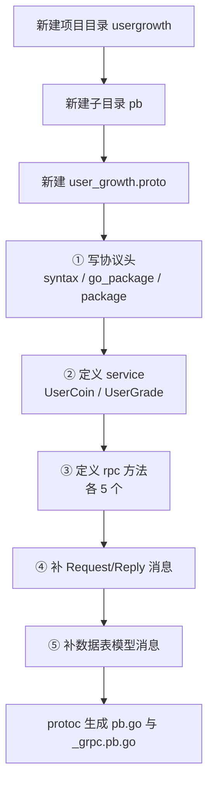

# Kubernetes 认证考点: 设计和编写 Protobuf 文件 —— 用户积分与等级服务的 proto3 定义

**上一节完成了用户成长体系的数据库设计，这一节把服务的 protobuf 文件编写出来。**

结论先给：**proto 文件最重要的是前面的设计 —— 设计好之后，再定义有哪些服务、有哪些方法、方法的请求参数和返回值是哪一些，proto 就定义好了；定义好之后通过 protoc 生成对应的 pb 代码和 gRPC 代码，后面的开发工作就容易了。** 这一节按「建目录 → 写协议头 → 定义服务与方法 → 补方法消息 → 补数据表模型消息」五步走。

## 纲要

- 先建目录：usergrowth 与 pb 子目录
- proto 文件的头部：协议版本与两个 package
- 定义 gRPC 服务：用户积分服务与用户等级服务
- 定义远程方法：五个积分方法 + 五个等级方法
- 请求与响应消息的命名约定
- 数据表模型消息：字段与数据库保持一致
- 时间类型的坑：proto3 不支持 datetime
- 参数设计的取舍：为什么传任务名而不是任务 ID
- API 速览、Demo 示例与总结

## 先建目录：usergrowth 与 pb 子目录

**首先要把用户成长体系的项目创建起来，所以需要新建目录 `usergrowth`；要编写 protobuf 文件，还要为它新建一个子目录 `pb`，然后在 `pb` 子目录里面新建一个 proto 文件 `user_growth.proto`。**



```text
usergrowth/                      用户成长体系项目根目录
├── database/                    上一节完成的数据库设计与导出文件
│   └── helloworld/              helloworld 小例子的 proto 文件
├── pb/                          proto 文件目录
│   ├── user_growth.proto        ★ 本节的产出
│   ├── user_growth.pb.go        protoc 生成的消息代码（下一节）
│   └── user_growth_grpc.pb.go   protoc 生成的 gRPC 代码（下一节）
├── main_server/                 服务端 main 方法
├── main_client/                 客户端 main 方法
└── ug_server/                   自己实现的 gRPC 服务与方法
    ├── coin_server.go           用户积分服务
    └── grade_server.go          用户等级服务
```

## proto 文件的头部：协议版本与两个 package

**proto 文件中都会有一些内容，像协议的版本、`go_package` 的名字，还有 gRPC 服务的 `package` 名字，就按照这里的定义来写就好了。**

```protobuf
syntax = "proto3";

option go_package = "usergrowth/pb";

package pb;
```

三个要素的作用：

| 要素 | 作用 | 注意 |
| --- | --- | --- |
| **`syntax = "proto3"`** | **声明协议版本** | **必须是文件第一行非空语句** |
| **`option go_package`** | **生成 Go 代码的包路径** | **protoc-gen-go 靠它决定输出包** |
| **`package pb`** | **proto 的命名空间** | **服务与消息全名是 `pb.UserCoin` 这种形式** |

## 定义 gRPC 服务：用户积分服务与用户等级服务

**这个项目需要定义两个服务，一个是用户积分服务，一个是用户等级服务。当然很多时候一个项目建一个服务是更常见的，根据实际需求来做就好了。**

```protobuf
service UserCoin {
  rpc ListTasks (ListTasksRequest) returns (ListTasksReply);
  rpc GetCoinInfo (GetCoinInfoRequest) returns (GetCoinInfoReply);
  rpc ListCoinDetails (ListCoinDetailsRequest) returns (ListCoinDetailsReply);
  rpc UserCoinChange (UserCoinChangeRequest) returns (UserCoinChangeReply);
}

service UserGrade {
  rpc ListGrades (ListGradesRequest) returns (ListGradesReply);
  rpc ListGradePrivileges (ListGradePrivilegesRequest) returns (ListGradePrivilegesReply);
  rpc CheckUserPrivilege (CheckUserPrivilegeRequest) returns (CheckUserPrivilegeReply);
  rpc GetUserGradeInfo (GetUserGradeInfoRequest) returns (GetUserGradeInfoReply);
  rpc UserGradeChange (UserGradeChangeRequest) returns (UserGradeChangeReply);
}
```

## 请求与响应消息的命名约定

**请求和响应的消息命名保持一致就好了 —— 方法叫 `ListTasks`，请求就是 `ListTasksRequest`，响应就是 `ListTasksReply`。**

```text
一个远程方法的三件套
├── rpc 声明      rpc ListTasks (ListTasksRequest) returns (ListTasksReply)
├── Request       ListTasksRequest   入参
└── Reply         ListTasksReply     出参（项目统一用 Reply 而非 Response）
   └── 约定
       ├── 单条数据用字段名 data
       ├── 数组用字段名 data_list + repeated 关键字
       └── 有特定含义时用表意性更强的名字（如 total）
```

## 数据表模型消息：字段与数据库保持一致

**除了方法的请求和响应消息，还需要定义数据表对应的消息（数据表模型的消息），这些消息对应着数据表的表结构，把数据类型补全，名字跟数据库字段保持一样就好了。**

```protobuf
message CoinTask {
  int32 id = 1;
  string task_name = 2;
  int32 coin = 3;
  string created_at = 4;
  string updated_at = 5;
}

message CoinDetail {
  int32 id = 1;
  int32 uid = 2;
  string task_name = 3;
  int32 coin = 4;
  string created_at = 5;
}

message CoinUser {
  int32 id = 1;
  int32 uid = 2;
  int32 coin = 3;
  string created_at = 4;
  string updated_at = 5;
}

message GradeInfo {
  int32 id = 1;
  string grade_name = 2;
  int32 growth = 3;
  string created_at = 4;
}

message GradePrivilege {
  int32 id = 1;
  int32 grade_id = 2;
  string product = 3;
  string function = 4;
}

message GradeUser {
  int32 id = 1;
  int32 uid = 2;
  int32 grade_id = 3;
  int32 growth = 4;
}
```

## 时间类型的坑：proto3 不支持 datetime

**这里有一个特别的就是时间类型 —— 数据库里面定义的是 datetime，但 protobuf 里面不支持。所以把它定义为字符串类型（`string`），在处理这类字段的过程中，需要把 `time.Time` 和字符串做一下转换，封装成一个类型转换方法就好了。**

```text
datetime ↔ protobuf 的处理链路
├── 数据库        datetime
├── Go 模型       time.Time
├── 类型转换方法   time.Time ↔ string（封装成一个工具函数）
└── proto 消息    string
   └── 约定格式： "2006-01-02 15:04:05"
```

## 参数设计的取舍：为什么传任务名而不是任务 ID

**调整积分时需要把用户 ID 传进来，还要传是在哪个任务上 —— 这里传的是任务名，而不是任务 ID。因为任务 ID 在外部调用时很难记住，`id = 1、2、3、4、5` 表意性特别差；传唯一的任务名进来，对其他调用方在使用的时候会更容易一些。**

同理，**检查用户特权时传的是表意性更强的产品名和功能名 —— 他对哪个产品的哪个功能有权限，然后返回他是否有权限。**

| 场景 | 传什么 | 理由 |
| --- | --- | --- |
| **调整积分** | **`uid` + `task_name` + 增减数量** | **任务名表意性强，调用方好记** |
| **检查特权** | **`uid` + `product` + `function`** | **产品名 + 功能名比 ID 直观** |
| **查特权列表** | **`grade_id`** | **ID 在内部联表用，不涉及外部记忆** |
| **查明细列表** | **`uid` + `page` + `size`** | **分页需要页码和每页数量** |

## 请求与响应消息的完整定义

```protobuf
message ListTasksRequest {}

message ListTasksReply {
  repeated CoinTask data_list = 1;
}

message GetCoinInfoRequest {
  int32 uid = 1;
}

message GetCoinInfoReply {
  CoinUser data = 1;
}

message ListCoinDetailsRequest {
  int32 uid = 1;
  int32 page = 2;
  int32 size = 3;
}

message ListCoinDetailsReply {
  repeated CoinDetail data_list = 1;
  int32 total = 2;
}

message UserCoinChangeRequest {
  int32 uid = 1;
  string task_name = 2;
  int32 coin = 3;
}

message UserCoinChangeReply {
  CoinUser data = 1;
}

message ListGradesRequest {}

message ListGradesReply {
  repeated GradeInfo data_list = 1;
}

message ListGradePrivilegesRequest {
  int32 grade_id = 1;
}

message ListGradePrivilegesReply {
  repeated GradePrivilege data_list = 1;
}

message CheckUserPrivilegeRequest {
  int32 uid = 1;
  string product = 2;
  string function = 3;
}

message CheckUserPrivilegeReply {
  bool data = 1;
}

message GetUserGradeInfoRequest {
  int32 uid = 1;
}

message GetUserGradeInfoReply {
  GradeInfo data = 1;
}

message UserGradeChangeRequest {
  int32 uid = 1;
  int32 growth = 2;
}

message UserGradeChangeReply {
  GradeInfo data = 1;
}
```

几点约定值得单独记住：

- **查询全部任务不需要任何参数，保持空的就好了**（`message ListTasksRequest {}`）；
- **返回全部数据用 `repeated` 关键字 + `data_list` 字段名**，它是一个数组；
- **返回单个数据用 `data` 字段名**，当然如果有特定含义，还是用表意性更强的名字来定义；
- **分页需要把页码（`page`）和每页的数量（`size`）都传进来**；
- **明细列表的返回值有两部分：`data_list` 数组和总数 `total`。**

## API 速览

| 能力 | 做法 | 关键点 |
| --- | --- | --- |
| **声明协议** | **`syntax = "proto3";`** | **必须是第一行非空语句** |
| **指定 Go 包** | **`option go_package = "usergrowth/pb";`** | **protoc-gen-go 依赖它** |
| **定义服务** | **`service UserCoin { ... }`** | **一个项目可建多个 service** |
| **定义方法** | **`rpc ListTasks (XxxRequest) returns (XxxReply);`** | **请求响应必须都是 message** |
| **定义数组** | **`repeated CoinTask data_list = 1;`** | **对应 Go 里的 slice** |
| **定义空消息** | **`message ListTasksRequest {}`** | **无入参也要给一个空 message** |
| **时间字段** | **`string created_at = 4;`** | **proto3 无 datetime，需自行转换** |
| **字段编号** | **`= 1` `= 2` …** | **同一 message 内唯一，上线后不要改** |

## Demo 示例

proto 文件本身不能执行，但「proto3 的编码规则」可以用纯标准库模拟一遍 —— 下面这段代码把 `repeated` 字段的 tag-length-value 编码和「字段编号为什么不能随便改」讲清楚：

```go
package main

import (
	"encoding/binary"
	"fmt"
)

// Field 模拟 proto 里的一个字段：编号 + 类型
type Field struct {
	Num  int
	Kind string // "varint" / "bytes"
}

// 模拟一个 CoinTask 消息定义
var coinTaskFields = []Field{
	{Num: 1, Kind: "varint"}, // id
	{Num: 2, Kind: "bytes"},  // task_name
	{Num: 3, Kind: "varint"}, // coin
	{Num: 4, Kind: "bytes"},  // created_at
}

// tag 的编码规则：(field_number << 3) | wire_type
// wire_type: 0 = varint, 2 = length-delimited
func tag(f Field) byte {
	wt := byte(0)
	if f.Kind == "bytes" {
		wt = 2
	}
	return byte(f.Num<<3) | wt
}

// varint 编码
func varint(v uint64) []byte {
	buf := make([]byte, 0, 10)
	for v >= 0x80 {
		buf = append(buf, byte(v)|0x80)
		v >>= 7
	}
	return append(buf, byte(v))
}

// encodeBytes = tag + length + payload
func encodeBytes(f Field, s string) []byte {
	out := []byte{tag(f)}
	out = append(out, varint(uint64(len(s)))...)
	return append(out, []byte(s)...)
}

// encodeVarint = tag + value
func encodeVarint(f Field, v uint64) []byte {
	out := []byte{tag(f)}
	return append(out, varint(v)...)
}

func main() {
	// 构造一条 CoinTask{id:1, task_name:"sign", coin:10, created_at:"2026-10-03 00:00:00"}
	msg := []byte{}
	msg = append(msg, encodeVarint(coinTaskFields[0], 1)...)
	msg = append(msg, encodeBytes(coinTaskFields[1], "sign")...)
	msg = append(msg, encodeVarint(coinTaskFields[2], 10)...)
	msg = append(msg, encodeBytes(coinTaskFields[3], "2026-10-03 00:00:00")...)

	fmt.Printf("编码后 %d 字节: % x\n", len(msg), msg)

	// 解码：只看 tag 就能认出字段，这就是为什么字段编号上线后不能改
	i := 0
	for i < len(msg) {
		t := msg[i]
		num, wt := int(t>>3), t&0x7
		i++
		switch wt {
		case 0:
			v, n := binary.Uvarint(msg[i:])
			fmt.Printf("  field=%d varint=%d\n", num, v)
			i += n
		case 2:
			l, n := binary.Uvarint(msg[i:])
			i += n
			fmt.Printf("  field=%d string=%q\n", num, string(msg[i:i+int(l)]))
			i += int(l)
		}
	}
}
```

proto 文件的目录与生成命令预览（下一节详细讲）：

```bash
# ① 建目录
mkdir -p usergrowth/pb usergrowth/main_server usergrowth/main_client usergrowth/ug_server

# ② 检查 proto 语法（protoc 只做语法检查，不生成代码）
protoc --proto_path=pb --go_out=pb --go-grpc_out=pb pb/user_growth.proto

# ③ 看一眼生成的两个文件
ls -l pb/*.pb.go
```

## 总结

1. **先建目录再写文件**：**先把用户成长体系的项目目录 `usergrowth` 创建起来，再建 `pb` 子目录，在里面新建 `user_growth.proto`**；
2. **头部三要素**：**协议版本 `proto3`、`go_package` 的名字、gRPC 服务的 `package` 名字，按定义来写就行**；
3. **两个服务**：**这个项目需要定义两个服务 —— 用户积分服务 `UserCoin` 和用户等级服务 `UserGrade`；当然很多时候一个项目建一个服务更常见，按实际需求来**；
4. **十个远程方法**：**积分侧 `ListTasks` / `GetCoinInfo` / `ListCoinDetails` / `UserCoinChange`，等级侧 `ListGrades` / `ListGradePrivileges` / `CheckUserPrivilege` / `GetUserGradeInfo` / `UserGradeChange`**；
5. **命名保持一致**：**方法的请求和响应消息与方法同名 + `Request` / `Reply` 后缀，先搭框子再补属性**；
6. **数据表模型消息**：**`CoinTask` / `CoinDetail` / `CoinUser` / `GradeInfo` / `GradePrivilege` / `GradeUser` 对应数据表结构，数据类型补全，名字跟数据库字段保持一致**；
7. **时间类型要转换**：**数据库里的 `datetime` 在 protobuf 里不支持，定义为 `string`，把 `time.Time` 和字符串的转换封装成类型转换方法**；
8. **字段约定**：**无入参就留空 message、数组用 `repeated` + `data_list`、单条用 `data`、分页传 `page` 和 `size`、列表带 `total`**；
9. **参数设计要为调用方着想**：**调整积分传任务名而不是任务 ID，因为 ID 表意性差、调用方难记住；检查特权传产品名和功能名，同样是表意性优先**；
10. **设计比敲代码重要**：**proto 最重要的还是前面的设计 —— 设计好之后定义有哪些服务、哪些方法、方法的请求参数和返回值是什么，proto 就定义好了；之后通过 protoc 生成 pb 代码和 gRPC 代码，后面的开发工作就容易了。**

