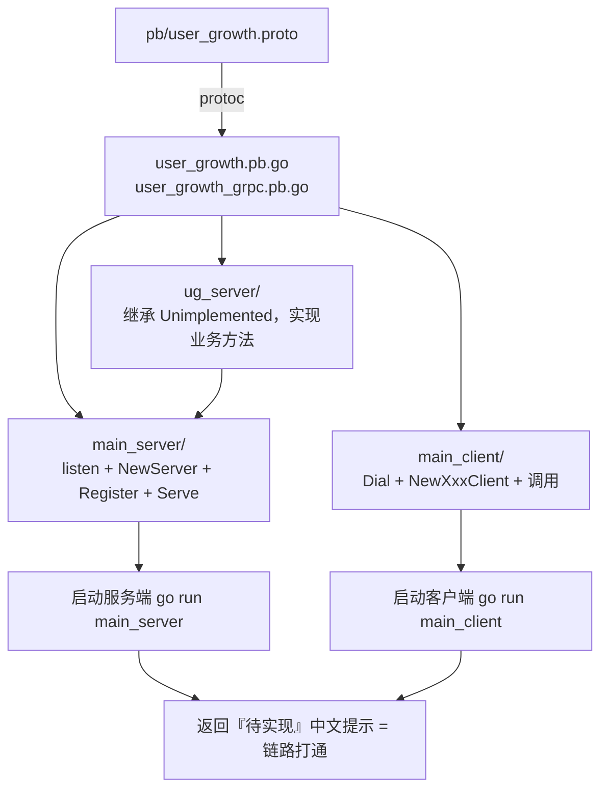

# Kubernetes 认证考点: 自动生成框架代码并验证服务 —— protoc 生成、三个目录、服务端与客户端 main

**上一节把 protobuf 文件编写完成了，这一节就是把服务代码生成出来，并且验证服务能跑通。**

结论先给：**自动生成 gRPC 代码只需要执行一行 `protoc` 命令；生成完 pb 代码和 gRPC 代码之后，要创建三个目录 `main_server`、`main_client`、`ug_server` —— 分别在 `main_server` 里实现服务端 main 方法、在 `main_client` 里实现客户端 main 方法、在 `ug_server` 里把 gRPC 的服务和方法实现了。生成出来的 gRPC 代码只有一个「未实现」的服务和方法，所以实战项目把自己实现的服务和方法代码放在 `ug_server` 目录中。** 上面这些代码都完成之后，启动服务端程序和客户端程序，就能验证服务是否可以正常运行。

## 纲要

- 一行 protoc 命令生成两套代码
- 三个目录的分工
- ug_server：继承未实现的服务，把方法补上
- 服务端 main：监听、创建、注册、启动
- 客户端 main：建连接、建客户端、写测试调用
- go mod 初始化，把依赖引进来
- 启动验证：先服务端后客户端
- 连接时的安全传输选项
- 命令行操作速查
- API 速览、Demo 示例与总结

## 一行 protoc 命令生成两套代码

**需要先进入到项目的 `pb` 目录下面来执行 `protoc` 命令，通过 `protoc` 命令来生成相应的 pb 的 Go 代码。生成的目录就在当前目录，还有一个选项指定源文件的目录（当前相对目录 `--proto_path=.`），然后 gRPC 的输出也放到当前目录（`--go-grpc_out=.`），最后指定 `user_growth.proto` 文件。**

```bash
cd usergrowth/pb

# 一行命令同时生成消息代码和 gRPC 代码
protoc --proto_path=. \
       --go_out=. --go_opt=paths=source_relative \
       --go-grpc_out=. --go-grpc_opt=paths=source_relative \
       user_growth.proto
```

执行成功会生成两个 Go 文件：

| 文件 | 内容 | 谁在用 |
| --- | --- | --- |
| **`user_growth.pb.go`** | **消息（message）的 Go 结构体与编解码** | **服务端 + 客户端** |
| **`user_growth_grpc.pb.go`** | **service 的接口、客户端桩、注册函数** | **服务端注册、客户端调用** |

## 三个目录的分工



```text
usergrowth/
├── pb/
│   ├── user_growth.proto
│   ├── user_growth.pb.go           protoc 生成：消息结构体
│   └── user_growth_grpc.pb.go      protoc 生成：服务接口/注册/客户端桩
├── main_server/                    ① 服务端 main 方法
│   └── main.go
├── main_client/                    ② 客户端 main 方法
│   └── main.go
├── ug_server/                      ③ 自己实现的 gRPC 服务与方法
│   ├── coin_server.go              用户积分服务
│   └── grade_server.go             用户等级服务
└── go.mod                          go mod init usergrowth
```

## ug_server：继承未实现的服务，把方法补上

**生成出来的 gRPC 代码只有一个未实现的服务和方法（`UnimplementedUserCoinServer` / `UnimplementedUserGradeServer`），所以实战项目中把自己实现的服务和方法代码放在 `ug_server` 目录中。这里可以直接继承 `pb.UnimplementedUserCoinServer`，然后把未实现的那几个方法都拿过来重写。**

```text
// 骨架示意（方法签名来自 protoc 生成的代码，此处省略 import 拼装）
type UGCoinServer struct {
    pb.UnimplementedUserCoinServer   // 嵌入未实现的结构体，向前兼容加方法
}

// 把未实现的方法逐个重写：参数名要补上，返回值改成中文提示
func (s *UGCoinServer) ListTasks(ctx context.Context, req *pb.ListTasksRequest) (*pb.ListTasksReply, error) {
    return nil, status.Error(codes.Unimplemented, "ListTasks 待实现")
}

func (s *UGCoinServer) GetCoinInfo(ctx context.Context, req *pb.GetCoinInfoRequest) (*pb.GetCoinInfoReply, error) {
    return nil, status.Error(codes.Unimplemented, "GetCoinInfo 待实现")
}

func (s *UGCoinServer) ListCoinDetails(ctx context.Context, req *pb.ListCoinDetailsRequest) (*pb.ListCoinDetailsReply, error) {
    return nil, status.Error(codes.Unimplemented, "ListCoinDetails 待实现")
}

func (s *UGCoinServer) UserCoinChange(ctx context.Context, req *pb.UserCoinChangeRequest) (*pb.UserCoinChangeReply, error) {
    return nil, status.Error(codes.Unimplemented, "UserCoinChange 待实现")
}
```

**未实现的时候这些参数都是空的，但后面要用到，所以要把参数名字加进去；还有未实现的返回值文案，改成中文的。正常运行起来之后如果报错返回的是中文提示，那说明是我们自己实现的，路径是对的。** 用户等级服务 `UGGradeServer` 的处理方法类似，继承 `pb.UnimplementedUserGradeServer` 即可。

## 服务端 main：监听、创建、注册、启动

**服务启动需要监听一个端口（这里用 80 端口）；如果有异常就处理异常信息；接着创建 gRPC 服务 `grpc.NewServer()`；下面是注册服务 —— `RegisterUserCoinServer` 这个方法也是在 gRPC 生成的代码里有的，直接调用它，把我们自己的 `ug_server` 实现放进去。两个 gRPC 服务，所以要写两次注册（用户积分、用户等级）。接下来就是启动服务，先打一行日志，启动会有一个异常的返回值，把这个异常处理一下。**

```text
// 骨架示意：main_server/main.go
func main() {
    listen, err := net.Listen("tcp", ":80")
    if err != nil {
        log.Fatalf("监听端口失败: %v", err)
    }
    s := grpc.NewServer()                       // 创建 gRPC 服务
    pb.RegisterUserCoinServer(s, &ug_server.UGCoinServer{})    // 注册用户积分服务
    pb.RegisterUserGradeServer(s, &ug_server.UGGradeServer{})  // 注册用户等级服务
    log.Println("服务启动，监听 :80")
    if err := s.Serve(listen); err != nil {     // 启动，返回异常要处理
        log.Fatalf("服务启动失败: %v", err)
    }
}
```

## 客户端 main：建连接、建客户端、写测试调用

**客户端代码首先连接到服务端：启动参数里面拿这个地址，默认读本地的 `localhost:80`；建立连接如果报错就打印报错信息；这个连接需要关闭，所以用一个 `defer`。接下来创建 gRPC 的客户端对象 `pb.NewUserCoinClient(conn)`，还有一个等级的客户端 —— 这两个方法也是在生成的 gRPC 文件里面能找到的。**

```text
// 骨架示意：main_client/main.go
conn, err := grpc.Dial("localhost:80", grpc.WithTransportCredentials(insecure.NewCredentials()))
if err != nil {
    log.Fatalf("连接失败: %v", err)
}
defer conn.Close()

coinClient := pb.NewUserCoinClient(conn)    // 用户积分客户端
gradeClient := pb.NewUserGradeClient(conn)  // 用户等级客户端

ctx, cancel := context.WithTimeout(context.Background(), time.Second)  // 1 秒钟超时
defer cancel()                                                         // 取消的处理

list, err := coinClient.ListTasks(ctx, &pb.ListTasksRequest{})   // 测试方法一
if err != nil {
    log.Printf("调用失败: %v", err)
} else {
    log.Printf("积分任务列表: %v", list)
}

grades, err := gradeClient.ListGrades(ctx, &pb.ListGradesRequest{})  // 测试方法二
if err != nil {
    log.Printf("调用失败: %v", err)
} else {
    log.Printf("等级列表: %v", grades)
}
```

关于安全传输选项：**如果不带安全传输设置，客户端会报错提示需要一个安全传输的设置；在客户端把这选项加进去 —— 连接时的参数配置参数 `grpc.WithTransportCredentials(insecure.NewCredentials())`（老版本写法是 `grpc.WithInsecure()`，新版本已废弃，改用 `insecure` 包）。**

## go mod 初始化，把依赖引进来

**写完两个 main 方法之后还会有很多报错，原因是没有把这个 Go 的模块建立起来。所以需要到命令行下面执行 `go mod init usergrowth`，然后再执行 `go mod tidy` 初始化一下、找一下依赖包，执行完这两个命令就有 `go.mod` 文件了。**

```bash
cd usergrowth
go mod init usergrowth
go mod tidy      # 扫描依赖，部分包需要外网通畅（必要时配 GOPROXY）
go build ./...   # 确认报错都消失
```

**这里需要特别注意：包依赖扫描的过程中有些包需要外网才能访问，所以要保证外网通畅。** 另外包名字的冲突也要留意 —— 复制代码过来的时候目录不一样，包名字是有差异的，把包名字写进去补充完，报错就消除了。

## 启动验证：先服务端后客户端

**服务验证要先启动服务端，服务端已经启动之后，再去启动客户端来调用服务端。**

```bash
# 终端一：启动服务端
go run ./main_server
# 输出：服务启动，监听 :80

# 终端二：启动客户端
go run ./main_client
# 输出：调用失败: rpc error: code = Unimplemented desc = ListTasks 待实现
```

**能看到返回的错误信息是我们自己实现的时候写的中文提示，所以整个 gRPC 服务就已经编写完成了。** 这一步的意义不在于拿到业务数据，而在于确认整条链路是通的：protoc 生成 → 服务注册 → 监听 → 客户端连接 → 方法派发 → 返回。

## 命令行操作速查

| 步骤 | 命令 | 产出/现象 |
| --- | --- | --- |
| **生成代码** | **`protoc --go_out=. --go-grpc_out=. user_growth.proto`** | **两个 `.pb.go` 文件** |
| **初始化模块** | **`go mod init usergrowth`** | **`go.mod`** |
| **拉依赖** | **`go mod tidy`** | **依赖写进 go.sum** |
| **编译自检** | **`go build ./...`** | **报错消失** |
| **起服务端** | **`go run ./main_server`** | **`服务启动，监听 :80`** |
| **起客户端** | **`go run ./main_client`** | **返回中文『待实现』提示** |

## API 速览

| 能力 | 做法 | 关键点 |
| --- | --- | --- |
| **生成消息代码** | **`protoc --go_out=. --go_opt=paths=source_relative`** | **`paths=source_relative` 决定输出路径** |
| **生成 gRPC 代码** | **`protoc --go-grpc_out=.`** | **需要 `protoc-gen-go-grpc` 插件** |
| **实现服务** | **`struct { pb.UnimplementedUserCoinServer }`** | **嵌入未实现结构体，加新方法也不破坏编译** |
| **监听端口** | **`net.Listen("tcp", ":80")`** | **失败要 `log.Fatal`** |
| **创建服务** | **`grpc.NewServer()`** | **配置参数走 `ServerOption`（见上一节）** |
| **注册服务** | **`pb.RegisterUserCoinServer(s, impl)`** | **两个服务注册两次** |
| **启动服务** | **`s.Serve(listen)`** | **阻塞，返回 err 要处理** |
| **建立连接** | **`grpc.Dial(addr, opts...)`** | **一定要带安全传输选项，否则报 need transport credentials** |
| **创建客户端** | **`pb.NewUserCoinClient(conn)`** | **方法在生成的 gRPC 文件里** |
| **调用超时** | **`context.WithTimeout(ctx, time.Second)`** | **配 `defer cancel()`** |

## Demo 示例

gRPC 的骨架依赖第三方包，这里用纯标准库把「注册 → 派发 → 未实现返回」这套机制复刻一遍，方便在没有 gRPC 环境时理解注册函数到底做了什么：

```go
package main

import (
	"context"
	"errors"
	"fmt"
	"log"
	"net"
	"time"
)

// ---------- 模拟 protoc 生成的部分 ----------

// ListTasksRequest 对应 message ListTasksRequest {}
type ListTasksRequest struct{}

// ListTasksReply 对应 message ListTasksReply { repeated CoinTask data_list = 1; }
type ListTasksReply struct {
	DataList []string
}

// UnimplementedUserCoinServer 模拟 protoc 生成的「未实现」基类
type UnimplementedUserCoinServer struct{}

func (UnimplementedUserCoinServer) ListTasks(ctx context.Context, req *ListTasksRequest) (*ListTasksReply, error) {
	return nil, errors.New("ListTasks 未实现")
}

// UserCoinServer 模拟 protoc 生成的服务接口
type UserCoinServer interface {
	ListTasks(ctx context.Context, req *ListTasksRequest) (*ListTasksReply, error)
}

// ServiceDesc 模拟 grpc.ServiceDesc：服务名 + 方法表
type ServiceDesc struct {
	Name    string
	Methods map[string]func(interface{}, context.Context, interface{}) (interface{}, error)
}

// ---------- 模拟 grpc.Server ----------

type Server struct {
	services map[string]map[string]func(interface{}, context.Context, interface{}) (interface{}, error)
	impls    map[string]interface{}
}

func NewServer() *Server {
	return &Server{
		services: map[string]map[string]func(interface{}, context.Context, interface{}) (interface{}, error){},
		impls:    map[string]interface{}{},
	}
}

// RegisterUserCoinServer 模拟 pb.RegisterUserCoinServer(s, impl)
func RegisterUserCoinServer(s *Server, impl UserCoinServer) {
	s.services["pb.UserCoin"] = map[string]func(interface{}, context.Context, interface{}) (interface{}, error){
		"ListTasks": func(i interface{}, ctx context.Context, req interface{}) (interface{}, error) {
			return i.(UserCoinServer).ListTasks(ctx, req.(*ListTasksRequest))
		},
	}
	s.impls["pb.UserCoin"] = impl
}

// Invoke 模拟客户端调用：按 服务名/方法名 派发
func (s *Server) Invoke(service, method string, req interface{}, timeout time.Duration) (interface{}, error) {
	ctx, cancel := context.WithTimeout(context.Background(), timeout)
	defer cancel()

	ms, ok := s.services[service]
	if !ok {
		return nil, fmt.Errorf("服务未注册: %s", service)
	}
	fn, ok := ms[method]
	if !ok {
		return nil, fmt.Errorf("方法不存在: %s/%s", service, method)
	}
	return fn(s.impls[service], ctx, req)
}

// Serve 模拟 grpc.Server.Serve(listen)
func (s *Server) Serve(l net.Listener) error {
	log.Println("服务启动，监听", l.Addr().String())
	return nil
}

// ---------- 我们自己的实现（ug_server） ----------

type UGCoinServer struct {
	UnimplementedUserCoinServer // 嵌入未实现基类：新增方法也不会编译不过
}

func (s *UGCoinServer) ListTasks(ctx context.Context, req *ListTasksRequest) (*ListTasksReply, error) {
	return nil, errors.New("ListTasks 待实现") // 中文提示：证明走的是我们自己的实现
}

func main() {
	listen, err := net.Listen("tcp", ":8080")
	if err != nil {
		log.Fatalf("监听端口失败: %v", err)
	}
	defer listen.Close()

	s := NewServer()
	RegisterUserCoinServer(s, &UGCoinServer{})

	if err := s.Serve(listen); err != nil {
		log.Fatalf("服务启动失败: %v", err)
	}

	// 客户端调用：1 秒钟超时
	ret, err := s.Invoke("pb.UserCoin", "ListTasks", &ListTasksRequest{}, time.Second)
	fmt.Println("返回:", ret, "错误:", err)

	// 未注册的服务：对应 UNAVAILABLE / Unimplemented 这类错误
	ret2, err2 := s.Invoke("pb.UserGrade", "ListGrades", &ListTasksRequest{}, time.Second)
	fmt.Println("返回:", ret2, "错误:", err2)
}
```

## 总结

1. **一行命令生成代码**：**自动生成 gRPC 代码只需要执行一行 `protoc` 命令，进入 `pb` 目录，指定 `--go_out` 和 `--go-grpc_out`，成功之后生成两个 Go 文件 —— 消息代码和 gRPC 代码**；
2. **三个目录各司其职**：**生成完代码之后创建 `main_server`、`main_client`、`ug_server` 三个目录，分别在里面实现服务端 main、客户端 main 和 gRPC 的服务与方法**；
3. **ug_server 继承未实现的服务**：**生成出来的 gRPC 代码只有一个未实现的服务和方法，所以自己实现的服务和方法放在 `ug_server` 目录；直接继承 `pb.UnimplementedUserCoinServer`，把方法拿过来重写，参数名补上、返回值改成中文提示**；
4. **服务端 main 四步**：**监听端口（这里 80 端口）→ `grpc.NewServer()` 创建服务 → `RegisterUserCoinServer` / `RegisterUserGradeServer` 注册两个服务（注册函数就在生成的代码里）→ `Serve` 启动并处理返回的异常**；
5. **客户端 main 四步**：**`grpc.Dial` 建连接（地址默认 `localhost:80`，失败打印报错，`defer` 关闭）→ `pb.NewUserCoinClient` / `NewUserGradeClient` 建两个客户端 → 写测试调用（先 `ListTasks` 再 `ListGrades`）→ 用 `context.WithTimeout` 设 1 秒钟超时并 `defer cancel()`**；
6. **安全传输选项必须加**：**不加会报错提示需要安全传输设置，客户端连接时加上 `grpc.WithTransportCredentials(insecure.NewCredentials())`（老版本是 `grpc.WithInsecure()`）**；
7. **go mod 消除报错**：**很多报错是因为项目模块没建起来，到命令行执行 `go mod init usergrowth` 再 `go mod tidy` 初始化并找依赖包，之后就有 `go.mod` 文件了**；
8. **依赖扫描要保证外网通畅**：**包依赖扫描的过程需要特别注意，有些包需要外网才能访问**；复制代码时目录不同会带包名字差异，把包名字写进去补充完整即可；
9. **验证顺序是先服务端后客户端**：**启动服务端之后再启动客户端调用，看到返回的是我们自己写的中文错误信息，就说明整个链路通了**；
10. **这一节只是搭框架**：**现在只是把 proto 定义、gRPC 代码生成和整个框架搭起来了，后面会开始进入实战项目，把数据层、服务层、应用层的代码全部完成。**

