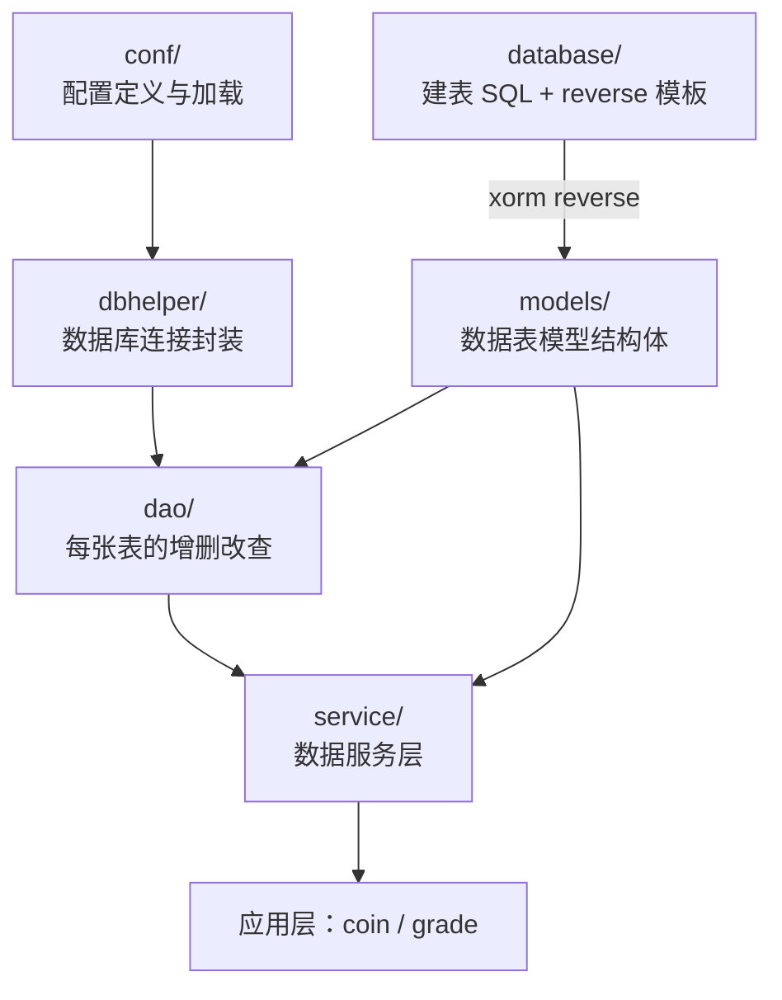

# Kubernetes 认证考点: models 与 dbhelper 实现用户积分和等级系统的数据层基础 —— xorm reverse、配置加载与数据库连接

**接下来要实现用户积分和等级系统的数据层和服务层代码了。前面已经完成了数据库的详细设计，相应的数据表也已经创建好（建表的 SQL 保存在项目代码的 `database` 目录）。**

结论先给：**数据层三件事 —— ① 用 `xorm` 的 `reverse` 工具按模板文件反向生成 `models` 目录下的模型文件；② 把配置信息和数据库连接单独封装（这部分代码在各个项目中都可以共用）；③ 数据库连接实例正常之后，再实现 DAO 的增删改查封装。** 特别要注意一个坑：**`xorm` 的 reverse 项目对 Go 的支持有问题 —— 数据表里 `unsigned int`（无符号整型）它识别不了，会生成默认的 `string` 类型，所以数据表结构定义时全部用 `int` 而不是无符号的 `int`。**

## 纲要

- 数据层的三层结构：models / dao / service
- 用 xorm reverse 反向生成模型文件
- unsigned int 的坑与规避
- 配置封装：conf 目录与环境变量
- 配置加载的分层：对外一个 LoadConfig，对内多种实现
- 数据库连接封装：dbhelper
- 连接池参数的设置
- 为什么不用单例模式
- 配置字段与连接池参数速查
- API 速览、Demo 示例与总结

## 数据层的三层结构



```text
usergrowth/
├── database/                      建表 SQL + xorm reverse 模板
│   ├── usergrowth.sql             数据库初始化脚本，可直接拿来用
│   └── mysql-usergrowth.yml       reverse 的模板文件（参考 examples 改的）
├── models/                        ★ reverse 生成的数据表模型
│   └── user_growth/               → 复制到 models 根目录后删掉这层
├── conf/                          ★ 配置定义与加载
│   └── config.go                  ProjectConfig / LoadConfig
├── dbhelper/                      ★ 数据库连接封装
│   └── mysql_source.go            InitDB / GetDB
├── dao/                           每张表一个文件（下一节）
├── service/                       数据服务层（下一节）
└── common/                        公共方法（如 common.Now）
```

## 用 xorm reverse 反向生成模型文件

**`database` 目录里面已经有数据库初始化的 SQL 语句，可以直接拿过来用；还有一个 `xorm` 的 `reverse` 模板文件（`mysql-usergrowth.yml`），这个模板在 reverse 的 examples 里面有类似的，把它改一改放到项目文件里面来。**

```yaml
# database/mysql-usergrowth.yml —— xorm reverse 模板
name: usergrowth
source:
  database: mysql
  conn_str: "root:123456@tcp(127.0.0.1:3306)/usergrowth?charset=utf8mb4"
targets:
  - type: reverse
    language: golang
    output_dir: ./models      # 输出目录，先建临时目录别直接覆盖
    multiple_files: true
    table_mapper: snake
    column_mapper: snake
```

| 模板字段 | 含义 | 要改的地方 |
| --- | --- | --- |
| **`conn_str`** | **数据库连接字符串** | **用户名、密码、IP、端口、数据库名称按自己的环境改** |
| **`output_dir`** | **模型输出目录** | **输出到 `models`，但不要直接覆盖已有文件** |
| **`table_mapper` / `column_mapper`** | **命名映射** | **`snake` 对应下划线命名** |
| **`multiple_files`** | **是否每张表一个文件** | **`true` 更清晰** |

**输出的时候要临时建一个目录，不要直接覆盖 —— 因为模型文件有可能会需要做修改，直接覆盖有风险。第一次生成的话，直接把生成出来的内容放到 `models` 目录下面去就好了。**

```bash
# 安装（以 xorm 官方资料为准，go install 即可）
go install xorm.io/xorm/cmd/xorm@latest
go install xorm.io/reverse@latest

# 生成模型文件
cd usergrowth/database
reverse -f mysql-usergrowth.yml

# 生成的内容在 models/usergrowth/ 下，挪到 models/ 根目录，删掉多余的 usergrowth 子目录
```

**生成出来的模型文件会把所有的数据表都对应生成出来，表 ID、字段类型、字段描述信息都有了。所以这一步是非常简单的模板生成代码。**

## unsigned int 的坑与规避

**需要特别注意：`xorm` 的 reverse 项目对 Go 的支持有一个问题 —— `int` 类型的数据，数据表里面如果设置为 `unsigned int`（无符号整型），它是不支持的，会生成默认的 `string` 类型，它识别不了这个 `unsigned`。早些时候如果定义成 `unsigned int` 它会报错，现在新版本不报错了，但会把 `unsigned` 生成 `string` 类型。所以在数据表的结构定义时，全部定义成 `int` 的类型，而不是无符号的 `int` 类型。**

```text
数据库类型 → Go 类型的映射（xorm reverse）
├── int                    → int        ✅ 正常
├── unsigned int           → string     ❌ 识别不了，退化成 string
├── varchar / text         → string     ✅
├── datetime / timestamp   → time.Time  ✅（proto 侧要转 string）
├── tinyint                → int / bool（看映射配置）
└── decimal                → string / float64（看映射配置）
```

## 配置封装：conf 目录与环境变量

**在编写数据操作这一层之前，需要先把数据库配置这些项目配置信息封装好，所以建一个 `conf` 目录。把配置信息放到环境变量里面去，所以定义一个环境变量的名称 `ENV_CONFIG_NAME = usergrowth_config`，读出来之后放到 `globalConfig` 变量里，这个变量就是接下来要定义的 `ProjectConfig`。**

```text
// 骨架示意：conf/config.go
const ENV_CONFIG_NAME = "usergrowth_config"

var globalConfig *ProjectConfig

// DBConfig 数据库配置
type DBConfig struct {
    Type         string `json:"type"`          // 值是 mysql
    UserName     string `json:"user_name"`     // 数据库用户名，如 root
    Password     string `json:"password"`
    Host         string `json:"host"`
    Port         int    `json:"port"`
    Database     string `json:"database"`
    Charset      string `json:"charset"`       // 编码类型
    ShowSQL      bool   `json:"show_sql"`      // 开发/测试环境打开
    MaxIdleConns int    `json:"max_idle_conns"`
    MaxOpenConns int    `json:"max_open_conns"`
    ConnMaxLife  int    `json:"conn_max_life"` // 连接生命周期，分钟
}

type ProjectConfig struct {
    DB *DBConfig `json:"db"`
}
```

**线上环境的密码肯定不会这么简单，端口、数据库名称、编码类型按实际情况填；`ShowSQL` 在开发测试环境需要打开；最大连接数量可以设一些默认值，对照默认值来改就行。**

## 配置加载的分层

**接下来定义一个方法加载配置 —— `LoadConfig` 是更高一层的封装，在下面再实现一个具体的 `loadEnvConfig`。因为配置有可能写在环境变量（`ENV`）里面，也有可能写到 Kubernetes 的配置文件（ConfigMap）中，或者写到本地的文件中，所以要有不同的实现；上面调用的时候就不需要太多改动，只要把具体的实现都写一遍，调用就很容易做调整。**

```text
// 骨架示意：分层加载
func LoadConfig() error {
    // 目前只有环境变量一种实现，后续加 ConfigMap / 本地文件时在这里扩展
    return loadEnvConfig()
}

func loadEnvConfig() error {
    v := os.Getenv(ENV_CONFIG_NAME)     // 从环境变量读
    if v == "" {
        return errors.New("环境变量 " + ENV_CONFIG_NAME + " 未设置")
    }
    cfg := &ProjectConfig{}
    if err := json.Unmarshal([]byte(v), cfg); err != nil {   // 字符串反序列化
        log.Printf("配置反序列化失败: %v", err)
        return err
    }
    globalConfig = cfg                   // 成功才设置全局变量
    return nil
}
```

```text
为什么要把 LoadConfig 和 loadEnvConfig 分开
├── 调用方只认 LoadConfig，加新配置源时不用改业务代码
├── 配置源可能的三种形态
│   ├── 环境变量 ENV                      → loadEnvConfig
│   ├── Kubernetes ConfigMap / Secret     → loadK8sConfig
│   └── 本地文件（yaml/json）              → loadFileConfig
└── 校验要做在读取之后：读出来为空、反序列化失败都要报错
```

## 数据库连接封装：dbhelper

**建立一个文件 `mysql_source.go`，在这个地方需要把数据库连接建立起来。引入 xorm 库，用 `xorm.NewEngine` 创建引擎对象；引擎对象不为空的时候就直接返回（之前已经初始化过），如果没有初始化就创建数据库连接 —— 之后连接 IP 和端口、数据库名字、用户名、密码、编码这些都从配置信息里读过来。**

```text
// 骨架示意：dbhelper/mysql_source.go
var dbEngine *xorm.Engine

func InitDB() error {
    if dbEngine != nil {          // 已经初始化过就直接返回
        return nil
    }
    cfg := conf.GetConfig()
    dsn := fmt.Sprintf("%s:%s@tcp(%s:%d)/%s?charset=%s",
        cfg.DB.UserName, cfg.DB.Password, cfg.DB.Host, cfg.DB.Port,
        cfg.DB.Database, cfg.DB.Charset)
    engine, err := xorm.NewEngine("mysql", dsn)
    if err != nil {
        log.Printf("数据库初始化失败: %v", err)
        return err
    }
    dbEngine = engine
    // 引擎创建成功后，按项目配置信息再设置连接池
    if cfg.DB.MaxIdleConns > 0 {
        dbEngine.SetMaxIdleConns(cfg.DB.MaxIdleConns)
    }
    if cfg.DB.MaxOpenConns > 0 {
        dbEngine.SetMaxOpenConns(cfg.DB.MaxOpenConns)
    }
    if cfg.DB.ConnMaxLife > 0 {
        dbEngine.SetConnMaxLifetime(time.Duration(cfg.DB.ConnMaxLife) * time.Minute)
    }
    dbEngine.ShowSQL(cfg.DB.ShowSQL)
    return nil
}

func GetDB() *xorm.Engine {   // 使用时通过 GetDB 获取
    return dbEngine
}
```

**连接建立失败了要把错误信息输出一下（初始化失败）；成功了给 `dbEngine` 赋值。**

## 为什么不用单例模式

**`InitDB` 方法没有做单例模式，所以对它的调用会放到项目的 `main` 方法中 —— 程序启动的时候去调用一次就好了，而不会频繁地去初始化数据库实例。程序要获取 DB engine 的话，再写一个 `GetDB` 方法来获取。所以这个设计非常简单：不需要用单例模式去创建数据库连接对象，初始化的时候保证只调用一次就行，后面使用时读取已经创建好的数据库对象。**

## 配置字段与连接池参数速查

| 字段 | 示例值 | 作用 |
| --- | --- | --- |
| **`type`** | **`mysql`** | **数据库类型** |
| **`user_name` / `password`** | **`root` / `***`** | **线上不要用简单密码** |
| **`host` / `port`** | **`127.0.0.1` / `3306`** | **连接地址** |
| **`database` / `charset`** | **`usergrowth` / `utf8mb4`** | **库名与编码** |
| **`show_sql`** | **`true`（dev）/ `false`（prod）** | **打印 SQL，方便调试** |
| **`max_idle_conns`** | **10** | **最大空闲连接** |
| **`max_open_conns`** | **100** | **最大打开连接** |
| **`conn_max_life`** | **60（分钟）** | **连接生命周期** |

## API 速览

| 能力 | 做法 | 关键点 |
| --- | --- | --- |
| **生成模型** | **`reverse -f mysql-usergrowth.yml`** | **输出目录先建临时目录，别直接覆盖** |
| **定义配置** | **`ProjectConfig{DB *DBConfig}`** | **结构体 tag 与环境变量里的 JSON 对齐** |
| **读环境变量** | **`os.Getenv(ENV_CONFIG_NAME)`** | **读出来为空要报错** |
| **反序列化** | **`json.Unmarshal([]byte(v), cfg)`** | **失败要打日志再返回 err** |
| **分层加载** | **`LoadConfig()` → `loadEnvConfig()`** | **加新配置源不改调用方** |
| **建连接** | **`xorm.NewEngine("mysql", dsn)`** | **dsn 全部从配置读** |
| **取连接** | **`GetDB()`** | **配合 `InitDB` 只在 main 调一次** |
| **连接池** | **`SetMaxIdleConns` / `SetMaxOpenConns` / `SetConnMaxLifetime`** | **按项目配置设，默认值对照着改** |
| **打印 SQL** | **`ShowSQL(bool)`** | **开发测试开，生产关** |

## Demo 示例

配置和连接池这套逻辑不依赖数据库也能讲清楚 —— 下面这段代码用纯标准库把「环境变量 → 反序列化 → 校验 → 连接池参数」完整跑一遍：

```go
package main

import (
	"encoding/json"
	"errors"
	"fmt"
	"os"
	"time"
)

const ENV_CONFIG_NAME = "usergrowth_config"

// DBConfig 数据库配置，与骨架里的结构一致
type DBConfig struct {
	Type         string `json:"type"`
	UserName     string `json:"user_name"`
	Password     string `json:"password"`
	Host         string `json:"host"`
	Port         int    `json:"port"`
	Database     string `json:"database"`
	Charset      string `json:"charset"`
	ShowSQL      bool   `json:"show_sql"`
	MaxIdleConns int    `json:"max_idle_conns"`
	MaxOpenConns int    `json:"max_open_conns"`
	ConnMaxLife  int    `json:"conn_max_life"`
}

type ProjectConfig struct {
	DB *DBConfig `json:"db"`
}

var globalConfig *ProjectConfig

// LoadConfig 对外只有这一个入口，加新配置源时调用方不用改
func LoadConfig() error {
	return loadEnvConfig()
}

// loadEnvConfig 具体实现之一：从环境变量读 JSON
func loadEnvConfig() error {
	v := os.Getenv(ENV_CONFIG_NAME)
	if v == "" {
		return errors.New("环境变量 " + ENV_CONFIG_NAME + " 未设置")
	}
	cfg := &ProjectConfig{}
	if err := json.Unmarshal([]byte(v), cfg); err != nil {
		fmt.Println("配置反序列化失败:", err)
		return err
	}
	globalConfig = cfg
	return nil
}

// GetConfig 对应 conf 包对外暴露的读取方法
func GetConfig() *ProjectConfig { return globalConfig }

// Pool 模拟数据库连接池：只保留 InitDB 里设置的三个参数
type Pool struct {
	addr        string
	maxIdle     int
	maxOpen     int
	connMaxLife time.Duration
}

func (p *Pool) String() string {
	return fmt.Sprintf("addr=%s idle=%d open=%d life=%v showSQL=%v",
		p.addr, p.maxIdle, p.maxOpen, p.connMaxLife, GetConfig().DB.ShowSQL)
}

// InitDB 模拟 dbhelper 的初始化：幂等，重复调用直接返回
func InitDB() (*Pool, error) {
	cfg := GetConfig()
	if cfg == nil || cfg.DB == nil {
		return nil, errors.New("配置未加载")
	}
	p := &Pool{
		addr: fmt.Sprintf("%s:%d", cfg.DB.Host, cfg.DB.Port),
	}
	if cfg.DB.MaxIdleConns > 0 {
		p.maxIdle = cfg.DB.MaxIdleConns
	}
	if cfg.DB.MaxOpenConns > 0 {
		p.maxOpen = cfg.DB.MaxOpenConns
	}
	if cfg.DB.ConnMaxLife > 0 {
		p.connMaxLife = time.Duration(cfg.DB.ConnMaxLife) * time.Minute
	}
	return p, nil
}

func main() {
	// ① 环境变量没设置 → 直接报错
	if err := LoadConfig(); err != nil {
		fmt.Println("第一次加载:", err)
	}

	// ② 设置环境变量（对应 K8s 里往容器的 env / ConfigMap 注入）
	os.Setenv(ENV_CONFIG_NAME, `{
      "db": {"type":"mysql","user_name":"root","password":"123456",
             "host":"127.0.0.1","port":3306,"database":"usergrowth",
             "charset":"utf8mb4","show_sql":true,
             "max_idle_conns":10,"max_open_conns":100,"conn_max_life":60}
    }`)
	if err := LoadConfig(); err != nil {
		fmt.Println("第二次加载:", err)
		return
	}

	// ③ 初始化数据库连接（只在 main 里调一次）
	pool, err := InitDB()
	if err != nil {
		fmt.Println("InitDB:", err)
		return
	}
	fmt.Println("连接池:", pool)

	// ④ 反序列化失败的形态：JSON 缺字段时 DB 为 nil，InitDB 要能挡住
	os.Setenv(ENV_CONFIG_NAME, `{}`)
	_ = LoadConfig()
	if _, err := InitDB(); err != nil {
		fmt.Println("空配置被挡住:", err)
	}
}
```

K8s 里把配置注入容器的示意（对应「配置也可能写到 K8s 的配置文件中」）：

```yaml
apiVersion: v1
kind: ConfigMap
metadata:
  name: usergrowth-config
  namespace: default
data:
  usergrowth_config: |
    {"db":{"type":"mysql","user_name":"root","password":"123456",
           "host":"mysql.default.svc.cluster.local","port":3306,
           "database":"usergrowth","charset":"utf8mb4","show_sql":false,
           "max_idle_conns":10,"max_open_conns":100,"conn_max_life":60}}
---
# Pod 里把 ConfigMap 的键注入成环境变量，conf.loadEnvConfig 直接就能读到
env:
  - name: usergrowth_config
    valueFrom:
      configMapKeyRef:
        name: usergrowth-config
        key: usergrowth_config
```

## 总结

1. **先建表、再生成模型**：**前面已经完成了数据库的详细设计，相应的数据表也已经创建好了；建表的 SQL 保存在项目代码的 `database` 目录中，可以直接拿过来做数据库的初始化**；
2. **xorm reverse 一步生成模型**：**`database` 目录里还有一个 `mysql-usergrowth.yml` 模板文件（从 reverse 的 examples 改来的），把连接字符串里的数据库用户名、密码、IP、端口、数据库名称改一下，再把输出目录指到 `models`，执行 `reverse -f` 就生成了模型文件；生成出来的文件把所有数据表都对应生成出来了，表 ID、字段类型、描述信息都有，所以这一步非常简单**；
3. **输出目录别直接覆盖**：**输出的时候要临时建一个目录，因为模型文件有可能会需要做修改，直接覆盖有风险**；
4. **unsigned int 是坑**：**`xorm` 的 reverse 项目对 Go 的支持有问题 —— 数据表里 `unsigned int`（无符号整型）识别不了，会生成默认的 `string` 类型（早期版本直接报错），所以在数据表结构定义时全部定义成 `int` 而不是无符号的 `int`**；
5. **配置单独封装**：**建 `conf` 目录，把配置放到环境变量里（定义环境变量名称 `usergrowth_config`），读出来放到 `globalConfig`，也就是 `ProjectConfig`；里面需要有 DB 的配置 —— 类型（`mysql`）、用户名、密码、端口、数据库名称、编码类型、`ShowSQL`、最大连接数量、连接生命周期等，线上环境按实际情况改**；
6. **加载要分层**：**`LoadConfig` 是更高一层的封装，下面再实现具体的 `loadEnvConfig`；因为配置有可能写在环境变量里、也可能写到 Kubernetes 的配置文件中或者本地文件里，所以要有不同的实现，调用方不需要太多改动**；
7. **读取后必须校验**：**从 OS 读环境变量，读出来为空肯定不对；读成功之后把字符串反序列化，反序列化失败要把错误信息打出来，不报错才设置全局变量**；
8. **数据库连接封装在 dbhelper**：**建 `mysql_source.go`，引入 xorm 库，用 `xorm.NewEngine` 创建引擎；引擎对象不为空就直接返回，没初始化才创建连接 —— IP、端口、数据库名、用户名、密码、编码都从配置信息里读；连接失败要把错误信息输出**；
9. **连接池参数按配置设**：**引擎创建成功之后，根据项目配置信息设置 `SetMaxIdleConns`、`SetMaxOpenConns`、`SetConnMaxLifetime`（连接时间用分钟为单位）和 `ShowSQL`**；
10. **不用单例模式**：**`InitDB` 没有做单例模式，调用放到项目的 `main` 方法中，程序启动时调用一次就好，不会频繁初始化；使用时用 `GetDB` 拿已经创建好的数据库对象 —— 设计简单，保证只调用一次即可。**

