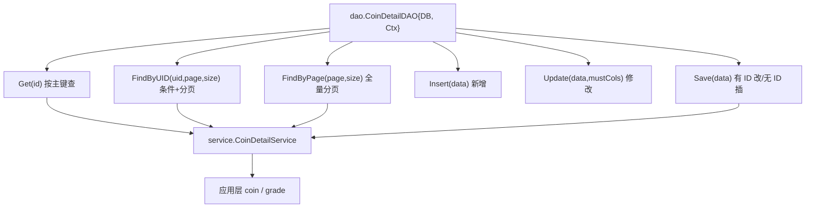

# Kubernetes 认证考点: dao 与 service 实现用户积分和等级系统的数据层、服务层 —— 增删改查、分页、软删除与分层隔离

**上一节把模型和配置、数据库连接准备好了，这一节把 DAO（数据操作层）和 service（数据服务层）的封装写出来。**

结论先给：**DAO 目录里每一张数据表对应一个文件、一个对象，对象里需要两个东西 —— 一个是 DB，一个是 context（所有的封装都尽量把上下文对象传进去，后面做变量传递、调用链跟踪都会用得到）。方法就是增删改查加上分页查询；`Save` 做更高一层的封装（有 ID 就修改，否则插入），删除按表而定（`coin_detail` 相当于日志不需要删除，`coin_task` 用状态字段做软删除）。service 层的方法看起来和 DAO 几乎一样，但不能省略 —— 这一层是为了把修改隔离出来：DAO 只做数据库操作，service 做数据操作，后面接缓存、外部接口、跨表组装都只改这一层。**

## 纲要

- DAO 的对象结构：DB + context
- 按 ID 查询与空数据约定
- 条件查询与分页：FindByUID、FindByPage
- 必须预编译，别拼 SQL
- 新增与修改：common.Now 与引用类型时间
- mustColumns：强制更新零值字段
- Save：有 ID 就改，没有就插
- 删除与恢复：软删除其实是修改
- service 层：为什么要有这层
- 复制改名的复用套路
- API 速览、Demo 示例与总结

## DAO 的对象结构：DB + context

**创建 DAO 目录，然后新建所有的数据表 —— 每个数据表的增删改查方法都放到一个单独的文件里面去，一个文件对应着一个数据表的操作。需要有两个东西，一个是 DB，一个是 context；所有的封装里面都尽量把这个上下文对象传进去，后面不管是做变量的传递也好，或者是做调用链跟踪也好，都会用得到。再实现一个 `New` 这样的方法，context 传进来返回这个对象，通过 `dbhelper.GetDB()` 获取到数据库实例。**



```text
usergrowth/
├── dao/                             数据操作层：一张表一个文件
│   ├── coin_detail.go               CoinDetailDAO{DB *xorm.Engine, Ctx context.Context}
│   ├── coin_task.go                 CoinTaskDAO  （额外有 Delete/Recover）
│   ├── coin_user.go
│   ├── grade_info.go
│   ├── grade_privilege.go
│   └── grade_user.go
├── service/                         数据服务层：一张表一个文件
│   ├── coin_detail_service.go       CoinDetailService{Ctx, DAO *dao.CoinDetailDAO}
│   ├── coin_task_service.go         不分页，全量读取
│   └── ...
└── common/
    └── public.go                    Now() 当前时间，用得太多所以抽成方法
```

## 按 ID 查询与空数据约定

**`Get` 把一个 id 传进来，获取一个对象 —— 去查数据库，id 传进去，get 到这个 data 里面去；有错误信息就把错误信息抛出去；如果这个数据为空，可以返回错误，也可以返回空数据，外部需要针对这种类型的空或者错误做处理。**

```text
// 骨架示意：dao/coin_detail.go
type CoinDetailDAO struct {
    DB  *xorm.Engine
    Ctx context.Context
}

func NewCoinDetailDAO(ctx context.Context) *CoinDetailDAO {
    return &CoinDetailDAO{DB: dbhelper.GetDB(), Ctx: ctx}
}

func (d *CoinDetailDAO) Get(id int32) (*models.CoinDetail, error) {
    data := &models.CoinDetail{}
    has, err := d.DB.ID(id).Get(data)
    if err != nil {
        return nil, err          // 错误信息抛出去
    }
    if !has {
        return nil, nil          // 空数据，由调用方决定是报错还是忽略
    }
    return data, nil
}
```

## 条件查询与分页

**还有通过一些查询条件来查，比如 `FindByUID` 查用户的明细，还有分页的支持 —— 返回的是一个数组，还有一个总记录数，因为有分页，所以需要把这一部分信息一起返回。**

**分页的处理：页码的合法性处理、`size` 给它设置一个默认值、起始位置 `start`、排序按 `id` 倒序、`Limit` 分页、`FindAndCount` 会把总数也返回回来，最后返回 `data_list`、`total` 和 `err`。**

```text
// 骨架示意：分页查询
func (d *CoinDetailDAO) FindByUID(uid int32, page, size int) ([]*models.CoinDetail, int64, error) {
    if page < 1 { page = 1 }
    if size < 1 { size = 20 }
    start := (page - 1) * size

    dataList := make([]*models.CoinDetail, 0)
    query := d.DB.Where("uid = ?", uid).      // 预编译占位符，不要拼字符串
        OrderBy("id desc").
        Limit(size, start)
    total, err := query.FindAndCount(&dataList)   // 一次查询同时拿到数据 + 总数
    return dataList, total, err
}
```

## 必须预编译，别拼 SQL

**这里都要使用预编译的方式来执行 SQL，会更安全一点，不要去直接拼 SQL 语句 —— 有可能会出现 SQL 注入的安全问题。**

| 写法 | 是否安全 | 说明 |
| --- | --- | --- |
| **`Where("uid = ?", uid)`** | **安全** | **参数走预编译占位符** |
| **`Where("uid = " + uidStr)`** | **危险** | **字符串拼接，SQL 注入** |
| **`fmt.Sprintf("uid = %d", uid)`** | **危险** | **同上，只是换了个拼接方式** |
| **`OrderBy("id desc")`** | **受控** | **排序字段来自代码常量，不接受外部输入** |

## 新增与修改：common.Now 与引用类型时间

**数据的增加：把数据对象传进来，对它做增加；这里有一个默认的时间处理 —— 增加的时候我们需要有一个时间，所以创建一个 `common` 目录，在里面把一些公共的方法封装实现了，像当前时间 `Now` 方法（`common/public.go`），这个用得太多了，所以写成具体的方法；这个时间是数据的创建时间 `common.Now()`。**

**这个类型还要注意一下，要手动改一下 —— 所有的 `time` 类型都要用引用的方式（`*time.Time`），因为它可以为空；被空时它就不会修改。如果不是引用类型，它就一定是有一个有效的数据值，字段有值的时候就会把这个数据又覆盖回去。所以这个地方要做手动修改 models 的内容。除了创建时间，还有一个修改时间，也设置为当前时间。**

```text
// 骨架示意：common/public.go
func Now() *time.Time {
    t := time.Now()
    return &t            // 返回引用：为空时不会被覆盖
}

// 骨架示意：dao/coin_detail.go
func (d *CoinDetailDAO) Insert(data *models.CoinDetail) error {
    now := common.Now()
    data.CreatedAt = now          // 创建时间
    data.UpdatedAt = now          // 修改时间
    _, err := d.DB.Insert(data)
    return err
}
```

## mustColumns：强制更新零值字段

**修改同样是把数据模型对象传进来，还有就是要强制修改的字段 —— 比如有些字段它的值可能是零或者是空字符串，如果没有设置强制更新，默认的这种空值就不会更新。所以这个地方把这个参数预留出来：如果设置了强制更新字段，就给它设置上，接下来执行更新。**

```text
// 骨架示意：更新
func (d *CoinDetailDAO) Update(data *models.CoinDetail, mustColumns ...string) error {
    if len(mustColumns) > 0 {
        d.DB = d.DB.Cols(mustColumns...)   // 强制更新：零值/空字符串也写进去
    }
    _, err := d.DB.ID(data.Id).Update(data)
    return err
    // 注意：这里没有更新 updated_at —— 数据库定义时默认做了扩展设置，
    // 数据有更新时数据库那侧直接帮我们做了时间更新
}
```

**在更新的时候反而没有去做 `updated_at` 时间的更新，因为数据库定义的时候默认做了一个扩展设置，当数据有更新，数据库这一侧就直接帮我们做了这样的一个时间更新处理。**

## Save：有 ID 就改，没有就插

**最后做一个更高一层的封装，就是数据的保存 —— 这个保存当然支持了插入和修改，所以在外面用的时候不需要再去做新增和修改的判断，直接用 `Save` 这个方法就可以了。有 ID 的时候就做修改，否则就插入。**

```text
func (d *CoinDetailDAO) Save(data *models.CoinDetail, mustColumns ...string) error {
    if data.Id > 0 {                       // 有 ID → 修改
        return d.Update(data, mustColumns...)
    }
    return d.Insert(data)                  // 无 ID → 插入
}
```

## 删除与恢复：软删除其实是修改

**删除有的地方需要支持，有的地方不需要支持，需要的时候再加进去。像 `coin_detail` 是积分明细，明细相当于日志，不需要删除功能，所以这里就不用实现了。`coin_task` 任务表是需要删除功能的 —— 看一下任务的表结构，有一个状态字段，1 表示删除，所以删除其实也是一个修改功能：构建一个对象，把 ID 传进来，还有删除的状态（`status = 1`），再调用 `Save` 方法就好了。恢复的方法同理，把这个状态再设为 0 就好了。**

```text
// 骨架示意：dao/coin_task.go
func (d *CoinTaskDAO) Delete(id int32) error {
    data := &models.CoinTask{Id: id, Status: 1}   // 1 = 已删除
    return d.Save(data, "status")                 // 强制更新 status，即使它是零值语义
}

func (d *CoinTaskDAO) Recover(id int32) error {
    data := &models.CoinTask{Id: id, Status: 0}   // 0 = 正常
    return d.Save(data, "status")
}
```

## service 层：为什么要有这层

**数据服务层的封装还是先创建一个 `service` 目录，对应的每一个数据表也做一个封装 —— 跟前面的 DAO 类似，每一个表建一个文件，也要建一个对象 `CoinDetailService`，把它的结构定义出来：上下文 `context`，还需要一个 DAO 对象来操作数据。同样要建一个 `New` 方法，context 传进来返回这个 service 对象。同样要把数据的增删改查都封装到 service 这一层来。**

**这些方法看着跟 DAO 里面的方法是不是特别的像？这种是比较简单的一层封装。那为什么还要做一层呢？就是为了后面做更多更复杂的封装 —— 当我们要改的时候，只需要去改这一层就好了，不需要再去改 DAO 那一层。通过封装把这些修改做隔离，每一层做的事情更纯粹一些：DAO 那一层做的就是数据库的操作，在 service 这一层就是数据的操作，包括数据库也可能会读别的数据，比如说来自于外部的接口或者来自于缓存，这些都可以在这一层来做封装。**

| 层 | 职责 | 变更时的扩散范围 |
| --- | --- | --- |
| **models** | **数据表结构映射** | **改表结构时才动** |
| **dao** | **纯数据库读写** | **只随表结构变** |
| **service** | **数据操作：可能跨表、读缓存、调外部接口** | **业务变只改这层** |
| **应用层** | **业务逻辑编排** | **需求变只改这层** |

**我们现在还没有涉及到那么多，所以 service 看上去是很多重复的内容，但也不能省略掉。**

## 复制改名的复用套路

**因为大部分都类似，后面很多代码可以复制后稍微调整一下就可以用 —— 复制一个文件，把 `coin_detail` 批量替换成 `coin_task` 就变成了任务数据表的操作。有些地方不存在的（比如任务表不需要分页），我们再去 DAO 里面看一下有哪些方法，把它换掉就行了：全部任务一次性全部读出来，也就不需要总数了。**

## API 速览

| 能力 | 做法 | 关键点 |
| --- | --- | --- |
| **建 DAO 对象** | **`NewCoinDetailDAO(ctx)`** | **DB 从 `dbhelper.GetDB()` 拿，ctx 透传** |
| **按主键查** | **`DB.ID(id).Get(data)`** | **查不到返回 `nil, nil`，由调用方处理** |
| **条件查询** | **`DB.Where("uid = ?", uid)`** | **预编译占位符，禁止拼 SQL** |
| **分页** | **`OrderBy("id desc").Limit(size, start)`** | **`page < 1` 归一、`size` 给默认值** |
| **带总数** | **`FindAndCount(&list)`** | **一次查询返回数据 + 总数** |
| **当前时间** | **`common.Now()`** | **返回 `*time.Time`，可为空** |
| **强制更新** | **`DB.Cols(mustColumns...)`** | **零值字段默认不更新** |
| **保存** | **`Save(data)`** | **`id > 0` 走 Update，否则 Insert** |
| **软删除** | **`Save(&Model{Id: id, Status: 1}, "status")`** | **删除是改状态，不是真删** |
| **service 层** | **`NewCoinDetailService(ctx)`** | **持有 DAO，方法名与 DAO 对齐** |

## Demo 示例

DAO 这套逻辑不连数据库也能验证 —— 下面这段代码用纯标准库把「分页参数归一、预编译占位符、Save 分支、软删除」四件事跑出来：

```go
package main

import (
	"errors"
	"fmt"
	"strings"
	"time"
)

// CoinTask 模拟 models 里的数据表结构
type CoinTask struct {
	Id        int32
	TaskName  string
	Status    int32      // 1 = 已删除
	CreatedAt *time.Time // 引用类型：可以为空
	UpdatedAt *time.Time
}

// Now 对应 common.Now()：返回引用，为空时不会被覆盖
func Now() *time.Time {
	t := time.Now()
	return &t
}

// Store 模拟数据库：只记录执行过的 SQL
type Store struct {
	rows   map[int32]*CoinTask
	nextID int32
	sqls   []string
}

func NewStore() *Store {
	return &Store{rows: map[int32]*CoinTask{}, nextID: 1}
}

// Where 预编译：参数单独存，SQL 里只放 ?
func (s *Store) Where(sql string, args ...interface{}) *Query {
	return &Query{store: s, cond: sql, args: args}
}

type Query struct {
	store *Store
	cond  string
	args  []interface{}
	limit int
	start int
}

func (q *Query) OrderBy(string) *Query { return q }

func (q *Query) Limit(size, start int) *Query {
	q.limit, q.start = size, start
	return q
}

// FindAndCount 模拟分页查询：返回数据 + 总数
func (q *Query) FindAndCount() ([]*CoinTask, int64, error) {
	// 关键点：SQL 与参数分离，参数不会被引号截断
	q.store.sqls = append(q.store.sqls, fmt.Sprintf("%s -- args=%v", q.cond, q.args))

	var matched []*CoinTask
	for _, v := range q.store.rows {
		if len(q.args) > 0 {
			if uid, ok := q.args[0].(int32); ok && v.Id != uid {
				continue
			}
		}
		matched = append(matched, v)
	}
	total := int64(len(matched))

	end := q.start + q.limit
	if q.limit == 0 {
		end = len(matched)
	}
	if q.start > len(matched) {
		q.start = len(matched)
	}
	if end > len(matched) {
		end = len(matched)
	}
	return matched[q.start:end], total, nil
}

// Save 有 ID 就改，没有就插
func (s *Store) Save(t *CoinTask, mustColumns ...string) error {
	if t.Id > 0 {
		old, ok := s.rows[t.Id]
		if !ok {
			return errors.New("记录不存在")
		}
		// 强制更新列：即使值是零值也写进去（xorm 的 Cols 语义）
		for _, c := range mustColumns {
			if c == "status" {
				old.Status = t.Status
			}
		}
		if t.TaskName != "" {
			old.TaskName = t.TaskName
		}
		// updated_at 不在这里更新：数据库定义时默认做了扩展设置
		return nil
	}
	now := Now()
	t.CreatedAt = now
	t.UpdatedAt = now
	t.Id = s.nextID
	s.nextID++
	s.rows[t.Id] = t
	return nil
}

// Delete / Recover 软删除：改状态而不是真删
func (s *Store) Delete(id int32) error {
	return s.Save(&CoinTask{Id: id, Status: 1}, "status")
}

func (s *Store) Recover(id int32) error {
	return s.Save(&CoinTask{Id: id, Status: 0}, "status")
}

// normalize 分页参数归一：页码合法化 + size 默认值
func normalize(page, size int) (int, int, int) {
	if page < 1 {
		page = 1
	}
	if size < 1 {
		size = 20
	}
	return page, size, (page - 1) * size
}

func main() {
	s := NewStore()
	_ = s.Save(&CoinTask{TaskName: "每日签到"})
	_ = s.Save(&CoinTask{TaskName: "邀请好友"})
	_ = s.Save(&CoinTask{TaskName: "发布内容"})

	page, size, start := normalize(0, 0) // 非法页码 + 零 size
	list, total, _ := s.Where("uid = ?", int32(1)).OrderBy("id desc").Limit(size, start).FindAndCount()
	fmt.Printf("归一化后 page=%d size=%d start=%d → 本页 %d 条 / 总数 %d\n",
		page, size, start, len(list), total)

	// 预编译的好处：参数里有引号也不会破坏 SQL
	s.Where("task_name = ?", "x' OR '1'='1").FindAndCount()
	fmt.Println("最后执行的 SQL:", s.sqls[len(s.sqls)-1])
	fmt.Println("是否被注入:", strings.Contains(s.sqls[len(s.sqls)-1], "OR '1'='1' --"))

	// 软删除 / 恢复
	_ = s.Delete(1)
	fmt.Println("删除后 status =", s.rows[1].Status)
	_ = s.Recover(1)
	fmt.Println("恢复后 status =", s.rows[1].Status)
}
```

## 总结

1. **一张表一个文件一个对象**：**创建 DAO 目录，每个数据表的增删改查方法都放到一个单独的文件里面去，一个文件对应着一张表；对象里需要两个东西 —— 一个是 DB，一个是 context**；
2. **context 要透传**：**所有的封装里面都尽量把上下文对象传进去，后面不管是做变量的传递也好，或者是做调用链跟踪也好，都会用得到**；
3. **查询与空数据约定**：**`Get` 按 id 获取对象，有错误信息就抛出去；数据为空可以返回错误也可以返回空数据，外部需要针对这种空或者错误做处理**；
4. **分页返回两样东西**：**条件查询加分页，返回的是一个数组，还有一个总记录数；页码要做合法性处理、`size` 给默认值、算起始位置 `start`、按 `id` 倒序、`Limit` 分页、`FindAndCount` 一次拿到数据和总数**；
5. **必须预编译**：**都要使用预编译的方式来执行 SQL，会更安全一点，不要去直接拼 SQL 语句，否则可能会出现 SQL 注入的安全问题**；
6. **时间抽成 `common.Now()`**：**增加数据时需要默认时间处理，创建 `common` 目录把公共方法封装实现，当前时间用得太多了所以写成方法；类型是引用（`*time.Time`），因为它可以为空，被空时不会修改，非引用类型一定有有效值会把数据覆盖回去 —— 所以要手动修改 models**；
7. **强制更新列要预留**：**有些字段的值可能是零或空字符串，没有设置强制更新时默认空值不会更新，所以把 `mustColumns` 参数预留出来**；
8. **`updated_at` 交给数据库**：**更新时没有去改 `updated_at`，因为数据库定义时默认做了扩展设置，数据有更新时数据库那侧直接帮我们做了时间更新**；
9. **`Save` 统一新增与修改**：**更高一层的封装是数据保存，支持插入和修改，外面用的时候不需要再判断 —— 有 ID 的时候做修改，否则插入**；
10. **删除按表而定，多数是软删**：**有的表需要删除有的不需要，积分明细相当于日志不需要删除；任务表有状态字段（1 表示删除），所以删除其实也是一个修改 —— 构建对象把 ID 和状态传进来调用 `Save`，恢复就是把状态设为 0**；
11. **service 层不能省**：**service 层的方法和 DAO 很像，但它是为了把修改隔离出来 —— 改的时候只改这一层，不用改 DAO；DAO 只做数据库操作，service 做数据操作，后面接缓存、外部接口、跨表组装都在这层；现在看起来重复，但业务复杂后 service 会越来越复杂**；
12. **复用套路是复制 + 批量改名**：**大部分代码复制后把 `coin_detail` 批量替换成 `coin_task` 就能用；不需要分页的表（如任务表）把分页相关的方法换成全量读取即可。**

