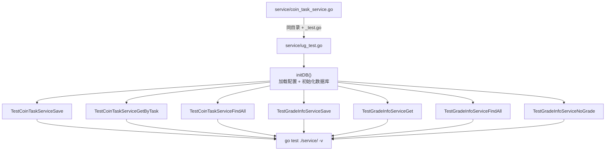

# Kubernetes 认证考点: 对服务层代码进行单元测试 —— `_test.go` 约定、initDB 公共方法与时区统一

**接下来编写单元测试代码，完成对服务层代码的单元测试。**

结论先给：**单元测试文件需要和源代码放在同一个目录中，文件名与原文件类似，只是要有一个 `_test.go` 的后缀（这个后缀可以被系统识别出来）。课程里不逐个源文件都写一遍，统一写在 `ug_test.go` 中，主要做两个测试 —— 一个是用户积分系统完成积分任务的创建和查询，另一个是用户等级系统完成用户等级的创建和查询。** 两个必须处理的细节：**一是测试里要写一个公共的 `initDB` 方法加载配置并初始化数据库（直接跑会因为没做数据库初始化而报错）；二是所有时区要统一设置为 `time.UTC`（格林威治时区），数据库也要设成 UTC，否则多地域部署（国内和海外）时时区问题会很严重。**

## 纲要

- 单元测试文件的放置约定
- 统一写在 ug_test.go
- 公共方法 initDB：配置 + 初始化
- 时区必须统一成 UTC
- 引入 mysql 驱动包
- 用户积分：任务保存的测试
- 用户积分：按任务名查询
- 用户积分：查询全部任务
- 用户等级：等级保存与查询
- 用户等级：按成长值判断等级
- 单元测试的复用套路
- API 速览、Demo 示例与总结

## 单元测试文件的放置约定

**单元测试文件需要和源代码放在同一个目录中。正常来说，需要对每一个源代码文件编写单元测试，那么对应的测试文件需要与原文件类似，只是要有一个 `_test.go` 的后缀。**



```text
usergrowth/
├── service/
│   ├── coin_task_service.go       被测源码
│   ├── coin_detail_service.go
│   ├── grade_info_service.go
│   └── ug_test.go                 ★ 统一写在这一个文件里
│       ├── initDB()                       公共方法：加载配置 + 初始化
│       ├── TestCoinTaskServiceSave()      任务保存
│       ├── TestCoinTaskServiceGetByTask() 按任务名查
│       ├── TestCoinTaskServiceFindAll()   查全部任务
│       ├── TestGradeInfoServiceSave()     等级保存
│       ├── TestGradeInfoServiceGet()      按 ID 查等级
│       ├── TestGradeInfoServiceFindAll()  查全部等级
│       └── TestGradeInfoServiceNoGrade()  按成长值判等级
└── go.mod                         需引入 mysql 驱动
```

## 公共方法 initDB：配置 + 初始化

**现在执行测试的时候会报错，因为执行这个文件的时候它没有引入数据库的包，没有做数据库初始化。所以在这个地方写一个公共的方法 `initDB` —— 在这里要去加载配置信息（配置信息自己写一个 JSON 字符串，放到操作系统的环境变量中），然后 `dbhelper.InitDB()`，这样就初始化完成了。**

```text
// 骨架示意：service/ug_test.go
func initDB() {
    // ① 配置写成一个 JSON 字符串，塞进环境变量
    os.Setenv(conf.ENV_CONFIG_NAME, `{"db":{"type":"mysql","user_name":"root",
        "password":"123456","host":"127.0.0.1","port":3306,
        "database":"usergrowth","charset":"utf8mb4","show_sql":true}}`)
    if err := conf.LoadConfig(); err != nil {
        panic(err)
    }
    // ② 初始化数据库连接（和 main 里那次是同一套代码）
    if err := dbhelper.InitDB(); err != nil {
        panic(err)
    }
}
```

## 时区必须统一成 UTC

**这里还要加一个时区的配置，我们统一都加上 —— 所有的时区要保持一致，本地的时区都设置为 `time.UTC`，也就是格林威治的时区，包括数据库也要设置成 UTC。有了统一的时区，不论是数据写到数据库里面去，还是从数据库里面读出来，就不需要再依赖操作系统的设置了。如果有差异的话，这段时间也挺难统一的，尤其是会涉及到多地域部署 —— 国内和海外部署的话，时区的问题就会更严重。**

```text
// 骨架示意：数据库连接串上指定时区
dsn := "root:123456@tcp(127.0.0.1:3306)/usergrowth?charset=utf8mb4&parseTime=true&loc=UTC"
//                                                                        ^^^^^^^^ 关键

// 本地时间统一按 UTC 取
now := time.Now().UTC()
```

| 环节 | 设置 | 不统一的后果 |
| --- | --- | --- |
| **Go 程序** | **`time.Now().UTC()`** | **写库用的是本地时区** |
| **MySQL 连接** | **`loc=UTC`** | **读出来按会话时区解释** |
| **数据库服务器** | **`time_zone = '+00:00'`** | **跨地域部署时间对不上** |
| **`parseTime`** | **`parseTime=true`** | **`time.Time` 才能正确解析** |

## 引入 mysql 驱动包

**还需要引入 mysql 的连接驱动包 `github.com/go-sql-driver/mysql`（匿名导入即可）。然后单元测试方法的第一行要先初始化一下 `initDB()`。**

```text
// 骨架示意：ug_test.go 的 import
import (
    "context"
    "testing"
    "time"

    _ "github.com/go-sql-driver/mysql"   // 匿名导入，只注册驱动
    "usergrowth/conf"
    "usergrowth/dbhelper"
    "usergrowth/models"
    "usergrowth/service"
)
```

## 用户积分：任务保存的测试

**测试 `CoinTaskService` 的保存方法：调用 `NewCoinTaskService`，把 context（`context.Background()`）传进去；保存的任务需要构建一个数据 `models.CoinTask`，把字段填充进去 —— `postarticle`（发文章）这个任务奖励 10 个积分，限制也是 10 次，其他的为空就不用输入了。然后调用 `Save` 方法把它保存进去。如果有错误就把错误报出来（保存时的报错信息，数据和错误信息都打出来），没有错误也写一个返回信息出来。**

```text
// 骨架示意
func TestCoinTaskServiceSave(t *testing.T) {
    initDB()                                     // 第一行先初始化
    s := service.NewCoinTaskService(context.Background())
    data := &models.CoinTask{
        TaskName: "postarticle",                 // 发文章
        Coin:     10,                            // 奖励 10 积分
        Limit:    10,                            // 限制 10 次
    }
    err := s.Save(data)
    if err != nil {
        t.Errorf("save error %v", err)           // 有错就报错 + 打印
    } else {
        t.Logf("save data %+v", data)            // 没错也打一行
    }
}
```

**执行之后提示通过，打出的 `save data` 这行日志里 `id = 1`（自增长的一行数据）。**

## 用户积分：按任务名查询

**类似的，前缀是 `Test`，接着要测试的方法 `CoinTaskService.GetByTask`：先 `initDB`，`NewCoinTaskService`，任务名跟上面一样是 `postarticle`，然后查询 `data, err := s.GetByTask(taskName)`，有错误返回报错（把参数 `task` 传进日志里），成功就把数据打印出来。**

## 用户积分：查询全部任务

**再补充一个 `TestCoinTaskServiceFindAll`：`initDB` 加 `NewCoinTaskService`，查出来的是一个数组，用 `list` 接；有错误把错误信息打印出来，成功把数据都打印出来。**

## 用户等级：等级保存与查询

**用户等级系统里方法的单元测试：`TestGradeInfoServiceSave` —— `initDB`，`NewGradeInfoService`，context 传进去；插入一条数据，构建 `GradeInfo` 填充数据，插入数据 ID 为 0，等级标题是「初级用户」，时间这些默认的就好了（因为里面封装了会去把时间初始化写进去）；调用 `Save` 方法，有错误抛出异常，成功把数据打印出来。执行之后 `id = 1` 也返回回来了。**

**`TestGradeInfoServiceGet`：查询一条数据 `data, err := s.Get(1)`，有报错和成功都一样处理。**

**`TestGradeInfoServiceFindAll`：查询全部等级信息，查出来是一个数组 `list`，错误信息处理，把数据打印出来。**

## 用户等级：按成长值判断等级

**再写一个单元测试验证用户的等级 —— 验证当前是哪个等级：`TestGradeInfoServiceNoGrade`。创建出 `GradeInfoService`，调用 `s.NoGrade(score)` 这个方法来验证，这里把 `score = 1` 传进去，看他当前是哪一个等级；有报错还是一样处理报错信息，没报错就把查出来的等级打印出来。**

**成长值等于 1，查出来是「初级」。因为前面创建的时候，初级只要分数达到 0 —— 所以 1 和 0 其实都能够满足，都是初级用户。如果再插入一个中级用户，那分数可能就写成 10 或者 100，那就是要大于等于 10、大于等于 100，才达到中级这个等级。**

| 等级 | 成长值门槛 | score = 1 时 |
| --- | --- | --- |
| **初级用户** | **≥ 0** | **命中** |
| **中级用户** | **≥ 10** | **不命中** |
| **高级用户** | **≥ 100** | **不命中** |

## 单元测试的复用套路

**这些方法跟前面的 DAO、service 也有很多类似的地方 —— 写一个方法，其他的方法跟第一个方法是类似的。前面写 DAO、写 service 那些封装，也是写好一个数据表的封装代码，其他的数据表跟第一个写的非常相似。同理，这种方法以后开发其他的项目也是可以用到的：关于 DAO 的封装、service 的封装和单元测试的封装，都可以这么来写。**

## API 速览

| 能力 | 做法 | 关键点 |
| --- | --- | --- |
| **测试文件命名** | **与原文件同名 + `_test.go`** | **必须和源码同目录** |
| **统一收口** | **全部写在 `ug_test.go`** | **课程演示用，真实项目建议一源一测** |
| **测试函数** | **`func TestXxx(t *testing.T)`** | **前缀必须是 `Test`** |
| **初始化** | **每个测试方法第一行 `initDB()`** | **不做初始化直接跑会报错** |
| **加载配置** | **`os.Setenv(ENV_CONFIG_NAME, json)` + `conf.LoadConfig()`** | **测试环境自己造配置** |
| **建连接** | **`dbhelper.InitDB()`** | **与 main 里同一套代码** |
| **驱动注册** | **`_ "github.com/go-sql-driver/mysql"`** | **匿名导入** |
| **时区** | **连接串 `loc=UTC` + `time.Now().UTC()`** | **数据库也要设 UTC** |
| **报错** | **`t.Errorf("save error %v", err)`** | **带上参数便于定位** |
| **执行** | **`go test ./service/ -v`** | **依赖没拉就先 `go mod tidy`** |

## Demo 示例

真实的 `_test.go` 依赖项目包，这里用纯标准库把「测试函数签名、断言、表驱动、初始化顺序」这套机制复刻一遍，可以直接跑：

```go
package main

import (
	"context"
	"errors"
	"fmt"
	"os"
	"time"
)

// ---------- 极简测试框架：对应 testing.T 的三个动作 ----------

type T struct {
	name    string
	failed  bool
	logs    []string
}

func (t *T) Errorf(format string, args ...interface{}) {
	t.failed = true
	t.logs = append(t.logs, "ERROR "+fmt.Sprintf(format, args...))
}

func (t *T) Logf(format string, args ...interface{}) {
	t.logs = append(t.logs, "LOG   "+fmt.Sprintf(format, args...))
}

func Run(tests map[string]func(*T)) int {
	failed := 0
	for name, fn := range tests {
		t := &T{name: name}
		fn(t)
		status := "PASS"
		if t.failed {
			status = "FAIL"
			failed++
		}
		fmt.Printf("--- %s: %s\n", status, name)
		for _, l := range t.logs {
			fmt.Println("   ", l)
		}
	}
	return failed
}

// ---------- 被测对象：模拟 service 层 ----------

type CoinTask struct {
	Id       int32
	TaskName string
	Coin     int32
	Limit    int32
}

type GradeInfo struct {
	Id       int32
	Grade    string
	Growth   int32
	CreateAt *time.Time
}

type CoinTaskService struct {
	ctx    context.Context
	rows   map[string]*CoinTask
	nextID int32
}

type GradeInfoService struct {
	ctx   context.Context
	rows  []*GradeInfo
}

var inited bool

// initDB 模拟：加载配置 + 初始化数据库。每个测试方法第一行都要调
func initDB() {
	if inited {
		return
	}
	os.Setenv("usergrowth_config", `{"db":{"type":"mysql","host":"127.0.0.1","port":3306}}`)
	// 时区统一：数据库 loc=UTC，本地也用 UTC
	time.Local = time.UTC
	inited = true
}

func NewCoinTaskService(ctx context.Context) *CoinTaskService {
	return &CoinTaskService{ctx: ctx, rows: map[string]*CoinTask{}, nextID: 1}
}

func (s *CoinTaskService) Save(data *CoinTask) error {
	if data.TaskName == "" {
		return errors.New("task_name 不能为空")
	}
	data.Id = s.nextID
	s.nextID++
	s.rows[data.TaskName] = data
	return nil
}

func (s *CoinTaskService) GetByTask(name string) (*CoinTask, error) {
	v, ok := s.rows[name]
	if !ok {
		return nil, nil // 查不到返回空，由调用方判断
	}
	return v, nil
}

func (s *CoinTaskService) FindAll() ([]*CoinTask, error) {
	list := make([]*CoinTask, 0)
	for _, v := range s.rows {
		list = append(list, v)
	}
	return list, nil
}

func NewGradeInfoService(ctx context.Context) *GradeInfoService {
	return &GradeInfoService{ctx: ctx, rows: []*GradeInfo{
		{Id: 1, Grade: "初级用户", Growth: 0},
		{Id: 2, Grade: "中级用户", Growth: 10},
		{Id: 3, Grade: "高级用户", Growth: 100},
	}}
}

func (s *GradeInfoService) Save(data *GradeInfo) error {
	now := time.Now().UTC() // 时区统一
	data.Id = int32(len(s.rows)) + 1
	data.CreateAt = &now
	s.rows = append(s.rows, data)
	return nil
}

func (s *GradeInfoService) Get(id int32) (*GradeInfo, error) {
	for _, v := range s.rows {
		if v.Id == id {
			return v, nil
		}
	}
	return nil, nil
}

// NoGrade 按成长值判断当前等级：取满足门槛的最高等级
func (s *GradeInfoService) NoGrade(score int32) (*GradeInfo, error) {
	var hit *GradeInfo
	for _, v := range s.rows {
		if score >= v.Growth {
			if hit == nil || v.Growth > hit.Growth {
				hit = v
			}
		}
	}
	if hit == nil {
		return nil, errors.New("没有匹配的等级")
	}
	return hit, nil
}

// ---------- 测试用例 ----------

func main() {
	bg := context.Background()

	failed := Run(map[string]func(*T){
		"TestCoinTaskServiceSave": func(t *T) {
			initDB()
			s := NewCoinTaskService(bg)
			data := &CoinTask{TaskName: "postarticle", Coin: 10, Limit: 10}
			if err := s.Save(data); err != nil {
				t.Errorf("save error %v", err)
				return
			}
			t.Logf("save data %+v", data)
		},
		"TestCoinTaskServiceGetByTask": func(t *T) {
			initDB()
			s := NewCoinTaskService(bg)
			_ = s.Save(&CoinTask{TaskName: "postarticle", Coin: 10, Limit: 10})
			task := "postarticle"
			data, err := s.GetByTask(task)
			if err != nil {
				t.Errorf("GetByTask error %v task=%s", err, task)
				return
			}
			if data == nil {
				t.Errorf("GetByTask 没有数据 task=%s", task)
				return
			}
			t.Logf("GetByTask data=%+v", data)
		},
		"TestCoinTaskServiceFindAll": func(t *T) {
			initDB()
			s := NewCoinTaskService(bg)
			_ = s.Save(&CoinTask{TaskName: "postarticle", Coin: 10, Limit: 10})
			_ = s.Save(&CoinTask{TaskName: "invite", Coin: 20, Limit: 5})
			list, err := s.FindAll()
			if err != nil {
				t.Errorf("FindAll error %v", err)
				return
			}
			t.Logf("FindAll 共 %d 条", len(list))
		},
		"TestGradeInfoServiceSave": func(t *T) {
			initDB()
			s := NewGradeInfoService(bg)
			data := &GradeInfo{Id: 0, Grade: "初级用户", Growth: 0}
			if err := s.Save(data); err != nil {
				t.Errorf("save error %v data=%+v", err, data)
				return
			}
			t.Logf("save data id=%d grade=%s", data.Id, data.Grade)
		},
		"TestGradeInfoServiceGet": func(t *T) {
			initDB()
			s := NewGradeInfoService(bg)
			data, err := s.Get(1)
			if err != nil {
				t.Errorf("get error %v id=1", err)
				return
			}
			t.Logf("get data=%+v", data)
		},
		"TestGradeInfoServiceNoGrade": func(t *T) {
			initDB()
			s := NewGradeInfoService(bg)
			for _, score := range []int32{0, 1, 10, 100} {
				grade, err := s.NoGrade(score)
				if err != nil {
					t.Errorf("NoGrade error %v score=%d", err, score)
					continue
				}
				t.Logf("score=%d → %s", score, grade.Grade)
			}
		},
	})

	fmt.Printf("\n失败用例数: %d\n", failed)
}
```

真实项目里执行的命令：

```bash
# ① 拉依赖（mysql 驱动、xorm 等），有包需要外网通畅
go mod tidy

# ② 跑 service 目录的单元测试，-v 看每个用例的日志
go test ./service/ -v -run TestCoinTaskService

# ③ 全量跑
go test ./... -v

# ④ 时区自查：确认连接串带 loc=UTC，数据库 time_zone 也是 UTC
mysql -e "SELECT @@global.time_zone, @@session.time_zone;"
```

## 总结

1. **测试文件放同目录**：**单元测试文件需要和源代码放在同一个目录中；正常来说需要对每一个源代码文件编写单元测试，对应的测试文件与原文件类似，只是要有 `_test.go` 后缀**；
2. **课程统一写在 `ug_test.go`**：**不会给每一个代码文件都写一遍，统一写在一个文件里，只部分完成服务层代码的单元测试，更多的单元测试方法也都是类似的，可以自己补充完整**；
3. **两个主要测试**：**一个是用户积分系统完成积分任务的创建和查询，另一个是用户等级系统完成用户等级的创建和查询；把这两个测试完成，更多查询方法的单元测试参照着这两个案例来做就很容易了**；
4. **必须有 `initDB` 公共方法**：**直接执行会报错，因为没有引入数据库的包、没有做数据库初始化；所以写一个公共方法 `initDB`，在里面加载配置信息（自己写一个 JSON 字符串放到操作系统的环境变量中）然后 `dbhelper.InitDB()`**；
5. **时区统一成 UTC**：**所有的时区要保持一致，本地时区设置为 `time.UTC`（格林威治时区），数据库也要设置成 UTC；这样不论是写进数据库还是读出来，都不需要再依赖操作系统的设置；涉及多地域部署（国内和海外）时，时区问题会更严重**；
6. **要引入 mysql 驱动**：**需要引入 mysql 的连接驱动包 `github.com/go-sql-driver/mysql`（匿名导入），然后单元测试方法的第一行要先 `initDB()` 初始化**；
7. **任务保存测试**：**调用 `NewCoinTaskService` 传 `context.Background()`，构建 `models.CoinTask` 填充字段（`postarticle` 发文章奖励 10 积分、限制 10 次，其他为空不用输入），调用 `Save`；有错把数据和错误信息都打出来，没错也打印返回信息；执行通过后 `id = 1` 自增长**；
8. **按任务名查询**：**`TestCoinTaskServiceGetByTask` 用同样的任务名查询，有错返回报错（参数 `task` 也传进日志），成功把数据打印出来**；
9. **查询全部**：**`TestCoinTaskServiceFindAll` 查出来是数组，用 `list` 接，有错打印错误信息，成功把数据都打印出来**；
10. **等级保存与查询**：**`TestGradeInfoServiceSave` 插入 ID 为 0 的数据、等级标题「初级用户」、时间用默认（封装里会初始化时间），调用 `Save` 后 `id = 1` 返回；`TestGradeInfoServiceGet` 按 ID 查一条；`TestGradeInfoServiceFindAll` 查全部**；
11. **按成长值判等级**：**`TestGradeInfoServiceNoGrade` 传 `score = 1`，查出来是「初级」—— 因为初级只要分数达到 0，1 和 0 都能满足；中级要 ≥ 10、高级要 ≥ 100**；
12. **套路可复用**：**这些方法跟前面的 DAO、service 有很多类似的地方 —— 写一个方法，其他方法跟第一个类似；以后开发其他项目，DAO 的封装、service 的封装和单元测试的封装都可以这么来写。**

