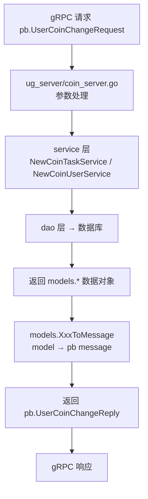

# Kubernetes 认证考点: coin 实现用户积分服务的应用层代码 —— 服务方法、model 与 message 双向转换

**前面已经把数据库操作的部分全部完成了，也完成了数据服务层的单元测试，接下来完成系统开发的最后一部分代码 —— 应用层代码。**

结论先给：**应用层就是 `ug_server/coin_server.go`（用户积分服务）和 `ug_server/grade_server.go`（用户等级服务）里那几个方法的具体实现 —— 参数处理、数据处理逻辑、结果输出都要在应用层代码中最终实现。之前写的时候用的是 `Unimplemented` 的异常报错返回，现在要把它注释掉换成真正的实现。** 这一层最核心的一个坑：**service 返回的是 `models` 包的数据对象，而 proto 生成的消息是 `pb` 包的对象 —— 虽然名字一样（都叫 `CoinTask`），但它们在不同的包里定义，就是不同的数据类型，没法直接赋值，必须做双向转换封装。**

## 纲要

- 应用层做什么：从 Unimplemented 到真实实现
- 第一个坑：同名不同包 = 不同类型
- 双向转换封装：ToMessage 与 ToObject
- 时间类型的转换封装
- 方法一：ListTasks 查询全部任务
- 方法二：GetCoinInfo 查询用户积分
- 方法三：ListCoinDetails 查询积分明细
- 方法四：UserCoinChange 调整用户积分
- 错误返回的讲究：别让错误都变成 Unknown
- 转换方法的数量与复用
- API 速览、Demo 示例与总结

## 应用层做什么：从 Unimplemented 到真实实现

**gRPC 服务应用层的代码框架之前已经创建好了，都在 `ug_server` 里 —— 用户积分在 `coin_server`，用户等级在 `grade_server` 里面。之前写的时候还是用的 `Unimplemented` 的异常报错返回，这次在应用层把它完善了，当然就不能用报错的方法来返回了。把这个报错的返回先注释掉，然后换成自己要实现的代码。**



```text
usergrowth/
├── ug_server/                     应用层：gRPC 方法的最终实现
│   ├── coin_server.go             ★ 用户积分服务的四个方法
│   │   ├── ListTasks              查全部积分任务
│   │   ├── GetCoinInfo            查用户积分信息
│   │   ├── ListCoinDetails        查用户积分明细（分页）
│   │   └── UserCoinChange         调整积分（奖励/惩罚）
│   └── grade_server.go            用户等级服务（下一节）
├── models/
│   └── convert.go                 ★ 双向转换：ToMessage / ToObject
├── common/
│   └── public.go                  ★ TimeFormat / TimeParse / Now
├── service/                       数据服务层
└── dao/                           数据操作层
```

## 第一个坑：同名不同包 = 不同类型

**查询到了数据直接返回 `pb.ListTasksReply`，里面的 `DataList` 能直接用吗？这里会报错。同样是读的一个数据列表，service 返回的数据列表是 `models` 里面的 `CoinTask` 数组，而这里的 `DataList` 是 `pb` 里面定义的 `pb.CoinTask`。虽然它们的名字是一样的，但是它们在不同的包里面定义的，那么它们就是不同的数据类型，所以在这个地方是没法直接给它赋值进去的。**

```text
service 返回  → []*models.CoinTask     （models 包，xorm 生成，字段是 *time.Time）
proto 需要    → []*pb.CoinTask         （pb 包，protoc 生成，字段是 string）

名字一样 ≠ 类型一样
├── 不同包定义的同名结构体 = 两个完全不同的类型
├── 不能直接赋值，编译期就报错
└── 必须做显式转换：字段一个一个搬，顺带把 time.Time ↔ string 也转了
```

## 双向转换封装：ToMessage 与 ToObject

**需要对来自于数据库的数据对象，以及来自 pb 的数据对象做一个转换处理，而且这个转换处理需要做双向转换。转换的封装方法写到 `models` 里面 —— `CoinTaskToMessage`（传进来 model 对象，返回 pb 对象）和 `CoinTaskToObject`（pb 数据传过来要保存到数据库里，先把 message 转成 model）。**

```text
// 骨架示意：models/convert.go
func CoinTaskToMessage(data *models.CoinTask) *pb.CoinTask {
    ret := &pb.CoinTask{}
    ret.Id = data.Id
    ret.TaskName = data.TaskName
    ret.Coin = data.Coin
    ret.Limit = data.Limit
    ret.Status = data.Status
    // 时间类型要转：time.Time → string
    ret.StartAt = common.TimeFormat(data.StartAt)
    ret.CreatedAt = common.TimeFormat(data.CreatedAt)
    ret.UpdatedAt = common.TimeFormat(data.UpdatedAt)
    return ret
}

func CoinTaskToObject(data *pb.CoinTask) *models.CoinTask {
    ret := &models.CoinTask{}
    ret.Id = data.Id
    ret.TaskName = data.TaskName
    ret.Coin = data.Coin
    ret.Limit = data.Limit
    // 时间类型要转：string → time.Time
    ret.StartAt = common.TimeParse(data.StartAt)
    ret.CreatedAt = common.TimeParse(data.CreatedAt)
    ret.UpdatedAt = common.TimeParse(data.UpdatedAt)
    return ret
}
```

## 时间类型的转换封装

**时间类型的转换也需要做一个封装，放到 `common` 里面去实现：一个是时间格式化（时间转成字符串），为空的时候返回一个空字符串，否则返回一个 `Format` 后的格式；还需要一个转换方法把字符串解析为时间类型返回时间，解析不出来报错时这个错误就不抛出了，直接返回一个空的时间到外面去处理。**

```text
// 骨架示意：common/public.go
const TimeLayout = "2006-01-02 15:04:05"   // 时间模板常量，放最上面

func TimeFormat(t *time.Time) string {
    if t == nil {
        return ""                          // 为空返回空字符串
    }
    return t.Format(TimeLayout)            // 输出 2022-12-11 08:30:00 这种格式
}

func TimeParse(s string) *time.Time {
    t, err := time.ParseInLocation(TimeLayout, s, time.UTC)
    if err != nil {
        return nil                         // 解析失败不抛错，返回空时间由外面处理
    }
    return &t
}
```

| 方向 | 方法 | 空值处理 |
| --- | --- | --- |
| **time → string** | **`common.TimeFormat`** | **nil 返回 `""`** |
| **string → time** | **`common.TimeParse`** | **解析失败返回 nil，不抛错** |
| **当前时间** | **`common.Now()`** | **返回 `*time.Time`，UTC** |

## 方法一：ListTasks 查询全部任务

**首先创建出这样的一个服务 `service.NewCoinTaskService(ctx)`，用这个服务去把数据拿出来 —— 所有的任务列表查出了所有数据，还要处理一下异常信息：如果有报错就把错误信息直接抛出去。没有异常的时候就可以直接返回了。**

**因为查询出来是一个数组，转换完之后也得是一个数组，所以要新建一个数组，里面的对象是 `pb.CoinTask`，数量是一样的，然后循环跟每一个 model 对象进行转换。**

```text
// 骨架示意：ug_server/coin_server.go
func (s *UGCoinServer) ListTasks(ctx context.Context, req *pb.ListTasksRequest) (*pb.ListTasksReply, error) {
    svc := service.NewCoinTaskService(ctx)
    list, err := svc.FindAll()
    if err != nil {
        return nil, err                    // 简化写法；严格来说应返回 status.Error(codes.Internal, ...)
    }
    dataList := make([]*pb.CoinTask, len(list))   // 新建 pb 数组，数量一致
    for i, v := range list {
        dataList[i] = models.CoinTaskToMessage(v) // 逐个转换
    }
    return &pb.ListTasksReply{DataList: dataList}, nil
}
```

## 方法二：GetCoinInfo 查询用户积分

**需要 `NewCoinUserService`，context 传进去；有几个参数需要处理 `uid` 这个参数，然后对它做查询 `GetByUID` 查询出来一个用户的信息；有错误的话一样的把这个错误信息直接抛出去；没有错误的话那就返回了 —— 返回的时候这是数据库的 model，需要对它做一个转换 `models.CoinUserToMessage`，生成 `pb.GetCoinInfoReply`。**

```text
func (s *UGCoinServer) GetCoinInfo(ctx context.Context, req *pb.GetCoinInfoRequest) (*pb.GetCoinInfoReply, error) {
    svc := service.NewCoinUserService(ctx)
    data, err := svc.GetByUID(req.Uid)
    if err != nil {
        return nil, err
    }
    return &pb.GetCoinInfoReply{Data: models.CoinUserToMessage(data)}, nil
}
```

## 方法三：ListCoinDetails 查询积分明细

**获取用户的积分明细列表，这里会传用户 ID 进来，还有分页的信息 `page`、`size`。先创建服务 `NewCoinDetailService`，调用 `FindByUID` 把参数传进去，返回 `dataList`、总数和错误信息；同样的做错误处理；输出之前要记得做一下转换（数据库转 pb）—— 循环把 list 里的数据一个一个 `CoinDetailToMessage` 转换，然后生成 reply 数据，填充 `data_list`，`total` 也要转换一下。**

```text
func (s *UGCoinServer) ListCoinDetails(ctx context.Context, req *pb.ListCoinDetailsRequest) (*pb.ListCoinDetailsReply, error) {
    svc := service.NewCoinDetailService(ctx)
    list, total, err := svc.FindByUID(req.Uid, int(req.Page), int(req.Size))
    if err != nil {
        return nil, err
    }
    dataList := make([]*pb.CoinDetail, len(list))
    for i, v := range list {
        dataList[i] = models.CoinDetailToMessage(v)
    }
    return &pb.ListCoinDetailsReply{DataList: dataList, Total: int32(total)}, nil
}
```

## 方法四：UserCoinChange 调整用户积分

**最后一个方法可以调整用户的积分，调整用户积分可以是奖励，也可以是惩罚，都用这个接口。它会传几个参数进来：用户（谁在操作），他在哪个任务上操作的 `taskName`，还有需要奖励多少积分 `coin`。**

```text
// 骨架示意
func (s *UGCoinServer) UserCoinChange(ctx context.Context, req *pb.UserCoinChangeRequest) (*pb.UserCoinChangeReply, error) {
    // ① 按任务名查任务：任务名不能乱传，一定是这里已经配置好了的才可以传进来使用
    taskSvc := service.NewCoinTaskService(ctx)
    taskInfo, err := taskSvc.GetByTask(req.TaskName)
    if err != nil {
        return nil, err
    }
    if taskInfo == nil {
        return nil, status.Error(codes.NotFound, "任务不存在")   // 查不到要报错
    }

    // ② coin 为空时用任务里配置好的默认值，简化调用方的处理
    coin := req.Coin
    if coin == 0 {
        coin = taskInfo.Coin
    }

    // ③ 插入积分明细
    detailSvc := service.NewCoinDetailService(ctx)
    detail := &models.CoinDetail{
        Uid:     req.Uid,
        TaskId:  taskInfo.Id,      // 任务 ID 从 taskInfo 里拿
        Coin:    coin,
    }
    if err := detailSvc.Save(detail); err != nil {
        return nil, err
    }

    // ④ 更新用户积分：查不到就新建，查得到就更新
    userSvc := service.NewCoinUserService(ctx)
    coinUser, err := userSvc.GetByUID(req.Uid)
    if err != nil {
        return nil, err
    }
    if coinUser == nil {                       // 第一次来，还没有数据
        coinUser = &models.CoinUser{Uid: req.Uid, Coin: coin}
    } else {
        coinUser.Coin += coin
        coinUser.UpdatedAt = nil               // 时间设为空，否则会再次写入旧数据
    }
    if err := userSvc.Save(coinUser); err != nil {
        return nil, err
    }

    // ⑤ 返回最新的用户积分信息（model → message）
    return &pb.UserCoinChangeReply{Data: models.CoinUserToMessage(coinUser)}, nil
}
```

**这里有两个细节要留意**：**如果传进来的 `coin` 参数为空，需要给它设置一个默认值，这个值就是在任务里面已经定义好了的值，这样可以简化调用处理 —— 有些任务不能任意传值，就用任务中配置好的积分值来写入。还有更新用户时要把它的时间设为空，因为这个时间不为空的话，在写入数据的时候会再次写入旧的数据，这样就不合理了。**

## 错误返回的讲究：别让错误都变成 Unknown

**前面讲过 gRPC 的常见问题。这个地方直接抛出异常信息的话，是没有抛出指定的 gRPC 定义的错误类型，没有把具体的错误码抛出去，那么这个时候错误信息都会统一是 `Unknown` 类型的。所以这里需要注意一下 —— 后面在细化处理的时候，可以考虑用 `status.Error(...)` 这种方式；像这个地方是内部的错误（数据库报错这些），就可以这么来写。**

| 错误来源 | 直接 `return err` | 推荐写法 |
| --- | --- | --- |
| **数据库报错** | **`Unknown`** | **`status.Error(codes.Internal, "...")`** |
| **任务不存在** | **`Unknown`** | **`status.Error(codes.NotFound, "任务不存在")`** |
| **参数不合法** | **`Unknown`** | **`status.Error(codes.InvalidArgument, "...")`** |
| **并发/限流** | **`Unknown`** | **`status.Error(codes.ResourceExhausted, "...")`** |

## 转换方法的数量与复用

**其他的数据表像 `CoinUserToMessage`、`CoinUserToObject` 也是成对出现的；总共有六七个表，需要成对的六七对转换方法。第一个写好了，后面其实大家都会写 —— 都是一个一个写，所以是很费时间的一个工作，但是难度不大。**

```text
转换方法的成对清单（六七个表 → 六七对）
├── CoinTaskToMessage      / CoinTaskToObject
├── CoinDetailToMessage    / CoinDetailToObject
├── CoinUserToMessage      / CoinUserToObject
├── GradeInfoToMessage     / GradeInfoToObject
├── GradePrivilegeToMessage/ GradePrivilegeToObject
└── GradeUserToMessage     / GradeUserToObject
   └── 每对都做三件事：普通字段搬运 + 类型转换 + 时间字段 TimeFormat/TimeParse
```

## API 速览

| 能力 | 做法 | 关键点 |
| --- | --- | --- |
| **建服务** | **`service.NewCoinTaskService(ctx)`** | **context 透传** |
| **查列表** | **`svc.FindAll()`** | **返回 `[]*models.Xxx`** |
| **查单条** | **`svc.GetByUID(uid)`** | **查不到返回 nil，要判空** |
| **分页查** | **`svc.FindByUID(uid, page, size)`** | **返回 list + total** |
| **model → pb** | **`models.CoinTaskToMessage(v)`** | **数组要新建后逐个转** |
| **pb → model** | **`models.CoinTaskToObject(v)`** | **入库前先转** |
| **时间转串** | **`common.TimeFormat(t)`** | **nil → `""`** |
| **串转时间** | **`common.TimeParse(s)`** | **失败返回 nil，不抛错** |
| **错误码** | **`status.Error(codes.Xxx, msg)`** | **别让错误都落到 Unknown** |
| **默认值** | **`coin == 0 → taskInfo.Coin`** | **简化调用方** |

## Demo 示例

**不同包的同名类型就是不同类型** —— 下面这段代码用纯标准库把 model ↔ message 的转换、时间格式化和默认值逻辑完整跑一遍，可以直接验证：

```go
package main

import (
	"fmt"
	"time"
)

const TimeLayout = "2006-01-02 15:04:05"

// ---------- models 包：数据库模型（时间是指针） ----------

type modelsCoinTask struct {
	Id       int32
	TaskName string
	Coin     int32
	Limit    int32
	StartAt  *time.Time
	CreateAt *time.Time
	UpdateAt *time.Time
}

// ---------- pb 包：protoc 生成的消息（时间是 string） ----------

type pbCoinTask struct {
	Id       int32
	TaskName string
	Coin     int32
	Limit    int32
	StartAt  string
	CreateAt string
	UpdateAt string
}

// ---------- common 包：时间转换 ----------

func TimeFormat(t *time.Time) string {
	if t == nil {
		return ""
	}
	return t.Format(TimeLayout)
}

func TimeParse(s string) *time.Time {
	if s == "" {
		return nil
	}
	t, err := time.ParseInLocation(TimeLayout, s, time.UTC)
	if err != nil {
		return nil // 解析失败不抛错，返回空时间由外面处理
	}
	return &t
}

func Now() *time.Time {
	t := time.Now().UTC()
	return &t
}

// ---------- models 包：双向转换 ----------

func CoinTaskToMessage(data *modelsCoinTask) *pbCoinTask {
	if data == nil {
		return nil
	}
	return &pbCoinTask{
		Id:       data.Id,
		TaskName: data.TaskName,
		Coin:     data.Coin,
		Limit:    data.Limit,
		StartAt:  TimeFormat(data.StartAt),
		CreateAt: TimeFormat(data.CreateAt),
		UpdateAt: TimeFormat(data.UpdateAt),
	}
}

func CoinTaskToObject(data *pbCoinTask) *modelsCoinTask {
	if data == nil {
		return nil
	}
	return &modelsCoinTask{
		Id:       data.Id,
		TaskName: data.TaskName,
		Coin:     data.Coin,
		Limit:    data.Limit,
		StartAt:  TimeParse(data.StartAt),
		CreateAt: TimeParse(data.CreateAt),
		UpdateAt: TimeParse(data.UpdateAt),
	}
}

// ---------- 应用层：UserCoinChange 的核心逻辑 ----------

// ChangeCoin 演示：任务不存在报错 + coin 为空取任务默认值 + 明细入库 + 用户积分累加
func ChangeCoin(tasks map[string]*modelsCoinTask, users map[int32]int32,
	uid int32, taskName string, coin int32) (*modelsCoinTask, int32, error) {

	task, ok := tasks[taskName]
	if !ok {
		return nil, 0, fmt.Errorf("任务不存在: %s", taskName)
	}
	if coin == 0 { // 传空则用任务里配置好的值，简化调用方
		coin = task.Coin
	}
	users[uid] += coin // 明细入库（此处省略）+ 用户积分累加
	return task, users[uid], nil
}

func main() {
	now := Now()
	task := &modelsCoinTask{
		Id: 1, TaskName: "postarticle", Coin: 10, Limit: 10,
		StartAt: now, CreateAt: now, UpdateAt: nil, // UpdateAt 为空 → 转出来是空串
	}

	// ① model → message：时间字段变成字符串
	msg := CoinTaskToMessage(task)
	fmt.Printf("ToMessage: id=%d name=%s coin=%d start_at=%q update_at=%q\n",
		msg.Id, msg.TaskName, msg.Coin, msg.StartAt, msg.UpdateAt)

	// ② message → model：字符串解析回时间（空串得到 nil）
	obj := CoinTaskToObject(msg)
	fmt.Printf("ToObject : id=%d name=%s start_at=%v update_at=%v\n",
		obj.Id, obj.TaskName, obj.StartAt, obj.UpdateAt)

	// ③ 数组转换：查询结果是 model 数组，要新建 pb 数组逐个转
	modelList := []*modelsCoinTask{task, {Id: 2, TaskName: "invite", Coin: 20, Limit: 5, CreateAt: now}}
	msgList := make([]*pbCoinTask, len(modelList))
	for i, v := range modelList {
		msgList[i] = CoinTaskToMessage(v)
	}
	fmt.Printf("数组转换: %d 条 → %d 条，第二条 update_at=%q\n",
		len(modelList), len(msgList), msgList[1].UpdateAt)

	// ④ 应用层逻辑：不存在的任务报错；coin 传 0 用任务默认值
	tasks := map[string]*modelsCoinTask{"postarticle": task}
	users := map[int32]int32{1001: 0}
	if _, _, err := ChangeCoin(tasks, users, 1001, "nobody", 0); err != nil {
		fmt.Println("预期报错:", err)
	}
	_, total, _ := ChangeCoin(tasks, users, 1001, "postarticle", 0)
	fmt.Println("用任务默认积分后用户积分:", total)
	_, total, _ = ChangeCoin(tasks, users, 1001, "postarticle", 5)
	fmt.Println("显式传 5 分后用户积分:", total)
}
```

## 总结

1. **应用层是最后一块拼图**：**前面已经把数据库操作的部分全部完成，也完成了数据服务层的单元测试，接下来完成系统开发的最后一部分 —— 应用层代码；用户积分服务实现 `ug_server/coin_server.go`，里面的参数处理、数据处理逻辑、结果输出都要全部在应用层代码中最终实现**；
2. **从 Unimplemented 换成真实实现**：**gRPC 服务应用层的代码框架之前已经创建好了，之前写的时候还是用 `Unimplemented` 的异常报错返回，这次把它完善 —— 把报错的返回先注释掉，换成自己要实现的代码**；
3. **同名不同包就是不同类型**：**service 返回的是 `models` 里的数据对象，`pb` 里定义的是另一个同名类型，虽然名字一样，但它们在不同的包里面定义，就是不同的数据类型，没法直接赋值，必须做转换处理**；
4. **双向转换放在 models 里**：**写一个转换的封装方法 —— `CoinTaskToMessage`（传 model 对象返回 pb 对象）和 `CoinTaskToObject`（pb 数据传过来要保存到数据库里，先把 message 转成 model）；都是成对出现的，六七个表就是六七对，一个一个写，费时间但难度不大**；
5. **时间转换放在 common 里**：**时间格式化（时间转成字符串，为空返回空字符串，否则 `Format` 一个格式）和字符串解析为时间（解析不出来不抛错，直接返回空时间到外面处理）；时间模板定义成常量 `TimeLayout`**；
6. **ListTasks 要新建数组逐个转**：**查询出来是一个数组，转换完之后也得是一个数组，所以新建一个 `pb.CoinTask` 数组，数量一样，循环跟每一个 model 对象进行转换**；
7. **GetCoinInfo 查用户积分**：**传 `uid` 参数，`GetByUID` 查询用户信息；有错误直接抛出，没有错误做 `CoinUserToMessage` 转换后生成 `pb.GetCoinInfoReply`**；
8. **ListCoinDetails 带分页**：**传用户 ID 和分页的 `page`、`size`，`FindByUID` 返回 `dataList`、总数和错误；输出之前做数据库转 pb 的转换，`data_list` 和 `total` 都要填充**；
9. **UserCoinChange 奖励惩罚都用它**：**先按任务名查 `taskInfo`（任务名不能乱传，一定是已经配置好了的才可以传进来使用，查不到要报「任务不存在」）；插入积分明细（任务 ID 从 `taskInfo` 里拿，`coin` 参数为空时用任务里已定义好的默认值，简化调用处理）；再更新用户积分 —— 查不到就新建一条记录，查得到就更新，更新时把时间设为空，否则写入数据时会把旧数据再写一遍**；
10. **错误别都变成 Unknown**：**直接抛出异常信息的话，没有抛出 gRPC 定义的错误类型、没有把具体的错误码抛出去，错误信息都会统一是 `Unknown` 类型的；细化处理时要考虑用 `status.Error(codes.Internal, ...)` 这种方式，数据库报错这类内部错误尤其适用**；
11. **注释要加上**：**没有注释看着特别难受，每个方法前把注释加进去（获取所有的积分任务列表、获取用户的积分信息等）**。

