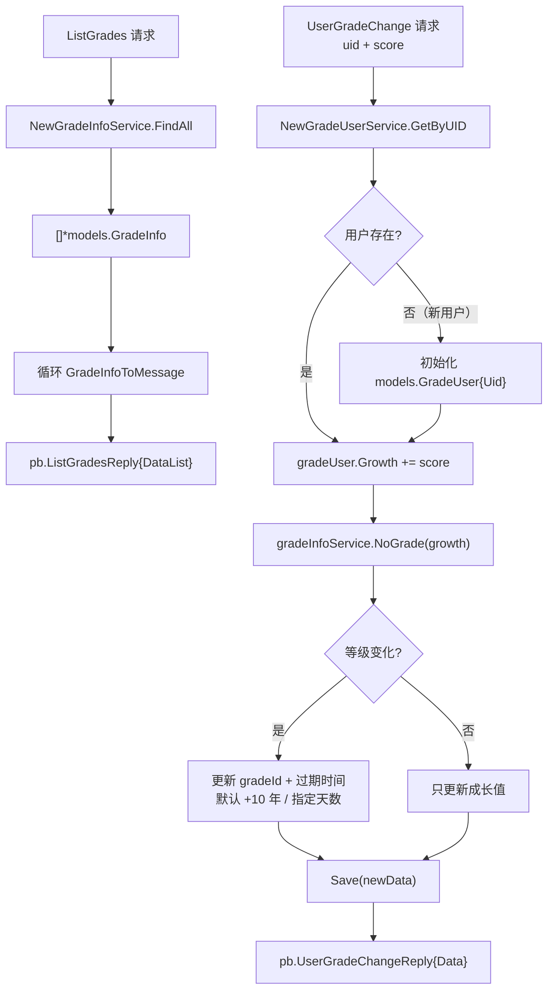

# Kubernetes 认证考点: grade 实现用户等级服务的应用层代码 —— 特权检查、成长值变更与等级跃迁

**接下来把用户等级服务的方法实现了，步骤以及方式跟前面（用户积分服务）是一样的。**

结论先给：**等级侧五个方法里，前四个是查询（`ListGrades`、`ListGradePrivileges`、`CheckUserPrivilege`、`GetUserGradeInfo`），套路和积分侧完全一致 —— 建服务、查数据、错误处理、`XxxToMessage` 转换、组装 reply 返回。真正复杂的是最后一个 `UserGradeChange`：它要操作两份数据（`grade_user` 和 `grade_info`），成长值更新后等级可能会变，等级变了还要顺带更新过期时间（默认永久加十年，指定了天数就加指定天数）。**

## 纲要

- 方法一：ListGrades 查询全部等级
- 方法二：ListGradePrivileges 的两种策略
- 方法三：CheckUserPrivilege 双条件匹配
- 方法四：GetUserGradeInfo 查指定用户
- 方法五：UserGradeChange 复杂度在哪
- 新用户的初始化
- 等级跃迁与过期时间
- 为什么要新建一个 newData 对象
- 参数与返回速查
- API 速览、Demo 示例与总结

## 方法一：ListGrades 查询全部等级

**先创建用户等级的服务 `service.NewGradeInfoService(ctx)`，把注释写上（获取所有的等级信息列表）。这个地方就是一个查询，返回这个 list 和错误信息；如果有错误直接抛出，没有错误就把数据返回回去。返回之前要做一个转换 —— 转换成消息的格式 `pb.GradeInfo`，长度一样，做循环 `range` 这个 list，给每一个 model 做转换 `models.GradeInfoToMessage`，转换完就可以输出 `pb.ListGradesReply`，最后 `return`。**



```text
ug_server/grade_server.go        用户等级服务的五个方法
├── ListGrades                   查全部等级 → 列表转换
├── ListGradePrivileges          查等级特权 → 两种策略（指定等级 / 全部）
├── CheckUserPrivilege           查用户特权 → 产品 + 功能 双条件匹配
├── GetUserGradeInfo             查指定用户等级 → 单条转换
└── UserGradeChange              调成长值 → 最复杂
    ├── 操作两份数据：grade_user（成长值）+ grade_info（等级门槛）
    ├── 新用户首次进来要初始化 models.GradeUser{Uid}
    ├── 成长值更新后重新判等级 NoGrade(growth)
    ├── 等级变化才更新 gradeId 和过期时间
    └── 用新对象 newData 承载要更新的字段
```

## 方法二：ListGradePrivileges 的两种策略

**获取等级的特权列表：先把参数拿出来 `gradeId`，创建服务 `service.NewGradePrivilegeService(ctx)`。这里有两个不一样的策略 —— `gradeId` 如果大于零，就是指定了某一个等级，就查这一个等级的特权列表（`FindByGrade`）；如果没有指定，那就去查全部（`FindAll`）。**

**查出来的数据需要在前面先做一个定义（`var list []*models.GradePrivilege`），错误也定义一下；返回回来的结果要判断错误处理；没有错误就做数据转换 —— `pb.GradePrivilege` 长度和 list 一样，也是做循环给每一个 model 做转换 `models.GradePrivilegeToMessage`，转换完就可以输出 `pb.ListGradePrivilegesReply`。**

```text
// 骨架示意
func (s *UGGradeServer) ListGradePrivileges(ctx context.Context, req *pb.ListGradePrivilegesRequest) (*pb.ListGradePrivilegesReply, error) {
    svc := service.NewGradePrivilegeService(ctx)
    var (
        list []*models.GradePrivilege
        err  error
    )
    if req.GradeId > 0 {                        // 策略一：指定了等级
        list, err = svc.FindByGrade(req.GradeId)
    } else {                                    // 策略二：查全部
        list, err = svc.FindAll()
    }
    if err != nil {
        return nil, err
    }
    dataList := make([]*pb.GradePrivilege, len(list))
    for i, v := range list {
        dataList[i] = models.GradePrivilegeToMessage(v)
    }
    return &pb.ListGradePrivilegesReply{DataList: dataList}, nil
}
```

## 方法三：CheckUserPrivilege 双条件匹配

**检查用户是否有某个产品的特权：有几个参数需要先拿出来转换一下 —— `uid`、`product`、`function`。创建相应的服务 `service.NewGradePrivilegeService`，除了这个还需要有一个用户服务（关于用户的信息）`service.NewGradeUserService`；`gradeUserService.GetByUID` 查询这个用户的信息得到 `gradeUser`，如果有报错还是一样直接抛出。**

**接下来还要用 `gradePrivilegeService` 去查一下这个等级的特权列表（`gradeUser.GradeId` —— 用户的等级会有哪一些特权）。要检查是否有权限：先定义一个是否有权限的变量，然后做循环处理，把用户的产品等级权限都循环一遍，看看 `product` 和 `function` 是否同时满足；如果同时满足那么就成功了，退出这个 for 循环，就可以输出 `pb.CheckUserPrivilegeReply{Data: isOk}`。**

```text
// 骨架示意
func (s *UGGradeServer) CheckUserPrivilege(ctx context.Context, req *pb.CheckUserPrivilegeRequest) (*pb.CheckUserPrivilegeReply, error) {
    uid, product, function := req.Uid, req.Product, req.Function

    gradeUserSvc := service.NewGradeUserService(ctx)
    gradeUser, err := gradeUserSvc.GetByUID(uid)
    if err != nil {
        return nil, err
    }
    privSvc := service.NewGradePrivilegeService(ctx)
    privList, err := privSvc.FindByGrade(gradeUser.GradeId)   // 该等级有哪些特权
    if err != nil {
        return nil, err
    }
    isOk := false
    for _, v := range privList {
        if v.Product == product && v.Function == function {   // 双条件同时满足
            isOk = true
            break                                             // 命中就退出
        }
    }
    return &pb.CheckUserPrivilegeReply{Data: isOk}, nil
}
```

## 方法四：GetUserGradeInfo 查指定用户

**查询指定用户的等级信息：会传一个 `uid` 进来，需要 `NewGradeUserService` 实例化一下，然后去查一下这个用户等级信息 `GetByUID`；报错的话还是要处理；没有报错就要转换一下 —— `GradeUserToMessage` 把 `gradeUser` 转成 pb 的消息，`pb.GetUserGradeInfoReply` 就可以返回了。**

## 方法五：UserGradeChange 复杂度在哪

**最后一个方法是 `UserGradeChange`，可以调整用户等级的成长值 —— 当用户参加了活动，就要给他相应的等级成长值。这个方法比前面的查询方法要复杂一些：调用参数 `uid`（转换一下数据类型）和一个等级的分数 `score`。**

**它要操作两个数据：一个是 `service.NewGradeUserService`，还有一个是等级的信息 `service.NewGradeInfoService`。**

```text
// 骨架示意
func (s *UGGradeServer) UserGradeChange(ctx context.Context, req *pb.UserGradeChangeRequest) (*pb.UserGradeChangeReply, error) {
    uid, score := req.Uid, req.Growth

    gradeUserSvc := service.NewGradeUserService(ctx)
    gradeInfoSvc := service.NewGradeInfoService(ctx)

    // ① 先查用户等级信息
    gradeUser, err := gradeUserSvc.GetByUID(uid)
    if err != nil {
        return nil, err
    }
    // ② 新用户：第一次进来等级信息是空的，需要初始化，只填充一个 uid
    if gradeUser == nil {
        gradeUser = &models.GradeUser{Uid: uid}
    }
    // ③ 成长值累加
    gradeUser.Growth += score

    // ④ 成长值更新了，等级也有可能变化 → 重新判等级
    newGrade, err := gradeInfoSvc.NoGrade(gradeUser.Growth)
    if err != nil {
        return nil, err
    }

    // ⑤ 新建一个对象承载要更新的字段
    newData := &models.GradeUser{
        Id:     gradeUser.Id,
        Uid:    gradeUser.Uid,
        Growth: gradeUser.Growth,
        // 时间默认会处理，不用管
    }

    // ⑥ 等级是否发生变化
    if gradeUser.GradeId != newGrade.Id {
        newData.GradeId = newGrade.Id          // 更新等级
        expireAt := time.Now().UTC()           // 过期时间也要更新
        if newGrade.Expire > 0 {               // 指定了天数
            expireAt = expireAt.AddDate(0, 0, int(newGrade.Expire))
        } else {                               // 默认永久：加十年
            expireAt = expireAt.AddDate(10, 0, 0)
        }
        newData.ExpireAt = &expireAt
    }

    // ⑦ 保存
    if err := gradeUserSvc.Save(newData); err != nil {
        return nil, err
    }
    // ⑧ 返回（转成 pb 消息）
    return &pb.UserGradeChangeReply{Data: models.GradeUserToMessage(newData)}, nil
}
```

## 新用户的初始化

**如果这个用户是个新用户，第一次进来这个用户等级信息是空的，需要给它做一下初始化 —— `models.GradeUser`，只需要填充一个 `uid`。那接下来要对它做一个成长值的更新：`gradeUser.Growth` 加上我们传过来的这个 `score` 成长值。**

## 等级跃迁与过期时间

**还要查一下用户当前的等级，因为用户的成长值已经更新了，那它的等级也有可能会发生变化 —— `gradeInfoService.NoGrade(gradeUser.Growth)` 看一下他新的等级是什么。**

**判断一下这个用户的等级是不是发生了变化：用户当前的等级如果不等于我们新的用户等级对应的等级，发生变化了就要做等级更新 —— `newData` 要去更新它的 `gradeId`；等级有变化，那这个过期时间也要更新（`expireAt`）：当前时间加上默认是永久的，就给它加上十年；如果不是默认的永久的、`expire` 大于零就是指定的天数，那就要给它加上指定的天数（24 小时 × 天数）。**

| 情况 | `expire` | 过期时间算法 |
| --- | --- | --- |
| **默认（永久）** | **`0`** | **当前时间 + 10 年** |
| **指定了天数** | **`> 0`** | **当前时间 + `expire` 天** |
| **等级没变** | **—** | **过期时间不动** |

## 为什么要新建一个 newData 对象

**做数据更新时要新建一个对象 `newData` —— 对这个用户信息做更新：用户的 ID、`gradeUser.Id` 这些不需要更新的就删掉；`gradeId` 有可能会更新，先保留；时间也有可能会更新，最后肯定是要更新的（不过下面这两个时间默认会处理，不用管它）。**

这样做的好处是**只写需要更新的字段，避免把旧对象里的脏数据（比如上一次读出来的 `updated_at`）又写回数据库。**

## 参数与返回速查

| 方法 | 入参 | 主要服务调用 | 返回 |
| --- | --- | --- | --- |
| **ListGrades** | **无** | **`gradeInfoService.FindAll()`** | **`ListGradesReply{DataList}`** |
| **ListGradePrivileges** | **`gradeId`（可选）** | **`FindByGrade` / `FindAll`** | **`ListGradePrivilegesReply{DataList}`** |
| **CheckUserPrivilege** | **`uid` + `product` + `function`** | **`GetByUID` + `FindByGrade`** | **`CheckUserPrivilegeReply{Data: bool}`** |
| **GetUserGradeInfo** | **`uid`** | **`gradeUserService.GetByUID`** | **`GetUserGradeInfoReply{Data}`** |
| **UserGradeChange** | **`uid` + `growth`** | **`GetByUID` + `NoGrade` + `Save`** | **`UserGradeChangeReply{Data}`** |

## API 速览

| 能力 | 做法 | 关键点 |
| --- | --- | --- |
| **建服务** | **`service.NewGradeInfoService(ctx)`** | **context 透传，方法内按需建多个** |
| **查全部等级** | **`FindAll()`** | **列表要新建 pb 数组逐个转** |
| **按等级查特权** | **`FindByGrade(gradeId)`** | **`gradeId > 0` 才走这条** |
| **查用户等级** | **`gradeUserService.GetByUID(uid)`** | **新用户返回 nil，要初始化** |
| **判等级** | **`gradeInfoService.NoGrade(growth)`** | **取满足门槛的最高等级** |
| **特权匹配** | **`product` 与 `function` 同时相等** | **命中就 `break`** |
| **更新用新对象** | **`newData := &models.GradeUser{...}`** | **只带要更新的字段** |
| **过期时间** | **`AddDate(10,0,0)` / `AddDate(0,0,expire)`** | **等级变了才更新** |
| **保存** | **`gradeUserSvc.Save(newData)`** | **有 ID 改、无 ID 插** |
| **返回** | **`GradeUserToMessage(newData)`** | **model → pb 必转** |

## Demo 示例

等级变更和特权检查这两段逻辑不依赖数据库也能验证 —— 下面用纯标准库把「成长值累加 → 重新判等级 → 等级跃迁才更新过期时间」和「产品 + 功能双条件匹配」跑出来：

```go
package main

import (
	"fmt"
	"time"
)

// ---------- models ----------

type GradeInfo struct {
	Id     int32
	Grade  string
	Growth int32  // 成长值门槛
	Expire int32  // 有效天数，0 = 永久
}

type GradePrivilege struct {
	GradeId  int32
	Product  string
	Function string
}

type GradeUser struct {
	Id       int32
	Uid      int32
	GradeId  int32
	Growth   int32
	ExpireAt *time.Time
}

// ---------- service 层 ----------

type GradeInfoService struct {
	grades []*GradeInfo
}

// NoGrade 按成长值判断等级：取满足门槛的最高等级
func (s *GradeInfoService) NoGrade(score int32) (*GradeInfo, error) {
	var hit *GradeInfo
	for _, g := range s.grades {
		if score >= g.Growth {
			if hit == nil || g.Growth > hit.Growth {
				hit = g
			}
		}
	}
	if hit == nil {
		return nil, fmt.Errorf("没有匹配的等级 score=%d", score)
	}
	return hit, nil
}

type GradePrivilegeService struct {
	privs []*GradePrivilege
}

func (s *GradePrivilegeService) FindByGrade(gradeId int32) ([]*GradePrivilege, error) {
	list := make([]*GradePrivilege, 0)
	for _, p := range s.privs {
		if p.GradeId == gradeId {
			list = append(list, p)
		}
	}
	return list, nil
}

// ---------- 应用层：CheckUserPrivilege ----------

func CheckUserPrivilege(privSvc *GradePrivilegeService, gradeUser *GradeUser, product, function string) bool {
	privList, _ := privSvc.FindByGrade(gradeUser.GradeId)
	for _, v := range privList {
		if v.Product == product && v.Function == function { // 双条件同时满足
			return true
		}
	}
	return false
}

// ---------- 应用层：UserGradeChange ----------

// ChangeGrade 返回更新后的用户等级信息
func ChangeGrade(infoSvc *GradeInfoService, gradeUser *GradeUser, score int32) (*GradeUser, error) {
	if gradeUser == nil { // 新用户：只填充 uid 这一层由调用方保证，这里兜底
		return nil, fmt.Errorf("用户对象不能为空")
	}
	gradeUser.Growth += score // ① 成长值累加

	newGrade, err := infoSvc.NoGrade(gradeUser.Growth) // ② 重新判等级
	if err != nil {
		return nil, err
	}

	newData := &GradeUser{ // ③ 新建对象，只带要更新的字段
		Id:     gradeUser.Id,
		Uid:    gradeUser.Uid,
		Growth: gradeUser.Growth,
	}

	if gradeUser.GradeId != newGrade.Id { // ④ 等级发生变化
		newData.GradeId = newGrade.Id
		expireAt := time.Now().UTC()
		if newGrade.Expire > 0 { // 指定了天数
			expireAt = expireAt.AddDate(0, 0, int(newGrade.Expire))
		} else { // 默认永久：加十年
			expireAt = expireAt.AddDate(10, 0, 0)
		}
		newData.ExpireAt = &expireAt
	}
	return newData, nil
}

func main() {
	infoSvc := &GradeInfoService{grades: []*GradeInfo{
		{Id: 1, Grade: "初级用户", Growth: 0, Expire: 0},
		{Id: 2, Grade: "中级用户", Growth: 10, Expire: 0},
		{Id: 3, Grade: "高级用户", Growth: 100, Expire: 365}, // 指定 365 天
	}}
	privSvc := &GradePrivilegeService{privs: []*GradePrivilege{
		{GradeId: 1, Product: "blog", Function: "read"},
		{GradeId: 2, Product: "blog", Function: "comment"},
		{GradeId: 3, Product: "blog", Function: "publish"},
	}}

	// 新用户：等级信息为空，初始化后只有 uid
	user := &GradeUser{Uid: 1001, GradeId: 1, Growth: 0}

	// 第一次加 5 分：还是初级，等级没变 → 过期时间不动
	u1, _ := ChangeGrade(infoSvc, user, 5)
	fmt.Printf("+5  → growth=%d gradeId=%d 过期时间=%v\n",
		u1.Growth, u1.GradeId, u1.ExpireAt)

	// 第二次加 8 分：累计 13 → 跃迁到中级，过期时间按默认 +10 年
	user.Growth = u1.Growth
	u2, _ := ChangeGrade(infoSvc, user, 8)
	fmt.Printf("+8  → growth=%d gradeId=%d 过期时间=%v\n",
		u2.Growth, u2.GradeId, u2.ExpireAt.Format("2006-01-02"))

	// 第三次加 100 分：累计 113 → 高级，expire=365 天
	user.Growth = u2.Growth
	u3, _ := ChangeGrade(infoSvc, user, 100)
	fmt.Printf("+100→ growth=%d gradeId=%d 过期时间=%v\n",
		u3.Growth, u3.GradeId, u3.ExpireAt.Format("2006-01-02"))

	// 特权检查：产品 + 功能双条件
	user.GradeId = u3.GradeId
	fmt.Println("blog/publish 有权限:", CheckUserPrivilege(privSvc, user, "blog", "publish"))
	fmt.Println("blog/read    有权限:", CheckUserPrivilege(privSvc, user, "blog", "read"))
}
```

## 总结

1. **等级侧套路和积分侧一样**：**先创建用户等级的服务 `service.NewGradeInfoService`，把注释写上（获取所有的等级信息列表）；查询返回 list 和错误信息，有错误直接抛出，没有错误做转换（循环 `range` 给每一个 model 做 `GradeInfoToMessage`），转换完输出 `pb.ListGradesReply`**；
2. **特权列表有两条策略**：**`gradeId` 大于零就是指定了某一个等级，查这一个等级的特权列表（`FindByGrade`）；没有指定就查全部（`FindAll`）；查出来的数据要在前面先定义好 list 和 err，错误判断之后做转换输出 `pb.ListGradePrivilegesReply`**；
3. **特权检查是双条件匹配**：**参数有 `uid`、`product`、`function`；除了特权服务还需要用户服务 `NewGradeUserService` —— 先 `GetByUID` 查用户信息（有报错直接抛出），再用 `gradeUser.GradeId` 查这个等级有哪些特权；循环时看 `product` 和 `function` 是否同时满足，同时满足就成功并退出循环，返回 `pb.CheckUserPrivilegeReply{Data: isOk}`**；
4. **查指定用户等级**：**传 `uid` 进来，`NewGradeUserService` 实例化后 `GetByUID` 查询，报错要处理，没有报错就 `GradeUserToMessage` 转换成 pb 消息，返回 `pb.GetUserGradeInfoReply`**；
5. **`UserGradeChange` 最复杂**：**当用户参加活动要给相应的等级成长值；它要操作两个数据 —— `gradeUserService` 和 `gradeInfoService`，比前面的查询方法复杂一些**；
6. **新用户要初始化**：**如果用户是新用户，第一次进来用户等级信息是空的，需要做一下初始化 —— `models.GradeUser` 只需要填充一个 `uid`，然后再做成长值的更新（`gradeUser.Growth` 加上 `score`）**；
7. **成长值变了要重判等级**：**用户的成长值更新了，等级也有可能会发生变化 —— 用 `gradeInfoService.NoGrade(growth)` 看他新的等级是什么，有报错返回错误信息**；
8. **更新用新对象 newData**：**新建一个对象承载要更新的字段 —— 不需要更新的（如用户 ID）就删掉，`gradeId` 有可能会更新先保留，时间最后肯定要更新但默认会处理不用管；这样能避免把旧对象里的脏数据写回数据库**；
9. **等级跃迁才更新过期时间**：**当前等级不等于新等级时，更新 `gradeId`；等级有变化过期时间也要更新 —— 当前时间加上默认是永久的（加十年），如果不是默认永久、`expire` 大于零就是指定的天数，那就加上指定的天数（24 小时 × 天数）**；
10. **保存后转消息返回**：**要更新的数据都准备好之后保存下来（`Save(newData)`），有报错返回错误；最后返回 `pb.UserGradeChangeReply`，数据是把 `newData` 做 `GradeUserToMessage` 转换得到的**；
11. **应用层代码到此写完**：**现在用户等级系统和用户积分系统这两个系统的服务方法、参数的处理、数据的转换以及返回都已经实现了，整个 gRPC 服务的应用层代码也已经写完；接下来会做一个完整的测试 —— 编写 gRPC 客户端程序来调用这些服务端的方法，看看程序的返回和日志是不是跟想象的一样。**

