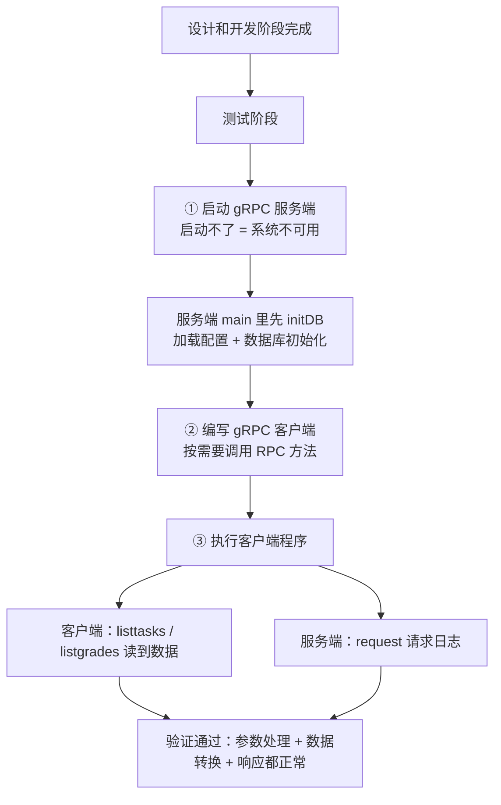

# Kubernetes 认证考点: 验证用户积分等级系统的效果 —— 服务端启动、客户端调用与数据库初始化

**前面已经把用户积分和等级系统的应用层代码也都完成了，意味着项目设计和开发阶段完成了，接下来就是测试阶段。**

结论先给：**第一个测试人员当然是自己 —— 作为技术开发是系统质量保证的第一人。验证分三步：① 把 gRPC 服务端程序启动起来（如果启动都有问题，说明系统根本不可用，这是最基本的一步测试）；② 编写 gRPC 客户端程序，根据测试的需要调用相关的 RPC 方法（要覆盖得更广就要调用更多的 RPC 方法）；③ 执行客户端程序验证最终效果。** 这次要补的一个关键点：**服务端现在需要连接数据库了，直接启动是没有数据库连接的，所以要做数据库的初始化工作 —— 引入 mysql 驱动、把单元测试里那个 `initDB` 方法在 `main_server` 里再写一次，并在 `main` 方法执行时把它调进来。**

## 纲要

- 开发阶段结束，进入测试阶段
- 第一道测试：服务端能否启动
- 服务端需要数据库初始化
- 引入 mysql 驱动包
- initDB 在 main_server 里再写一次
- 把初始化挂进 main 方法
- 启动服务端与客户端
- 看两端的输出：客户端拿到数据、服务端有请求日志
- 验证结论与后续扩展
- API 速览、Demo 示例与总结

## 开发阶段结束，进入测试阶段

**第一个测试人员当然是咱们自己 —— 作为技术开发是系统质量保证的第一人，也就是第一个测试人员。**



```text
验证一次要动的地方
├── main_server/main.go                ★ 加 initDB 调用
│   ├── import _ "github.com/go-sql-driver/mysql"   数据库驱动
│   ├── initDB()                       时区 UTC + LoadConfig + dbhelper.InitDB()
│   └── main()                         第一行调 initDB()，再 listen / register / serve
├── main_client/main.go               调用更多 RPC 方法扩大覆盖
│   ├── coinClient.ListTasks           读积分任务列表
│   └── gradeClient.ListGrades         读等级列表
└── 观察点
    ├── 客户端输出：有没有读到数据
    └── 服务端输出：有没有 request 请求日志
```

## 第一道测试：服务端能否启动

**首先把 gRPC 服务端程序启动起来。如果启动都有问题，说明系统根本不可用，这是最基本的一步测试。**

## 服务端需要数据库初始化

**回到 `main_server` 这个文件，服务端程序现在启动起来还是缺一点东西的 —— 因为现在需要连接数据库，我们直接启动起来是没有那些数据库连接的，所以我们需要做数据库的初始化工作。**

| 缺失项 | 现象 | 补法 |
| --- | --- | --- |
| **mysql 驱动** | **建不了连接** | **`import _ "github.com/go-sql-driver/mysql"`** |
| **配置未加载** | **读不到地址/账号** | **`conf.LoadConfig()`** |
| **DB 未初始化** | **`dbEngine == nil`** | **`dbhelper.InitDB()`** |
| **时区不统一** | **时间对不上** | **`time.Local = time.UTC`** |

## 引入 mysql 驱动包

**需要 `github.com/go-sql-driver/mysql`，需要有数据库驱动程序。**

## initDB 在 main_server 里再写一次

**然后在这个地方把 service 里面单元测试的那个 `initDB` 方法，在这里再写一次 —— 时区 UTC、`LoadConfig` 加载相应的配置信息、`dbhelper.InitDB()`。关于数据库的配置、初始化都做完了。**

```text
// 骨架示意：main_server/main.go
import (
    "log"
    "net"
    "time"

    _ "github.com/go-sql-driver/mysql"   // 数据库驱动（匿名导入，只注册）
    "google.golang.org/grpc"
    "usergrowth/conf"
    "usergrowth/dbhelper"
    "usergrowth/pb"
    "usergrowth/ug_server"
)

func initDB() {
    time.Local = time.UTC                 // ① 时区统一
    if err := conf.LoadConfig(); err != nil {   // ② 加载配置（环境变量/ConfigMap）
        log.Fatalf("加载配置失败: %v", err)
    }
    if err := dbhelper.InitDB(); err != nil {   // ③ 初始化数据库连接
        log.Fatalf("数据库初始化失败: %v", err)
    }
}
```

## 把初始化挂进 main 方法

**在 main 方法执行的时候，把这个初始化方法在这里加进来。现在再启动就可以连到数据库了。**

```text
func main() {
    initDB()                                   // ★ 加进来，否则后面全是空连接

    listen, err := net.Listen("tcp", ":80")
    if err != nil {
        log.Fatalf("监听端口失败: %v", err)
    }
    s := grpc.NewServer()
    pb.RegisterUserCoinServer(s, &ug_server.UGCoinServer{})
    pb.RegisterUserGradeServer(s, &ug_server.UGGradeServer{})
    log.Println("服务启动，监听 :80")
    if err := s.Serve(listen); err != nil {
        log.Fatalf("服务启动失败: %v", err)
    }
}
```

## 启动服务端与客户端

**服务启动好了之后，再到客户端这里运行一下客户端的 main 方法 —— 能看到一些返回信息：`listtasks` 读到了数据，还有 `listgrades` 也读到了数据。**

```bash
# 终端一：服务端
export usergrowth_config='{"db":{"type":"mysql","user_name":"root","password":"123456",
  "host":"127.0.0.1","port":3306,"database":"usergrowth","charset":"utf8mb4",
  "show_sql":true,"max_idle_conns":10,"max_open_conns":100,"conn_max_life":60}}'
go run ./main_server
# 输出：服务启动，监听 :80

# 终端二：客户端
go run ./main_client
# 输出：listtasks → 读到 N 条积分任务
# 输出：listgrades → 读到 N 条等级
```

## 看两端的输出

**再来看一下服务端这边有没有日志 —— 服务端这边有请求，请求日志 `request` 的消息都已经看到了。所以客户端的调用请求都已经正常返回了；之前做单元测试时候写了的数据，再次执行应该返回的是一样的。**

| 观察位置 | 期望现象 | 说明 |
| --- | --- | --- |
| **客户端 stdout** | **`listtasks` 有数据** | **积分任务读到了** |
| **客户端 stdout** | **`listgrades` 有数据** | **等级读到了** |
| **服务端 stdout** | **`request` 请求日志** | **请求确实打到服务端了** |
| **两端对比** | **数据与单元测试时一致** | **同一份数据，重复执行结果稳定** |

## 验证结论

**这个过程就验证了 gRPC 服务是能够正常地从数据库里读到数据的，并且它的参数处理、数据的响应、转换处理都是成功的，没有报错。**

## API 速览

| 能力 | 做法 | 关键点 |
| --- | --- | --- |
| **注册驱动** | **`import _ "github.com/go-sql-driver/mysql"`** | **匿名导入，只注册不调用** |
| **加载配置** | **`conf.LoadConfig()`** | **环境变量 / ConfigMap 二选一** |
| **建连接** | **`dbhelper.InitDB()`** | **main 里只调一次** |
| **时区** | **`time.Local = time.UTC`** | **数据库也要设 UTC** |
| **启动顺序** | **`initDB()` → `Listen` → `NewServer` → `Register` → `Serve`** | **顺序不能反** |
| **扩大覆盖** | **客户端多调几个 RPC 方法** | **调用越多覆盖越广** |
| **看日志** | **服务端 `request` 日志 + 客户端返回** | **两端都要看** |

## Demo 示例

「少了 initDB 就跑不起来」这件事，用纯标准库就能完整演示一遍 —— 下面这段代码把启动顺序和失败分支都跑出来：

```go
package main

import (
	"errors"
	"fmt"
	"log"
	"net"
	"os"
	"time"
)

// ---------- 模拟 conf / dbhelper ----------

var configLoaded bool
var dbEngine string

func LoadConfig() error {
	v := os.Getenv("usergrowth_config")
	if v == "" {
		return errors.New("环境变量 usergrowth_config 未设置")
	}
	configLoaded = true
	return nil
}

func InitDB() error {
	if !configLoaded {
		return errors.New("配置未加载，无法建立连接")
	}
	dbEngine = "mysql@127.0.0.1:3306/usergrowth"
	return nil
}

func GetDB() string { return dbEngine }

// ---------- initDB：main 里的第一步 ----------

func initDB() error {
	time.Local = time.UTC // ① 时区统一
	if err := LoadConfig(); err != nil {
		return fmt.Errorf("加载配置失败: %w", err)
	}
	if err := InitDB(); err != nil {
		return fmt.Errorf("数据库初始化失败: %w", err)
	}
	return nil
}

// ---------- 服务端启动 ----------

type Server struct {
	services []string
}

func (s *Server) Register(name string) { s.services = append(s.services, name) }

// Serve 只有数据库就绪才允许启动：缺 initDB 就是「系统根本不可用」
func (s *Server) Serve(l net.Listener) error {
	if GetDB() == "" {
		return errors.New("数据库未初始化，拒绝启动")
	}
	fmt.Println("服务启动，监听", l.Addr().String())
	for _, name := range s.services {
		fmt.Println("  已注册服务:", name)
	}
	return nil
}

// ---------- 客户端调用 ----------

func callListTasks() (string, error) {
	if GetDB() == "" {
		return "", errors.New("服务端不可用")
	}
	return "[{id:1 task_name:postarticle coin:10}]", nil
}

func callListGrades() (string, error) {
	if GetDB() == "" {
		return "", errors.New("服务端不可用")
	}
	return "[{id:1 初级用户} {id:2 中级用户}]", nil
}

func main() {
	// ① 没配置、没 initDB → 启动就失败
	if err := initDB(); err != nil {
		log.Println("第一次启动:", err)
	}
	s := &Server{}
	s.Register("pb.UserCoin")
	s.Register("pb.UserGrade")
	listen, _ := net.Listen("tcp", ":8080")
	defer listen.Close()
	if err := s.Serve(listen); err != nil {
		log.Println("启动失败:", err)
	}

	// ② 补上配置 + initDB → 启动成功
	os.Setenv("usergrowth_config", `{"db":{"type":"mysql","host":"127.0.0.1","port":3306}}`)
	if err := initDB(); err != nil {
		log.Fatal(err)
	}
	if err := s.Serve(listen); err != nil {
		log.Fatal(err)
	}

	// ③ 客户端调用：两个方法都读到数据
	tasks, err := callListTasks()
	fmt.Println("listtasks →", tasks, "err:", err)
	grades, err := callListGrades()
	fmt.Println("listgrades →", grades, "err:", err)
}
```

## 总结

1. **开发阶段结束，测试阶段开始**：**前面已经把用户积分和等级系统的应用层代码也都完成了，意味着项目设计和开发阶段完成了；是不是设计和开发 gRPC 服务也挺简单的 —— 接下来就是测试阶段了**；
2. **开发是第一个测试人员**：**第一个测试人员当然是自己，作为技术开发是系统质量保证的第一人**；
3. **第一道测试是服务端能不能启动**：**首先把 gRPC 服务端程序启动起来；如果启动都有问题，说明系统根本不可用，这是最基本的一步测试**；
4. **服务端要补数据库初始化**：**直接启动起来还是缺一点东西 —— 现在需要连接数据库，直接启动是没有那些数据库连接的，所以需要做数据库的初始化工作**；
5. **引入 mysql 驱动**：**需要 `github.com/go-sql-driver/mysql`，需要有数据库驱动程序**；
6. **`initDB` 在 main_server 里再写一次**：**把 service 里面单元测试的那个 `initDB` 方法在这里再写一次 —— 时区 UTC、`LoadConfig` 加载相应的配置信息、`dbhelper.InitDB()`；关于数据库的配置和初始化都做完了**；
7. **挂进 main 方法**：**在 main 方法执行的时候把这个初始化方法加进来；现在再启动就可以连到数据库了**；
8. **客户端按需调用更多方法**：**还需要再编写 gRPC 客户端程序，根据测试的需要来调用相关的 RPC 方法；如果要测试覆盖得更广，就要调用更多的 RPC 方法；客户端程序代码写完了，就可以执行客户端程序验证最终的效果了**；
9. **两端都要看输出**：**客户端这边能看到 `listtasks` 读到了数据、`listgrades` 也读到了数据；服务端这边有请求，`request` 请求日志的消息都已经看到了，说明客户端的调用请求都已经正常返回了**；
10. **结果与单元测试一致**：**之前做单元测试时候写了的数据，再次执行应该返回的是一样的**；
11. **验证结论**：**这个过程验证了 gRPC 服务能够正常地从数据库里读到数据，并且它的参数处理、数据的响应、转换处理都是成功的，没有报错**；
12. **后面还会扩展**：**关于用户积分和等级系统的验证、这个服务的测试就全部完成了；后面的章节还会对这个服务做一些扩展处理。**

