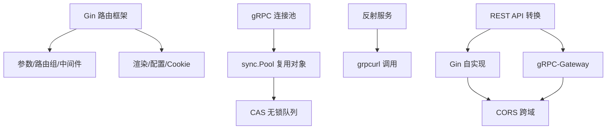

# Gin 框架、gRPC 连接池与 REST API 转换：本章小结

为了给 gRPC 服务开发 REST API，咱们会用到 Gin 路由框架。所以一开始先介绍了 Gin 路由框架的使用，重点是**路由参数、路由组、中间件、渲染、自定义配置以及 Cookie** 这些内容。当然 Gin 还有很多东西，想深入可以上官网看更多示例，甚至把源码下载下来研究内部实现。

## 纲要

- Gin 路由框架：路由参数 / 路由组 / 中间件 / 渲染 / 自定义配置 / Cookie
- gRPC 连接池：基于 `sync.Pool` 复用连接（与对象）提升性能
- `sync.Pool` 的边界：创建开销极大的对象不适合用它做缓存池
- 无锁队列：CAS（比较并交换）原子指令避免互斥锁阻塞
- 反射 + grpcurl：一行注册反射，用 grpcurl 像 curl 一样调服务
- REST API 两种方案：Gin 自实现转发 vs gRPC-Gateway 代理；以及 CORS 跨域

## 本章小节结构

```text
KCNA 第8章 Gin、gRPC 连接池与 REST API 转换
├── 8-1 本章导学
├── 8-2 Gin 路由框架使用
├── 8-3 使用 gRPC 连接池复用连接
├── 8-4 用反射简化 gRPC 的调用
├── 8-5 gRPC 服务转 RestfulAPI 之 gin 框架
├── 8-6 gRPC 服务转 RestfulAPI 之 grpc-gateway
├── 8-7 增加 CORS 跨域支持
├── 8-8 讨论为什么不用 python 实现 restfulAPI
└── 8-11 本章小结
```
## Gin 路由框架

本章开头先把 Gin 框架的基础能力过了一遍：**路由参数**（如 `/user/:id`）、**路由组**（对一组路由统一加前缀或中间件）、**中间件**（鉴权、日志、恢复等横切逻辑）、**渲染**（JSON / HTML 等）、**自定义配置**以及 **Cookie** 处理。这些是 Web 开发的基本功，官网有更多示例，想进一步研究建议直接读源码。

## gRPC 连接池与对象复用

接着讲解并实现了 **gRPC 连接池**，其底层用 Go 标准库的 `sync.Pool` 来管理连接对象。它的价值不只是做连接池，也可以做更通用的**对象缓存池**——核心目的都是**减少对象的反复创建与销毁，复用已存在的对象来提高系统性能**。

```go
// 用 sync.Pool 缓存 gRPC 连接/对象（示意，参数以实际为准）
var connPool = sync.Pool{
    New: func() interface{} {
        c, _ := grpc.Dial(addr, grpc.WithInsecure())
        return c
    },
}
c := connPool.Get().(*grpc.ClientConn)
defer connPool.Put(c)
```

> `sync.Pool` 使用非常简单，但它**没法自己控制容量和回收时机**，全部被内部封装了复杂度。因此，对于**创建开销非常大**的对象，不建议用 `sync.Pool` 做缓存池。

## 无锁队列与 CAS

本章还讲了 `sync.Pool` 内部的**无锁队列**，使用了 **CAS（Compare-And-Swap，比较并交换）** 这种原子指令，可以避免互斥锁（mutex）的开销以及对程序的阻塞。理解这一点，有助于你在其他高并发场景里选择正确的同步原语。

## 反射服务与 grpcurl

为了让 gRPC 服务更容易调用，咱们引入了**反射服务**。加入这个反射能力非常简单——**只需要一行代码**就能搞定。接着还要安装 `grpcurl` 工具来调用 gRPC 服务：`grpcurl` 调用 gRPC 服务和用 `curl` 调用 HTTP 服务非常像，同样很简单。只需把服务 IP、端口、服务名、方法名传进去即可：

- 用 `list` 指令查看服务方法的列表；
- 用 `describe` 指令查看定义的源码；
- 也可以直接调用 gRPC 服务。

掌握了 `grpcurl`，对日常开发与测试工作帮助很大。

## REST API 两种方案对比

本章的重点，是把 gRPC 服务方法转为 REST API，实现了**两种方案**：

| 方案 | 实现方式 | 特点 |
| --- | --- | --- |
| **Gin 自实现** | 用 Gin 路由定义并转发到 gRPC | 开发/维护工作量稍大，但可控性强 |
| **gRPC-Gateway** | 引入 gRPC-Gateway 做服务代理 | 更简单，但自定义与可控性偏弱 |

两种方案实现差异很大、各有特点，能都掌握就多一种选择。**gRPC-Gateway 更省事**，但自定义程度低；**Gin 方案**开发维护量更大，但灵活。最后为了实现 API 在浏览器中支持跨域请求，咱们都实现了 **CORS 处理**，把 CORS 需要的几个 header 在两种方案里都正确返回——虽然处理方式不同，但目的和结果一致：都能实现自定义域名的跨域调用。



## 总结

本章把"让 gRPC 服务更易用"的实战收口了：

1. **Gin 基本功**：路由参数、路由组、中间件、渲染、自定义配置、Cookie；
2. **连接池提效**：基于 `sync.Pool` 复用 gRPC 连接/对象，减少创建销毁开销；
3. **`sync.Pool` 有边界**：创建开销极大的对象不适合用它缓存；
4. **CAS 无锁**：`sync.Pool` 内部用比较并交换原子指令避免锁阻塞；
5. **反射 + grpcurl**：一行注册反射，`list`/`describe`/调用三板斧；
6. **两种 REST 方案 + CORS**：Gin 可控 vs Gateway 省事，跨域 header 两方案都必备。
