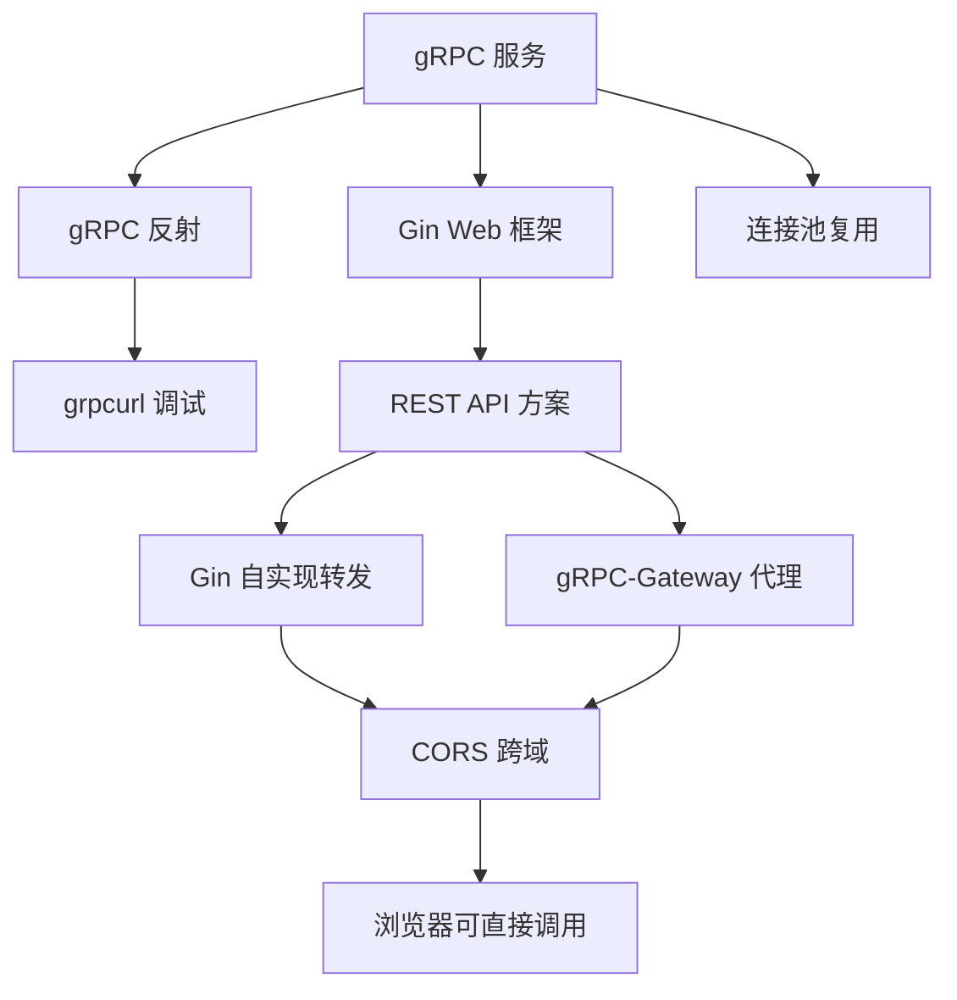

# 为 gRPC 服务增加 REST API：本章导学

上一章咱们把用户积分等级系统的 gRPC 服务实现完了。但测试 gRPC 服务，得用 gRPC 客户端才能调用；一旦遇到问题要排查，比 HTTP 接口麻烦不少。所以这一章咱们再进一步：把 gRPC 服务**转成 REST API**，这样就能直接在浏览器里调用了。

## 纲要

- 动机：gRPC 调用门槛高，转 REST 便于浏览器调试与接入
- Web 框架：以 Gin 为例，掌握一个框架即可迁移其他（Echo、Iris 等）
- gRPC 连接池：复用长连接替代短连接，提升性能，思路可复用到缓存
- 反射机制：注册 gRPC 反射服务，用 `grpcurl` 像 `curl` 一样调服务
- 重点：gRPC → REST API 的两种方案（Gin 自实现 / gRPC-Gateway）
- CORS 跨域：微服务化后浏览器跨域常见，两种方案中均需实现

## 为什么要把 gRPC 转成 REST

gRPC 性能好、契约严，但调用方必须持有 gRPC 客户端，排查问题时也比 HTTP 接口费劲。把服务暴露成 REST API 后，就能直接在浏览器里用 HTTP 请求，调试和第三方接入都轻松很多。

课程使用的 Web 框架是 **Gin**。这里会简单介绍 Gin 路由框架的使用——讲师也用过 Iris、Echo 等其他 Go Web 框架，其实**大同小异**：只要掌握一个框架、知道它能做什么、怎么用，换别的框架都非常容易。

## gRPC 连接池

咱们的 gRPC 客户端如果每次请求都新建连接、用完立刻关闭（类似 HTTP 短连接 `AGDP` 那种），效率肯定低很多。**使用连接池可以复用已存在的 gRPC 连接，提升程序执行性能**。而且这个"连接池"的实现思路，同样能用在其它需要缓存、需要提高资源利用率的地方。

## gRPC 反射与 grpcurl

接着讲 **gRPC 的反射机制**：通过注册 gRPC 的反射服务，我们可以用 **`grpcurl`** 工具快速查看 gRPC 服务的情况，也能像用 `curl` 命令行一样用 `grpcurl` 来调用 gRPC 服务。对开发与测试非常有帮助。

```bash
# 启用反射后，用 grpcurl 列服务、查定义、发请求（示意）
grpcurl -plaintext localhost:8080 list
grpcurl -plaintext localhost:8080 describe user.UserService
grpcurl -plaintext -d '{"userId":1}' localhost:8080 user.UserService/GetLevel
```

## 重点：gRPC 转 REST 的两种方案

本章的重头戏，是把 gRPC 服务方法转为 REST API，提供两种方式：

| 方案 | 实现方式 | 优点 | 缺点 |
| --- | --- | --- | --- |
| **Gin 自实现** | 用 Gin 路由定义并转发到 gRPC | 可控性强、易定制 | 开发/维护工作量稍大 |
| **gRPC-Gateway** | 引入 gRPC-Gateway 工具自动代理 | 几乎零开发量，全方法自动转 | 自定义与控制性偏弱 |

gRPC-Gateway 不需要多少开发量，就能把全部服务方法转换为 HTTP 方式调用。两种方案差异很大、各有特点，建议大家都能掌握，以后就多一种选择。

## CORS 跨域

最后还会介绍 **CORS（跨域资源共享）** 的实现。在浏览器里访问时，微服务化之后跨域问题很常见。CORS 的 header 需要在两种方案里都正确返回——虽然 Gin 自实现与 gRPC-Gateway 的处理方式差异很大，但**目的和结果一致**：都能实现自定义域名的跨域调用。

```dir
本章内容结构
├── Gin 路由框架
│   ├── 路由参数 / 路由组
│   ├── 中间件 / 渲染
│   └── 配置 / Cookie
├── gRPC 连接池
│   └── sync.Pool 复用长连接
├── 反射 + grpcurl
└── REST API 两种方案
    ├── Gin 自实现转发
    └── gRPC-Gateway 代理
        └── CORS 跨域
```



## 总结

本章导学把"让 gRPC 服务更好用"的路线规划好了：

1. **动机清晰**：gRPC 调用/排查门槛高，转 REST 便于浏览器调试；
2. **框架通用**：以 Gin 为例，掌握一个 Web 框架即可迁移其它；
3. **连接池提效**：复用 gRPC 长连接，思路可复用到缓存场景；
4. **反射 + grpcurl**：一行注册反射，用 grpcurl 像 curl 一样调服务；
5. **两种 REST 方案**：Gin 自实现（可控）vs gRPC-Gateway（省事）；
6. **CORS 收尾**：跨域 header 在两种方案都需正确返回，实现浏览器可调用。
