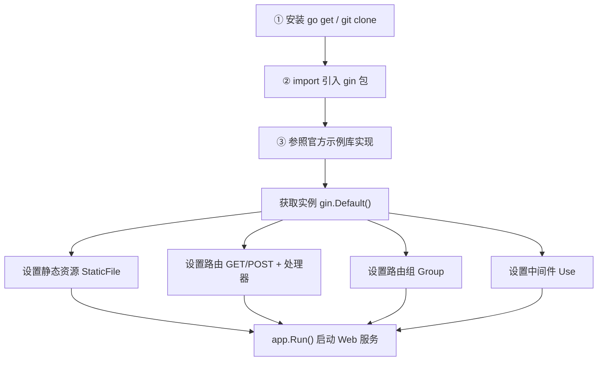

# Kubernetes 认证考点: gin 路由框架使用 —— 路由参数、路由组、中间件、渲染与自定义 HTTP Server

**要学习一个新的 Web 框架，或者一个新的库，还是建议首先去它的官网，那里有最新和最完整的介绍。**

结论先给：**使用 gin 框架分三步走 —— ① 学会安装（`go get` 把库下载到本地，想看源码就 `git clone`）；② 项目中使用（在 main 文件最开头的 import 中把 gin 包引入）；③ 具体的实现参考官方的示例库（里面有三十多个例子，总有一个适合你）。** 最常用的几块能力是：**路由参数（`:name` 必选、`*action` 可选）、路由组（`Group` 统一加前缀）、中间件（`Use`，处理器和普通处理器一样只有一个 `*gin.Context` 参数没有返回值）、渲染（`c.JSON` / `c.XML` / `c.YAML` / `c.ProtoBuf` / HTML 模板）以及自定义 `http.Server` 配置。**

## 纲要

- 学习一个新框架的三步走
- 最小可用示例：Default、StaticFile、GET、Run
- 路由参数：必选参数与可选参数
- 路由组与源码里的两个接口
- 中间件：定义、顺序与作用域
- 渲染：JSON / XML / YAML / ProtoBuf / HTML
- 自定义 HTTP Server 配置
- Cookie 的设置与读取
- 常用方法速查表
- API 速览、Demo 示例与总结

## 学习一个新框架的三步走

**第一步，学会安装 —— 这里直接使用 `go get`，把 gin 框架的库下载到本地。如果对源码有兴趣，还是建议使用 `git clone` 把源码下载到本地，这样可以时不时去看看源码中的一些具体实现方法。第二步，在项目中使用 —— 在 main 文件的最开头 import 中，把 gin 包引入就可以使用了。第三步，项目中具体的使用和实现，参考官方的示例库，里面有三十多个例子。**



```text
一个最小 gin 项目的结构
├── main.go                    import "github.com/gin-gonic/gin"
│   ├── r := gin.Default()              获取路由实例（New + 日志/恢复中间件）
│   ├── r.StaticFile("/favicon.ico", ...) 静态资源
│   ├── r.GET("/ping", handler)         路由 + 处理器
│   ├── v1 := r.Group("/v1")            路由组，统一前缀
│   │   ├── v1.Use(middleware)          组级中间件（组内全部路由生效）
│   │   └── v1.POST("/user", handler)   → /v1/user
│   ├── r.Use(middleware)               全局中间件
│   └── r.Run(":8080")                  启动（可换成 http.Server）
└── templates/                 HTML 模板目录（LoadHTMLGlob 加载）
```

## 最小可用示例

**首先是 import gin 库（注意这里引入新的库，记得执行 `go mod tidy` 命令来更新项目中的 Go 依赖包）。然后在 main 方法中获取一个 gin 路由的实例，这里使用的是 `gin.Default()`，也可以使用 `gin.New()` 新建一个 —— `Default` 方法返回的实例只是多了请求日志和错误日志的处理，没有太多的差异。中间的代码如 `app.StaticFile` 是设置静态资源文件（像这里的 ico 文件），然后 `app.GET` 设置了一个 GET 方法的接口 `/ping`，这个接口只是返回一个字符串，实际的处理逻辑需要自己来实现。路由和处理器都处理好之后，就可以使用 `app.Run` 把 Web 服务启动起来了。**

```text
// 骨架示意：main.go
package main

import "github.com/gin-gonic/gin"

func main() {
    app := gin.Default()                                  // gin.New() 也行，Default 多了日志
    app.StaticFile("/favicon.ico", "./static/favicon.ico") // 静态资源文件
    app.GET("/ping", func(c *gin.Context) {                // GET 接口
        c.String(200, "pong")                              // 返回字符串
    })
    app.Run(":8080")                                       // 启动 Web 服务
}
```

## 路由参数：必选参数与可选参数

**先来看看怎么设置路由参数，也就是 URL 路径中设置参数，而不是在 query 或者 body 中设置参数。第一个 `router.GET` 的路径中使用了冒号 `:name`，定义了一个 `name` 参数 —— 这个参数必须存在，才可以匹配到这个路由处理器。第二个 `router.GET` 中使用了冒号 `:name`（和上面是一样的），它里面还有一个使用了星号 `*action` 的参数 —— 说明 `action` 这个参数是可选的，路由匹配的时候可以存在，也可以不存在。**

**参数设置了，路由参数在处理器中就可以使用 `c.Param` 方法来读取 —— `name` 和 `action` 参数都是一样的读取方式。只是 `name` 是可选参数（指 `action`），所以读取到的值可能是空字符串。**

| 写法 | 含义 | 匹配示例 | 不匹配 |
| --- | --- | --- | --- |
| **`/user/:name`** | **`name` 必选** | **`/user/tom`** | **`/user`** |
| **`/user/:name/*action`** | **`name` 必选、`action` 可选** | **`/user/tom` 或 `/user/tom/edit`** | **`/user`** |
| **`/ping`** | **无参数** | **`/ping`** | **`/ping/x`** |

```text
// 骨架示意
router.GET("/user/:name", func(c *gin.Context) {
    name := c.Param("name")          // 必选参数，一定有值
    c.String(200, "hello "+name)
})

router.GET("/user/:name/*action", func(c *gin.Context) {
    name := c.Param("name")          // 必选
    action := c.Param("action")      // 可选，可能是空字符串
    c.String(200, name+" do "+action)
})
```

## 路由组与源码里的两个接口

**`router.Group` 方法定义了 `v1` 这个路由组，接着使用 `v1.POST` 定义的路径就都会有 `v1` 这个路由前缀了。**

**gin 框架的源码里面定义了 `IRouter` 和 `IRoutes` 两个接口，其中 `IRoutes` 接口继承了 `IRouter` 接口，而且里面增加了一个 `Group` 方法 —— 这就是路由组 `router.Group` 调用的方法。所有的方法对应着 HTTP 的几种方法（`GET`、`POST`、`PUT`、`DELETE` 等），也可以设置单独的中间件和处理器等；下面的 `Static` 系列方法可以设置 Web 站点的静态文件目录等。**

```text
// 骨架示意
v1 := router.Group("/v1")          // 路由组：统一前缀
{
    v1.POST("/login", loginHandler)   // → /v1/login
    v1.POST("/submit", submitHandler) // → /v1/submit
}

v2 := router.Group("/v2")
v2.Use(authMiddleware)             // 中间件设在组上 → 组内全部路由都经过
{
    v2.GET("/user", userHandler)      // → /v2/user，且经过 authMiddleware
}
```

## 中间件：定义、顺序与作用域

**在路由上使用 `Use` 方法可以设置这个路由的中间件。中间件的处理器和路由的普通处理器是一样的定义 —— 都是只有一个 `*gin.Context` 的参数，没有返回值。在一个路由上可以设置多个处理器，同理也可以设置多个中间件。如果中间件有先后顺序的依赖关系，那么在路由上加入中间件的时候也需要保持顺序。如果一个中间件设置在路由组上，那么在这个路由组下面的全部路由都会经过这个中间件的处理器。**

```text
// 骨架示意：中间件就是一个 func(*gin.Context)
func Logger() gin.HandlerFunc {
    return func(c *gin.Context) {
        start := time.Now()
        c.Next()                              // 交给下一个处理器
        log.Printf("%s %s %v", c.Request.Method, c.Request.URL.Path, time.Since(start))
    }
}

router.Use(Logger(), gin.Recovery())          // 顺序 = 执行顺序
```

| 作用域 | 写法 | 生效范围 |
| --- | --- | --- |
| **全局** | **`router.Use(mw)`** | **所有路由** |
| **路由组** | **`v1.Use(mw)`** | **组内全部路由** |
| **单个路由** | **`router.GET("/p", mw, handler)`** | **只有这一条** |

**后面的章节中处理 CORS 跨域请求时，也会实现一个中间件 —— 操作一遍就更加印象深刻了。**

## 渲染：JSON / XML / YAML / ProtoBuf / HTML

**每一个路由处理器最后都要输出一个结果给调用方，这时候就要用到渲染了。除了普通的字符串输出，gin 还可以非常容易地渲染输出 JSON 和 XML 格式 —— `c.JSON` 方法会把结果以 JSON 格式输出，`c.XML` 方法会把结果以 XML 格式输出；还有像 YAML 和 ProtoBuf 格式的渲染输出，使用方法与前面的 JSON 和 XML 格式类似，都已经封装成相应的 `YAML` 和 `ProtoBuf` 方法了。**

```text
// 骨架示意
c.String(200, "pong")                          // 普通字符串
c.JSON(200, gin.H{"code": 0, "data": data})    // JSON（平时用得最多）
c.XML(200, data)                               // XML
c.YAML(200, data)                              // YAML
c.ProtoBuf(200, pbMsg)                         // ProtoBuf
```

**如果想在服务端渲染 HTML 输出，gin 同样可以很简单的实现，只需要两步：第一步，加载 HTML 模板文件；第二步，选择一个模板文件传进去一些参数和值，就可以把模板与数据渲染为 HTML 输出了。**

```text
router.LoadHTMLGlob("templates/*")             // ① 加载模板
router.GET("/index", func(c *gin.Context) {
    c.HTML(200, "index.tmpl", gin.H{"title": "用户成长体系"})  // ② 选模板 + 传值
})
```

**在平时大家用得最多的肯定还是 JSON 格式的渲染，其他的格式有需要的话也可以很容易使用。**

## 自定义 HTTP Server 配置

**使用 gin 框架的时候，想要自定义 HTTP 服务的配置也是非常简单的：先创建 gin 路由器，该如何配置路由和处理器按照前面的示例就好了；这里需要注意的就是先创建一个 `http.Server` 对象，在里面把 gin 路由器作为这个 `http.Server` 的 `Handler` 传进去就可以了。还有更多的参数，如超时时间和 body 数据的大小等，具体有哪些参数可以查一下 `http.Server` 的定义，根据需要来设置就好了。最后是启动 Web 服务 —— 把 gin 框架的 `router.Run` 换成 `s.ListenAndServe` 方法就好了。**

```text
// 骨架示意
router := gin.Default()
router.GET("/ping", handler)

s := &http.Server{
    Addr:         ":8080",
    Handler:      router,                       // gin 路由器作为 Handler
    ReadTimeout:  10 * time.Second,             // 读超时
    WriteTimeout: 10 * time.Second,             // 写超时
    MaxHeaderBytes: 1 << 20,                    // 头部大小上限
}
s.ListenAndServe()                              // 代替 router.Run()
```

| 配置项 | 作用 | 不设的后果 |
| --- | --- | --- |
| **`ReadTimeout`** | **读请求超时** | **慢请求拖住连接** |
| **`WriteTimeout`** | **写响应超时** | **大响应长期占用** |
| **`MaxHeaderBytes`** | **头部大小上限** | **被超大头部打** |
| **`Handler`** | **就是 gin 路由器** | **不设就没有路由** |

## Cookie 的设置与读取

**在 gin 框架中如何设置和获取 Cookie：读取 Cookie 直接从 `*gin.Context` 对象中调用 `Cookie` 方法就可以了；而设置 Cookie 调用 `SetCookie` 方法就可以了。关于 Cookie 的属性 —— 也就是浏览器 Cookie 包含的如名称、值、有效时间、路径、域名等，其他地方设置 Cookie 也都是这些属性。**

```text
// 骨架示意
name, err := c.Cookie("name")          // 读
if err != nil {
    name = "guest"
}
c.SetCookie("name", "tom", 3600, "/", "example.com", false, true)  // 设
```

## 常用方法速查表

| 能力 | 方法 | 说明 |
| --- | --- | --- |
| **获取实例** | **`gin.Default()` / `gin.New()`** | **Default 多日志与恢复** |
| **静态文件** | **`StaticFile` / `Static`** | **ico、静态目录** |
| **注册路由** | **`GET` / `POST` / `PUT` / `DELETE`** | **对应 HTTP 方法** |
| **路由参数** | **`:name` / `*action` + `c.Param`** | **必选 / 可选** |
| **路由组** | **`Group("/v1")`** | **统一前缀 + 组级中间件** |
| **中间件** | **`Use(mw...)`** | **`func(*gin.Context)`，无返回值** |
| **渲染** | **`String` / `JSON` / `XML` / `YAML` / `ProtoBuf` / `HTML`** | **JSON 最常用** |
| **自定义配置** | **`http.Server{Handler: router}` + `ListenAndServe`** | **超时、大小限制** |
| **Cookie** | **`c.Cookie` / `c.SetCookie`** | **名称、值、有效期、路径、域名** |

## API 速览

| 能力 | 做法 | 关键点 |
| --- | --- | --- |
| **安装** | **`go get github.com/gin-gonic/gin`** | **引入新库后跑 `go mod tidy`** |
| **看源码** | **`git clone` 官方仓库** | **`IRoutes` 继承 `IRouter` 并加 `Group`** |
| **建路由组** | **`v1 := router.Group("/v1")`** | **组内路径自动带前缀** |
| **必选参数** | **`/user/:name`** | **参数不存在就匹配不上** |
| **可选参数** | **`/user/:name/*action`** | **`c.Param` 可能读到空串** |
| **加中间件** | **`Use(mw...)`** | **有依赖就按序加** |
| **组级中间件** | **`v1.Use(mw)`** | **组内全部路由生效** |
| **JSON 输出** | **`c.JSON(200, gin.H{...})`** | **最常用** |
| **HTML 输出** | **`LoadHTMLGlob` + `c.HTML`** | **两步：加载 + 渲染** |
| **自定义 Server** | **`&http.Server{Handler: router}`** | **超时与大小限制在这里配** |

## Demo 示例

gin 依赖第三方包，这里用纯标准库 `net/http` 把它的核心机制 —— **路径参数匹配（必选/可选）、路由组前缀、中间件链、JSON 渲染** —— 完整复刻一遍，可以直接跑：

```go
package main

import (
	"encoding/json"
	"fmt"
	"log"
	"net/http"
	"net/http/httptest"
	"strings"
	"time"
)

// ---------- 复刻 gin 的 Context ----------

type Context struct {
	W    http.ResponseWriter
	R    *http.Request
	keys map[string]string   // 路由参数（对应 c.Param）
	idx  int                 // 中间件链游标（对应 c.Next）
	hds  []HandlerFunc
}

type HandlerFunc func(*Context)

func (c *Context) Param(k string) string { return c.keys[k] }

// Next 交给下一个处理器：中间件靠它串成链
func (c *Context) Next() {
	c.idx++
	for c.idx < len(c.hds) {
		c.hds[c.idx](c)
		c.idx++
	}
}

// JSON 渲染：平时用得最多的一种
func (c *Context) JSON(code int, v interface{}) {
	c.W.Header().Set("Content-Type", "application/json")
	c.W.WriteHeader(code)
	_ = json.NewEncoder(c.W).Encode(v)
}

func (c *Context) String(code int, s string) {
	c.W.WriteHeader(code)
	_, _ = c.W.Write([]byte(s))
}

// ---------- 复刻 gin 的路由 ----------

type Router struct {
	routes []route
	mws    []HandlerFunc
}

type route struct {
	method  string
	pattern string
	hds     []HandlerFunc
}

// Group 路由组：组内路径自动带前缀
type Group struct {
	r      *Router
	prefix string
	mws    []HandlerFunc
}

func (g *Group) handle(method, path string, hds ...HandlerFunc) {
	g.r.routes = append(g.r.routes, route{
		method:  method,
		pattern: g.prefix + path,
		hds:     append(append([]HandlerFunc{}, g.mws...), hds...), // 组级中间件前置
	})
}

func (g *Group) GET(path string, hds ...HandlerFunc)  { g.handle("GET", path, hds...) }
func (g *Group) POST(path string, hds ...HandlerFunc) { g.handle("POST", path, hds...) }

// Use 设置中间件：顺序 = 执行顺序
func (g *Group) Use(mws ...HandlerFunc) { g.mws = append(g.mws, mws...) }

func (r *Router) Group(prefix string) *Group { return &Group{r: r, prefix: prefix} }

// Use 全局中间件：所有路由都会经过
func (r *Router) Use(mws ...HandlerFunc) { r.mws = append(r.mws, mws...) }

// match 解析路径参数：:name 必选，*action 可选
func match(pattern, path string) (map[string]string, bool) {
	ps := strings.Split(strings.Trim(pattern, "/"), "/")
	ss := strings.Split(strings.Trim(path, "/"), "/")
	keys := map[string]string{}
	for i, p := range ps {
		if strings.HasPrefix(p, "*") { // 可选参数：吃掉剩下全部
			keys[p[1:]] = strings.Join(ss[i:], "/")
			return keys, len(ss) >= i+1
		}
		if i >= len(ss) {
			return nil, false
		}
		if strings.HasPrefix(p, ":") { // 必选参数：这一段必须存在
			if ss[i] == "" {
				return nil, false
			}
			keys[p[1:]] = ss[i]
			continue
		}
		if p != ss[i] {
			return nil, false
		}
	}
	return keys, len(ps) == len(ss)
}

func (r *Router) ServeHTTP(w http.ResponseWriter, req *http.Request) {
	for _, rt := range r.routes {
		if rt.method != req.Method {
			continue
		}
		keys, ok := match(rt.pattern, req.URL.Path)
		if !ok {
			continue
		}
		hds := append(append([]HandlerFunc{}, r.mws...), rt.hds...) // 全局中间件前置
		c := &Context{W: w, R: req, keys: keys, hds: hds}
		hds[0](c)
		return
	}
	http.NotFound(w, req)
}

// ---------- 中间件 ----------

func Logger() HandlerFunc {
	return func(c *Context) {
		start := time.Now()
		log.Printf("→ %s %s", c.R.Method, c.R.URL.Path)
		c.Next() // 交给下一个处理器
		log.Printf("← 耗时 %v", time.Since(start))
	}
}

func Auth() HandlerFunc {
	return func(c *Context) {
		if c.R.Header.Get("Authorization") == "" {
			c.String(401, "unauthorized")
			return // 不调 Next，链路到此中断
		}
		c.Next()
	}
}

func main() {
	log.SetOutput(noopWriter{})
	r := &Router{}
	r.Use(Logger()) // 全局中间件

	root := r.Group("")
	root.GET("/ping", func(c *Context) { c.String(200, "pong") })
	root.GET("/user/:name", func(c *Context) { // 必选参数
		c.String(200, "hello "+c.Param("name"))
	})
	root.GET("/user/:name/*action", func(c *Context) { // 可选参数
		c.JSON(200, map[string]string{"name": c.Param("name"), "action": c.Param("action")})
	})

	v1 := r.Group("/v1")
	v1.POST("/login", func(c *Context) { c.JSON(200, map[string]string{"path": "/v1/login"}) })

	v2 := r.Group("/v2")
	v2.Use(Auth()) // 组级中间件：组内全部路由生效
	v2.GET("/user", func(c *Context) { c.JSON(200, map[string]string{"path": "/v2/user"}) })

	// 逐个验证
	cases := []struct {
		method, path string
		auth        string
	}{
		{"GET", "/ping", ""},
		{"GET", "/user/tom", ""},
		{"GET", "/user/tom/edit", ""},
		{"POST", "/v1/login", ""},
		{"GET", "/v2/user", ""},
		{"GET", "/v2/user", "token"},
		{"GET", "/user", ""}, // 必选参数缺失 → 404
	}
	for _, tc := range cases {
		req := httptest.NewRequest(tc.method, tc.path, nil)
		if tc.auth != "" {
			req.Header.Set("Authorization", tc.auth)
		}
		w := httptest.NewRecorder()
		r.ServeHTTP(w, req)
		fmt.Printf("%-5s %-18s → %d %s\n", tc.method, tc.path, w.Code, strings.TrimSpace(w.Body.String()))
	}
}

type noopWriter struct{}

func (noopWriter) Write(p []byte) (int, error) { return len(p), nil }
```

## 总结

1. **学新框架先看官网**：**要学习一个新的 Web 框架或者新的库，还是建议首先去它的官网，那里有最新和最完整的介绍**；
2. **三步走：安装、引入、照抄示例**：**第一步 `go get` 把库下载到本地（对源码有兴趣就 `git clone`，可以时不时去看源码的具体实现）；第二步在 main 文件最开头的 import 中把 gin 包引入；第三步参考官方的示例库，里面有三十多个例子，总有一个适合你**；
3. **最小示例四行核心**：**在 main 方法中获取 gin 路由实例（`gin.Default()`，也可以用 `gin.New()`，Default 只是多了请求日志和错误日志的处理）；`app.StaticFile` 设置静态资源文件（如 ico 文件）；`app.GET` 设置 GET 接口 `/ping`（只是返回一个字符串，实际处理逻辑要自己实现）；`app.Run` 把 Web 服务启动起来 —— 是不是特别简单**；
4. **引入新库记得 `go mod tidy`**：**注意这里引入新的库，记得执行 `go mod tidy` 命令来更新项目中的 Go 依赖包**；
5. **路由参数分必选和可选**：**路径中使用冒号 `:name` 定义必选参数，这个参数必须存在才可以匹配到路由处理器；使用星号 `*action` 定义可选参数，路由匹配的时候可以存在也可以不存在；处理器中用 `c.Param` 方法读取，可选参数读到的值可能是空字符串**；
6. **路由组统一前缀**：**`router.Group` 方法定义了 `v1` 这个路由组，接着使用 `v1.POST` 定义的路径就都会有 `v1` 这个路由前缀**；
7. **源码里两个接口**：**gin 源码定义了 `IRouter` 和 `IRoutes` 两个接口，`IRoutes` 继承了 `IRouter` 并增加了 `Group` 方法；所有的方法对应着 HTTP 的几种方法，也可以设置单独的中间件和处理器，`Static` 系列方法用来设置静态文件目录**；
8. **中间件就是一个 `func(*gin.Context)`**：**在路由上使用 `Use` 方法设置中间件，中间件的处理器和普通处理器定义一样 —— 只有一个 `*gin.Context` 参数、没有返回值；一个路由可以设置多个处理器，同理也可以设置多个中间件；如果中间件有先后顺序的依赖关系，加入时也要保持顺序；中间件设在路由组上，则该组下全部路由都会经过**；
9. **渲染格式任选，JSON 最常用**：**每个处理器最后都要输出结果 —— `c.JSON` 输出 JSON、`c.XML` 输出 XML，还有 YAML 和 ProtoBuf 也都封装好了；服务端渲染 HTML 只需两步（加载模板文件 + 选择模板传值）；平时用得最多的肯定还是 JSON**；
10. **自定义 HTTP 配置很简单**：**先创建 gin 路由器（路由和处理器按前面的示例配），再创建一个 `http.Server` 对象，把 gin 路由器作为它的 `Handler` 传进去，还可以设超时时间和 body 数据大小等（具体参数查 `http.Server` 的定义），最后把 `router.Run` 换成 `s.ListenAndServe`**；
11. **Cookie 读写就两个方法**：**读取 Cookie 直接调用 `c.Cookie` 方法，设置 Cookie 调用 `c.SetCookie` 方法；Cookie 的属性就是名称、值、有效时间、路径、域名这些，其他地方设置也都是这些属性**；
12. **这只是最常用的部分**：**关于 gin 路由框架的使用这里只是最常用到的一些功能，还有更多功能，需要的话可以参照官方的例子进一步学习；后面处理 CORS 跨域请求时还会实现一个中间件，操作一遍就更加印象深刻了。**

