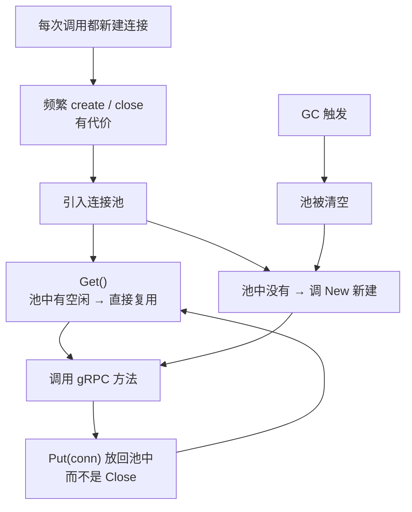

# Kubernetes 认证考点: 使用 gRPC 连接池复用连接 —— sync.Pool 的 New/Get/Put、容量自伸缩与 CAS 无锁原理

**如果每次发起 gRPC 请求的时候都新建一个 gRPC 连接，调用结束就关闭这个连接，那么大量的调用就会出现频繁的创建连接和关闭连接的操作。这个不断新建连接的过程也是有代价的，如果可以省略，自然就可以提高程序的性能。**

结论先给：**用 Go 标准库的 `sync.Pool` 做连接池 —— 定义一个只有 `New` 方法的连接池对象，获取连接调 `Get()`（池中没连接就调 `New` 生成，有空闲就直接拿出来复用），释放连接不是 `conn.Close()` 而是 `Put(conn)` 放回池中；对 gRPC 客户端现有代码的改造很少。** 但更重要的问题是**要不要用**：**gRPC 服务调用使用的是 HTTP/2 协议，协议本身就支持长连接以及多路复用，一个 gRPC 连接自身就能支持上万的并发请求 —— 客户端调用并发不高的话完全没有必要使用连接池，只有当客户端需要支持上万的并发时才需要考虑；连接池的引入会增加系统复杂度，不要过早地引入、过早优化。**

## 纲要

- 为什么要连接池：省掉反复建连的代价
- sync.Pool 的三个要素：New、Get、Put
- 对现有代码的改造量
- 什么时候真的需要连接池
- HTTP/2 长连接与多路复用
- 不要过早优化
- sync.Pool 是临时缓存，连接随时可能失效
- 容量自动控制：会增大也会缩小
- GC 时会被清空
- 新建开销大的对象不适合放 sync.Pool
- CAS 与无锁队列原理
- API 速览、Demo 示例与总结

## 为什么要连接池



```text
gRPC 客户端引入连接池前后的对比
├── 改造前
│   ├── conn, _ := grpc.Dial(addr, opts...)   每次调用都新建
│   ├── client := pb.NewUserCoinClient(conn)
│   └── defer conn.Close()                    调用结束就关闭
└── 改造后
    ├── 包级变量：connPool = sync.Pool{New: func() any { return dial() }}
    ├── getConn()  → connPool.Get()           获取（有就复用）
    └── connPool.Put(conn)                    释放（放回而不是关闭）
```

## sync.Pool 的三个要素

**这里的连接池使用了 Go 中的 `sync.Pool` 对象。首先需要新建一个 `connPool` 连接池对象，这个连接池只有一个属性，需要定义一个 `New` 方法，也就是新建连接的方法 —— 如果你使用 `sync.Pool` 不是做 gRPC 连接池，那么这里的 `New` 方法相应地改一下就好了。这里的 `New` 方法就是创建一个与 gRPC 服务的连接，返回值也就是这个连接对象。**

```text
// 骨架示意
var connPool = &sync.Pool{
    New: func() interface{} {
        conn, err := grpc.Dial(addr, grpc.WithTransportCredentials(insecure.NewCredentials()))
        if err != nil {
            return nil
        }
        return conn            // 新建的 gRPC 连接
    },
}

// 获取连接：池中没有就调 New 生成，有空闲就直接拿出来复用
func getConn() *grpc.ClientConn {
    return connPool.Get().(*grpc.ClientConn)
}

// 释放连接：放回池中，而不是 Close
func putConn(conn *grpc.ClientConn) {
    connPool.Put(conn)
}
```

**接下来从连接池中获取 gRPC 连接对象，只需要调用一次 `connPool.Get()` 方法（这里封装为 `getConn` 方法，没有任何参数）。如果当前连接池中没有连接，就会调用前面定义的 `New` 方法生成一个连接然后返回；如果当前连接池中有空闲的连接，就会直接拿出来返回，就不需要新建连接了 —— 这时候就达到了复用连接的作用。**

**gRPC 调用结束的时候需要把连接释放掉，这时候就不是使用 `conn.Close()` 方法来关闭连接了，而是使用 `connPool.Put` 把 gRPC 连接重新放回到连接池中。**

## 对现有代码的改造量

**对 gRPC 客户端现有的代码改造是不是也很少？最主要就是把新建连接这一段代码换了位置，然后获取和释放连接换一个方法就行了。**

| 位置 | 改造前 | 改造后 |
| --- | --- | --- |
| **新建连接** | **调用处 `grpc.Dial`** | **挪到 `sync.Pool.New` 里** |
| **获取连接** | **`grpc.Dial` 的返回值** | **`connPool.Get()`** |
| **释放连接** | **`defer conn.Close()`** | **`defer connPool.Put(conn)`** |
| **客户端对象** | **`pb.NewXxxClient(conn)`** | **不变** |

## 什么时候真的需要连接池

**gRPC 服务调用使用的是 HTTP/2 协议，协议本身就支持长连接以及多路复用，也就是说 gRPC 连接自身就能支持上万的并发请求。如果你的客户端调用并发不高，完全没有必要使用连接池 —— 只有当你的 gRPC 客户端需要支持上万的并发时，才需要考虑使用连接池。相信大部分小伙伴都不会遇到过万的并发，但这也不妨碍了解连接池的技术。**

## 不要过早优化

**连接池的引入会增加系统的复杂度，所以没有必要过早地引入它 —— 也就是不要过早地对系统进行优化。只有真的需要了，再来优化也不迟。**

## sync.Pool 是临时缓存，连接随时可能失效

**最后需要注意：`sync.Pool` 只是临时缓存，在里面的连接随时可能失效。这个特性是它的实现理念决定的 —— 就是通过池化资源，避免大量的资源反复创建和释放，同时避免在 Go 程序中进行垃圾回收的时候进行大量的对象牵连。所以它考虑了资源生成和回收两方面的优化，也是为了简化使用。**

## 容量自动控制

**通过上面的使用没有看到设置连接池大小的选项，那么 `sync.Pool` 的大小是怎么控制的呢？答案是系统自动控制的。当你不断地调用 `Put` 方法的时候，它内部会检查当前的连接池大小是否可以放得下，如果放不下了，就会新建一个更大的连接池。所以这里的连接池大小，也可以认为它的容量是内存的上限了。**

**如果连接池容量总是在增大，那是不是太浪费资源了？一旦并发量降下来了，不需要那么多连接的时候，这个连接池是不是会缩小呢？答案是它自动会缩小 —— 只是这个自动缩小的时机不是我们能控制的，它会在 Go 程序触发垃圾回收时，直接把全部连接池清空。这也是为什么前面说 `sync.Pool` 是一个临时缓存池，因为它随时都有可能被清空。**

| 问题 | 答案 |
| --- | --- |
| **大小怎么控制** | **系统自动控制，没有设置选项** |
| **什么时候增大** | **不断 `Put` 时放不下就建更大的池** |
| **容量上限** | **可以认为是内存的上限** |
| **什么时候缩小** | **GC 触发时，全部清空** |
| **缩小可控吗** | **不可控，时机由 GC 决定** |

**但是由于它有 `New` 方法可以在需要的时候马上新建一个连接对象，所以只是大家在使用时需要考虑一下：对于新建开销很大的对象，不建议使用 `sync.Pool` 来保存。**

## CAS 与无锁队列原理

**关于 `sync.Pool` 还有非常重要的一点，就是它的性能与锁的关系 —— 都说 `sync.Pool` 是无锁操作，那么它又是怎么做到并发安全的呢？这里它用到了一个非常常见的原子操作：CAS 操作（比较并交换）。`sync.Pool` 的 `Put` 和 `Get` 方法都会改变连接池的数据，它内部的数据结构是一个双向循环队列；每次获取和放回对象都要改变它的头或者尾，这时候就会先读取出来头或者尾的数据，修改完之后，使用 CAS 操作来更新实际的队列的头或者尾；这时候如果发现头或者尾的对象变了，那说明已经被其他的程序修改过，这时候就不能操作成功。这就是无锁队列的实现原理 —— 听上去很简单，理解起来还是有点难。**

```text
无锁队列的一次 CAS 更新
├── ① 读取当前 head/tail 的值           atomic.Load
├── ② 在本地算出新值                     head+1 / tail+1
├── ③ 用 CAS 写回                        CompareAndSwap(old, new)
│   ├── 成功：期间没人改过，本次操作生效
│   └── 失败：说明被其他 goroutine 改过 → 回到 ① 重试
└── ④ 全程不阻塞其他调用者（这是「无锁」的本质）
```

**程序中很多时候加锁实际上都是用的 CAS 指令实现的无锁编程，它不需要阻塞程序的调用，所以大部分时候性能方面会好很多。**

## API 速览

| 能力 | 做法 | 关键点 |
| --- | --- | --- |
| **建池** | **`&sync.Pool{New: func() interface{} {...}}`** | **`New` 是唯一的必配属性** |
| **获取** | **`connPool.Get()`** | **无连接时自动调 `New`** |
| **释放** | **`connPool.Put(conn)`** | **放回而不是 `Close`** |
| **封装** | **`getConn()` / `putConn(conn)`** | **改造量最小** |
| **容量** | **无需设置** | **自动增大，GC 时清空** |
| **并发安全** | **CAS 原子操作 + 双向循环队列** | **失败重试，不阻塞** |
| **适用判断** | **并发上万才考虑** | **HTTP/2 单连接已能支持上万并发** |
| **不适用** | **新建开销极大的对象** | **被清空后重建代价太高** |

## Demo 示例

下面两段代码都用标准库，可以直接跑：第一段演示 `sync.Pool` 的复用与「GC 后被清空」，第二段复刻 CAS 无锁队列。

```go
package main

import (
	"fmt"
	"runtime"
	"sync"
	"sync/atomic"
)

var dialCount int32 // 统计真正新建连接的次数

// Conn 模拟一个 gRPC 连接
type Conn struct {
	ID int32
}

// connPool 对应 sync.Pool{New: ...}
var connPool = &sync.Pool{
	New: func() interface{} {
		n := atomic.AddInt32(&dialCount, 1)
		return &Conn{ID: n} // 真正新建连接的地方
	},
}

func getConn() *Conn   { return connPool.Get().(*Conn) }
func putConn(c *Conn)  { connPool.Put(c) }

func main() {
	// ① 第一次获取：池是空的 → 走 New
	c1 := getConn()
	fmt.Println("第一次获取:", c1.ID)

	// ② 放回后再取：复用同一个连接
	putConn(c1)
	c2 := getConn()
	fmt.Printf("放回后再取: %d（复用=%v）\n", c2.ID, c1 == c2)

	// ③ 并发取放：连接池是并发安全的（CAS 无锁）
	var wg sync.WaitGroup
	for i := 0; i < 100; i++ {
		wg.Add(1)
		go func() {
			defer wg.Done()
			c := getConn()
			putConn(c)
		}()
	}
	wg.Wait()
	fmt.Println("100 次并发取放后，累计新建连接数:", atomic.LoadInt32(&dialCount))

	// ④ GC 会清空池：这就是「临时缓存，随时可能失效」
	putConn(c2)
	runtime.GC()
	c3 := getConn()
	fmt.Println("GC 之后再取:", c3.ID, "（与 GC 前不是同一个 =", c3 != c2, "）")
	fmt.Println("累计新建连接数:", atomic.LoadInt32(&dialCount))
}
```

CAS 无锁队列的最小实现：

```go
package main

import (
	"fmt"
	"sync"
	"sync/atomic"
)

// LFQueue 无锁队列：环形数组 + 两个原子下标（复刻 sync.Pool 内部的 CAS 思路）
type LFQueue struct {
	buf  []int32
	size int32
	head int32
	tail int32
}

func NewLFQueue(size int32) *LFQueue {
	return &LFQueue{buf: make([]int32, size), size: size}
}

// Push：先读 tail，算新值，再用 CAS 写回；失败说明被别人改过，重试
func (q *LFQueue) Push(v int32) bool {
	for {
		t := atomic.LoadInt32(&q.tail)
		h := atomic.LoadInt32(&q.head)
		if t-h >= q.size {
			return false // 满了
		}
		if atomic.CompareAndSwapInt32(&q.tail, t, t+1) {
			q.buf[t%q.size] = v
			return true
		}
		// CAS 失败 → 回到循环重读，全程不阻塞任何人
	}
}

// Pop：同理，先读 head 再 CAS
func (q *LFQueue) Pop() (int32, bool) {
	for {
		h := atomic.LoadInt32(&q.head)
		t := atomic.LoadInt32(&q.tail)
		if h == t {
			return 0, false // 空
		}
		v := q.buf[h%q.size]
		if atomic.CompareAndSwapInt32(&q.head, h, h+1) {
			return v, true
		}
	}
}

func main() {
	q := NewLFQueue(1024)

	var wg sync.WaitGroup
	var pushed, popped int32

	// 4 个生产者 + 4 个消费者并发操作同一个队列
	for i := 0; i < 4; i++ {
		wg.Add(1)
		go func(base int32) {
			defer wg.Done()
			for j := int32(0); j < 250; j++ {
				if q.Push(base*1000 + j) {
					atomic.AddInt32(&pushed, 1)
				}
			}
		}(int32(i))
	}
	for i := 0; i < 4; i++ {
		wg.Add(1)
		go func() {
			defer wg.Done()
			for {
				if _, ok := q.Pop(); ok {
					atomic.AddInt32(&popped, 1)
					continue
				}
				// 队列暂时空了：等生产者（真实场景会有更精细的退出条件）
				if atomic.LoadInt32(&pushed) == 1000 && atomic.LoadInt32(&popped) == atomic.LoadInt32(&pushed) {
					return
				}
			}
		}()
	}
	wg.Wait()

	fmt.Printf("入队 %d / 出队 %d，无锁队列收支平衡: %v\n",
		atomic.LoadInt32(&pushed), atomic.LoadInt32(&popped),
		atomic.LoadInt32(&pushed) == atomic.LoadInt32(&popped))
}
```

## 总结

1. **频繁建连是有代价的**：**如果每次发起 gRPC 请求都新建一个 gRPC 连接、调用结束就关闭，那么大量的调用就会出现频繁的创建连接和关闭连接的操作；这个不断新建连接的过程也是有代价的，如果可以省略自然就能提高程序的性能**；
2. **用 `sync.Pool` 做连接池**：**这里的连接池使用了 Go 中的 `sync.Pool` 对象 —— 首先新建一个 `connPool` 连接池对象，这个连接池只有一个属性，需要定义一个 `New` 方法，也就是新建连接的方法；不是做 gRPC 连接池的话，把 `New` 方法相应改一下就好了；这里的 `New` 方法就是创建一个与 gRPC 服务的连接，返回值就是这个连接对象**；
3. **获取走 `Get`**：**从连接池中获取 gRPC 连接对象只需要调用一次 `connPool.Get()` 方法（这里封装为无参的 `getConn`）；如果当前连接池中没有连接，就会调用前面定义的 `New` 方法生成一个连接然后返回；如果池中有空闲连接，就直接拿出来返回，不需要新建 —— 这就达到了复用连接的作用**；
4. **释放走 `Put` 而不是 `Close`**：**gRPC 调用结束的时候需要把连接释放掉，这时候不是使用 `conn.Close()` 方法关闭连接，而是使用 `connPool.Put` 把 gRPC 连接重新放回连接池中**；
5. **改造量很小**：**对 gRPC 客户端现有的代码改造也很少 —— 最主要就是把新建连接这一段代码换了位置，然后获取和释放连接换一个方法就行了**；
6. **HTTP/2 本身就够强**：**gRPC 服务调用使用的是 HTTP/2 协议，协议本身就支持长连接以及多路复用，也就是说 gRPC 连接自身就能支持上万的并发请求**；
7. **并发不高就没必要**：**如果你的客户端调用并发不高，完全没有必要使用连接池；只有当 gRPC 客户端需要支持上万的并发时，才需要考虑使用连接池；相信大部分小伙伴都不会遇到过万的并发，但这也不妨碍了解这门技术**；
8. **不要过早优化**：**连接池的引入会增加系统的复杂度，所以没有必要过早地引入它 —— 不要过早地对系统进行优化，只有真的需要了再来优化也不迟**；
9. **`sync.Pool` 是临时缓存**：**它只是临时缓存，在里面的连接随时可能失效；这个特性是它的实现理念决定的 —— 通过池化资源避免大量资源反复创建和释放，同时避免 GC 时进行大量对象牵连，它考虑了资源生成和回收两方面的优化**；
10. **容量自动增大**：**没有看到设置连接池大小的选项，答案是系统自动控制 —— 不断调用 `Put` 时内部会检查当前池大小是否放得下，放不下就新建一个更大的连接池；所以池大小可以认为容量是内存的上限**；
11. **缩小时机不可控**：**它会自动缩小，只是时机不受控制 —— 会在 Go 程序触发垃圾回收时直接把全部连接池清空；这也是为什么说它是临时缓存池，随时可能被清空；由于有 `New` 方法可以马上新建，所以对新建开销很大的对象，不建议使用 `sync.Pool` 保存**；
12. **无锁靠 CAS**：**`sync.Pool` 的 `Put` 和 `Get` 都会改变连接池数据，内部数据结构是双向循环队列；每次获取和放回都要改变头或尾 —— 先读出来头/尾的数据，改完用 CAS 操作更新实际的头/尾；如果发现头/尾变了说明被其他程序修改过，这次就操作不成功，需要重试；这就是无锁队列的实现原理**；
13. **CAS 不阻塞所以快**：**程序中很多时候加锁实际上都是用 CAS 指令实现的无锁编程，它不需要阻塞程序的调用，所以大部分时候性能方面会好很多。**

