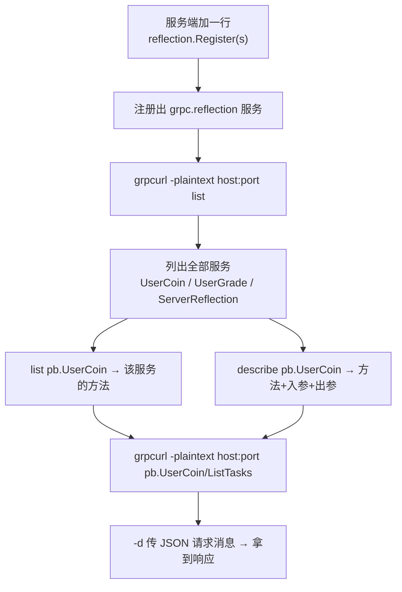

# Kubernetes 认证考点: 用反射简化 gRPC 的调用 —— reflection.Register 与 grpcurl 的 list/describe/调用

**这一节要在 gRPC 服务中注入反射，简化 gRPC 服务的调用。**

结论先给：**服务端只需要加一行代码 `reflection.Register(grpcServer)` 注册一个反射服务，目标服务就具备反射能力了；然后装一个客户端工具 `grpcurl`（mac 上可以用 `brew install`，也可以 `go install` 从源码安装），就能像用 `curl` 一样调用 gRPC 方法，还能用 `list` 浏览服务与方法的清单、用 `describe` 拿到 proto 的原始定义。** 除了访问带反射服务的 gRPC 服务，`grpcurl` 也支持通过本地的 `proto` 文件和 `protoset` 文件执行这些命令。

## 纲要

- 服务端加一行 reflection.Register
- 客户端工具 grpcurl 的安装
- grpcurl 的调用格式
- list：浏览服务与方法清单
- describe：拿到 proto 的原始定义
- 用本地 proto 文件
- 用 protoset 文件
- 真正发起一次调用与 -d 参数
- 反射背后的能力：列出服务、方法、入参出参
- 开发期的实用建议
- API 速览、Demo 示例与总结

## 服务端加一行 reflection.Register

**首先需要把反射服务注册上去 —— 在服务端代码里面加入一行代码 `reflection.Register`，把 gRPC service 传进去，只用加这一行就够了，目标服务就有了反射能力。**



```text
引入反射后的调用栈
├── 服务端
│   └── reflection.Register(s)        一行代码，注册 ServerReflection
├── 客户端工具 grpcurl
│   ├── list                          浏览服务清单
│   ├── list <服务>                    浏览该服务的方法
│   ├── describe <服务/方法>           拿到 proto 原定义
│   └── <服务>/<方法> -d '{...}'       发起调用
└── 三种元数据来源
    ├── 反射（服务端注册）             最省事
    ├── 本地 .proto 文件               -proto 参数
    └── .protoset 文件                 -protoset 参数（protoc 打包生成）
```

```text
// 骨架示意：main_server/main.go
import (
    "google.golang.org/grpc"
    "google.golang.org/grpc/reflection"
    "usergrowth/pb"
)

func main() {
    s := grpc.NewServer()
    pb.RegisterUserCoinServer(s, &ug_server.UGCoinServer{})
    pb.RegisterUserGradeServer(s, &ug_server.UGGradeServer{})
    reflection.Register(s)     // ★ 只加这一行
    // ... s.Serve(listen)
}
```

## 客户端工具 grpcurl 的安装

**注册了反射服务之后，还需要一个客户端工具来方便调用 —— 需要安装 `grpcurl`。根据官方说明，在 mac 系统上可以使用 `brew install` 来安装，也可以使用 `go install` 从源码安装。客户端安装之后就可以使用 grpcurl 来调用了。**

```bash
# 方式一：brew（macOS）
brew install grpcurl

# 方式二：go install（从源码）
go install github.com/fullstorydev/grpcurl/cmd/grpcurl@latest
```

## grpcurl 的调用格式

**这个工具跟 `curl` 非常类似：传入 gRPC 服务的 IP 和端口号，然后是服务的包名称加上服务名称，最后是远程方法的名称 —— 其中包名称和服务名称中间使用点号分割（如 `pb.UserCoin`），服务名称前面使用斜线分割（如 `/ListTasks`）；`-plaintext` 表示非安全连接的方式请求。**

```text
grpcurl -plaintext <host:port> <包.服务>/<方法>
        │          │            │
        │          │            └─ 包名称.服务名称 + / + 方法名
        │          └─ gRPC 服务地址
        └─ 不使用 TLS（明文 HTTP/2）
```

## list：浏览服务与方法清单

**`grpcurl` 除了可以方便调用 gRPC 服务的方法，也可以支持对服务定义的浏览 —— `list` 命令可以获取到服务和方法的清单。**

```bash
cd usergrowth/pb

# 列出所有服务
grpcurl -plaintext localhost:80 list
```

**结果有两个服务是 `pb.UserCoin` 和 `pb.UserGrade`，下面还多了一个 `grpc.reflection.v1alpha.ServerReflection` 这样的服务 —— 这个服务就是加的那一行代码注册上去的服务。调用的时候用它提供的反射方式把这些信息都返回回来。**

**后面再加上一个参数，把包名称和服务名称传进去，返回的就是这个服务里面的所有方法。**

```bash
grpcurl -plaintext localhost:80 list pb.UserCoin
# pb.UserCoin.ListTasks
# pb.UserCoin.GetCoinInfo
# pb.UserCoin.ListCoinDetails
# pb.UserCoin.UserCoinChange
```

## describe：拿到 proto 的原始定义

**`describe` 命令可以获取定义的源码 —— 这个指令会把 proto 的原定义的信息显示出来：这些服务、包括它的方法、输入消息、返回消息都会显示出来。**

| 命令 | 返回内容 |
| --- | --- |
| **`describe`** | **全部服务 + 各自的方法 + 入参出参** |
| **`describe pb.UserCoin`** | **该服务下的方法列表** |
| **`describe pb.UserCoin.ListTasks`** | **只返回这一个方法及其输入、输出消息** |

```bash
grpcurl -plaintext localhost:80 describe pb.UserCoin.GetCoinInfo
# 返回 GetCoinInfo 方法及 GetCoinInfoRequest / GetCoinInfoReply 的定义
```

## 用本地 proto 文件

**`grpcurl` 不仅可以请求访问有反射服务的 gRPC 服务，还可以通过本地的 proto 文件和 protoset 文件来执行这些命令。当然，如果本地已经有 protobuf 文件，直接看 proto 文件就够了。**

```bash
cd usergrowth/pb
grpcurl -proto user_growth.proto list                  # 只有我们定义的两个服务
grpcurl -proto user_growth.proto list pb.UserCoin
grpcurl -proto user_growth.proto describe pb.UserCoin   # describe 同样支持
```

**这种方法就没有调用反射的服务了，所以这里只有我们定义的两个服务。**

## 用 protoset 文件

**同样能支持 protoset 文件 —— 首先需要有一个 protoset 文件。通过 `protoc` 命令，将多个 proto 文件打包成一个 protoset 文件（内置 proto 源码生成），只需要执行一行命令就可以了。**

```bash
# ① 打包成 protoset（--include_imports 把依赖的 proto 也打进去）
protoc --proto_path=. --descriptor_set_out=myservice.protoset --include_imports user_growth.proto

# ② 用 -protoset 传进去，后面的指令跟前面一样
grpcurl -protoset myservice.protoset list
grpcurl -protoset myservice.protoset describe pb.UserCoin
```

## 真正发起一次调用与 -d 参数

**下面来调用服务了：调用的方法和参数跟前面是类似的 —— 把 IP 和端口传进去，然后是服务的包名字、服务名字中间加上点，再加上斜线，加上它的方法名，这样就可以调用一个服务。**

```bash
# 无入参调用
grpcurl -plaintext localhost:80 pb.UserCoin/ListTasks

# 带请求消息：-d 传 JSON，跟用 curl 命令是一样的
grpcurl -plaintext localhost:80 -d '{"uid": 1001}' pb.UserCoin/GetCoinInfo
```

**下面这个加了一个 `-d` 参数，这是它的请求消息输入的参数 —— 这个参数跟用 `curl` 命令其实是一样的。返回的是读一个用户的积分信息，因为没有这个用户，所以返回的是一个空数据。**

**`-plaintext` 参数就是不使用 HTTPS 协议，而是普通的那种没有安全认证的 HTTP 的请求。**

## 反射背后的能力

反射服务本质上是把「服务名 → 方法列表 → 入参出参类型」这套元信息在运行期暴露出来，`grpcurl` 才能在不拿 proto 文件的情况下拼出请求。下面这张表对应它的三个层次：

| grpcurl 命令 | 反射提供的能力 | 对应元信息 |
| --- | --- | --- |
| **`list`** | **列出服务** | **服务全名清单** |
| **`list <服务>`** | **列出方法** | **方法名清单** |
| **`describe <方法>`** | **列出定义** | **入参/出参消息结构** |
| **`<服务>/<方法>`** | **发起调用** | **按消息结构解析 JSON** |

## 开发期的实用建议

**这就是把反射服务注册上去之后，用 grpcurl 工具能够快速地来调用和展示服务以及方法的定义 —— 使用起来方便了很多。开发 gRPC 服务的时候，也可以把这个反射的服务注册上去，然后把 grpcurl 工具安装上就可以像这样来使用了。**

| 环境 | 是否建议开反射 | 理由 |
| --- | --- | --- |
| **本地开发** | **建议** | **调试省事，省去传 proto** |
| **测试环境** | **建议** | **联调方便** |
| **生产环境** | **按需（通常关闭或限制访问）** | **会暴露服务与方法清单** |

## API 速览

| 能力 | 做法 | 关键点 |
| --- | --- | --- |
| **开反射** | **`reflection.Register(s)`** | **一行代码，注册 ServerReflection** |
| **装工具** | **`brew install grpcurl` / `go install ...`** | **装完就能当 curl 用** |
| **列服务** | **`grpcurl -plaintext host:port list`** | **会多出 reflection 自身** |
| **列方法** | **`grpcurl ... list pb.UserCoin`** | **包.服务 用点号** |
| **看定义** | **`grpcurl ... describe pb.UserCoin.GetCoinInfo`** | **服务 → 方法 → 入参出参** |
| **发调用** | **`grpcurl ... pb.UserCoin/ListTasks`** | **服务后用斜线接方法** |
| **带参数** | **`-d '{"uid":1001}'`** | **JSON，和 curl 一样** |
| **明文** | **`-plaintext`** | **不走 TLS** |
| **本地 proto** | **`-proto user_growth.proto`** | **不走反射** |
| **protoset** | **`protoc --descriptor_set_out=... --include_imports`** | **一行命令打包** |

## Demo 示例

`reflection.Register` 依赖 gRPC 包，但「反射能列出服务、方法、入参出参」这件事用标准库的 `reflect` 就能完整复刻 —— 下面这段代码相当于在进程内实现了一个迷你反射服务：

```go
package main

import (
	"encoding/json"
	"fmt"
	"reflect"
	"strings"
)

// ---------- 模拟 pb 包的消息 ----------

type ListTasksRequest struct{}
type ListTasksReply struct {
	DataList []string `json:"data_list"`
}
type GetCoinInfoRequest struct {
	Uid int32 `json:"uid"`
}
type GetCoinInfoReply struct {
	Uid  int32 `json:"uid"`
	Coin int32 `json:"coin"`
}

// ---------- 模拟两个 gRPC 服务 ----------

type UserCoinServer struct{}

func (UserCoinServer) ListTasks(req *ListTasksRequest) (*ListTasksReply, error) {
	return &ListTasksReply{DataList: []string{"postarticle", "invite"}}, nil
}

func (UserCoinServer) GetCoinInfo(req *GetCoinInfoRequest) (*GetCoinInfoReply, error) {
	return &GetCoinInfoReply{Uid: req.Uid, Coin: 0}, nil // 用户不存在 → 空数据
}

type UserGradeServer struct{}

func (UserGradeServer) ListGrades(req *ListTasksRequest) (*ListTasksReply, error) {
	return &ListTasksReply{DataList: []string{"初级用户", "中级用户"}}, nil
}

// ---------- 迷你反射服务：对应 reflection.Register 暴露的元信息 ----------

var services = map[string]interface{}{
	"pb.UserCoin":  UserCoinServer{},
	"pb.UserGrade": UserGradeServer{},
}

// list 命令：列出全部服务
func list(service string) []string {
	if service == "" {
		names := make([]string, 0)
		for k := range services {
			names = append(names, k)
		}
		names = append(names, "grpc.reflection.v1alpha.ServerReflection")
		return names
	}
	// list <服务>：列出该服务的方法
	v, ok := services[service]
	if !ok {
		return nil
	}
	t := reflect.TypeOf(v)
	names := make([]string, 0)
	for i := 0; i < t.NumMethod(); i++ {
		names = append(names, service+"."+t.Method(i).Name)
	}
	return names
}

// describe 命令：打印某个方法的入参出参类型
func describe(full string) []string {
	parts := strings.SplitN(full, ".", 3)
	if len(parts) < 3 {
		return nil
	}
	service, method := parts[0]+"."+parts[1], parts[2]
	v, ok := services[service]
	if !ok {
		return nil
	}
	m, ok := reflect.TypeOf(v).MethodByName(method)
	if !ok {
		return nil
	}
	// 方法签名：func(recv, req) (reply, error)
	out := []string{fmt.Sprintf("%s (%s) returns (%s)",
		method, m.Type.In(1).String(), m.Type.Out(0).String())}
	out = append(out, "  请求消息字段:")
	for i := 0; i < m.Type.In(1).Elem().NumField(); i++ {
		f := m.Type.In(1).Elem().Field(i)
		out = append(out, fmt.Sprintf("    %s %s", f.Name, f.Type.String()))
	}
	return out
}

// call 命令：按 服务/方法 用 JSON 入参发起调用（对应 -d 参数）
func call(full string, payload string) (string, error) {
	ps := strings.Split(full, "/")
	if len(ps) != 2 {
		return "", fmt.Errorf("格式应为 包.服务/方法")
	}
	v, ok := services[ps[0]]
	if !ok {
		return "", fmt.Errorf("服务不存在: %s", ps[0])
	}
	m, ok := reflect.TypeOf(v).MethodByName(ps[1])
	if !ok {
		return "", fmt.Errorf("方法不存在: %s", ps[1])
	}
	req := reflect.New(m.Type.In(1).Elem()) // 造一个入参对象
	if payload != "" {
		if err := json.Unmarshal([]byte(payload), req.Interface()); err != nil {
			return "", err
		}
	}
	ret := m.Func.Call([]reflect.Value{reflect.ValueOf(v), req})
	if !ret[1].IsNil() {
		return "", ret[1].Interface().(error)
	}
	b, _ := json.Marshal(ret[0].Interface())
	return string(b), nil
}

func main() {
	fmt.Println("== list ==")
	for _, s := range list("") {
		fmt.Println(" ", s)
	}

	fmt.Println("\n== list pb.UserCoin ==")
	for _, m := range list("pb.UserCoin") {
		fmt.Println(" ", m)
	}

	fmt.Println("\n== describe pb.UserCoin.GetCoinInfo ==")
	for _, l := range describe("pb.UserCoin.GetCoinInfo") {
		fmt.Println(l)
	}

	fmt.Println("\n== 调用（对应 -d 参数）==")
	r1, _ := call("pb.UserCoin/ListTasks", "")
	fmt.Println(" pb.UserCoin/ListTasks        →", r1)
	r2, _ := call("pb.UserCoin/GetCoinInfo", `{"uid":1001}`)
	fmt.Println(" pb.UserCoin/GetCoinInfo -d   →", r2)
	if _, err := call("pb.UserCoin/Nobody", ""); err != nil {
		fmt.Println(" 不存在的方法 →", err)
	}
}
```

命令行侧的完整流程：

```bash
# ① 服务端开启反射后启动
go run ./main_server

# ② 浏览服务清单（会多出 reflection 自身）
grpcurl -plaintext localhost:80 list

# ③ 浏览某服务的方法
grpcurl -plaintext localhost:80 list pb.UserCoin

# ④ 看某方法的入参出参定义
grpcurl -plaintext localhost:80 describe pb.UserCoin.GetCoinInfo

# ⑤ 真正调用（-d 传 JSON 请求消息）
grpcurl -plaintext localhost:80 -d '{"uid":1001}' pb.UserCoin/GetCoinInfo

# ⑥ 不打服务端也能看定义：用本地 proto / protoset
grpcurl -proto user_growth.proto list
protoc --proto_path=. --descriptor_set_out=myservice.protoset --include_imports user_growth.proto
grpcurl -protoset myservice.protoset describe pb.UserCoin
```

## 总结

1. **反射只要一行代码**：**需要在服务端代码里面加入一行代码把这个反射的服务注册上去 —— `reflection.Register`，把 gRPC service 传进去，只用加这一行就够了，目标服务就有了反射能力**；
2. **再配一个客户端工具**：**注册了反射服务之后还需要一个客户端工具来方便调用 —— 安装 `grpcurl`；mac 上可以用 `brew install`，也可以用 `go install` 从源码安装，装完就可以使用了**；
3. **调用格式和 curl 很像**：**传入 gRPC 服务的 IP 和端口号，然后是服务的包名称加上服务名称，最后是远程方法的名称 —— 包名称和服务名称中间用点号分割，服务名称前面用斜线分割；`-plaintext` 表示非安全连接的方式请求**；
4. **`list` 浏览服务清单**：**`grpcurl` 除了方便调用方法，也支持对服务定义的浏览 —— `list` 命令可以获取到服务和方法的清单；结果里除了 `pb.UserCoin` 和 `pb.UserGrade`，还会多出 `grpc.reflection.v1alpha.ServerReflection`，这就是加的那一行代码注册的服务**；
5. **`list` 加参数列出方法**：**后面再加上一个参数，把包名称和服务名称传进去，返回的就是这个服务里面的所有方法；这些方法都是之前在 proto 文件里面定义的**；
6. **`describe` 拿到原定义**：**`describe` 指令会把 proto 的原定义信息显示出来 —— 这些服务、包括它的方法、输入消息、返回消息都会显示出来；指定服务就返回该服务下的方法列表，再具体到方法就只返回这一个方法及其输入和输出消息**；
7. **也支持本地 proto 文件**：**`grpcurl` 不仅可以请求访问有反射服务的 gRPC 服务，还可以通过本地的 proto 文件执行这些命令 —— 进到本地 pb 目录用 `-proto` 参数，这种方法就没有调用反射服务了，所以只列出我们定义的两个服务；当然本地已经有 protobuf 文件的话，直接看 proto 文件就够了**；
8. **还支持 protoset 文件**：**用 `protoc` 命令可以将多个 proto 文件打包成一个 protoset 文件（内置 proto 源码生成），只需要执行一行命令就可以；然后用 `-protoset` 把这个文件传进去，后面的指令跟前面用的那些是一样的**；
9. **真正调用靠 `-d`**：**调用的写法跟前面类似 —— 把 IP 和端口传进去，然后是服务的包名字、服务名字（中间加点），再加上斜线和方法名，就可以调用一个服务；加一个 `-d` 参数就是请求消息输入的参数，跟用 `curl` 命令是一样的**；
10. **`-plaintext` 是不走 TLS**：**这个参数就是不使用 HTTPS 协议，而是普通的那种没有安全认证的请求**；
11. **没数据就返回空**：**调用读一个用户的积分信息时，因为没有这个用户，所以返回的是一个空数据**；
12. **开发期非常实用**：**把反射服务注册上去之后，用 grpcurl 工具能够快速地调用和展示服务以及方法的定义，使用起来方便了很多；开发 gRPC 服务的时候可以把反射服务注册上、把 grpcurl 装上，就能像这样做调试了。**

