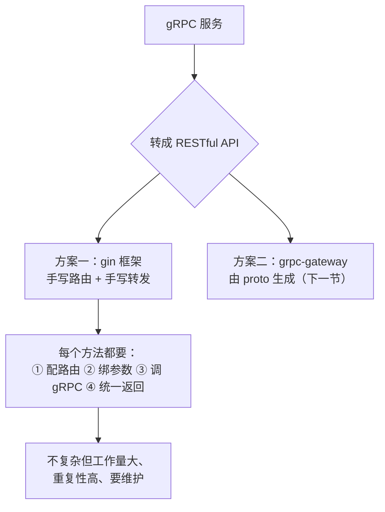

# Kubernetes 认证考点: gRPC 服务转 Restful API（gin 框架）—— 路由组、参数绑定与转发调用

**这一节把 gRPC 服务转成 RESTful API，那样就可以直接在浏览器中调用了。有两个方案来完成这个转换工作：第一个方案使用 gin 框架来实现，第二个方案使用 grpc-gateway。**

结论先给：**用 gin 框架的思路是 —— 给每一个服务方法配置上相应的路由，这样就定义了 RESTful API；在路由的处理器中还是要把请求转发给 gRPC 服务端，所以这里也是要实现 gRPC 客户端，然后通过这个客户端把请求发给服务端。也就是说每一个服务和方法都要设置路由、都要实现转发调用逻辑。虽然定义和实现都不复杂，但是工作量较大、重复性工作多，还是需要一些开发成本以及后续的维护成本。**

## 纲要

- 两个方案的取舍
- 第一步：建 gin 目录与最小路由
- 第二步：按服务建路由组
- 路径与 proto 保持一致的好处
- 第三步：HTTP 服务配置与端口冲突
- 第四步：建立 gRPC 客户端连接
- 处理器逻辑：无参方法的转发
- 处理器逻辑：带参方法的绑定与转发
- 统一响应格式：code + message
- 验证：curl 三个接口
- 这个方案的成本
- API 速览、Demo 示例与总结

## 两个方案的取舍



```text
gin 方案的项目结构
├── gin/
│   └── main.go                       Web 服务入口
│       ├── router := gin.Default()              创建路由
│       ├── router.GET("/hello", ...)            测试接口
│       ├── coin := router.Group("/v1/usergrowth/usercoin")
│       │   ├── coin.GET("/listtask", handler)         读 → GET
│       │   └── coin.POST("/usercoinchange", handler)  写 → POST
│       ├── grade := router.Group("/v1/usergrowth/usergrade")
│       │   └── grade.GET("/listgrades", handler)
│       ├── conn → grpc.Dial("localhost:80")     建 gRPC 客户端
│       ├── coinClient := pb.NewUserCoinClient(conn)
│       ├── gradeClient := pb.NewUserGradeClient(conn)
│       └── http.Server{Addr: ":8080", Handler: router}.ListenAndServe()
└── pb/                               路径与 proto 里的包/服务/方法保持一致
```

## 第一步：建 gin 目录与最小路由

**首先要创建一个 gin 的目录，然后在里面写一个 main 文件。在 main 方法中，先创建一个 gin 引擎对象出来（gin 的路由 router），先写一个测试的路由：`router.GET` 方法，路由的路径写一个测试的 `/hello`，它的处理器也简单地输出一个字符串。这是第一个 API，把服务启动起来之后直接访问 `/hello` 地址就可以了。**

```text
// 骨架示意：gin/main.go
router := gin.Default()
router.GET("/hello", func(c *gin.Context) {
    c.String(200, "hello")
})
```

## 第二步：按服务建路由组

**定义 API 之前先创建一个路由组 `router.Group` —— 这个路由组 `v1/usergrowth/usercoin` 是用户积分服务的一个路由组。在这个组里面再去定义几个方法：`/listtask` 定义为 `GET` 方法（因为这只是读请求，把全部的任务列表都读出来）；再写一个 `POST` 方法来定义 `/usercoinchange`，也就是修改用户积分。**

**接下来是用户等级，跟上面的也是一样 —— 定义路由组 `/v1/usergrowth/usergrade`，在这个路由组下面写一个 `/listgrades` 读取所有的用户等级列表。**

| 方法 | HTTP 方法 | 路径 | 对应 gRPC 方法 |
| --- | --- | --- | --- |
| **测试** | **GET** | **`/hello`** | **无（静态字符串）** |
| **读任务列表** | **GET** | **`/v1/usergrowth/usercoin/listtask`** | **`UserCoin.ListTasks`** |
| **改用户积分** | **POST** | **`/v1/usergrowth/usercoin/usercoinchange`** | **`UserCoin.UserCoinChange`** |
| **读等级列表** | **GET** | **`/v1/usergrowth/usergrade/listgrades`** | **`UserGrade.ListGrades`** |

**读请求用 `GET`（把全部的任务列表都读出来），修改用 `POST`。更多方法的定义在这个地方就都类似了，不全部都写一遍，大家自己来实现就好了 —— 这里大部分就是工作量的事情。**

## 路径与 proto 保持一致的好处

**这个路径不管是组的路径还是方法的路径，都跟 proto 文件里面定义的包名称、服务名称和方法名称保持一致。这样在调用的时候，也容易和我们的 proto 文件关联起来。**

## 第三步：HTTP 服务配置与端口冲突

**接下来还要做一些关于 Web 服务的配置 —— 把 gin 的路由传进去作为处理器，然后是 HTTP 服务的连接配置（这个地方没有设置更多的选项，都是默认的值）。接下来就是配置 HTTP 服务：这里面要配置服务的端口号等等这些基本的配置 —— 这个服务的地址监听 8080 端口；之前 gRPC 服务监听的是 80 端口，这个端口号不能冲突。处理器配好之后就是启动 HTTP 服务 `ListenAndServe`。这样我们就完成了 gin 路由框架的初始化、路由的定义和服务的配置以及启动。**

| 服务 | 端口 | 说明 |
| --- | --- | --- |
| **gRPC 服务** | **80** | **已有，不能冲突** |
| **RESTful Web 服务** | **8080** | **本节新增** |

```text
// 骨架示意
s := &http.Server{
    Addr:    ":8080",        // 与 gRPC 的 80 端口错开
    Handler: router,         // gin 路由作为处理器
}
s.ListenAndServe()
```

## 第四步：建立 gRPC 客户端连接

**在最前面的地方还需要做一些事情 —— 需要建一个连接到 gRPC 服务的客户端。目标地址先写上 `localhost:80`，然后这里有一个安全的传输协议，把这个选项加进去 `insecure.NewCredentials()`。连接有了还要处理一下错误信息：如果有报错就直接退出（连接失败）。最后还要把这个连接释放掉，再写一个 `defer`。然后还要创建相应的客户端 `pb.NewUserCoinClient(conn)` 获取到一个客户端，同样的还有用户等级的客户端 `pb.NewUserGradeClient(conn)`。**

```text
// 骨架示意
conn, err := grpc.Dial("localhost:80", grpc.WithTransportCredentials(insecure.NewCredentials()))
if err != nil {
    log.Fatalf("连接失败: %v", err)     // 有报错直接退出
}
defer conn.Close()                       // 释放连接

coinClient := pb.NewUserCoinClient(conn)
gradeClient := pb.NewUserGradeClient(conn)
```

## 处理器逻辑：无参方法的转发

**现在连接池连接也已经建立了、两个客户端也有了，最后要做的事情就是把下面的处理器改一下，完善具体的主体逻辑。用户积分任务就用它的 `ListTasks` 方法，用 `ctx` 传进去，它的请求消息是空的，但是我们也要把这个消息传进去；然后它有一个返回值和错误。如果有错误就要返回错误信息（`http.StatusInternalServerError`）。**

**关于错误信息，还是要保持格式的一致性 —— 所以返回一个 map 结构，它有几个数据：`code` 和 `message` 这样的结构；返回的时候就要有 `code` 和 `message` 返回回来。如果没有报错，那就把这个 `out` 消息（结果）返回回去。**

```text
// 骨架示意：GET /v1/usergrowth/usercoin/listtask
func listTasks(c *gin.Context) {
    out, err := coinClient.ListTasks(c, &pb.ListTasksRequest{})   // 空消息也要传
    if err != nil {
        c.JSON(http.StatusInternalServerError, gin.H{
            "code":    http.StatusInternalServerError,
            "message": err.Error(),
        })
        return
    }
    c.JSON(http.StatusOK, out)
}
```

## 处理器逻辑：带参方法的绑定与转发

**下面这个修改用户积分的方法也是一样的 —— 我们要拿到一个请求消息 `UserCoinChangeRequest`，需要绑定一下，把 HTTP body 中的 JSON 数据绑定到这个 pb 变量上去；如果绑定报错也要把这个错误信息抛出去。这就是 HTTP 方式传进来的一个数据，我们转成 pb 的 message。如果有报错，把错误信息、状态码这些跟上面一样（`code`、`message`）。如果没有报错，那就来请求 gRPC 服务：`coinClient.UserCoinChange` 把参数传进去；如果有错误就返回错误，如果没有错就把结果 `out` 返回回去。**

**这就实现了一个用户积分修改的方法，它比前面多了一个参数的处理 —— 从 HTTP body 中传过来一个 JSON，把它转成我们需要的一个 message，然后再去调用 gRPC 的远程方法。**

```text
// 骨架示意：POST /v1/usergrowth/usercoin/usercoinchange
func userCoinChange(c *gin.Context) {
    req := &pb.UserCoinChangeRequest{}
    if err := c.ShouldBindJSON(req); err != nil {      // body 里的 JSON → pb message
        c.JSON(http.StatusBadRequest, gin.H{"code": 400, "message": err.Error()})
        return
    }
    out, err := coinClient.UserCoinChange(c, req)
    if err != nil {
        c.JSON(http.StatusInternalServerError, gin.H{"code": 500, "message": err.Error()})
        return
    }
    c.JSON(http.StatusOK, out)
}
```

## 统一响应格式

**关于错误信息还是要保持格式的一致性 —— 返回一个 map 结构，有 `code` 和 `message` 这样的数据。**

| 情况 | HTTP 状态码 | 响应体 |
| --- | --- | --- |
| **成功** | **200** | **gRPC 返回的消息（原样输出）** |
| **参数绑定失败** | **400** | **`{"code":400,"message":"..."}`** |
| **gRPC 调用失败** | **500** | **`{"code":500,"message":"..."}`** |

## 验证

**我们把这样的一个 Web server 启动起来，能看到注册的这些路由。来调用一下 `curl localhost:8080/hello` —— 返回一个 hello。再来调用服务的 API：`/v1/usergrowth/usercoin/listtask`（没有加任何参数，那默认的就是 GET 方法请求）—— 这里已经把任务列表读取出来了，返回值也是期望的那个结果。再来调用 `/v1/usergrowth/usergrade/listgrades` —— 返回等级列表。如果要调用修改用户积分，那就要把请求参数以 JSON 格式放到 body 中传过去（POST 方法）。**

```bash
# ① 测试接口
curl localhost:8080/hello
# → hello

# ② 读积分任务列表（GET）
curl localhost:8080/v1/usergrowth/usercoin/listtask

# ③ 读等级列表（GET）
curl localhost:8080/v1/usergrowth/usergrade/listgrades

# ④ 修改用户积分（POST + JSON body）
curl -X POST localhost:8080/v1/usergrowth/usercoin/usercoinchange \
     -H "Content-Type: application/json" \
     -d '{"uid":1001,"task_name":"postarticle","coin":10}'
```

## 这个方案的成本

**关于用 gin 框架来实现 RESTful API 就演示到这里 —— 全部的方法实现还是很简单的，有兴趣的同学可以把这些服务方法都实现了。** 但要把话说清楚：**虽然这里的定义和实现都不复杂，但是工作量较大，重复性工作多，还是需要一些开发成本以及后续的维护。那么有没有更好的替代方案呢？这就是第二个方案 —— 使用 grpc-gateway。**

## API 速览

| 能力 | 做法 | 关键点 |
| --- | --- | --- |
| **建路由组** | **`router.Group("/v1/usergrowth/usercoin")`** | **路径对齐 proto 的包/服务** |
| **读接口** | **`coin.GET("/listtask", handler)`** | **读用 GET** |
| **写接口** | **`coin.POST("/usercoinchange", handler)`** | **写用 POST** |
| **建连接** | **`grpc.Dial("localhost:80", WithTransportCredentials(insecure.NewCredentials()))`** | **失败直接退出，`defer Close`** |
| **建客户端** | **`pb.NewUserCoinClient(conn)`** | **每个服务一个** |
| **空消息** | **`&pb.ListTasksRequest{}`** | **没有参数也要传** |
| **绑参数** | **`c.ShouldBindJSON(req)`** | **HTTP body 的 JSON → pb message** |
| **统一错误** | **`c.JSON(500, gin.H{"code":..., "message":...})`** | **格式保持一致** |
| **端口** | **`http.Server{Addr: ":8080"}`** | **与 gRPC 的 80 错开** |
| **启动** | **`s.ListenAndServe()`** | **代替 `router.Run`** |

## Demo 示例

gin 依赖第三方包，但「路由组 → 绑定 JSON → 转发给 gRPC 客户端 → 统一 code/message 响应」这条链路用标准库就能完整复刻：

```go
package main

import (
	"encoding/json"
	"fmt"
	"net/http"
	"net/http/httptest"
	"strings"
)

// ---------- 模拟 pb 消息 ----------

type ListTasksRequest struct{}
type ListTasksReply struct {
	DataList []string `json:"data_list"`
}
type UserCoinChangeRequest struct {
	Uid      int32  `json:"uid"`
	TaskName string `json:"task_name"`
	Coin     int32  `json:"coin"`
}
type UserCoinChangeReply struct {
	Uid  int32 `json:"uid"`
	Coin int32 `json:"coin"`
}

// ---------- 模拟 gRPC 客户端（真实场景是 pb.NewUserCoinClient(conn)） ----------

type CoinClient struct{}

func (CoinClient) ListTasks(req *ListTasksRequest) (*ListTasksReply, error) {
	return &ListTasksReply{DataList: []string{"postarticle", "invite"}}, nil
}

func (CoinClient) UserCoinChange(req *UserCoinChangeRequest) (*UserCoinChangeReply, error) {
	if req.TaskName == "" {
		return nil, fmt.Errorf("任务名不能为空")
	}
	return &UserCoinChangeReply{Uid: req.Uid, Coin: req.Coin}, nil
}

type GradeClient struct{}

func (GradeClient) ListGrades(req *ListTasksRequest) (*ListTasksReply, error) {
	return &ListTasksReply{DataList: []string{"初级用户", "中级用户"}}, nil
}

var coinClient CoinClient
var gradeClient GradeClient

// ---------- 统一响应：code + message ----------

func fail(w http.ResponseWriter, code int, msg string) {
	w.Header().Set("Content-Type", "application/json")
	w.WriteHeader(code)
	_ = json.NewEncoder(w).Encode(map[string]interface{}{"code": code, "message": msg})
}

func ok(w http.ResponseWriter, v interface{}) {
	w.Header().Set("Content-Type", "application/json")
	w.WriteHeader(http.StatusOK)
	_ = json.NewEncoder(w).Encode(v)
}

// ---------- 处理器 ----------

func hello(w http.ResponseWriter, r *http.Request) {
	w.WriteHeader(http.StatusOK)
	_, _ = w.Write([]byte("hello"))
}

// listTasks 无参方法：空消息也要传进去
func listTasks(w http.ResponseWriter, r *http.Request) {
	out, err := coinClient.ListTasks(&ListTasksRequest{})
	if err != nil {
		fail(w, http.StatusInternalServerError, err.Error())
		return
	}
	ok(w, out)
}

// userCoinChange 带参方法：绑定 body 里的 JSON → pb message → 调 gRPC
func userCoinChange(w http.ResponseWriter, r *http.Request) {
	req := &UserCoinChangeRequest{}
	if err := json.NewDecoder(r.Body).Decode(req); err != nil { // 对应 c.ShouldBindJSON
		fail(w, http.StatusBadRequest, err.Error())
		return
	}
	out, err := coinClient.UserCoinChange(req)
	if err != nil {
		fail(w, http.StatusInternalServerError, err.Error())
		return
	}
	ok(w, out)
}

func listGrades(w http.ResponseWriter, r *http.Request) {
	out, err := gradeClient.ListGrades(&ListTasksRequest{})
	if err != nil {
		fail(w, http.StatusInternalServerError, err.Error())
		return
	}
	ok(w, out)
}

// ---------- 路由表：路径与 proto 的包/服务/方法保持一致 ----------

func main() {
	routes := map[string]http.HandlerFunc{
		"/hello":                                    hello,
		"/v1/usergrowth/usercoin/listtask":          listTasks,
		"/v1/usergrowth/usercoin/usercoinchange":    userCoinChange,
		"/v1/usergrowth/usergrade/listgrades":       listGrades,
	}
	mux := http.NewServeMux()
	for path, h := range routes {
		mux.HandleFunc(path, h)
	}
	// 端口 8080：与 gRPC 服务的 80 错开
	s := &http.Server{Addr: ":8080", Handler: mux}

	cases := []struct {
		method, path, body string
	}{
		{"GET", "/hello", ""},
		{"GET", "/v1/usergrowth/usercoin/listtask", ""},
		{"GET", "/v1/usergrowth/usergrade/listgrades", ""},
		{"POST", "/v1/usergrowth/usercoin/usercoinchange", `{"uid":1001,"task_name":"postarticle","coin":10}`},
		{"POST", "/v1/usergrowth/usercoin/usercoinchange", `{"uid":1001}`}, // 缺 task_name → 500
	}
	for _, tc := range cases {
		req := httptest.NewRequest(tc.method, tc.path, strings.NewReader(tc.body))
		w := httptest.NewRecorder()
		s.Handler.ServeHTTP(w, req)
		fmt.Printf("%-5s %-46s → %d %s\n", tc.method, tc.path, w.Code, strings.TrimSpace(w.Body.String()))
	}
}
```

## 总结

1. **目标是能在浏览器里直接调**：**这一节把 gRPC 服务转成 RESTful API，那样就可以直接在浏览器中调用了**；
2. **两个方案，先讲 gin**：**第一个方案使用 gin 框架 —— 用 gin 框架给每一个服务方法配置上相应的路由，这样就定义了 RESTful API**；
3. **处理器里要转发给 gRPC 服务端**：**在路由的处理器中还是要把请求转发给 gRPC 服务端，所以这里也是要实现 gRPC 客户端，然后通过这个客户端把请求发给服务端；每一个服务和方法都要设置路由以及都要实现这里的转发调用逻辑**；
4. **成本是工作量和维护**：**虽然这里的定义和实现都不复杂，但是工作量较大，重复性工作多，还是需要一些开发成本以及后续的维护；所以还有第二个方案 grpc-gateway**；
5. **先建目录写最小路由**：**创建一个 gin 目录，在里面写 main 文件；在 main 方法中先创建一个 gin 引擎对象（路由 router），先写一个测试路由 `/hello`，处理器简单输出一个字符串，服务启动后直接访问 `/hello` 就可以了**；
6. **按服务建路由组**：**定义 API 之前先创建路由组 `router.Group` —— 用户积分服务一个组 `/v1/usergrowth/usercoin`，里面 `/listtask` 定义为 GET（读请求，把全部任务列表读出来）、`/usercoinchange` 定义为 POST（修改用户积分）；用户等级一个组 `/v1/usergrowth/usergrade`，里面写 `/listgrades` 读取所有等级列表**；
7. **路径对齐 proto**：**这个路径不管是组的路径还是方法的路径，都跟 proto 文件里面定义的包名称、服务名称和方法名称保持一致，这样调用的时候容易和 proto 文件关联起来**；
8. **端口不能冲突**：**Web 服务要配置服务地址等基本配置，监听 8080 端口 —— 之前 gRPC 服务监听的是 80 端口，这个端口号不能冲突；把 gin 路由作为处理器传给 `http.Server`，然后 `ListenAndServe` 启动**；
9. **建 gRPC 客户端连接**：**需要一个连接到 gRPC 服务的客户端 —— 目标地址写 `localhost:80`，加上安全传输选项 `insecure.NewCredentials()`；有报错直接退出（连接失败），最后写 `defer` 释放连接；再创建 `pb.NewUserCoinClient` 和 `pb.NewUserGradeClient` 两个客户端**；
10. **无参方法也要传空消息**：**用户积分任务就用 `ListTasks` 方法，请求消息是空的但也要把这个消息传进去；有错误就返回 `http.StatusInternalServerError`；关于错误信息要保持格式的一致性，返回一个有 `code` 和 `message` 的 map 结构；没有报错就把 `out` 结果返回回去**；
11. **带参方法多了绑定这一步**：**修改用户积分的方法要拿到 `UserCoinChangeRequest` 请求消息，把 HTTP body 中的 JSON 数据绑定到这个 pb 变量上；绑定报错也要把错误信息抛出去；这就是 HTTP 方式传进来的数据转成 pb 的 message，然后再去调用 gRPC 的远程方法**；
12. **验证用 curl**：**把 Web server 启动起来能看到注册的路由 —— `curl localhost:8080/hello` 返回 hello；`curl .../usercoin/listtask` 把任务列表读取出来了；`curl .../usergrade/listgrades` 返回等级列表；修改用户积分要把请求参数以 JSON 格式放到 body 中用 POST 传过去**；
13. **全部方法实现都很简单**：**关于用 gin 框架实现 RESTful API 就演示到这里，全部的方法实现还是很简单的，有兴趣的同学可以把这些服务方法都实现了。**

