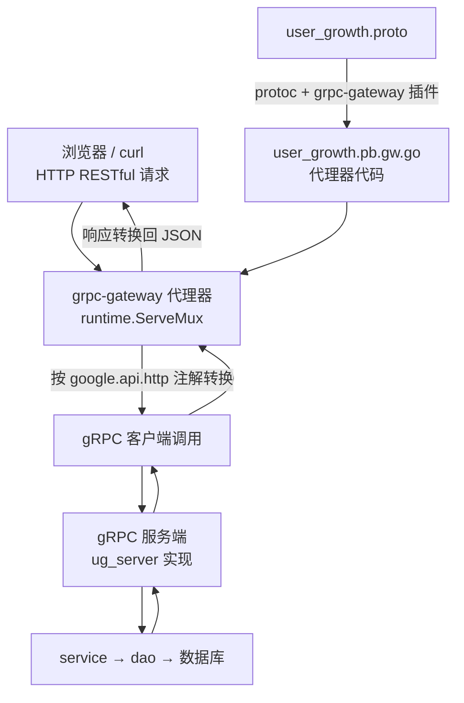

# Kubernetes 认证考点: gRPC 服务转 Restful API（grpc-gateway）—— 注解生成代理器与关联启动

**再来看看第二个方案：使用 grpc-gateway。grpc-gateway 就是一个代理器 —— 接收 HTTP 请求的 RESTful API，然后转换和请求到 gRPC 服务端，最后把结果再返回。**

结论先给：**首先还是需要有 protobuf 文件，根据 proto 文件可以生成 grpc-gateway 的代理器代码（要生成代理器代码，还需要一个 grpc-gateway 的 protobuf 插件，类似 protobuf 的 gRPC 插件）；为了支持 grpc-gateway，原来的 proto 文件也需要做一些修改 —— 增加谷歌 API 的扩展配置。有了 grpc-gateway 和 gRPC 服务的代码，再编写一些代码把它们关联起来，就可以自动识别 RESTful API 并请求到 gRPC 服务了。** 和 gin 方案的取舍是：**grpc-gateway 比较简单快捷；gin 框架可控性更强，毕竟需要自己实现客户端调用 gRPC 服务。**

## 纲要

- grpc-gateway 是一个代理器
- proto 文件要加谷歌 API 扩展
- 三个依赖的 proto 文件
- google.api.http 注解的写法
- 插件安装：go mod tidy + go install
- protoc 生成 gateway 代码
- 关联代码之一：初始化数据库与驱动
- 关联代码之二：注册 gRPC 服务
- 关联代码之三：RegisterXxxHandlerServer
- 启动 HTTP 服务与端口区分
- 验证与两种方案的取舍
- API 速览、Demo 示例与总结

## grpc-gateway 是一个代理器



```text
grpc-gateway 方案的项目结构
├── pb/
│   ├── user_growth.proto                  ★ 增加 google.api.http 注解
│   ├── google/api/annotations.proto       依赖一
│   ├── google/api/http.proto              依赖二
│   ├── google/protobuf/descriptor.proto   依赖三
│   ├── user_growth.pb.go                  消息代码
│   ├── user_growth_grpc.pb.go             gRPC 代码
│   └── user_growth.pb.gw.go               ★ grpc-gateway 插件生成的代理器
├── ug_server/                             自己的服务实现（复用）
│   ├── coin_server.go
│   └── grade_server.go
└── main_gateway.go                        ★ 把 gateway 和 gRPC 服务关联起来
    ├── initDB()                            从 main_server 复制过来
    ├── import _ "github.com/go-sql-driver/mysql"
    ├── 注册 gRPC 服务（反射那行就不需要了）
    ├── pb.RegisterUserCoinHandlerServer(mux, server)   ★ 关联
    ├── pb.RegisterUserGradeHandlerServer(mux, server)  ★ 关联
    └── http.Server{Addr: ":8081"}                      启动
```

## proto 文件要加谷歌 API 扩展

**首先是 import 这个地方，需要引入 `google/api/annotations.proto` 这样的一个 proto 文件。关于 import 这个地方要注意的是文件依赖。**

**下面就是它支持的一个扩展 —— 之前这个地方是空的，现在需要加上一个 `option`，把 `google.api.http` 这个结构填进去：首先是 `get` 方法，然后是路径（一定要写成一致的格式），然后下面的 `post` 方法还有 `body` 参数，都一个一个按照这个规则把它写出来 —— 把方法、路径和 body 都写进去就好了。**

```protobuf
syntax = "proto3";

package pb;
option go_package = "usergrowth/pb";

import "google/api/annotations.proto";

service UserCoin {
  rpc ListTasks (ListTasksRequest) returns (ListTasksReply) {
    option (google.api.http) = {
      get: "/v1/usergrowth/usercoin/listtask"
    };
  }

  rpc UserCoinChange (UserCoinChangeRequest) returns (UserCoinChangeReply) {
    option (google.api.http) = {
      post: "/v1/usergrowth/usercoin/usercoinchange"
      body: "*"
    };
  }
}

service UserGrade {
  rpc ListGrades (ListGradesRequest) returns (ListGradesReply) {
    option (google.api.http) = {
      get: "/v1/usergrowth/usergrade/listgrades"
    };
  }
}
```

| 注解字段 | 含义 | 示例 |
| --- | --- | --- |
| **`get`** | **HTTP GET + 路径** | **`/v1/usergrowth/usercoin/listtask`** |
| **`post`** | **HTTP POST + 路径** | **`/v1/usergrowth/usercoin/usercoinchange`** |
| **`body`** | **哪些字段放 body** | **`"*"` 表示全部** |
| **`put` / `delete`** | **其余 HTTP 方法** | **按需配置** |

## 三个依赖的 proto 文件

**而这个 proto 文件又依赖 `google/api/http.proto` 和 `google/protobuf/descriptor.proto` 这两个 proto 文件，所以本地也要把依赖的这三个文件都放在本地 —— 拿到项目的源码之后，也是可以在 `pb` 目录中找到它们的。**

| 文件 | 作用 |
| --- | --- |
| **`google/api/annotations.proto`** | **定义 `google.api.http` 扩展** |
| **`google/api/http.proto`** | **HTTP 规则的具体结构** |
| **`google/protobuf/descriptor.proto`** | **扩展机制的基础描述** |

## 插件安装

**关于它的安装，大家可以到官网上去了解一下，也是很简单的 —— 就写一个 Go 文件，在里面 import 这两个包，然后执行一下 `go mod tidy` 命令，这样项目就会下载这些文件到本地；然后再执行一下 `go install`，就会把这两个 protoc 插件安装到 GOPATH/bin 下面去，这样就把 grpc-gateway 需要的插件安装成功了。**

```bash
# ① 写一个 tools.go，import 两个包
#    _ "github.com/grpc-ecosystem/grpc-gateway/v2/protoc-gen-grpc-gateway"
#    _ "github.com/grpc-ecosystem/grpc-gateway/v2/protoc-gen-openapiv2"

# ② 下载依赖
go mod tidy

# ③ 安装插件到 GOPATH/bin
go install github.com/grpc-ecosystem/grpc-gateway/v2/protoc-gen-grpc-gateway@latest
go install github.com/grpc-ecosystem/grpc-gateway/v2/protoc-gen-openapiv2@latest
```

**安装成功之后，去执行 protoc 的时候就可以用 grpc-gateway 的参数来生成我们需要的 gateway 代码文件。**

```bash
cd usergrowth/pb
protoc --proto_path=. --proto_path=./google/api --proto_path=./google/protobuf \
       --go_out=. --go_opt=paths=source_relative \
       --go-grpc_out=. --go-grpc_opt=paths=source_relative \
       --grpc-gateway_out=. --grpc-gateway_opt=paths=source_relative \
       user_growth.proto
# → 生成 user_growth.pb.gw.go（代理器代码）
```

## 关联代码之一：初始化数据库与驱动

**我们定义一个新的方法 `mainGateway`，这里也需要启动 gRPC 服务，所以需要初始化数据库实例 —— 这里也要把 `initDB` 方法拿进来（在 `main_server` 里面已经实现过的，把这个方法直接 copy 过来就好了）。除了这个初始化，还有一行代码就是引入数据库驱动，也把它加进来，不然是会报错的。**

```text
// 骨架示意：main_gateway.go
import (
    _ "github.com/go-sql-driver/mysql"   // ★ 数据库驱动，不加会报错
)

func mainGateway() {
    initDB()                              // ★ 从 main_server 复制过来
    // ...
}
```

## 关联代码之二：注册 gRPC 服务

**接下来还要启动 gRPC 服务 —— 到 `main_server` 里面去找一下 gRPC 服务注册（gRPC 服务反射，这个在这里就不需要了）。**

```text
// 骨架示意
listen, _ := net.Listen("tcp", ":80")
s := grpc.NewServer()
pb.RegisterUserCoinServer(s, &ug_server.UGCoinServer{})
pb.RegisterUserGradeServer(s, &ug_server.UGGradeServer{})
// reflection.Register(s)  ← gateway 方案里不需要
```

## 关联代码之三：RegisterXxxHandlerServer

**下面要注意了，我们要注册 grpc-gateway —— 它也要做这个服务注册，这样就开始关联起来了：`pb.RegisterUserCoinHandlerServer`，这个方法是在生成的 gateway 文件里面（通过 grpc-gateway 这个插件来生成的文件），这样就可以把它们关联起来了。**

**还有一个参数它的服务 —— 到前面来创建一下 `runtime.NewServeMux()`，还有一个 context，接着就是关联我们的 gRPC 服务 `ug_server.UGCoinServer`，还有一个返回值是不是报错；如果出现错误把错误信息打印出来。这是注册了一个积分服务，还有一个等级服务一样的，就要把这个名字改一下 `grade`，也都是自动生成的 —— 所有这些跟我们定义的 proto 文件是有关联的。**

```text
// 骨架示意
mux := runtime.NewServeMux()                    // ★ gateway 的 mux
ctx := context.Background()

err := pb.RegisterUserCoinHandlerServer(ctx, mux, &ug_server.UGCoinServer{})
if err != nil {
    log.Printf("注册 UserCoin gateway 失败: %v", err)
}
err = pb.RegisterUserGradeHandlerServer(ctx, mux, &ug_server.UGGradeServer{})
if err != nil {
    log.Printf("注册 UserGrade gateway 失败: %v", err)
}
```

| 参数 | 含义 |
| --- | --- |
| **`ctx`** | **上下文** |
| **`mux`** | **`runtime.NewServeMux()`，gateway 的路由** |
| **服务实现** | **我们自己的 `ug_server.UGCoinServer`** |
| **返回值** | **error，出错要打印** |

**那就用 gateway 注册了我们的 gRPC 服务，那它就能够识别我们 proto 文件里面定义的这些方法和路径了。**

## 启动 HTTP 服务与端口区分

**接下来就要去启动 HTTP 服务了 —— `http.NewServeMux()` 创建一个 HTTP 服务，这个 HTTP 服务的处理器要负责处理一个路径（这个路径也是需要跟 proto 文件中定义的保持一致；这里是一个前缀，包括后面的都会被处理）。**

**接下来就要去配置 HTTP 服务 —— 在 HTTP 服务里面，它的服务地址是 8081，跟之前的 80 和 8080 区分一下；Handler 处理器我们这个地方需要做一个转换（`http.Handler` 转换）：这里先打印一个日志方便调试，实际来处理的是那个 mux（就是前面的 grpc-gateway 的服务），把处理转给 gateway 这个服务来进行实际的处理。然后就是启动 HTTP 服务 `ListenAndServe`，一样的把错误信息处理一下。**

| 服务 | 端口 |
| --- | --- |
| **gRPC 服务** | **80** |
| **gin 方案的 Web 服务** | **8080** |
| **grpc-gateway 的 Web 服务** | **8081** |

```text
// 骨架示意
gatewayMux := http.NewServeMux()
gatewayMux.Handle("/v1/", mux)              // 前缀一致，后面都会被处理

server := &http.Server{
    Addr:    ":8081",                        // 与 80、8080 区分
    Handler: gatewayMux,
}
log.Println("gateway 服务启动，监听 :8081")
if err := server.ListenAndServe(); err != nil {
    log.Printf("gateway 服务启动失败: %v", err)
}
```

**现在这个 main 方法就要去调用上面那个方法了 —— main 方法里面调用 `mainGateway`。**

## 验证与两种方案的取舍

**启动起来了，监听 8081 端口。来请求一下：GET 请求 8081 端口，这个地址也能够返回数据；然后在服务端这边应该也有相应的调用日志 —— 有数据库查询和响应值的日志。再请求一个用户等级里面的方法 `listgrades`，同样的也能够正常返回。**

**对照着前面使用 gin 框架启动的是 8080 端口，它们的路径是一模一样的，调用方式也跟这个是一模一样的。这样我们就把两个方案都实现了。**

| 维度 | grpc-gateway | gin 框架 |
| --- | --- | --- |
| **代码量** | **proto 加注解，代码自动生成** | **每个方法手写路由 + 转发** |
| **速度** | **比较简单快捷** | **工作量大、重复性高** |
| **可控性** | **由生成代码决定** | **更强，毕竟自己实现客户端调用** |
| **维护** | **改 proto 重新生成** | **改 proto 还要改路由代码** |
| **端口示例** | **8081** | **8080** |

```bash
# 验证 gateway（8081）
curl localhost:8081/v1/usergrowth/usercoin/listtask
curl localhost:8081/v1/usergrowth/usergrade/listgrades

# 对照 gin 方案（8080），路径和调用方式一模一样
curl localhost:8080/v1/usergrowth/usercoin/listtask
```

## API 速览

| 能力 | 做法 | 关键点 |
| --- | --- | --- |
| **加注解** | **`option (google.api.http) = { get: "..." }`** | **方法 + 路径 + body** |
| **引依赖** | **`import "google/api/annotations.proto"`** | **三个依赖 proto 都要放本地** |
| **装插件** | **`go mod tidy` + `go install`** | **装到 GOPATH/bin** |
| **生代码** | **`protoc --grpc-gateway_out=.`** | **生成 `*.pb.gw.go`** |
| **建 mux** | **`runtime.NewServeMux()`** | **gateway 的路由** |
| **关联服务** | **`pb.RegisterUserCoinHandlerServer(ctx, mux, impl)`** | **方法在生成的 gw 文件里** |
| **挂前缀** | **`http.NewServeMux()` + `Handle("/v1/", mux)`** | **与 proto 里定义的路径一致** |
| **启服务** | **`http.Server{Addr: ":8081"}.ListenAndServe()`** | **与 80、8080 区分** |
| **初始化** | **`initDB()` + mysql 驱动** | **不加驱动会报错** |

## Demo 示例

grpc-gateway 依赖第三方包，但「从 proto 注解生成 HTTP 路由表，再由 mux 转发」这件事用标准库就能复刻 —— 下面这段代码模拟了一次完整的注册与转发：

```go
package main

import (
	"encoding/json"
	"fmt"
	"net/http"
	"net/http/httptest"
	"strings"
)

// ---------- 模拟 pb 消息 ----------

type ListTasksRequest struct{}
type ListTasksReply struct {
	DataList []string `json:"data_list"`
}
type UserCoinChangeRequest struct {
	Uid      int32  `json:"uid"`
	TaskName string `json:"task_name"`
	Coin     int32  `json:"coin"`
}
type UserCoinChangeReply struct {
	Uid  int32 `json:"uid"`
	Coin int32 `json:"coin"`
}
type ListGradesRequest struct{}
type ListGradesReply struct {
	DataList []string `json:"data_list"`
}

// ---------- 模拟 gRPC 服务实现（ug_server） ----------

type UGCoinServer struct{}

func (UGCoinServer) ListTasks(req *ListTasksRequest) (*ListTasksReply, error) {
	return &ListTasksReply{DataList: []string{"postarticle", "invite"}}, nil
}

func (UGCoinServer) UserCoinChange(req *UserCoinChangeRequest) (*UserCoinChangeReply, error) {
	if req.TaskName == "" {
		return nil, fmt.Errorf("任务名不能为空")
	}
	return &UserCoinChangeReply{Uid: req.Uid, Coin: req.Coin}, nil
}

type UGGradeServer struct{}

func (UGGradeServer) ListGrades(req *ListGradesRequest) (*ListGradesReply, error) {
	return &ListGradesReply{DataList: []string{"初级用户", "中级用户"}}, nil
}

// ---------- 模拟 protoc + grpc-gateway 插件生成的路由表 ----------

// HTTPRule 对应 google.api.http 注解
type HTTPRule struct {
	Method string
	Path   string
	Body   string
}

// GatewayMux 对应 runtime.NewServeMux()
type GatewayMux struct {
	rules []routeRule
}

type routeRule struct {
	rule HTTPRule
	call func(r *http.Request) (interface{}, error)
}

// RegisterUserCoinHandlerServer 对应生成的注册函数：把注解和服务实现关联起来
func (m *GatewayMux) RegisterUserCoinHandlerServer(srv UGCoinServer) {
	m.rules = append(m.rules,
		routeRule{HTTPRule{"GET", "/v1/usergrowth/usercoin/listtask", ""},
			func(r *http.Request) (interface{}, error) {
				return srv.ListTasks(&ListTasksRequest{})
			}},
		routeRule{HTTPRule{"POST", "/v1/usergrowth/usercoin/usercoinchange", "*"},
			func(r *http.Request) (interface{}, error) {
				req := &UserCoinChangeRequest{}
				if err := json.NewDecoder(r.Body).Decode(req); err != nil { // body:"*"
					return nil, err
				}
				return srv.UserCoinChange(req)
			}},
	)
}

func (m *GatewayMux) RegisterUserGradeHandlerServer(srv UGGradeServer) {
	m.rules = append(m.rules,
		routeRule{HTTPRule{"GET", "/v1/usergrowth/usergrade/listgrades", ""},
			func(r *http.Request) (interface{}, error) {
				return srv.ListGrades(&ListGradesRequest{})
			}},
	)
}

// ServeHTTP 按注解匹配：method + path 都要对上
func (m *GatewayMux) ServeHTTP(w http.ResponseWriter, r *http.Request) {
	for _, rt := range m.rules {
		if rt.rule.Method == r.Method && rt.rule.Path == r.URL.Path {
			out, err := rt.call(r)
			if err != nil {
				w.WriteHeader(http.StatusInternalServerError)
				_ = json.NewEncoder(w).Encode(map[string]interface{}{"code": 500, "message": err.Error()})
				return
			}
			w.Header().Set("Content-Type", "application/json")
			w.WriteHeader(http.StatusOK)
			_ = json.NewEncoder(w).Encode(out)
			return
		}
	}
	http.NotFound(w, r)
}

func main() {
	mux := &GatewayMux{}
	mux.RegisterUserCoinHandlerServer(UGCoinServer{})   // ★ 关联积分服务
	mux.RegisterUserGradeHandlerServer(UGGradeServer{}) // ★ 关联等级服务

	gatewayMux := http.NewServeMux()
	gatewayMux.Handle("/v1/", mux) // 前缀一致，后面都会被处理

	server := &http.Server{Addr: ":8081", Handler: gatewayMux}

	cases := []struct {
		method, path, body string
	}{
		{"GET", "/v1/usergrowth/usercoin/listtask", ""},
		{"GET", "/v1/usergrowth/usergrade/listgrades", ""},
		{"POST", "/v1/usergrowth/usercoin/usercoinchange", `{"uid":1001,"task_name":"postarticle","coin":10}`},
		{"GET", "/v1/usergrowth/usercoin/nobody", ""}, // 没注册的路径 → 404
	}
	for _, tc := range cases {
		req := httptest.NewRequest(tc.method, tc.path, strings.NewReader(tc.body))
		w := httptest.NewRecorder()
		server.Handler.ServeHTTP(w, req)
		fmt.Printf("%-5s %-46s → %d %s\n", tc.method, tc.path, w.Code, strings.TrimSpace(w.Body.String()))
	}
	fmt.Println("\n监听地址:", server.Addr, "（与 gRPC 的 80、gin 的 8080 区分）")
}
```

## 总结

1. **grpc-gateway 就是代理器**：**它接收 HTTP 请求的 RESTful API，然后转换和请求到 gRPC 服务端，最后把结果再返回**；
2. **入口还是 proto 文件**：**首先还是需要有 protobuf 文件，根据 proto 文件可以生成 grpc-gateway 的代理器代码；要生成代理器代码还需要一个 grpc-gateway 的 protobuf 插件，类似 protobuf 的 gRPC 插件**；
3. **proto 要加谷歌 API 扩展**：**为了支持 grpc-gateway，原来的 proto 文件也需要做一些修改 —— 增加谷歌 API 的扩展配置；先在 import 里引入 `google/api/annotations.proto`，然后在远程方法的扩展配置中加入 `google.api.http` 的设置，里面可以设置 `get`、`post`、`put`、`delete` 等 HTTP 方法以及它们的请求路径**；
4. **三个依赖 proto 要放本地**：**`annotations.proto` 又依赖 `google/api/http.proto` 和 `google/protobuf/descriptor.proto`，所以本地也要把依赖的这三个文件都放在本地（项目源码的 `pb` 目录中可以找到）；关于 import 要注意的是文件依赖**；
5. **注解要写方法、路径和 body**：**之前这个地方是空的，现在加上一个 `option`，把 `google.api.http` 这个结构填进去 —— 首先是 `get` 方法然后是路径（一定要写成一致的格式），下面的 `post` 方法还有 `body` 参数都一个一个按这个规则写出来**；
6. **安装只需两步**：**写一个 Go 文件 import 这两个包，执行 `go mod tidy` 把文件下载到本地，再执行 `go install` 把这两个 protoc 插件安装到 GOPATH/bin 下面，插件就安装成功了**；
7. **生成用 `--grpc-gateway_out`**：**安装成功之后，执行 protoc 的时候就可以用 grpc-gateway 的参数来生成需要的 gateway 代码文件**；
8. **关联代码要初始化数据库与驱动**：**定义一个新的方法 `mainGateway`，这里也需要启动 gRPC 服务，所以需要初始化数据库实例 —— 把 `main_server` 里已经实现的 `initDB` 方法直接 copy 过来；除这个初始化，还有一行代码就是引入数据库驱动，也把它加进来，不然是会报错的**；
9. **注册 gRPC 服务（反射不需要了）**：**到 `main_server` 里面找一下 gRPC 服务注册的代码拿过来；gRPC 服务反射在这个地方就不需要了**；
10. **关键一步是 `RegisterXxxHandlerServer`**：**要注册 grpc-gateway，它也要做这个服务注册，这样就开始关联起来了 —— `pb.RegisterUserCoinHandlerServer`，这个方法是在生成的 gateway 文件里面（通过 grpc-gateway 插件生成的文件）；参数有 `runtime.NewServeMux()` 创建的 mux、context，还有我们自己的 gRPC 服务实现，返回值是 error，出错要把错误信息打印出来；还有一个等级服务一样的，把名字改一下，也都是自动生成的，所有这些跟我们定义的 proto 文件是有关联的 —— 注册之后它就能识别 proto 里定义的这些方法和路径**；
11. **HTTP 服务挂前缀、换端口**：**`http.NewServeMux()` 创建一个 HTTP 服务，处理器要负责处理一个路径（这个路径也要跟 proto 文件中定义的保持一致，这里是一个前缀，包括后面的都会被处理）；服务地址是 8081，跟之前的 80 和 8080 区分一下；Handler 需要做一个转换 —— 先打印日志方便调试，实际处理转给那个 mux（grpc-gateway 的服务）；然后 `ListenAndServe` 启动，错误信息一样处理；最后 main 方法调用 `mainGateway`**；
12. **验证通过**：**启动起来监听 8081 端口，GET 请求 8081 端口这个地址也能够返回数据；服务端这边也有相应的调用日志 —— 有数据库查询和响应值的日志；再请求用户等级里面的 `listgrades` 方法，同样的也能够正常返回**；
13. **两个方案的取舍**：**对照前面 gin 框架启动的 8080 端口，它们的路径是一模一样的，调用方式也一模一样；以后使用时可以根据需要来考虑 —— 用 gateway 比较简单快捷，还是用 gin 框架来实现；gin 框架实现的话可控性会更强一点，毕竟是需要自己来实现客户端调用 gRPC 服务。**

