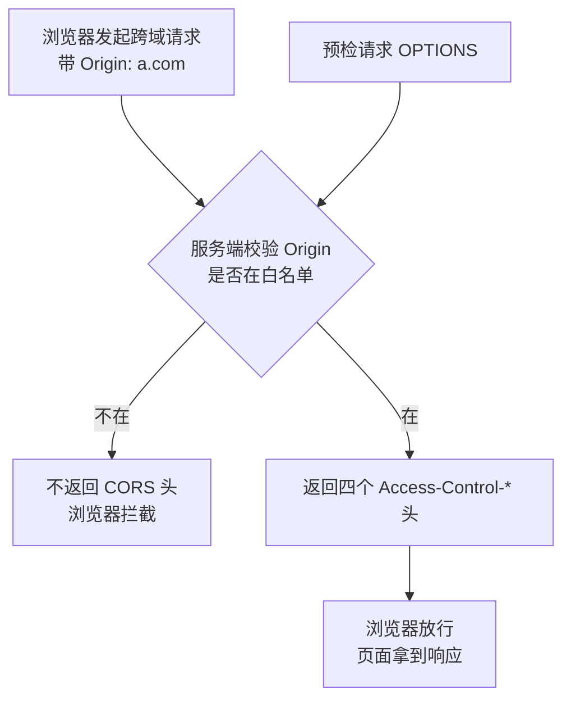

# Kubernetes 认证考点: 增加 CORS 跨域支持 —— 白名单校验、gin 中间件与 grpc-gateway 的 metadata 方案

**这一节对已经实现的 RESTful API 进一步补充丰富一下，增加 CORS 跨域的支持。**

结论先给：**跨域问题主要是浏览器为了安全原因所做的限制 —— 如果你写程序来调用 API 是不存在跨域问题的；简单理解就是域名不一样的时候就出现了跨域问题（端口不一样也算）。CORS 全称是跨域资源共享，是 W3C 的一个标准，按照标准做就可以让页面访问到不同域名的 API 和资源 —— 方法很简单，就是在响应头中增加几个以 `Access-Control-` 开头的头信息。最关键的一个坑：`Access-Control-Allow-Origin` 不支持配多个域名（除了 `*` 支持全部），所以必须自己定一个白名单，再验证请求里的 `Origin` 是否在白名单里，最后才输出这些 CORS 头。**

## 纲要

- 什么是跨域：浏览器的限制
- CORS 是什么与四个响应头
- 另外三种方案的对比
- gin 中：中间件加在哪一层
- 四个头的写法与 context.Next
- 为什么不能写死多个域名
- 白名单 + Origin 校验
- grpc-gateway 没有注入点怎么办
- WithMetadata + WithOutgoingHeaderMatcher
- 验证：带 Origin 请求看返回头
- 常见头速查表
- API 速览、Demo 示例与总结

## 什么是跨域

**跨域问题主要是因为浏览器为了安全原因所受的限制。如果你写程序来调用 API 是不存在跨域问题的。** 那什么情况会出现跨域问题？**简单理解就是域名不一样的时候，就出现了跨域问题。**

| 场景 | 是否跨域 | 原因 |
| --- | --- | --- |
| **`a.com` ↔ `web.com`** | **是** | **域名不一样** |
| **`web.com` ↔ `web.com:8080`** | **是** | **端口不一样** |
| **`web.com/a` ↔ `web.com/b`** | **否** | **同域名同端口** |
| **程序/服务端调用 API** | **否** | **不受浏览器限制** |

**所以，如果不想出现跨域问题，就把页面、API 和资源的访问域名都设置为相同才行 —— 要不然就需要用到 CORS 请求了。**

## CORS 是什么与四个响应头

**CORS 的全称是跨域资源共享（Cross-Origin Resource Sharing），它是 W3C 的一个标准。只要按照标准来做，就可以让页面访问到不同域名的 API 和资源了 —— 方法也很简单，就是在页面接口资源访问的响应头中增加几个头信息，它们都是以 `Access-Control-` 开头。**



```text
四个 CORS 响应头
├── Access-Control-Allow-Origin       控制域名（关键：只支持单个值或 *）
├── Access-Control-Allow-Methods      控制 HTTP 方法 GET/POST/PUT/DELETE/OPTION
├── Access-Control-Allow-Headers      控制额外发送的头信息
└── Access-Control-Allow-Credentials   控制是否发送 cookie 给服务端
```

## 另外三种方案的对比

**支持跨域的方式除了这里讲的 CORS 还有其他的一些方法：**

| 方案 | 原理 | 局限 |
| --- | --- | --- |
| **JSONP** | **动态加载 JS 文件发起请求，响应通过 JS 方法调用完成后续工作** | **比较早就支持的方式，但只能支持 GET，无法实现 POST 等其他方法** |
| **服务端代理** | **在同域名的 Web 服务下做代理转发 —— 页面请求相同域名不存在跨域，服务端调用也不存在跨域** | **可行，但增加一次服务端转发，既增加工作量和复杂度，也降低性能和效率** |
| **`document.domain`** | **主域名相同时，在页面上用 JS 设置 `document.domain` 为主域名，就能请求到子域名** | **要求主域名相同才行，有局限性** |
| **CORS** | **响应头加几个 `Access-Control-*`** | **各方面对比下来更加简单，通用性更好一些** |

## gin 中：中间件加在哪一层

**首先在 gin 框架中，来加上几个 header —— 这里最好是在路由组里面来加，因为现在定义了很多的服务和方法，如果一个一个加这样代码量就会很大。所以我们这个地方要再提取一层，定义一个路由组放在 `v1` 这个更高一层的路径上。这里的路由处理器其实就是一个中间件 —— 因为它是一个公共的处理方法，把这个 header 返回就好了，没有太多的处理逻辑。**

```text
// 骨架示意：gin 里的 CORS 中间件
v1 := router.Group("/v1")
v1.Use(corsMiddleware())          // ★ 加在更高一层的组上，组内全部路由生效
{
    coin := v1.Group("/usergrowth/usercoin")    // 前缀不再重复写 /v1
    coin.GET("/listtask", listTasks)
    coin.POST("/usercoinchange", userCoinChange)

    grade := v1.Group("/usergrowth/usergrade")
    grade.GET("/listgrades", listGrades)
}
```

## 四个头的写法与 context.Next

**`Allow-Origin`：如果这里写星号的话，那就是所有的域名都可以支持了。还有几个 header 我们都加进去 —— `methods`（我们支持的方法，像 GET、POST 这些，PUT、DELETE、OPTION）；还有 `headers`（所有的 header 都可以传过去）；`credentials`（cookie 是不是能支持）。**

**中间件的处理我们需要注意一下：如果不需要中断请求，要写上 `context.Next()`，让它去执行下一个 handle。**

```text
func corsMiddleware() gin.HandlerFunc {
    return func(c *gin.Context) {
        c.Header("Access-Control-Allow-Origin", "*")                        // 域名
        c.Header("Access-Control-Allow-Methods", "GET,POST,PUT,DELETE,OPTION") // 方法
        c.Header("Access-Control-Allow-Headers", "*")                       // 额外头
        c.Header("Access-Control-Allow-Credentials", "true")                // cookie
        if c.Request.Method == "OPTIONS" {
            c.AbortWithStatus(204)     // 预检请求到此为止
            return
        }
        c.Next()                       // ★ 不中断，交给下一个 handle
    }
}
```

## 为什么不能写死多个域名

**现在这样的话就是把所有的域名都通过了，安全性肯定是不好的。所以我们要限定某一些域名才能够使用，就需要在这里指定（像 `a.com`）。如果这样写死的话，那就意味着只支持一个域名；那是不是要支持多个域名，就直接写 `b.com` 呢？但是这里的 `Origin` 是不支持多个地址的 —— 如果你这样写，它是一个都匹配不到的。**

| 写法 | 效果 |
| --- | --- |
| **`Allow-Origin: *`** | **所有域名都支持，安全性不好** |
| **`Allow-Origin: a.com`** | **只支持一个域名** |
| **`Allow-Origin: a.com,b.com`** | **一个都匹配不到（不支持多个值）** |
| **白名单 + 校验后输出** | **精准控制，推荐** |

## 白名单 + Origin 校验

**所以这个地方需要改一下，不能直接在这个地方写多个域名 —— 那我们就要去配一个白名单，需要支持的域名有哪一些，在这个地方配个白名单 `allowList`，比如需要支持 `a.com`、`b.com` 还有 `web.com`（如果有别的域名，在这个地方配置上就好了）。**

**那么有了这个白名单，在实际的输出之前，我们再做一件事情 —— 就是验证当前的 `Origin`：从 header 里面是能够读取到当前的 `Origin` 是什么，这个 `Origin` 是不是在我们白名单里面存在；存在的话，才输出这些允许访问的头信息，这样才能够实现精准的控制。**

```text
var allowList = []string{"a.com", "b.com", "web.com"}   // 白名单

func corsMiddleware() gin.HandlerFunc {
    return func(c *gin.Context) {
        origin := c.Request.Header.Get("Origin")
        if contains(allowList, origin) {                 // ★ 在白名单里才输出
            c.Header("Access-Control-Allow-Origin", origin)
            c.Header("Access-Control-Allow-Methods", "GET,POST,PUT,DELETE,OPTION")
            c.Header("Access-Control-Allow-Headers", "*")
            c.Header("Access-Control-Allow-Credentials", "true")
        }
        if c.Request.Method == "OPTIONS" {
            c.AbortWithStatus(204)
            return
        }
        c.Next()
    }
}
```

## grpc-gateway 没有注入点怎么办

**现在我们来看看 gateway 的实现是不是也这样呢？我们发现 gateway 这里没有像 gin 框架这样的注入点 —— 因为它都被封装到 gateway 这个库里面去了，也就没有直接用的地方。所以在使用 grpc-gateway 的时候，还是有很大的差异的。因为这些差异我们需要去找其他的方法 —— 就是在它启动服务的时候，有一些启动服务的选项：mux 新建这个服务的时候是有一些服务选项的（`runtime.ServeMuxOption`）。**

```text
// 骨架示意：grpc-gateway 的 CORS
muxOption := []runtime.ServeMuxOption{
    runtime.WithMetadata(metadataHandler),              // ① 请求时生成 metadata
    runtime.WithOutgoingHeaderMatcher(headerMatcher),   // ② 响应时把 metadata 转成 HTTP header
}
mux := runtime.NewServeMux(muxOption...)
```

## WithMetadata + WithOutgoingHeaderMatcher

**在这个选项数组里面，我们可以用到两个方法 —— 一个是关于 header 的处理，一个是关于 metadata 的处理。**

**`WithOutgoingHeaderMatcher` 可以把 gRPC 服务里面的 metadata 的数据，作为 HTTP 的 header 发送出去；这个选项可以控制哪些元数据能发送、哪些不能发送。我们这个地方就简单一点，把所有的原数据都设置为能发送 —— 就是每一个 metadata 数据，我们都返回 `true`，然后它就会作为 header 发送出去。**

**那 metadata 从哪里来呢？我们还要做一个事情，就是需要生成 metadata 的数据 —— `WithMetadata`：这个方法能够接收到 HTTP 的请求 request 对象（这个 request 是 HTTP 请求），所以我们能从它的 header 里面拿到 `Origin`。看到这里，大家是不是发现跟前面 gin 框架的实现是一样的？对的，这里的判断是一样的 —— 如果支持这个 `Origin`，那我们就要去生成一个 metadata。**

```text
// 骨架示意
func metadataHandler(ctx context.Context, r *http.Request) metadata.MD {
    origin := r.Header.Get("Origin")               // 从 HTTP 请求头里读
    if !contains(allowList, origin) {
        return nil
    }
    md := metadata.New(map[string]string{          // metadata 的数据结构是一个 map
        "Access-Control-Allow-Origin":      origin,
        "Access-Control-Allow-Methods":     "GET,POST,PUT,DELETE,OPTION",
        "Access-Control-Allow-Headers":     "*",
        "Access-Control-Allow-Credentials": "true",
    })
    return md                                       // 放到 gRPC 的 header 里
}

func headerMatcher(key string) (string, bool) {
    return key, true                                // 全部 metadata 都作为 HTTP header 发出去
}
```

**整个过程就是：我们在请求的时候，在 gRPC 请求中创建了一个 metadata；然后在 HTTP 响应时把这个 metadata 放到了 header 里面，输出了 —— 这样就把这个 metadata 作为 header 返回给外部的调用方。这样的话，我们在 gRPC 里面就能够收到这个 metadata；这个 metadata 又可以通过 `WithOutgoingHeaderMatcher` 方法转换成 HTTP 的 header 数据给传出去。浏览器请求的时候，服务端就能够验证这个 `Origin` 是不是允许跨域处理 —— 允许的话，这四个 header 就会在 response 里面传出去，这就实现了 grpc-gateway 里面的跨域处理。**

## 验证

**我们先试一下 gin 框架的处理：启动起来，发起一个请求 `8080/v1/usergrowth/usercoin/listtask`，要把头信息打印出来（`-v` 选项，所有的 header 都能够看到了）。我们把 `Origin` 这个 header 传进去（`a.com`）—— 我们传了这个 `Origin`，它识别到了，就多了这一部分的 header 的返回，这是 gin 框架里面实现的跨域支持。**

**再来试一下 gateway 这个方案是不是也支持：重新启动一下，gateway 是 8081 端口，同样的请求换成 8081 端口 —— 也看到这个返回里面也是有这些 header。那我们改一下，改成 `c.com`（不在白名单），当然这个返回里面就没有了 —— 这就是支持 CORS 跨域的处理。**

```bash
# ① gin（8080）：带白名单内的 Origin
curl -v -H "Origin: a.com" localhost:8080/v1/usergrowth/usercoin/listtask
# → 返回里多出 Access-Control-Allow-Origin: a.com 等四个头

# ② gateway（8081）：同样
curl -v -H "Origin: a.com" localhost:8081/v1/usergrowth/usercoin/listtask

# ③ 不在白名单的 Origin（如 c.com）→ 返回里没有这些头
curl -v -H "Origin: c.com" localhost:8080/v1/usergrowth/usercoin/listtask

# ④ 预检请求
curl -v -X OPTIONS -H "Origin: a.com" \
     -H "Access-Control-Request-Method: POST" \
     localhost:8080/v1/usergrowth/usercoin/usercoinchange
```

## 常见头速查表

| 响应头 | 作用 | 常用取值 |
| --- | --- | --- |
| **`Access-Control-Allow-Origin`** | **允许的域名** | **白名单里匹配到的单个值（`*` 表示全部）** |
| **`Access-Control-Allow-Methods`** | **允许的方法** | **`GET,POST,PUT,DELETE,OPTION`** |
| **`Access-Control-Allow-Headers`** | **允许携带的头** | **`*`（或列出具体头）** |
| **`Access-Control-Allow-Credentials`** | **是否带 cookie** | **`true`** |
| **`Access-Control-Request-Method`** | **预检请求里带的** | **浏览器自动加** |

## API 速览

| 能力 | 做法 | 关键点 |
| --- | --- | --- |
| **加在哪** | **`v1.Use(corsMiddleware())`** | **放在更高一层的路由组，避免逐个方法加** |
| **读 Origin** | **`c.Request.Header.Get("Origin")`** | **从请求头里读** |
| **白名单** | **`allowList := []string{...}`** | **`Allow-Origin` 不支持多个值，必须自己配** |
| **输出头** | **`c.Header("Access-Control-...", v)`** | **只在校验通过后才输出** |
| **预检** | **`OPTIONS` → `AbortWithStatus(204)`** | **预检到此为止** |
| **不中断** | **`c.Next()`** | **需要继续走后面的 handler** |
| **gateway 生成 metadata** | **`runtime.WithMetadata(handler)`** | **从 HTTP 请求头拿 Origin 生成 map** |
| **gateway 转 header** | **`runtime.WithOutgoingHeaderMatcher(m)`** | **返回 `true` 表示这条 metadata 作为 header 发出** |

## Demo 示例

gin 和 grpc-gateway 的实现都依赖第三方包，但「白名单校验 + 输出四个头 + 预检处理」以及「metadata 转 header」这两件事用标准库就能完整复刻：

```go
package main

import (
	"fmt"
	"net/http"
	"net/http/httptest"
	"strings"
)

// 白名单：Allow-Origin 不支持多个值，所以必须自己配一个白名单
var allowList = []string{"a.com", "b.com", "web.com"}

func contains(list []string, s string) bool {
	for _, v := range list {
		if v == s {
			return true
		}
	}
	return false
}

// ---------- ① gin 方案的等价实现：CORS 中间件 ----------

func corsMiddleware(next http.Handler) http.Handler {
	return http.HandlerFunc(func(w http.ResponseWriter, r *http.Request) {
		origin := r.Header.Get("Origin") // 从请求头里读当前 Origin
		if contains(allowList, origin) { // ★ 只在白名单里才输出
			w.Header().Set("Access-Control-Allow-Origin", origin)
			w.Header().Set("Access-Control-Allow-Methods", "GET,POST,PUT,DELETE,OPTION")
			w.Header().Set("Access-Control-Allow-Headers", "*")
			w.Header().Set("Access-Control-Allow-Credentials", "true")
		}
		if r.Method == http.MethodOptions { // 预检请求到此为止
			w.WriteHeader(http.StatusNoContent)
			return
		}
		next.ServeHTTP(w, r) // 对应 gin 里的 c.Next()
	})
}

func listTasks(w http.ResponseWriter, r *http.Request) {
	w.Header().Set("Content-Type", "application/json")
	_, _ = w.Write([]byte(`{"data_list":["postarticle","invite"]}`))
}

// ---------- ② gateway 方案的等价实现：metadata → HTTP header ----------

// metadataHandler 对应 runtime.WithMetadata：从 HTTP 请求头拿 Origin，生成 metadata(map)
func metadataHandler(r *http.Request) map[string]string {
	origin := r.Header.Get("Origin")
	if !contains(allowList, origin) {
		return nil
	}
	return map[string]string{
		"Access-Control-Allow-Origin":      origin,
		"Access-Control-Allow-Methods":     "GET,POST,PUT,DELETE,OPTION",
		"Access-Control-Allow-Headers":     "*",
		"Access-Control-Allow-Credentials": "true",
	}
}

// gatewayHandler 对应 mux + WithOutgoingHeaderMatcher：响应时把 metadata 写成 HTTP 头
func gatewayHandler(w http.ResponseWriter, r *http.Request) {
	md := metadataHandler(r)
	for k, v := range md { // 等价 headerMatcher 返回 true：全部作为 header 发出去
		w.Header().Set(k, v)
	}
	w.Header().Set("Content-Type", "application/json")
	_, _ = w.Write([]byte(`{"data_list":["postarticle","invite"]}`))
}

func main() {
	// gin 方案：中间件串在路由组上
	ginMux := http.NewServeMux()
	ginMux.HandleFunc("/v1/usergrowth/usercoin/listtask", listTasks)
	ginServer := &http.Server{Addr: ":8080", Handler: corsMiddleware(ginMux)}

	// gateway 方案：8081
	gwMux := http.NewServeMux()
	gwMux.HandleFunc("/v1/usergrowth/usercoin/listtask", gatewayHandler)
	gwServer := &http.Server{Addr: ":8081", Handler: gwMux}

	cases := []string{"a.com", "b.com", "c.com", ""}
	fmt.Println("== gin 方案（8080）==")
	for _, origin := range cases {
		req := httptest.NewRequest("GET", "/v1/usergrowth/usercoin/listtask", nil)
		if origin != "" {
			req.Header.Set("Origin", origin)
		}
		w := httptest.NewRecorder()
		ginServer.Handler.ServeHTTP(w, req)
		fmt.Printf("Origin=%-8q → Allow-Origin=%q\n", origin, w.Header().Get("Access-Control-Allow-Origin"))
	}

	fmt.Println("\n== gateway 方案（8081）==")
	for _, origin := range cases {
		req := httptest.NewRequest("GET", "/v1/usergrowth/usercoin/listtask", nil)
		if origin != "" {
			req.Header.Set("Origin", origin)
		}
		w := httptest.NewRecorder()
		gwServer.Handler.ServeHTTP(w, req)
		fmt.Printf("Origin=%-8q → Allow-Origin=%q\n", origin, w.Header().Get("Access-Control-Allow-Origin"))
	}

	// 预检请求：OPTIONS 应直接 204 并带上允许的方法
	req := httptest.NewRequest("OPTIONS", "/v1/usergrowth/usercoin/usercoinchange", strings.NewReader(""))
	req.Header.Set("Origin", "a.com")
	req.Header.Set("Access-Control-Request-Method", "POST")
	w := httptest.NewRecorder()
	ginServer.Handler.ServeHTTP(w, req)
	fmt.Printf("\n预检 OPTIONS → %d, Allow-Methods=%q\n",
		w.Code, w.Header().Get("Access-Control-Allow-Methods"))
}
```

## 总结

1. **跨域是浏览器的限制**：**跨域问题主要是因为浏览器为了安全原因所受的限制；如果你写程序来调用 API 是不存在跨域问题的**；
2. **域名或端口不一样就跨域**：**简单理解就是域名不一样的时候，就出现了跨域问题 —— 比如 `a.com` 和 `web.com` 是域名不一样，`web.com` 和 `web.com:8080` 因为端口不一样，也会出现跨域问题**；
3. **不想跨域就统一域名**：**如果不想出现跨域问题，就把页面、API 和资源的访问域名都设置为相同才行；要不然就需要用到 CORS 请求了**；
4. **CORS 是 W3C 标准**：**CORS 的全称是跨域资源共享，它是 W3C 的一个标准；只要按照标准来做，就可以让页面访问到不同域名的 API 和资源了**；
5. **方法就是加几个响应头**：**方法也很简单，就是在页面接口资源访问的响应头中增加几个头信息，它们都是以 `Access-Control-` 开头 —— `Origin` 控制域名、`Methods` 控制 HTTP 方法、`Headers` 控制额外发送的头信息、`Credentials` 控制是否发送 cookie 给服务端**；
6. **其他方案各有局限**：**JSONP 是比较早就支持的方式，通过动态加载 JS 文件发起请求、响应通过 JS 方法调用完成后续工作，但它只能支持 GET，无法实现 POST 等其他方法；服务端代理是在同域名的 Web 服务下做代理转发（页面请求相同域名不存在跨域，服务端调用也不存在跨域），可行但增加一次服务端转发，既增加工作量和复杂度，也降低性能和效率；`document.domain` 方案要求主域名相同才能用，也有局限性；各方面对比起来还是 CORS 更加简单，通用性更好一些**；
7. **gin 里加在更高一层的路由组**：**最好是在路由组里面来加 —— 因为现在定义了很多的服务和方法，如果一个一个加代码量就会很大；所以再提取一层，定义一个路由组放在 `v1` 这个更高一层的路径上；这里的路由处理器其实就是一个中间件，因为它是一个公共的处理方法，把这个 header 返回就好了，没有太多的处理逻辑**；
8. **四个头的写法**：**`Allow-Origin` 写星号就是所有域名都支持；`Allow-Methods` 是我们支持的方法（GET、POST、PUT、DELETE、OPTION）；`Allow-Headers` 让所有的 header 都可以传过去；`Allow-Credentials` 控制 cookie 是不是能支持**；
9. **中间件不要忘了 `Next`**：**中间件的处理需要注意一下 —— 如果不需要中断请求，要写上 `context.Next()`，让它去执行下一个 handle**；
10. **星号通过所有域名不安全**：**现在这样就是把所有的域名都通过了，安全性肯定是不好的，所以要限定某一些域名才能够使用**；
11. **`Allow-Origin` 不支持多个域名**：**如果写死就只支持一个域名；直接写多个（如 `a.com,b.com`）的话，它是一个都匹配不到的 —— 所以这个地方需要改一下，不能直接写多个域名，要去配一个白名单**；
12. **白名单 + 校验才是精准控制**：**配一个白名单（如 `a.com`、`b.com`、`web.com`，有别的域名在这里配置上就好了）；在实际输出之前，验证当前的 `Origin` —— 从 header 里面能读取到当前的 `Origin` 是什么，它是不是在白名单里面存在；存在的话才输出这些允许访问的头信息，这样才能实现精准的控制**；
13. **路由组里前缀不要重复**：**现在路由组实现跨域请求，那下面就得用新定义的这个组 `v1.Group` 再来定义路由前缀，前面已经有了这里就不需要重复了；用户等级服务同样的把前缀去掉**；
14. **gateway 没有注入点，要走选项**：**gateway 这里没有像 gin 框架这样的注入点，因为它都被封装到 gateway 这个库里面去了，也就没有直接用的地方，所以使用 grpc-gateway 时还是有很大的差异；要找其他方法 —— 就是它启动服务时的选项，mux 新建服务的时候是有一些服务选项的（`runtime.ServeMuxOption`）**；
15. **两个选项配合**：**`WithOutgoingHeaderMatcher` 可以把 gRPC 服务里面的 metadata 数据作为 HTTP 的 header 发送出去，这个选项控制哪些元数据能发送哪些不能（简单做法就是每个 metadata 都返回 `true`，它就会作为 header 发送出去）；metadata 从 `WithMetadata` 来 —— 这个方法能接收到 HTTP 的请求 request 对象，能从它的 header 里拿到 `Origin`，判断跟 gin 框架的实现是一样的，支持这个 `Origin` 就生成一个 metadata（数据结构是 map），把需要的那几个 header 传进去，并把 metadata 放到 gRPC 的 header 里**；
16. **整条链路**：**请求时在 gRPC 请求中创建了一个 metadata，HTTP 响应时把这个 metadata 放到了 header 里输出 —— 这样 metadata 作为 header 返回给外部调用方；gRPC 里面的 metadata 又可以通过 `WithOutgoingHeaderMatcher` 转换成 HTTP 的 header 数据传出去；浏览器请求时服务端就能验证 `Origin` 是否允许跨域，允许的话这四个 header 就会在 response 里面传出去**；
17. **验证要带 `-v` 看头**：**发起请求时用 `-v` 选项，所有的 header 都能够看到了；把 `Origin` 这个 header 传进去（`a.com`），它识别到了就多出这一部分的 header 返回；gateway 是 8081 端口，同样的请求也有这些 header；改成 `c.com`（不在白名单）返回里面就没有了**；
18. **一定要记住白名单这一条**：**我们需要定义一个白名单，因为 `Allow-Origin` 它不支持配多个域名（除了 `*` 可以支持全部域名）；所以要定义一个白名单，再去验证这个 `Origin` 是不是白名单里面的，最后再输出这些 CORS 的 header。**

