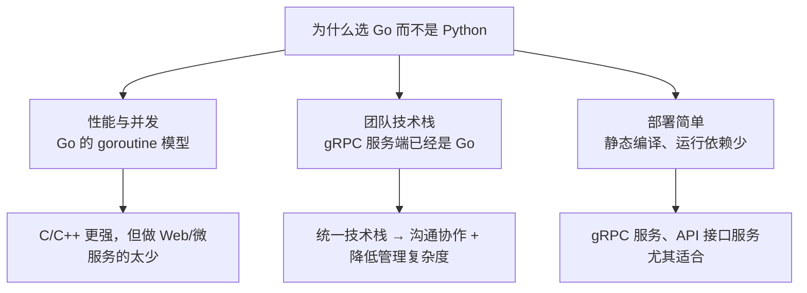

# Kubernetes 认证考点: 讨论为什么不用 python 实现 Restful API —— 性能并发、技术栈统一与部署依赖

**这一节做一个小讨论：为什么不用 Python 来实现 RESTful API 呢？**

结论先给：**可能很多人的第一个想法跟我一样 —— 因为我不会写 Python。除了这个原因，还有几个方面：首先是性能和并发能力方面 Golang 表现得更好（当然使用 C 或者 C++ 在性能和并发方面可能会更好一些，可惜用 C 和 C++ 做微服务或者 Web 服务的实在是太少了）；另外就是团队的技术栈决定的 —— 如果 gRPC 服务端使用的是 Golang，那么再实现 RESTful API 换开发语言的可能性就非常小；最后面向微服务架构虽然不局限于某一门开发语言，但是 Golang 的开发和部署都很简单，对于运行环境的依赖也非常少。**

## 纲要

- 第一个理由：不会写 Python（开玩笑的）
- 性能与并发能力：Go 表现更好
- C/C++ 更强但用的人太少
- 团队技术栈决定选型
- 统一技术栈的三个好处
- 微服务不绑定语言，但 Go 更适合
- 开发与部署简单、运行依赖少
- 适用场景：gRPC 服务与 API 接口服务
- 选型决策表
- API 速览、Demo 示例与总结

## 理由一：性能与并发

**首先是性能和并发能力方面，Golang 表现得更好。**



```text
选型要考虑的三个维度
├── 性能与并发
│   ├── Go：goroutine + channel，语言级并发
│   ├── Python：GIL 限制，多核利用要靠多进程
│   └── C/C++：可能更好，但做微服务/Web 服务的实在太少
├── 团队技术栈
│   ├── gRPC 服务端已经是 Go → 换语言的可能性非常小
│   └── 统一技术栈便于沟通协作、降低项目管理复杂度
└── 部署与依赖
    ├── Go：静态编译出一个二进制，运行依赖非常少
    └── 这也是现在用 Go 的团队越来越多的原因
```

## 理由二：C/C++ 更强但用的人太少

**当然，使用 C 或者 C++ 在性能和并发方面可能会更好一些。可惜用 C 和 C++ 做微服务或者 Web 服务的实在是太少了 —— 其中原因大家应该也能说上一二（开发效率、内存安全、生态和人才储备）。**

| 语言 | 性能 | 开发效率 | 微服务生态 | 结论 |
| --- | --- | --- | --- | --- |
| **C / C++** | **最好** | **低** | **少** | **做微服务/Web 的实在太少** |
| **Go** | **好** | **高** | **成熟** | **本课程的选择** |
| **Python** | **一般** | **最高** | **成熟** | **GIL 限制并发，且与现有技术栈不统一** |

## 理由三：团队技术栈决定选型

**另外就是团队的技术栈决定的 —— 如果 gRPC 服务端使用的是 Golang，那么再实现 RESTful API 换开发语言的可能性就非常小。因为需要尽量统一团队的技术栈，方便团队成员间的沟通和协作，也会降低项目管理的复杂度。**

| 统一技术栈的好处 | 说明 |
| --- | --- |
| **沟通协作** | **同一套语言、同一套工具链，代码评审和互相支援无障碍** |
| **降低管理复杂度** | **一套构建、一套依赖管理、一套部署流程** |
| **复用** | **proto、客户端、中间件可以跨服务复用** |
| **招聘与交接** | **人员流动时上手成本低** |

## 理由四：开发与部署简单、运行依赖少

**最后，面向微服务架构虽然不局限于某一门开发语言，但是 Golang 的开发和部署都很简单，对于运行环境的依赖也非常少。这也是为什么现在使用 Golang 的团队越来越多了，尤其是在开发 gRPC 服务、开发 API 接口服务等。**

```text
一次构建、到处运行的两种形态对比
├── Go
│   ├── go build → 单个二进制
│   ├── 容器镜像可以做到极小（甚至 scratch）
│   └── 运行依赖非常少：不需要装运行时和一堆包
└── 解释型语言
    ├── 运行环境要装解释器
    ├── 依赖包要在目标机器/镜像里装齐
    └── 版本不一致就容易出现「我这里能跑」
```

```bash
# Go 的部署形态：一个静态二进制
CGO_ENABLED=0 GOOS=linux go build -o usergrowth ./main_server
ls -lh usergrowth          # 单个文件，拷到哪都能跑

# 容器里可以做到极小镜像
# FROM scratch
# COPY usergrowth /usergrowth
# ENTRYPOINT ["/usergrowth"]
```

## 选型决策表

| 场景 | 建议 | 理由 |
| --- | --- | --- |
| **服务端已经是 Go** | **RESTful 也用 Go** | **技术栈统一** |
| **高并发 API 服务** | **Go** | **并发模型更合适** |
| **追求极致性能** | **C/C++（但慎重）** | **生态和人才成本高** |
| **脚本/数据分析** | **Python** | **生态优势明显** |
| **容器化微服务** | **Go** | **镜像小、依赖少** |

## API 速览

| 维度 | Go | Python | C/C++ |
| --- | --- | --- | --- |
| **并发模型** | **goroutine，语言级** | **受 GIL 限制** | **线程，手动管理** |
| **部署产物** | **单个静态二进制** | **源码 + 解释器 + 依赖** | **二进制 + 动态库** |
| **运行依赖** | **非常少** | **较多** | **中等** |
| **微服务生态** | **成熟** | **成熟** | **少** |
| **开发效率** | **高** | **最高** | **低** |
| **本课程选择** | **✅** | **—** | **—** |

## Demo 示例

「Go 的并发能力」不是嘴上说说 —— 下面这段代码用标准库把 goroutine + channel 的并发模型跑一遍，对比串行与并发的耗时：

```go
package main

import (
	"fmt"
	"runtime"
	"sync"
	"time"
)

// work 模拟一次「调用下游接口」的 IO 型任务
func work(id int) int {
	time.Sleep(50 * time.Millisecond) // 模拟等待
	return id * 2
}

// serial 串行执行
func serial(n int) (int, time.Duration) {
	start := time.Now()
	total := 0
	for i := 0; i < n; i++ {
		total += work(i)
	}
	return total, time.Since(start)
}

// concurrent 并发执行：goroutine + channel，这是 Go 语言级的并发能力
func concurrent(n int) (int, time.Duration) {
	start := time.Now()
	ch := make(chan int, n)
	var wg sync.WaitGroup
	for i := 0; i < n; i++ {
		wg.Add(1)
		go func(id int) { // 一个任务一个 goroutine，开销极低
			defer wg.Done()
			ch <- work(id)
		}(i)
	}
	wg.Wait()
	close(ch)

	total := 0
	for v := range ch {
		total += v
	}
	return total, time.Since(start)
}

func main() {
	const n = 20

	fmt.Println("GOMAXPROCS =", runtime.GOMAXPROCS(0), "NumCPU =", runtime.NumCPU())

	s1, d1 := serial(n)
	fmt.Printf("串行 %d 个任务: 结果=%d 耗时=%v\n", n, s1, d1)

	c1, d2 := concurrent(n)
	fmt.Printf("并发 %d 个任务: 结果=%d 耗时=%v\n", n, c1, d2)

	fmt.Printf("结果一致=%v 加速比≈%.1fx\n", s1 == c1, float64(d1)/float64(d2))
	fmt.Println("说明：goroutine 由 Go 运行时调度，创建成本低，这是 Go 在并发场景表现更好的原因之一")
}
```

## 总结

1. **讨论的起点是个玩笑**：**为什么不用 Python 来实现 RESTful API 呢？可能很多人的第一个想法跟我一样 —— 因为我不会写 Python**；
2. **除了玩笑还有正经理由**：**这里也提出来其他的几个方面原因，大家看看是否觉得有道理**；
3. **性能和并发能力 Go 更好**：**首先是性能和并发能力方面，Golang 表现得更好**；
4. **C/C++ 更强但用得太少**：**当然，使用 C 或者 C++ 在性能和并发方面可能会更好一些，可惜用 C 和 C++ 做微服务或者 Web 服务的实在是太少了（其中原因大家应该也能说上一二）**；
5. **团队技术栈决定选型**：**另外就是团队的技术栈决定的 —— 如果 gRPC 服务端使用的是 Golang，那么再实现 RESTful API 换开发语言的可能性就非常小**；
6. **统一技术栈有三个好处**：**因为需要尽量统一团队的技术栈，方便团队成员间的沟通和协作，也会降低项目管理的复杂度**；
7. **微服务不限制语言，但 Go 更合适**：**面向微服务架构虽然不局限于某一门开发语言，但是 Golang 的开发和部署都很简单**；
8. **运行依赖非常少**：**Golang 对于运行环境的依赖也非常少 —— 这也是为什么现在使用 Golang 的团队越来越多了，尤其是在开发 gRPC 服务、开发 API 接口服务等**；
9. **欢迎不同意见**：**如果你有不一样的想法，也可以在讨论区提出来，期待你的分享。**

