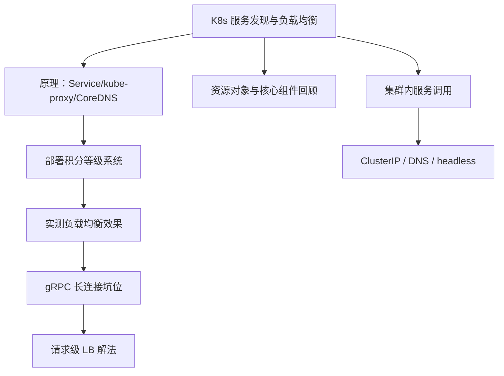

# Kubernetes 服务发现与负载均衡（含 gRPC）：本章导学

这一章咱们回到 Kubernetes 的内容。课程最开始的章节其实已经讲过**服务发现与负载均衡**——注册中心、两种负载均衡模式等原理。这次咱们来**详细**讲讲 K8s 的服务发现与负载均衡，这里的内容和 K8s 的网络有很大关系。当然，本章里的服务是用 gRPC 框架开发的，有它的特殊性，所以也会涉及到 gRPC 服务的特点，把 gRPC 服务与 K8s 集群结合起来讲。

## 纲要

- 本章主线：深入 K8s 服务发现与负载均衡（偏原理，呼应前面章节）
- 知识串联：结合 K8s 核心组件、各类资源对象一起回顾
- 实战验证：把用户积分等级系统部署上 K8s，实测负载均衡效果
- 重点坑位：gRPC 长连接导致负载均衡失效，提出通用解法
- 集群内调用：服务部署后，自己的服务在集群内该怎么互相调用
- 适用面：gRPC 的负载均衡解法同样适用于同类原因引发的问题

## 本章小节结构

```text
KCNA 第9章 Kubernetes 服务发现与负载均衡（含 gRPC）
├── 9-1 本章导学
├── 9-2 K8s 服务发现与负载均衡原理
├── 9-3 测试 K8s 服务的负载均衡
├── 9-4 gRPC 的天坑：K8s 负载均衡失效
├── 9-5 Headless 解决 K8s 负载均衡失效的问题
├── 9-6 集群内服务之间的调用
└── 9-7 本章小结
```
## 原理先行：K8s 的服务发现与负载均衡

本章前半段以**原理为主**，详细讲 K8s 的服务发现与负载均衡。建议大家结合前面讲过的相关内容一起学，把 K8s 中这一块的实现和原理更好地掌握。这里也会牵扯到前面讲过的 K8s **核心组件**以及很多**资源对象**，正好借机把 K8s 的整体内容回顾一遍。

简言之，K8s 通过 **Service** 这个抽象把一组动态变化的 Pod 聚合为一个稳定访问入口，再借助 **kube-proxy**（或基于 eBPF/CNI 的实现）做转发，配合 **CoreDNS** 完成服务名到 ClusterIP 的解析，从而实现"服务发现 + 负载均衡"。

```bash
# 查看 Service 与端点（示意，参数以实际为准）
kubectl get svc
kubectl get endpoints <service-name>
```

## 实战：把服务部署上去测负载均衡

讲完原理，后面会在 K8s 集群上把咱们的**用户积分等级系统**部署上去，实测一下 K8s 负载均衡的效果。这部分是把前面章节的 gRPC 服务真正落地到集群里，观察流量是否被均匀分发到多个后端实例。

## 重点坑位：gRPC 的负载均衡失效

针对 gRPC 服务的特点，在线上应用时遇到过一个**比较严重的问题**：负载均衡**失效**——部分后端服务负载很高，部分后端却很空闲，根本没达到好的负载均衡效果。

根因在于 gRPC 基于 **HTTP/2 长连接**：客户端与某个后端建立一条持久连接后，所有请求都复用这条连接。而 K8s 传统的 `kube-proxy` 负载均衡发生在**连接层面**（连接建立时才选一次后端），一条已经建好的长连接里的请求不会再被重新分发，于是流量就"粘"在个别 Pod 上。

> 为避免和解决这类问题，本章会给出一些办法（如客户端侧负载均衡、headless Service + 自解析端点、或引入服务网格做 L7 负载均衡等）。**具体选型与配置建议以所用 K8s / gRPC 版本官方文档与实测为准**。这些方法不只适用于 gRPC，也适用于因同类原因（长连接 + 连接级负载均衡）引发的问题。

| 现象 | 根因 | 方向 |
| --- | --- | --- |
| 部分 Pod 过载、部分空闲 | HTTP/2 长连接粘连在单后端 | 请求级（L7）负载均衡 |
| 扩容后流量未分散 | 连接建立时只选一次后端 | 客户端侧 / 网格侧重均衡 |
| 滚动更新瞬间不均 | 长连接不随端点变化重连 | 连接空闲超时 / 主动重连 |

## 集群内服务如何互相调用

最后，本章还会专门讲讲 **K8s 集群内服务之间的调用**。虽然在测试集群负载均衡时已经调用过服务，但那里只涉及少量方式；本章会把更多方法讲清楚——让你明白：把服务部署在 K8s 集群之后，咱们自己的服务在集群内到底该怎么调用（ClusterIP / DNS 名 / headless 等）。



## 总结

本章导学把"K8s 网络与服务发现"的深入路线规划好了：

1. **回到 K8s 主线**：在前面原理基础上详细展开服务发现与负载均衡；
2. **原理串联**：结合核心组件与资源对象，顺带回顾 K8s 全貌；
3. **实战验证**：把 gRPC 版积分等级系统部署上集群，实测负载均衡；
4. **重点排坑**：gRPC HTTP/2 长连接导致负载均衡失效，给出通用解法；
5. **解法可迁移**：同类"长连接 + 连接级 LB"问题都适用；
6. **集群内调用**：系统讲清服务在 K8s 内部互相调用的多种方式。
