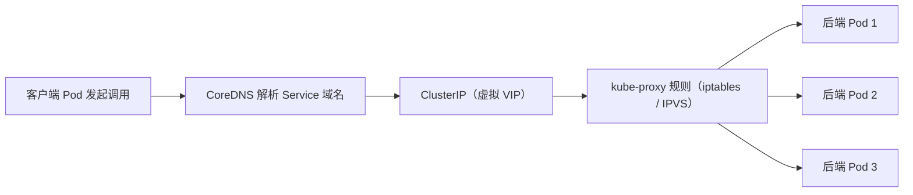

# K8s 服务发现与负载均衡本章小结：kube-proxy 三种模式、gRPC 长连接失效与 ClusterIP/PodIP/nodeIP

本章把 Kubernetes 里的**服务发现（Service Discovery）**和**负载均衡（Load Balancing）**这条主线彻底串了一遍：从 kube-proxy 如何在节点上落地转发规则，到我们在腾讯云 TKE 集群里把"用户积分和等级系统"真正跑起来、看到调用被均衡到不同后端，再到生产里一个非常典型的坑——**gRPC 在 K8s 下的负载均衡会失效**。下面把本章要点收一遍口，顺便把坑讲透。

## 纲要

- 服务发现与负载均衡的整体原理：注册 → 发现 → 转发三步
- kube-proxy 的三种工作模式（userspace / iptables / IPVS）与取舍
- 在 TKE 集群部署用户积分等级系统，验证集群内负载均衡生效
- 生产痛点：gRPC 因"长连接 + HTTP/2 单连接并发"导致 LB 失效，及三种解法
- 集群内调用的三条路径：环境变量 / 直连 ClusterIP / 服务域名（推荐）
- 三个关键 IP 概念：ClusterIP（虚拟 VIP）、PodIP、nodeIP

## 服务发现与负载均衡的整体原理

K8s 里一个 Service 背后的事情可以拆成三步：

1. **服务注册**：Pod 被调度启动后，`EndpointSlice` Controller 会持续把"健康的 Pod IP 列表"维护进 `Endpoints` / `EndpointSlice` 对象，相当于把这个 Service 的后端清单登记好；
2. **服务发现**：客户端不需要记住 Pod IP，只要知道 Service 名字。`CoreDNS` 把 `Service 名.命名空间.svc.cluster.local` 解析成 ClusterIP；同时 kubelet 也会往容器里注入形如 `<SVC>_SERVICE_HOST` / `<SVC>_SERVICE_PORT` 的环境变量（但它依赖 Pod 创建时 Service 已存在，顺序一反就没有——这点下面细说）；
3. **负载均衡**：每个节点上的 `kube-proxy`  watch 到 Service / EndpointSlice 变化后，把"ClusterIP → 后端 Pod"的转发规则写进本机网络栈；客户端访问 ClusterIP 时，流量被透明地均衡到不同后端实例。

这整套机制的目标始终如一：**让每次调用都尽量均衡地落到不同后端实例上**，调用方完全感知不到 Pod 的生灭。



## kube-proxy 的三种工作模式

"负载均衡有好几种方法"——本质就是 kube-proxy 的不同实现模式。它们目标一致，但转发位置和性能差异很大：

| 模式 | 实现位置 | 负载均衡算法 | 性能 | 现状 |
| --- | --- | --- | --- | --- |
| userspace | 用户态进程转发 | 轮询 | 差（多一次拷贝） | 已废弃，仅作兼容 |
| iptables | 内核 netfilter 规则（DNAT） | 随机 / statistic 模块 | 中 | **默认模式** |
| IPVS | 内核哈希表虚拟服务 | rr/wrr/lc 等十余种 | 好（大规模更稳） | 需加载 `ip_vs` 等内核模块 |

> iptables 模式在**连接建立的第一包**就做了 DNAT、选定一个后端；IPVS 模式则在内核维护一张虚拟服务表，后端增删对规则重算的影响更小，节点上 Service/Pod 很多时（上千规模）比 iptables 更稳。是否启用 IPVS 以集群实际配置为准，**建议实测**。

## 在 TKE 集群部署并验证负载均衡

我们在腾讯云创建的 K8s 集群里，把"用户积分等级系统"以多副本 Deployment + Service 的形式部署上去，然后在集群内发起测试调用。可以很直观地看到：不同客户端请求被调度到了**不同的后端实例**——这正是 K8s 帮我们完成了服务发现与负载均衡的证据。

查看后端是否被正确登记，是排障第一步：

```bash
# 看某个 Service 实际对应的后端 Pod 列表
kubectl get endpointslices -n default -l app=user-rank

# 看 Service 分配到的 ClusterIP
kubectl get svc user-rank -n default
```

## 生产痛点：gRPC 负载均衡为什么会失效

这是本章最值得记住的坑。在真实环境用 K8s 跑 gRPC 服务时，**负载均衡经常会"看起来生效、实际失效"**。根因有两点：

1. **长连接**：gRPC 通常维持一个长期 TCP 连接，不会每次调用都新建；
2. **HTTP/2 的单连接并发调用**：gRPC 跑在 HTTP/2 之上，一个连接上多路复用（multiplexing）多个并发请求。

把这两点叠起来就出问题了：kube-proxy 的负载均衡发生在**连接建立那一刻**（首包 DNAT 选定后端），连接一旦建立，这个连接上后续的**所有** HTTP/2 流（无论多少并发请求）都只能落到**同一个**后端 Pod——连接级别被钉死了，多路复用的请求根本没机会再被分发。结果：请求全堆在一两个 Pod 上，其它 Pod 闲着，负载均衡名存实亡。

对应有三种解法，本质上是"把 LB 从连接层挪到请求层 / 客户端 / 网关层"：

- **解法一：避免单连接并发**。调用时尽量用不同连接，而不是只复用同一个连接——简单但连接开销大；
- **解法二：headless Service（推荐做法之一）**。把 ClusterIP 设为 `None`，让 CoreDNS 直接返回后端 Pod 的 IP 列表，负载均衡交给**客户端**自己按请求做（配合 gRPC 的 `round_robin` 策略），彻底绕过 kube-proxy 的 VIP 钉死；
- **解法三：自建 gRPC 网关 / 引入服务网格 sidecar（Envoy 等）**。在 L7 做 per-RPC 的负载均衡，同样要规避"单连接并发调用"导致的失效。

headless Service 的清单长这样（注意要放在 fenced 代码块里，避免模板引擎误解析）：

```yaml
apiVersion: v1
kind: Service
metadata:
  name: user-rank
spec:
  clusterIP: None   # headless：不为 Service 分配 ClusterIP，DNS 直接返回 Pod IP 列表
  selector:
    app: user-rank
  ports:
    - port: 80
      targetPort: 8080
```

```dir
K8s 服务发现与负载均衡（用户积分等级系统）落地结构
├── 控制平面
│   ├── kube-apiserver（写入 Service / EndpointSlice）
│   ├── EndpointSlice Controller（维护健康后端 Pod 列表）
│   └── CoreDNS（Service 域名 → ClusterIP / Pod IP）
├── 数据平面（每个节点）
│   ├── kube-proxy（watch Service 变化写规则）
│   │   ├── userspace 模式（已废弃）
│   │   ├── iptables 模式（默认，DNAT）
│   │   └── IPVS 模式（需 ip_vs 内核模块）
│   └── 节点网络（CNI 分配 PodIP）
└── 业务 Service
    ├── ClusterIP 类型（集群内虚拟 VIP，普通 LB）
    ├── headless Service（clusterIP: None，客户端 LB）
    └── 用户积分等级系统（多副本 Deployment，跑在腾讯云 TKE）
```

## 集群内调用的三条路径

本章最后又回到"集群内服务之间到底怎么调"这个问题。有三种方式，但推荐度不同：

| 调用方式 | 怎么拿到地址 | 可靠性 | 建议 |
| --- | --- | --- | --- |
| 环境变量 | kubelet 注入 `<SVC>_SERVICE_HOST` | 低（Service 须先于 Pod 创建） | 不推荐 |
| 直连 ClusterIP | 手动写死虚拟 IP | 中（IP 可能变） | 不推荐 |
| 服务域名 | `svc.ns.svc.cluster.local` 经 CoreDNS | 高（自动跟随后端变化） | **推荐** |

结论很清楚：尽量用**服务域名**来调用，让域名解析帮你做服务发现——既简单又可靠，不用关心后端 Pod 的生灭。直连 ClusterIP 或读环境变量都不是好选择：环境变量有创建顺序陷阱，ClusterIP 只是个靠 iptables/IPVS 规则映射出来的虚拟地址，并不真正可路由。

## 三个必须分清的 IP

理解服务调用，先把三种 IP 掰清楚：

- **ClusterIP**：Service 的虚拟 VIP，不是真实网卡地址，靠节点上的 iptables/IPVS 规则把流量"骗"到后端 Pod；
- **PodIP**：后端实例的真实地址，由 CNI 插件分配，集群内可路由；
- **nodeIP**：节点本身的 IP（物理机或云上虚拟网卡）。

知道它们分别是什么、谁来分配、是否真实可路由，再看"集群内调用很容易、集群外调用另有门道"就顺理成章了。集群外访问正是下一章 Ingress 要解决的——通过 Ingress / Ingress Controller 把服务收敛成一个统一入口。

## 总结

学完本章，你对 K8s 服务发现与负载均衡应该建立起一条完整的知识链：

1. **三步链路**：服务注册（EndpointSlice）→ 服务发现（CoreDNS / 环境变量）→ 负载均衡（kube-proxy 规则）；
2. **kube-proxy 三种模式**：userspace 已废弃、iptables 为默认（连接级 DNAT）、IPVS 大规模更稳（需内核模块）；
3. **gRPC 失效坑**：长连接 + HTTP/2 单连接并发 → 连接被钉死在一个 Pod，LB 名存实亡；
4. **三种解法**：多连接 / headless Service 客户端 LB / 自建 gRPC 网关或网格 sidecar，核心都是把均衡从"连接层"挪到"请求层"；
5. **推荐用服务域名调用**：环境变量有顺序陷阱、ClusterIP 是虚拟地址，域名解析最省心；
6. **分清三种 IP**：ClusterIP（虚拟）、PodIP（真实，CNI 分）、nodeIP（节点），这是看懂一切调用的地基。

下一章进入 Ingress：把集群内服务通过 Ingress / Ingress Controller 收敛成统一入口。
