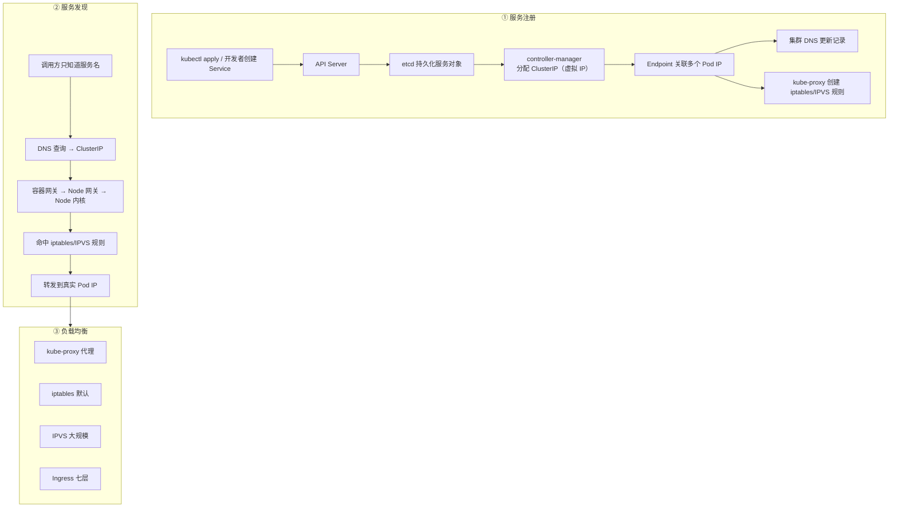

# Kubernetes 认证考点: K8s 服务发现与负载均衡原理 —— 服务注册、DNS 到 Pod IP 的链路与四种负载均衡方案

**这一节了解 K8s 服务发现与负载均衡原理，主要包含三部分：服务注册、服务发现、负载均衡。**

结论先给：**服务注册是把服务信息写进 etcd 并派生出 ClusterIP、Endpoint、DNS 记录和 kube-proxy 规则；服务发现是调用方只知道服务名，通过 DNS 拿到 ClusterIP，再经容器网关 → Node 网关 → Node 内核，由 iptables/IPVS 规则把 ClusterIP 转发到真实的 Pod IP；负载均衡有四种方案 —— kube-proxy 代理（性能最差）、iptables（默认，内核态，只支持随机和轮询）、IPVS（大规模集群推荐，hash table、策略更多、支持健康检查与连接重试）、Ingress（七层网关，用于把集群内服务暴露给集群外）。**

## 纲要

- 三部分：注册、发现、负载均衡
- 服务注册：从 kubectl 到 etcd
- ClusterIP 与 Endpoint 的关联
- DNS 与 kube-proxy 都在监听变更
- 涉及的组件全景
- 服务发现：从服务名到 Pod IP
- 数据在容器、Node、内核之间怎么走
- 负载均衡方案一：kube-proxy 代理
- 负载均衡方案二：iptables（默认）
- 负载均衡方案三：IPVS
- 负载均衡方案四：Ingress（七层网关）
- 四种方案对比
- API 速览、Demo 示例与总结

## 三部分：注册、发现、负载均衡



```text
一次「用服务名调用」背后经过的组件
├── 控制面
│   ├── API Server          接收创建请求，写入 etcd
│   ├── etcd                持久化服务信息
│   └── controller-manager  分配 ClusterIP，维护 Endpoint
├── 节点面
│   ├── kube-proxy          监听变更 → 写 iptables / IPVS 规则
│   └── Node 内核           真正按规则转发
├── 插件
│   └── 集群 DNS            监听变更 → 更新域名→ClusterIP 记录
└── 数据面
    ├── 容器网关 → Node 网关 → 操作系统内核
    └── ClusterIP --(规则)--> Pod IP
```

## 服务注册：从创建到 etcd

**首先是创建服务，这个发起方可能是管理员，也可能是服务开发者或者是运维人员来操作。创建服务需要调用 K8s 的核心组件 API Server，API Server 会把服务信息保存到持久化组件 etcd 中，生成一个新的服务对象。**

## ClusterIP 与 Endpoint 的关联

**controller-manager 监听到有新的服务要创建，就要为这个新的服务对象创建一个 ClusterIP —— 它是一个虚拟 IP，每个服务都会有一个唯一的虚拟 IP。由于是分布式多实例，也就需要创建多个 Pod，这时候 ClusterIP 就会关联上多个 Endpoint（所创建的 Pod）；这个虚拟 IP ClusterIP 是知道后端所有的 Pod IP 的。**

| 概念 | 是什么 | 谁创建 |
| --- | --- | --- |
| **Service 对象** | **服务的定义（选择器、端口）** | **API Server 写入 etcd** |
| **ClusterIP** | **唯一虚拟 IP，不会随 Pod 变化** | **controller-manager** |
| **Endpoint** | **后端 Pod IP:Port 的列表** | **controller-manager 维护** |
| **DNS 记录** | **服务名 → ClusterIP** | **集群 DNS 服务** |
| **转发规则** | **ClusterIP → Pod IP** | **kube-proxy** |

## DNS 与 kube-proxy 都在监听变更

**前面的 ClusterIP 以及 Pod IP 的创建完成之后，集群 DNS 服务也会监听 API Server 得到服务变更通知，然后集群 DNS 服务就会获取集群服务的 ClusterIP 以及 Pod IP 更新自己的 DNS 记录。那么下次通过服务名请求 DNS 时就可以解析到正确的 Pod IP 了。**

**除了集群 DNS 会监听服务信息变更，kube-proxy 组件也会一直监听服务信息变更，也会把最新的服务配置信息拉取一遍，然后创建对应的 IPVS 规则；如果使用的是 iptables 方式，也就是创建对应的 iptables 规则 —— 他们的目的都是一样的：调用 ClusterIP 的时候，知道如何把这个请求转发到正确的 Pod IP 上。**

## 涉及的组件全景

**上面这些工作全部完成，一个服务的注册也就完成了 —— 是不是还挺复杂的？涉及到 API Server、etcd、controller-manager、kube-proxy 等大部分的 K8s 核心组件，还有扩展的插件如 DNS 或者自定义的相关组件，只要是关注服务信息变更的都会参与进来。只有把服务信息完整的保存，并且可以及时地更新，后面的服务发现才可以准确无误。**

## 服务发现：从服务名到 Pod IP

**首先当然是需要调用服务，这时候也只是知道服务名，于是需要通过 DNS 来查询服务名对应的 IP 地址 —— DNS 中会保存最新的服务信息。在服务注册中有讲到：通过 DNS 查询可以获得服务的 ClusterIP。拿到了服务的 IP 地址，就可以建立连接，以及把数据发送到这个 ClusterIP。**

## 数据在容器、Node、内核之间怎么走

**要发送数据，先要通过容器网关 —— 容器网关没有实际的网络处理能力，于是会把数据转发到 node，交给物理节点的机器来处理这个数据；请求物理节点的机器，同样的会把请求发送到 node 网关，由物理节点的机器上的网关来处理这个数据；调用 node 网关要实际的发送数据，也是要经过 node 内核来处理，最后是由操作系统来完成数据的发送。**

**这时候在操作系统处理网络数据的时候，就会遇到之前由 kube-proxy 创建的 IPVS 规则（当然，如果是 iptables 的方式，这里就是 iptables 规则，它们是类似的）—— 为过滤和处理网络请求，根据规则 ClusterIP 会转发到实际的后端 Pod IP 上。后端 Pod IP 就是实际部署的后端服务，调用服务的数据最终连接和发送给 Pod IP，就是最终找到了实际的后端服务。**

```text
数据包的完整路径
服务名 → DNS → ClusterIP
   ↓
容器网关（无实际处理能力，只转发）
   ↓
Node 网关（物理节点机器上的网关）
   ↓
Node 内核 ★ 在这里命中 kube-proxy 下的 IPVS / iptables 规则
   ↓
ClusterIP --DNAT--> Pod IP（真实后端实例）
```

**这个过程有用到 DNS，更多是在容器节点和操作系统内部的数据转发。当然，除了使用 DNS 也还有其他的方式可以找到服务的 ClusterIP（后面也会介绍到）。找到 ClusterIP 之后，后续的数据转发和处理虽然也会有 IPVS、iptables 等不同的规则，但是整个过程是类似的 —— 最终是要把请求发送到服务的后端实例的 Pod IP 上才算成功。**

**咱们使用时非常容易 —— 调用方使用域名来调用后端服务就行。但是 K8s 内部却经过了一系列的封装处理才可以真正的找到实际的后端实例，尤其是在这种分布式系统的部署环境，后端部署的数量很多，它们的 IP 也频繁地发生变化。如果不是由 K8s 来帮助我们自动地管理这些关联的话，咱们自己来维护是不可能完成的任务。**

## 负载均衡方案一：kube-proxy 代理

**当服务有很多后端实例的时候，就需要有负载均衡能力，来把请求合理均匀地分配到不同的 Pod IP 上。K8s 有很多方案来实现负载均衡的能力。**

**第一种是 kube-proxy 组件来实现的负载均衡 —— 这就是把 proxy 真正的作为一个代理服务了，所有的请求都要经过 kube-proxy 这个服务来转发。这种方式的特点是 kube-proxy 的性能压力很大：它既要保证 K8s 的服务注册、服务发现的功能，实时监听和更新服务配置的变更，又要接收容器的请求、转发 —— 这对一个应用程序来说，要做的事情就太多了，对他的依赖和要求也就更高了。由于 kube-proxy 是一个应用程序，通过它来转发的话，性能和效率方面也会比较低，在并发很大的情况下，也容易出现瓶颈。**

## 负载均衡方案二：iptables（默认）

**iptables 是 K8s 负载均衡的默认方式，由 kube-proxy 管理和 node 节点的 iptables 规则。由于 iptables 规则是在操作系统内核中执行的规则，所以性能和效率上还是非常高的 —— 可以快速地找到 ClusterIP 对应的后端 Pod IP 以及高效地转发出去，性能方面比 kube-proxy 的方式要高很多。**

**它的特点是支持的负载均衡策略比较有限，现在只支持随机策略和轮询策略。对于大部分的服务请求没有什么特殊需求，这两种负载均衡策略也就足够了，它们也是使用最多的负载均衡策略。**

## 负载均衡方案三：IPVS

**还有一种方案是使用 IPVS 规则，它的使用和 iptables 看上去有些类似，但实现原理却又完全不一样。iptables 设计是用于防火墙的，对于比较少的规则，没有太多的性能影响；但是如果是一个规模庞大的 K8s 集群，有成千上万个微服务，每个 service 又有很多个 pod，每一个 pod 都是一个 iptables 规则，那么在集群的每个 node 节点上都会有大量的规则，这简直是一个噩梦。**

**所以，如果 K8s 集群的规模很大，建议使用 IPVS 规则做转发和负载均衡 —— IPVS 使用 hash tables 来保存网络转发规则，比 iptables 更有优势。总结一下 IPVS 的特点：它的扩展性更强，性能也非常好，能支持的负载均衡策略更多，而且 IPVS 还支持服务器的健康检查和连接重试。**

| 维度 | iptables | IPVS |
| --- | --- | --- |
| **数据结构** | **顺序链表（规则逐条匹配）** | **hash table（O(1) 查找）** |
| **设计初衷** | **防火墙** | **负载均衡** |
| **大规模表现** | **规则数爆炸，是噩梦** | **扩展性强** |
| **策略** | **随机、轮询** | **更多（rr/lc/dh/sh/sed/nq 等）** |
| **健康检查** | **不支持** | **支持** |
| **连接重试** | **不支持** | **支持** |

## 负载均衡方案四：Ingress（七层网关）

**最后再简单讲一下 Ingress —— 前面的三种方案，无论是 kube-proxy、iptables 还是 IPVS，都是由 kube-proxy 组件在每一个 node 节点上完成服务注册和服务发现，再由 kube-proxy 转发，或者 kube-proxy 配置的 iptables 规则、kube-proxy 配置的 IPVS 规则；这些都是在每一个 node 节点上来完成 ClusterIP 的转发。而 Ingress 则完全不一样 —— 它是一个独立的 API 网关，更像是包装服务的独立的一层服务网关服务。**

**它的特点是七层网关，更多的用来把集群内服务暴露给集群外来访问；七层网关能做的负载均衡策略也是非常多的。它的性能可能没有 iptables/IPVS 强，但是由它统一来管理和屏蔽集群内的服务，放开部分允许的服务，这样在安全上还是非常有必要的 —— 尽量不要默认地把集群内所有的服务都暴露出去，只把真正需要对外服务的个别服务通过 Ingress 暴露出去就行了。**

## 四种方案对比

| 方案 | 层级 | 实现位置 | 性能 | 策略 | 适用场景 |
| --- | --- | --- | --- | --- | --- |
| **kube-proxy 代理** | **四层** | **用户态应用** | **低，并发大易瓶颈** | **—** | **几乎不用** |
| **iptables** | **四层** | **Node 内核** | **高** | **随机、轮询** | **默认，中小集群** |
| **IPVS** | **四层** | **Node 内核（hash table）** | **高且可扩展** | **更多 + 健康检查 + 重试** | **大规模集群** |
| **Ingress** | **七层** | **独立 API 网关** | **不如前两者** | **非常多** | **对外暴露，安全收敛** |

## API 速览

| 能力 | 做法 | 关键点 |
| --- | --- | --- |
| **看服务对象** | **`kubectl get svc`** | **ClusterIP 在这里** |
| **看后端实例** | **`kubectl get endpoints`** | **ClusterIP 关联的 Pod IP 列表** |
| **看转发模式** | **`kubectl get configmap kube-proxy -n kube-system`** | **`mode: iptables` 还是 `ipvs`** |
| **集群内解析** | **`nslookup <服务名>.<ns>.svc.cluster.local`** | **DNS 返回 ClusterIP** |
| **看 iptables 规则** | **`iptables -t nat -L KUBE-SERVICES`** | **ClusterIP → Pod IP 的 DNAT** |
| **看 IPVS 规则** | **`ipvsadm -Ln`** | **hash table 形态** |
| **对外暴露** | **Ingress 资源 + Ingress Controller** | **只暴露真正需要的服务** |

## Demo 示例

负载均衡的「随机 / 轮询」两种策略，以及 iptables（顺序匹配）和 IPVS（hash 查找）的规则规模差异，用标准库就能跑出对比：

```go
package main

import (
	"fmt"
	"math/rand"
	"sort"
	"time"
)

// ---------- 后端实例（Endpoint 里的 Pod IP） ----------

var podIPs = []string{"10.244.1.5", "10.244.1.6", "10.244.2.7", "10.244.2.8"}

// ---------- 策略一：随机（iptables 支持的两种之一） ----------

type RandomLB struct{ rnd *rand.Rand }

func (l *RandomLB) Pick() string {
	return podIPs[l.rnd.Intn(len(podIPs))]
}

// ---------- 策略二：轮询（iptables 支持的另一种） ----------

type RoundRobinLB struct{ idx int }

func (l *RoundRobinLB) Pick() string {
	ip := podIPs[l.idx%len(podIPs)]
	l.idx++
	return ip
}

// ---------- 规则表：iptables 顺序匹配 vs IPVS hash 查找 ----------

// IPTablesRules 顺序链表：规则数随 Pod 数线性增长，查找要逐条匹配
type IPTablesRules struct {
	rules []string // 每条规则形如 "ClusterIP:Port -> PodIP:Port"
}

func (t *IPTablesRules) Lookup(clusterIP string) (string, int) {
	steps := 0
	for _, r := range t.rules {
		steps++
		if len(r) >= len(clusterIP) && r[:len(clusterIP)] == clusterIP {
			return r, steps // 命中
		}
	}
	return "", steps
}

// IPVSRules hash table：查找复杂度与规则数无关
type IPVSRules struct {
	table map[string]string
}

func (t *IPVSRules) Lookup(clusterIP string) (string, int) {
	v := t.table[clusterIP]
	return v, 1 // hash 查找，一步到位
}

func main() {
	rnd := rand.New(rand.NewSource(time.Now().UnixNano()))

	// ① 两种策略各打 12 次，统计分布
	counts := map[string]int{}
	rlb := &RandomLB{rnd: rnd}
	rrlb := &RoundRobinLB{}
	for i := 0; i < 12; i++ {
		counts["随机:"+rlb.Pick()]++
		counts["轮询:"+rrlb.Pick()]++
	}
	keys := make([]string, 0, len(counts))
	for k := range counts {
		keys = append(keys, k)
	}
	sort.Strings(keys)
	fmt.Println("== 负载均衡策略分布（12 次调用）==")
	for _, k := range keys {
		fmt.Printf("  %-22s %d 次\n", k, counts[k])
	}

	// ② 规则规模对比：服务数 × 每服务 Pod 数
	services := 1000
	podsPerSvc := 10
	total := services * podsPerSvc

	ipt := &IPTablesRules{}
	ipvs := &IPVSRules{table: map[string]string{}}
	for s := 0; s < services; s++ {
		clusterIP := fmt.Sprintf("10.96.%d.%d", s/256, s%256)
		for p := 0; p < podsPerSvc; p++ {
			podIP := fmt.Sprintf("10.244.%d.%d", s%256, p)
			ipt.rules = append(ipt.rules, clusterIP+" -> "+podIP)
		}
		ipvs.table[clusterIP] = fmt.Sprintf("10.244.%d.1", s%256)
	}

	target := "10.96.3.232" // 故意取靠后的服务
	_, stepsIPT := ipt.Lookup(target)
	_, stepsIPVS := ipvs.Lookup(target)

	fmt.Printf("\n== 规则规模：%d 个服务 × %d 个 Pod = %d 条规则 ==\n", services, podsPerSvc, total)
	fmt.Printf("  iptables 顺序匹配命中第 %d 条规则（最坏 %d 条）\n", stepsIPT, total)
	fmt.Printf("  IPVS hash 查找步数 %d（与规则总数无关）\n", stepsIPVS)
	fmt.Println("  → 集群规模大时，iptables 的规则数是个噩梦，建议切 IPVS")
}
```

命令行侧的自查：

```bash
# ① 看服务的 ClusterIP 与后端 Endpoint
kubectl get svc usergrowth -o wide
kubectl get endpoints usergrowth

# ② 集群内解析服务名（拿到的是 ClusterIP，不是 Pod IP）
kubectl run dns-test --rm -it --image=busybox:1.28 -- \
  nslookup usergrowth.default.svc.cluster.local

# ③ 看 kube-proxy 当前用的哪种模式
kubectl get configmap kube-proxy -n kube-system -o yaml | grep -i mode

# ④ 到节点上看规则
iptables -t nat -L KUBE-SERVICES -n | head    # iptables 模式
ipvsadm -Ln                                    # IPVS 模式
```

## 总结

1. **三部分内容**：**这一节了解 K8s 服务发现与负载均衡原理，包含三部分 —— 服务注册（创建服务，服务的信息需要注册到 K8s 中）、服务发现（怎么通过服务名找到服务信息）、负载均衡（调用服务地址可以均匀分散地请求到多个后端实例）**；
2. **服务信息变更也要关注**：**其实除了服务注册时需要关注服务信息，也包括服务变更的时候同样要关注服务信息，这些信息都是统一由 K8s 来管理的**；
3. **服务发现要解决 IP 频繁变化**：**调用方只知道服务名，但要请求到这个服务还需要更多信息，比如服务部署的后端实例的 IP 和端口号；尤其是 IP 地址在 K8s 集群中会经常发生变更（实例数量变化、实例发生重启等都会造成后端实例 IP 变化），因为服务名是不会变化的，所以需要根据服务名正确找到更多的服务信息**；
4. **创建服务先进 etcd**：**创建服务的发起方可能是管理员、服务开发者或者运维人员；创建服务需要调用 K8s 的核心组件 API Server，API Server 会把服务信息保存到持久化组件 etcd 中，生成一个新的服务对象**；
5. **ClusterIP 是唯一虚拟 IP**：**controller-manager 监听到有新的服务要创建，就要为这个新的服务对象创建一个 ClusterIP —— 它是一个虚拟 IP，每个服务都会有一个唯一的虚拟 IP**；
6. **ClusterIP 通过 Endpoint 关联 Pod**：**由于是分布式多实例，需要创建多个 Pod，这时候 ClusterIP 就会关联上多个 Endpoint（所创建的 Pod）；这个虚拟 IP ClusterIP 是知道后端所有的 Pod IP 的**；
7. **DNS 与 kube-proxy 都监听变更**：**集群 DNS 服务也会监听 API Server 得到服务变更通知，然后获取集群服务的 ClusterIP 以及 Pod IP 更新自己的 DNS 记录，下次通过服务名请求 DNS 时就可以解析到正确的 Pod IP；除了 DNS，kube-proxy 组件也会一直监听服务信息变更，把最新的服务配置信息拉取一遍，然后创建对应的 IPVS 规则（iptables 方式就是创建 iptables 规则）—— 目的都一样：调用 ClusterIP 的时候知道如何把请求转发到正确的 Pod IP 上**；
8. **涉及几乎所有核心组件**：**一个服务的注册涉及到 API Server、etcd、controller-manager、kube-proxy 等大部分 K8s 核心组件，还有扩展的插件如 DNS 或者自定义组件 —— 只要关注服务信息变更的都会参与进来；只有把服务信息完整保存并及时更新，后面的服务发现才可以准确无误**；
9. **发现链路：DNS → ClusterIP → 内核规则 → Pod IP**：**调用时只知道服务名，通过 DNS 查询服务名对应的 IP 地址（DNS 中保存最新的服务信息），拿到 ClusterIP 后建立连接发送数据；发送数据先通过容器网关（没有实际网络处理能力）→ 转发到 node → node 网关 → node 内核 → 由操作系统完成数据发送；操作系统处理网络数据时就会遇到 kube-proxy 创建的 IPVS/iptables 规则，根据规则 ClusterIP 转发到实际的后端 Pod IP**；
10. **自己维护是不可能完成的任务**：**使用时调用方使用域名调用后端服务就行，但 K8s 内部经过一系列封装处理才能找到实际后端实例；尤其在分布式部署环境下后端数量很多、IP 频繁变化，如果不是 K8s 自动管理这些关联，自己来维护是不可能完成的任务**；
11. **kube-proxy 代理方式压力最大**：**第一种是把 proxy 真正作为代理服务，所有请求都经过 kube-proxy 转发 —— 它既要保证服务注册、服务发现、实时监听和更新配置变更，又要接收容器请求转发，性能压力很大；作为应用程序转发性能和效率也比较低，并发大时容易出现瓶颈**；
12. **iptables 是默认方式**：**iptables 是 K8s 负载均衡的默认方式，由 kube-proxy 管理 node 节点的 iptables 规则；规则在操作系统内核中执行，性能和效率非常高，可以快速找到 ClusterIP 对应的后端 Pod IP 并高效转发出去，性能比 kube-proxy 方式高很多；特点是支持的策略有限，现在只支持随机策略和轮询策略 —— 对大部分服务请求没有特殊需求，这两种也就足够了，也是使用最多的**；
13. **IPVS 适合大规模集群**：**IPVS 的使用和 iptables 看上去类似，但实现原理完全不一样 —— iptables 设计用于防火墙，规则少时影响不大，但规模庞大的集群有成千上万个微服务、每个 service 又有很多 pod，每一个 pod 都是一个 iptables 规则，那么每个 node 节点上都会有大量规则，这简直是噩梦；所以集群规模很大建议使用 IPVS：它使用 hash tables 保存网络转发规则，扩展性更强、性能非常好、支持的负载均衡策略更多，还支持服务器的健康检查和连接重试**；
14. **Ingress 是独立的七层网关**：**前面三种方案都是由 kube-proxy 在每一个 node 节点上完成服务注册发现和 ClusterIP 转发；Ingress 完全不一样 —— 它是一个独立的 API 网关，更像是包装服务的独立一层服务网关；特点是七层网关，更多用来把集群内服务暴露给集群外访问，能做的负载均衡策略非常多；性能可能没有 iptables/IPVS 强，但由它统一管理、屏蔽集群内服务，只放开部分允许的服务，在安全上非常有必要的 —— 尽量不要默认把集群内所有服务都暴露出去，只把真正需要对外服务的个别服务通过 Ingress 暴露出去就行了。**

