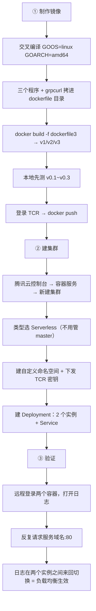

# Kubernetes 认证考点: 测试 K8s 服务的负载均衡 —— 制作镜像、TCR 推送、建集群与双实例验证

**这一节做一下负载均衡的测试，要做几件事情：第一，把服务制作成可以运行的镜像，然后把镜像推送到腾讯云的 TCR 仓库里面；第二，在腾讯云上面再次创建一个 K8s 集群（之前有做过这方面的演示，这次为了测试负载均衡，把集群的创建和服务的部署再做一遍）；最后就是把服务部署到集群里面去，部署完成之后验证服务的调用，看看它的负载均衡是不是跟预期一样，能达到多实例的均匀调度。**

结论先给：**验证方法很朴素 —— 把实例数设为两个，分别远程登录两个容器把日志打出来，然后反复用服务域名发起调用，看日志是不是在两个实例之间来回切换。** 这次只验证「访问是否正常」，**数据库还没有部署好（服务端会报连不上 mysql 3306），但只要请求到了服务端，负载均衡就是生效的。**

## 纲要

- 三件事：做镜像、建集群、验证
- 三个 Dockerfile 版本的差异
- 交叉编译必须带 GOOS/GOARCH
- dockerfile1：alpine 最小镜像
- 环境变量与启动脚本
- dockerfile2：golang 基础镜像
- dockerfile3：推荐版本
- 本地版本与服务端版本的区分
- 推送到 TCR 前要登录
- 建集群：Serverless 与命名空间密钥
- 部署：两个实例 + 三个端口
- 验证：两个容器日志来回切换
- API 速览、Demo 示例与总结

## 三件事：做镜像、建集群、验证



```text
usergrowth/
└── dockerfile/usergrowth/            镜像制作目录
    ├── dockerfile1                   最小镜像（alpine，几兆）
    ├── dockerfile2                   golang 基础镜像（三百多兆）
    ├── dockerfile3                   ★ 推荐：本地编译好 grpcurl 直接 COPY
    ├── main_client                   gRPC 服务的 client
    ├── main_server                   gRPC 服务的 server
    ├── webapi                        gin 开发的 web api / webserver
    ├── grpcurl                       基于 grpcurl 源码编译出来的工具
    └── startup.sh                    容器启动脚本（运行两个程序）
```

## 三个 Dockerfile 版本的差异

**制作镜像这个过程就不全部再演示一遍了 —— 整个过程的操作文档都已经整理出来了。拿到项目的源码之后，可以在 `dockerfile` 目录下面看到一个 `usergrowth` 的目录，在这个目录里面有三个 dockerfile 文件，因为我们制作了三个版本的镜像，它们的差别非常小。所以大家用的时候，用每一个都差不多 —— 这里推荐使用 dockerfile3，这个版本是在前面的基础上增加了 grpcurl 工具。**

| 版本 | 基础镜像 | 特点 | 建议 |
| --- | --- | --- | --- |
| **dockerfile1** | **alpine** | **几兆，最基础最小** | **够用，但没有 grpcurl** |
| **dockerfile2** | **golang** | **三百多兆，镜像里能 `go build`/`install` 装 grpcurl** | **镜像大** |
| **dockerfile3** | **alpine** | **本地编译好 grpcurl 直接 COPY 进去** | **★ 推荐，镜像非常小** |

## 交叉编译必须带 GOOS/GOARCH

**第一步，根据文档来操作的话，先进入代码目录，然后编译这三个应用程序 —— 一个是 gRPC 服务的 client，一个是 gin 框架开发的 web api（一个 webserver），然后是 gRPC 服务的 server。这三个程序需要注意前面加上这些参数：因为我们要制作的镜像是在 linux 环境运行的，而且它的架构是 amd64 架构；如果不加这些参数的话，默认是当前的 macOS 以及本地的 M1 芯片，这样编译出来的程序在服务器上是运行不了的。**

```bash
# 目标：linux + amd64（服务器上运行）
GOOS=linux GOARCH=amd64 go build -o main_server ./main_server
GOOS=linux GOARCH=amd64 go build -o main_client ./main_client
GOOS=linux GOARCH=amd64 go build -o webapi     ./gin

# grpcurl：拉取源码后同样交叉编译
git clone https://github.com/fullstorydev/grpcurl.git
cd grpcurl/cmd/grpcurl
GOOS=linux GOARCH=amd64 go build -o grpcurl .

# 编译完之后把生成出来的文件移到 dockerfile 所在目录
mv main_server main_client webapi grpcurl ../../dockerfile/usergrowth/
```

| 场景 | 参数 | 说明 |
| --- | --- | --- |
| **服务端镜像** | **`GOOS=linux GOARCH=amd64`** | **不加会在服务器上跑不起来** |
| **本地测试版本** | **不加** | **默认就是本地能运行的程序** |

## dockerfile1：alpine 最小镜像

**dockerfile1 是最基础的、也是最小的一个镜像，它使用的是 alpine —— 这个操作系统是极小的一个操作系统，只有几兆。先把软件包更新，然后加上一个可能用到的 curl 工具，然后创建代码的运行目录，把编译好的这几个应用程序复制到这个目录里面去，再设置它为当前工作目录。**

```dockerfile
FROM alpine:latest
RUN apk update && apk add --no-cache curl
RUN mkdir -p /app
COPY main_server main_client webapi /app/
WORKDIR /app
ENV usergrowth_config='{"db":{"type":"mysql","user_name":"root","password":"123456","host":"127.0.0.1","port":3306,"database":"usergrowth","charset":"utf8mb4"}}'
RUN echo -e '#!/bin/sh\n./main_server &\n./webapi &\nwait' > /app/startup.sh
RUN chmod +x /app/startup.sh
EXPOSE 80 8080 8081
CMD ["/app/startup.sh"]
```

## 环境变量与启动脚本

**这里还有一个 `ENV` 命令，用来设置一个环境变量 `usergrowth_config` —— 里面的配置信息是数据库的用户名、密码、host、port 这些，大家相应的改一下就行了。我们这一次还没有把数据库部署好，所以就没有去做这里的针对性配置，还是保持像本地一样的配置。因为我们这一次也只是测试服务的访问是否正常 —— 虽然这个服务没有配置调数据库肯定是不正常的，但是我们只需要知道它的访问是否正常就好了；我们的目标是把实战项目的应用程序启动，它们在服务器都能够运行起来，目标就达到了。**

**接下来要生成一个 `startup.sh` 作为容器的启动脚本 —— 我们把 shell 代码通过 `echo` 命令输出到这个文件里面去。来看这个文件的内容：运行我们的两个程序，一个是 gRPC 的服务，一个是 web api 的服务（里面有 gin 框架开发的 web 服务，也有 grpc-gateway 开发出来的 web 服务），把这两个程序都启动起来了。这个地方也需要导出几个端口：80 端口是 gRPC 的服务端口，8080 是 gin 框架开发的 webserver，8081 是 grpc-gateway 开发的那个 webserver。最后 `CMD` 命令执行一下这个脚本就好了。**

| 端口 | 服务 |
| --- | --- |
| **80** | **gRPC 服务** |
| **8080** | **gin 框架开发的 webserver** |
| **8081** | **grpc-gateway 开发的 webserver** |

## dockerfile2 与 dockerfile3

**dockerfile2 的基础镜像变了 —— 这个镜像比较大，相对 alpine 的镜像大了很多，golang 的这个镜像已经有三百多兆了。这个镜像里面安装了 golang，可以执行 `go build`、`go install`，这些在镜像里面下载和安装 grpcurl 工具，下面这些内容都是一样的。**

**最后 dockerfile3 也用了最小的这个版本 —— 唯一的差别就是我们把那个 grpcurl 程序，直接从本地编译好了，然后 copy 进去了。这样就不需要在镜像里面去做编译的处理，所以这个镜像会非常小，下面的这些都是一样的。**

**这里给一点建议：如果需要用 grpcurl 的话，就用 dockerfile3 生成的镜像。**

## 本地版本与服务端版本

**然后下面 `docker build` 制作相应的版本，有 v1、v2 和 v3；然后在本地也要先做测试 —— 所以本地用的是 v0.1、v0.2 和 v0.3，在本地来启动（验证脚本都已经有了）。本地测试通过了，我们再去构建服务端的镜像，就是 v1、v2、v3。**

**当然，这里执行 `docker build` 要注意一点 —— 本地的版本不需要把前面这些参数带上。所以在使用 `go build` 编译项目代码时需要调整一下：在本地验证的时候，就不需要指定架构了，默认的就是我们本地能运行的程序，就这一个区别。**

```bash
# 本地版本（不带交叉编译参数）
go build -o main_server ./main_server
docker build -f dockerfile3 -t usergrowth:v0.3 .

# 服务端版本（带 GOOS/GOARCH）
docker build -f dockerfile3 -t "$TCR_REGISTRY/$TCR_NS/usergrowth:v3" .
```

## 推送到 TCR 前要登录

**本地跑起来没问题了，推送到 TCR 服务端之前，当然需要去登录一下 TCR 的服务和账号 —— 大家自己申请免费的 TCR 共享实例，应该也会有这种域名和账号，登录上去就好了。然后把本地的版本推送到 TCR 服务端去，这样就完成了服务端镜像的制作以及推送到镜像仓库。**

```bash
TCR_REGISTRY="ccr.ccs.tencentyun.com"   # 镜像仓库域名，按自己申请到的改
TCR_NS="myrepo"                          # 命名空间
TCR_USER="100000000000"                  # 申请免费的 TCR 共享实例后会有账号

docker login "$TCR_REGISTRY" --username="$TCR_USER"
docker push "$TCR_REGISTRY/$TCR_NS/usergrowth:v3"
```

## 建集群：Serverless 与命名空间密钥

**接下来去腾讯云上面再创建一下 K8s 集群 —— 进到控制台里面来，地域这个地方选择广州（大家也可以选择香港或者其他地方，哪个地方更快就选择哪个地方就好了）。在容器服务的集群这个地方来新建集群 —— 这里还是直接选 Serverless 类似这种类型，我们不需要去维护 K8s 集群的 master 节点，只需要采购弹性的超级节点就好了，会更方便很多也会便宜很多。**

**然后创建集群，起一个名字就叫 `testk8s`；K8s 版本的话默认最新的版本就好了；地域、网络、区域还是按量计费，子网之前都创建过，所以用以前创建过的就好了；其他默认就这样去创建了 —— 创建集群的过程可能会需要两三分钟时间，所以需要稍等一下。**

**创建完之后，要创建一个自定义的命名空间；命名空间里有一个设置，就是镜像仓库的密钥 —— 它可以自动把 TCR 的密钥下发，这样的话，K8s 集群就可以在这个命名空间下面拉取相应的镜像了。**

## 部署：两个实例 + 三个端口

**接下来要把这个服务部署上去，然后要新建一个部署 —— 用刚才创建的命名空间，选一下刚才创建的镜像，容器名称、镜像这些都默认不用去设置；镜像我们选 `usergrowth`，版本这个地方选 v3（v3 里面增加了 grpcurl 工具）；还有这些环境变量 —— 这个是我们自己定义的 `usergrowth_config`，里面有数据库相关的配置；容器的端口号我们有三个端口：80、8080、8081，对应的是 gRPC、gin 框架的 webserver 和 gateway 的 webserver；实例数我们选择两个 —— 毕竟这个服务要测试 K8s 的负载均衡，如果只有一个实例就没法测试了；凭证、默认的调度这些都不用改；Service 也是这个地方一起创建的（集群内访问，我们不需要外网访问，LB 就不选了），端口映射跟前面的一样。**

| 配置项 | 取值 |
| --- | --- |
| **集群类型** | **Serverless（不用维护 master）** |
| **命名空间** | **自定义，并下发 TCR 密钥** |
| **镜像** | **`usergrowth:v3`（含 grpcurl）** |
| **环境变量** | **`usergrowth_config`（数据库配置）** |
| **容器端口** | **80 / 8080 / 8081** |
| **实例数** | **2（测试负载均衡的前提）** |
| **Service** | **集群内访问，不开外网 LB** |

**有一个实操坑：控制台上 Service 和 Deployment 一起创建时，可能出现 Service 已经创建成功但 Deployment 没有创建成功的情况 —— 那就重新再来一遍，这次 Service 不创建了（前面已经创建过），单独创建 Deployment。**

## 验证：两个容器日志来回切换

**我们需要登录到服务器上来做验证 —— 到工作负载里面，Deployment 进到我们的一个部署里面来，现在有两个容器，可以在这个地方直接远程登录。两个都要登录，把这些日志都打印出来，因为接下来有请求的话，在日志中是能够看到变化的。**

**再用一下 gRPC 客户端来调用 —— 这个地址使用域名的方式：`usergrowth.<命名空间>.svc.cluster.local`，端口是 80。我们能看到是能够请求成功的：客户端能够请求到 gRPC 服务端，只不过 gRPC 服务端返回了一个报错，因为它无法连接到 mysql 的 3306 端口（原因是我们的数据库配置还有问题，我们在线上还没有创建数据库呢，所以服务端是会报错的）。但是我们的请求是到了服务端的。**

```bash
# ① 用 gRPC 客户端调用（服务域名 + 80 端口）
./main_client usergrowth.usergrowth.svc.cluster.local:80
# 返回 3306 连接报错 → 说明请求已经到了服务端

# ② 用 grpcurl 列服务（v3 镜像自带）
grpcurl -plaintext usergrowth.usergrowth.svc.cluster.local:80 list

# ③ gin 的 webserver（8080）
curl usergrowth.usergrowth.svc.cluster.local:8080/hello
curl usergrowth.usergrowth.svc.cluster.local:8080/v1/usergrowth/usercoin/listtask

# ④ grpc-gateway 的 webserver（8081）
curl usergrowth.usergrowth.svc.cluster.local:8081/v1/usergrowth/usercoin/listtask
```

**然后我们看一下服务端的日志 —— 这一个实例上面是有日志的，这一个上面还没有，因为只有一次请求。我们再来请求一次，同样的还是会返回 3306 端口的报错，说明也是到了服务端的。**

**再来一次，后面这个机器有变化，这个机器没变化；再来一次，大家看到了这个过程 —— 我们请求的话，这台机器会有变化，另一台机器没有；再请求一次就会变成另一台机器有变化，这一台没有。所以这个就是负载均衡的作用 —— 会在两个实例之间循环地转发请求。**

| 调用方式 | 现象 | 说明 |
| --- | --- | --- |
| **gRPC 客户端** | **两个实例的日志来回切换** | **负载均衡生效** |
| **grpcurl `list`** | **能列出 service 列表** | **说明请求到了 gRPC 服务端** |
| **gin 8080 `/hello`** | **返回 hello** | **webserver 正常** |
| **gin 8080 `/listtask`** | **返回 3306 报错** | **请求到了，只是数据库有问题** |
| **gateway 8081** | **两个实例之间切换** | **同样负载均衡生效** |

## API 速览

| 能力 | 做法 | 关键点 |
| --- | --- | --- |
| **交叉编译** | **`GOOS=linux GOARCH=amd64 go build`** | **不加会在服务器跑不起来** |
| **最小镜像** | **`FROM alpine` + `COPY` 编译好的程序** | **几兆，推荐** |
| **装 grpcurl** | **本地编译好再 COPY（dockerfile3）** | **别在镜像里编译，镜像会很大** |
| **启动脚本** | **`startup.sh` 起 gRPC + webapi，`CMD` 执行** | **导出 80/8080/8081** |
| **配置注入** | **`ENV usergrowth_config='{...}'`** | **数据库用户名密码 host port** |
| **推送** | **`docker login` + `docker push`** | **先登录 TCR** |
| **建集群** | **Serverless 类型 + 超级节点** | **不用维护 master，便宜** |
| **拉镜像** | **命名空间下发 TCR 密钥** | **否则拉不到私有镜像** |
| **实例数** | **2 个** | **测负载均衡的前提** |
| **验证** | **两个容器都开日志，反复请求看切换** | **日志来回变 = 生效** |

## Demo 示例

「两个实例之间循环转发请求」这件事，用标准库就能把验证过程模拟出来 —— 下面这段代码等价于在两个容器上各开一个日志计数器，然后反复请求看它落在哪个实例：

```go
package main

import (
	"fmt"
	"sync"
)

// Instance 模拟一个 Pod 实例：每次接到请求就记一条日志
type Instance struct {
	name string
	mu   sync.Mutex
	logs int
}

func (i *Instance) Serve(done chan<- string) {
	i.mu.Lock()
	i.logs++
	i.mu.Unlock()
	done <- i.name
}

// ClusterIPService 模拟 Service：ClusterIP 后面挂两个实例，轮询分发
type ClusterIPService struct {
	instances []*Instance
	idx       int
	mu        sync.Mutex
}

// Call 对应一次「请求服务域名:端口」的调用
func (s *ClusterIPService) Call() string {
	s.mu.Lock()
	inst := s.instances[s.idx%len(s.instances)]
	s.idx++
	s.mu.Unlock()

	done := make(chan string, 1)
	inst.Serve(done)
	return <-done
}

func (s *ClusterIPService) Report() {
	for _, i := range s.instances {
		i.mu.Lock()
		fmt.Printf("  实例 %s 日志条数: %d\n", i.name, i.logs)
		i.mu.Unlock()
	}
}

func main() {
	svc := &ClusterIPService{instances: []*Instance{
		{name: "pod-1 (10.244.1.5)"},
		{name: "pod-2 (10.244.2.7)"},
	}}

	fmt.Println("== 模拟 6 次请求，观察日志落在哪个实例 ==")
	for i := 1; i <= 6; i++ {
		hit := svc.Call()
		fmt.Printf("第 %d 次请求 → 落在 %s\n", i, hit)
	}

	fmt.Println("\n== 两个实例的日志统计 ==")
	svc.Report()
	fmt.Println("→ 日志在两个实例之间来回变化，说明负载均衡生效")
	fmt.Println("→ 本例中服务端会返回 mysql 3306 连接报错，但请求确实到了服务端")
}
```

一次完整的镜像制作与推送：

```bash
# ① 交叉编译（linux + amd64）
GOOS=linux GOARCH=amd64 go build -o main_server ./main_server
GOOS=linux GOARCH=amd64 go build -o main_client ./main_client
GOOS=linux GOARCH=amd64 go build -o webapi     ./gin

# ② 本地先跑一遍（不带交叉编译参数的版本）
docker build -f dockerfile3 -t usergrowth:v0.3 .
docker run --rm -p 80:80 -p 8080:8080 -p 8081:8081 usergrowth:v0.3

# ③ 构建服务端版本并推送
docker build -f dockerfile3 -t ccr.ccs.tencentyun.com/myrepo/usergrowth:v3 .
docker login ccr.ccs.tencentyun.com --username=myaccount
docker push ccr.ccs.tencentyun.com/myrepo/usergrowth:v3
```

## 总结

1. **三件事：做镜像、建集群、验证**：**第一把服务制作成可以运行的镜像，然后把镜像推送到腾讯云的 TCR 仓库；第二在腾讯云上面再次创建一个 K8s 集群（这次为了测试负载均衡，把集群的创建和服务的部署再做一遍）；最后把服务部署到集群里面去，部署完成之后验证服务的调用，看看负载均衡是不是跟预期一样，能达到多实例的均匀调度**；
2. **三个 dockerfile 差别很小**：**拿到项目源码之后，可以在 `dockerfile` 目录下看到一个 `usergrowth` 目录，里面有三个 dockerfile 文件（制作了三个版本的镜像），它们的差别非常小，用每一个都差不多 —— 这里推荐使用 dockerfile3，这个版本是在前面的基础上增加了 grpcurl 工具**；
3. **交叉编译必须带参数**：**编译这三个应用程序（gRPC 服务的 client、gin 框架开发的 web api、gRPC 服务的 server）时，前面需要加上参数 —— 因为制作的镜像是在 linux 环境运行、架构是 amd64；如果不加，默认是当前的 macOS 以及本地的 M1 芯片，编译出来的程序在服务器上是运行不了的**；
4. **grpcurl 也要编译进去**：**增加一个 grpcurl 工具 —— 这个工具我们也可以在本地编译好，同样打包到镜像里面去（拉取代码、进到源码里面去 `go build`），在镜像里面用就会很简单了；编译出来之后把文件移到当前目录下面来**；
5. **dockerfile1 是最小镜像**：**它使用的是 alpine —— 这个操作系统是极小的一个操作系统，只有几兆；先把软件包更新，加上可能用到的 curl 工具，创建代码的运行目录，把编译好的几个应用程序复制到这个目录里面去，再设置它为当前工作目录**；
6. **环境变量注入数据库配置**：**还有一个 `ENV` 命令设置环境变量 `usergrowth_config`，里面的配置信息是数据库的用户名、密码、host、port 这些（大家相应改一下）；这一次还没有把数据库部署好，所以保持像本地一样的配置 —— 我们只是测试服务访问是否正常，虽然服务没配数据库肯定不正常，但只要知道访问是否正常就好了；目标是把实战项目的应用程序启动，它们在服务器都能够运行起来**；
7. **启动脚本跑两个程序、导三个端口**：**生成一个 `startup.sh` 作为容器的启动脚本（通过 `echo` 命令把 shell 代码输出进去）—— 运行两个程序：一个是 gRPC 的服务，一个是 web api 的服务（里面有 gin 框架开发的 web 服务，也有 grpc-gateway 开发出来的 web 服务）；导出几个端口 —— 80 是 gRPC 服务端口，8080 是 gin 开发的 webserver，8081 是 grpc-gateway 开发的 webserver；最后 `CMD` 执行一下这个脚本就好了**；
8. **dockerfile2 大而全，dockerfile3 推荐**：**dockerfile2 的基础镜像变了 —— golang 这个镜像已经有三百多兆了，相对 alpine 大了很多；这个镜像里面安装了 golang，可以在镜像里面下载和安装 grpcurl 工具；dockerfile3 也用了最小版本，唯一差别是把 grpcurl 程序直接从本地编译好 copy 进去，不需要在镜像里做编译处理，所以镜像会非常小 —— 如果需要用 grpcurl，就用 dockerfile3 生成的镜像**；
9. **本地版本和服务端版本分开**：**`docker build` 制作相应的版本有 v1、v2、v3；本地也要先做测试，用的是 v0.1、v0.2、v0.3；本地测试通过了我们再去构建服务端的镜像 v1、v2、v3；注意本地版本不需要把交叉编译参数带上 —— 在本地验证时不需要指定架构，默认就是本地能运行的程序，就这一个区别**；
10. **推送前要登录 TCR**：**本地跑起来没问题了，推送到 TCR 服务端之前需要登录一下 TCR 的服务和账号（申请免费的 TCR 共享实例会有域名和账号），然后把本地的版本推送到 TCR 服务端去**；
11. **集群选 Serverless 更省事**：**到腾讯云控制台创建集群，地域选广州（也可以选香港或其他地方，哪个更快选哪个）；集群类型直接选 Serverless 类似这种类型 —— 不需要去维护 K8s 集群的 master 节点，只需要采购弹性的超级节点，会更方便很多也会便宜很多；K8s 版本默认最新，按量计费，创建过程可能需要两三分钟**；
12. **命名空间要下发镜像密钥**：**创建完之后要创建一个自定义的命名空间；命名空间里有一个设置就是镜像仓库的密钥，它可以自动把 TCR 的密钥下发，这样 K8s 集群就可以在这个命名空间下面拉取相应的镜像了**；
13. **部署要两个实例、三个端口**：**新建一个部署，选刚才创建的镜像 `usergrowth`、版本选 v3（v3 里面增加了 grpcurl 工具）；环境变量是自定义的 `usergrowth_config`（数据库相关配置）；容器端口三个：80、8080、8081，对应 gRPC、gin 的 webserver 和 gateway 的 webserver；实例数选择两个 —— 毕竟要测试负载均衡，只有一个实例就没法测试了；Service 也一起创建（集群内访问，不需要外网访问，LB 就不选了）**；
14. **控制台的一个坑**：**可能出现 Service 已经创建成功但 Deployment 没有创建成功的情况 —— 那就重新再来一遍，这次 Service 不创建了（前面已经创建过），单独创建 Deployment**；
15. **验证靠两个容器的日志切换**：**远程登录两个容器，把日志都打印出来（有请求的话日志中是能够看到变化的）；用 gRPC 客户端调用，地址使用域名的方式 `usergrowth.<命名空间>.svc.cluster.local`、端口 80 —— 能够请求成功（服务端返回连不上 mysql 3306 的报错，因为线上还没创建数据库），但是请求是到了服务端的；看服务端日志：一次请求只有一台机器有变化，再请求一次就变成另一台有变化 —— 这就在两个实例之间循环地转发请求，是负载均衡的作用**；
16. **三种入口都能验证**：**也可以通过 grpcurl 工具来调用（能 `list` 出相应的 service 列表，说明已经请求到 gRPC 服务端了）；也可以请求 8080 端口看 gin 开发的 webserver（`/hello` 返回 hello，`/listtask` 同样返回 3306 报错说明数据库这一块操作报错了）；再换 grpc-gateway（8081）会打印相应的日志信息，能看到调用到了其中一个实例，再请求一次又到另外一个实例 —— 在两个实例之间做切换；说明 K8s 的负载均衡是有效果的，跟预期一样**；
17. **用起来很省心**：**这个地方在使用的时候，只要去请求服务的域名和端口，其他的信息跟我们普通的请求是一样的 —— 然后 K8s 集群能帮我们把负载均衡的事情都搞定。**

