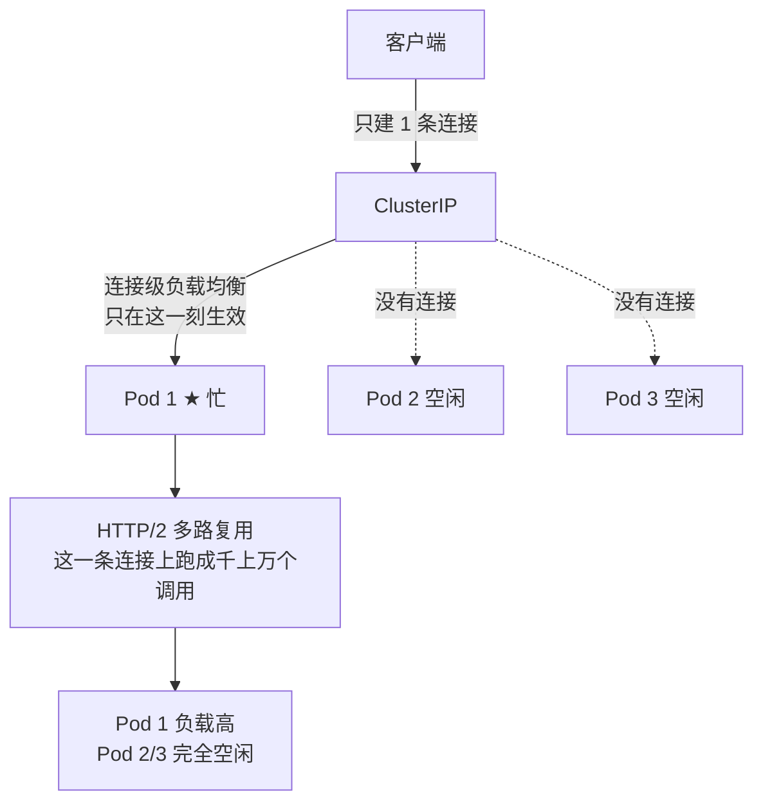

# Kubernetes 认证考点: gRPC 的天坑 —— K8s 负载均衡失效的成因与 HTTP/2 长连接并发

**这一节讲一个使用 gRPC 的时候很容易出现、会导致 K8s 负载均衡失效的问题。**

结论先给：**现象是有多个 gRPC 服务的后端实例时，有的实例负载很高，而有的实例负载却非常低 —— 典型的负载不均衡。根因不是 ClusterIP 的转发有问题，而是「K8s 的负载均衡只作用在建立连接时」，而 gRPC 使用 HTTP/2，一条长连接就能并发成千上万个调用 —— 客户端只建一条连接，成千上万次调用就只打到那一个 Pod IP 上，其他实例连连接都没有，自然是空闲的。对比 HTTP/1.1：它虽然也支持长连接，但不支持并发调用，要并发就得建多条连接，K8s 正好会把这些连接分散到不同 Pod 上，所以不会出现这种不均衡。**

## 纲要

- 现象：有的实例很忙，有的很闲
- 只在 gRPC 上遇到？先重新分析
- gRPC / HTTP 调用的四步流程
- ClusterIP 的负载均衡发生在哪个环节
- 关键纠正：连接数均衡 ≠ 请求数均衡
- 根因：HTTP/2 长连接支持并发调用
- 为什么 HTTP/1.1 不会这样
- 同类问题：所有 HTTP/2 长连接并发调用
- 排查与确认清单
- 现象与成因对照表
- API 速览、Demo 示例与总结

## 现象：有的实例很忙，有的很闲

**出现问题时，可以很明显地观察到：有多个 gRPC 服务的后端实例时，有的实例负载很高，而有的实例负载却非常低。这就是典型的负载不均衡 —— 没有把请求均匀地分配到每一个后端实例。**



```text
请求数与连接数的分离
├── K8s 的负载均衡 → 作用在「建立连接」这一刻
│   └── 每条新连接按策略（随机/轮询）分到一个 Pod IP
├── 后端实例的实际负载 → 由「连接上的请求数量」决定
│   └── 一条连接上跑多少请求，K8s 管不着
└── 两者不一致 → 连接数均衡，但请求数不均衡
```

## gRPC / HTTP 调用的四步流程

**这种情况难道只有在 gRPC 服务中才会遇到吗？以前在 HTTP 的服务调用中，基本上没有遇到过。于是只能重新来分析这个问题，到底是什么原因引起的、会是在哪个环节出现的。再来看一下 gRPC 服务调用的流程 —— 这个流程跟 HTTP 调用也是类似的：**

1. **客户端建立 TCP 连接**；
2. **发送请求**；
3. **服务端处理完这个请求之后，响应请求**；
4. **客户端拿到响应结果之后，整个请求就算完成了，最后是断开连接。**

**如果再有下一次调用，再次重复这个过程。**

## ClusterIP 的负载均衡发生在哪个环节

**看一下 K8s 的负载均衡处理 —— 客户端拿到 ClusterIP 之后建立连接、发送请求等，都是通过 ClusterIP 来转发到实际的 Pod IP。那么负载不均衡的问题，难道是 ClusterIP 的转发出现了问题吗？**

**再来想一想，ClusterIP 转发时做的负载均衡，是在流程中的「连接」「发送」哪个环节来做转发和负载均衡呢？显然是最开始的建立连接时 —— 因为后面的发送请求和响应等，都是在建立的这个连接基础上才可以完成，不可能把数据发送到一个没有建立连接的 Pod IP 上去。**

## 关键纠正：连接数均衡 ≠ 请求数均衡

**那么为什么在建立连接的时候会出现负载不均衡呢？大家发现没有 —— 这个提问是有问题的，因为整个推理和结论也有问题。**

**K8s 的负载均衡发生在建立连接的时候，由 ClusterIP 来转发请求到 Pod IP；而服务的后端实例的负载不均衡并不是「建立的连接不均衡」，而是「调用的请求数量不均衡」—— 这是两个不一样的问题。K8s 的负载均衡只是作用在建立连接时，而服务的后端实例的负载均衡是调用请求的数量决定的。如果建立连接没问题，但是每个连接上调用的请求数量不一样，是不是就会引起这样的负载不均衡呢？**

| 概念 | 谁负责 | 粒度 |
| --- | --- | --- |
| **K8s 的负载均衡** | **ClusterIP + iptables/IPVS** | **连接级（每条新连接选一个 Pod）** |
| **后端实例的实际负载** | **客户端在连接上发多少请求** | **请求级（K8s 管不着）** |

## 根因：HTTP/2 长连接支持并发调用

**这些分析之后就清楚了：gRPC 服务造成的负载均衡失效的原因是 —— gRPC 使用的是 HTTP/2 协议，它的长连接是支持并发调用的，在一个连接基础上，就可以并发成千上万个调用。**

**那么我们的客户端只建立一个连接，这时候这个客户端上的成千上万次的并发调用，就只会发送到这一个 Pod IP 上。那么是不是这个后端实例的负载就会很高，而其他的后端实例根本就没有连接，自然也就不会有并发调用，也就是完全的空闲状态。**

```text
gRPC（HTTP/2）的情况
├── 客户端建 1 条 TCP 连接 → K8s 分配给 Pod 1
├── 这条连接上并发 10000 次调用（多路复用）
└── 结果：Pod 1 扛下全部 10000 次，Pod 2/3 = 0
```

## 为什么 HTTP/1.1 不会这样

**那为什么普通的 HTTP 接口调用不会有这种情况发生呢？HTTP/1.1 也是支持长连接的呀 —— 由于 HTTP/1.1 虽然支持长连接，但是不支持并发调用，一个请求和另一个请求无法同时在一个连接上发送。**

**这时候如果要并发，就需要建立两个连接；要建立两个连接，K8s 也就会把这两个连接通过负载均衡策略分配到不同的 Pod IP 上 —— 也就不会出现后端实例负载不均衡的情况了。**

```text
HTTP/1.1 的情况
├── 要并发 3 个请求 → 必须建 3 条连接
├── K8s 把这 3 条连接分配到 Pod 1 / Pod 2 / Pod 3
└── 结果：每个 Pod 各 1 次，天然均衡
```

| 协议 | 长连接 | 单连接并发 | 并发时需要几条连接 | K8s 能否分散 |
| --- | --- | --- | --- | --- |
| **HTTP/1.1** | **支持** | **不支持** | **N 个并发 = N 条连接** | **能，天然均衡** |
| **HTTP/2（gRPC）** | **支持** | **支持（多路复用）** | **1 条就够** | **不能，全打到同一个 Pod** |

## 同类问题：所有 HTTP/2 长连接并发调用

**到这里，大家应该理解了 gRPC 的天坑、引起 K8s 负载均衡失效的原因了吧？同理，是不是其他类似于 gRPC 使用 HTTP/2 这类长连接，而且支持并发调用的情况，也有可能造成这类的负载不均衡呢？大家以后如果要用到这类 HTTP/2 调用时，都是需要注意这个问题的。**

## 排查与确认清单

| 排查项 | 方法 | 说明 |
| --- | --- | --- |
| **确认是不是连接级不均衡** | **`kubectl get endpoints` + 各 Pod 的 CPU/请求数指标** | **有的忙有的闲就是典型现象** |
| **看客户端建了几条连接** | **`ss -tnp` / 客户端日志** | **只有 1 条就基本坐实** |
| **看协议** | **gRPC = HTTP/2，天然多路复用** | **一条连接能跑上万并发** |
| **对比 HTTP/1.1 服务** | **同样部署下是否也出现** | **不出现说明就是协议差异** |
| **确认 K8s 转发模式** | **iptables / IPVS** | **两者都是连接级，都一样会中招** |

## 现象与成因对照表

| 观察 | 表象结论 | 真实原因 |
| --- | --- | --- |
| **有的 Pod 忙、有的 Pod 闲** | **ClusterIP 转发坏了？** | **转发没问题，连接建得少** |
| **连接数是均衡的** | **那应该负载均衡生效了** | **K8s 只管连接，不管连接上的请求数** |
| **gRPC 客户端只建 1 条连接** | **省资源，很好** | **恰恰是请求数全压到一个 Pod 的原因** |
| **HTTP/1.1 服务没有这问题** | **K8s 对 gRPC 有 bug** | **1.1 不支持单连接并发，被迫多建连接** |

## API 速览

| 能力 | 做法 | 关键点 |
| --- | --- | --- |
| **看后端实例** | **`kubectl get endpoints <svc>`** | **确认有多个 Pod IP** |
| **看负载分布** | **各 Pod 的 CPU / 请求数面板** | **忙闲差异明显就是现象** |
| **看连接数** | **`ss -tnp \| grep <port>`** | **客户端只建几条很关键** |
| **确认协议** | **gRPC = HTTP/2** | **单连接就能并发上万调用** |
| **看转发模式** | **`kubectl get configmap kube-proxy -n kube-system`** | **iptables / IPVS 都是连接级** |
| **下一步** | **Headless Service / 客户端侧负载均衡** | **下一节讲** |

## Demo 示例

「一条连接跑上万并发 vs 每个并发一条连接」的差别，用标准库就能把负载分布算出来：

```go
package main

import (
	"fmt"
	"sync"
)

// Pod 模拟一个后端实例：统计落到它身上的请求数
type Pod struct {
	name    string
	reqs    int
	conns   int
	mu      sync.Mutex
}

func (p *Pod) AddReq(n int) {
	p.mu.Lock()
	p.reqs += n
	p.mu.Unlock()
}

func (p *Pod) Report(total int) {
	p.mu.Lock()
	pct := 0.0
	if total > 0 {
		pct = float64(p.reqs) / float64(total) * 100
	}
	fmt.Printf("  %s 连接数=%d 请求数=%d 占比=%.1f%%\n", p.name, p.conns, p.reqs, pct)
	p.mu.Unlock()
}

// K8sService 模拟 ClusterIP：连接级负载均衡（轮询分配连接）
type K8sService struct {
	pods []*Pod
	idx  int
}

func (s *K8sService) NewConn() *Pod {
	p := s.pods[s.idx%len(s.pods)]
	s.idx++
	p.mu.Lock()
	p.conns++
	p.mu.Unlock()
	return p
}

// HTTP11Client HTTP/1.1：单连接不支持并发 → N 个并发要 N 条连接
func (s *K8sService) HTTP11Client(concurrency int) {
	var wg sync.WaitGroup
	for i := 0; i < concurrency; i++ {
		wg.Add(1)
		go func() {
			defer wg.Done()
			p := s.NewConn() // 每个并发都要新开一条连接
			p.AddReq(1)
		}()
	}
	wg.Wait()
}

// GRPCClient gRPC(HTTP/2)：单连接支持并发 → 只建一条连接跑完所有调用
func (s *K8sService) GRPCClient(concurrency int) {
	p := s.NewConn() // ★ 只建一条连接
	var wg sync.WaitGroup
	for i := 0; i < concurrency; i++ {
		wg.Add(1)
		go func() {
			defer wg.Done()
			p.AddReq(1) // 全部复用同一条连接（HTTP/2 多路复用）
		}()
	}
	wg.Wait()
}

func main() {
	const concurrency = 1000
	const total = concurrency

	fmt.Println("== HTTP/1.1 客户端：并发就要多建连接 ==")
	s1 := &K8sService{pods: []*Pod{{name: "Pod-1"}, {name: "Pod-2"}, {name: "Pod-3"}}}
	s1.HTTP11Client(concurrency)
	for _, p := range s1.pods {
		p.Report(total)
	}

	fmt.Println("\n== gRPC 客户端（HTTP/2）：只建一条连接 ==")
	s2 := &K8sService{pods: []*Pod{{name: "Pod-1"}, {name: "Pod-2"}, {name: "Pod-3"}}}
	s2.GRPCClient(concurrency)
	for _, p := range s2.pods {
		p.Report(total)
	}

	fmt.Println("\n结论：K8s 的负载均衡作用在建立连接时；")
	fmt.Println("gRPC 只建一条连接，这条连接上的全部并发都压到同一个 Pod → 负载不均衡。")
}
```

命令行侧的自查：

```bash
# ① 确认后端有多个实例
kubectl get endpoints usergrowth

# ② 看各 Pod 的负载（忙闲差异明显就是现象）
kubectl top pod -l app=usergrowth

# ③ 在客户端容器里看建了几条连接（只有 1 条就坐实了）
ss -tnp | grep :80

# ④ 确认 kube-proxy 的负载均衡粒度（iptables/IPVS 都是连接级）
kubectl get configmap kube-proxy -n kube-system -o yaml | grep -i mode
```

## 总结

1. **现象是忙闲两极分化**：**使用 gRPC 的时候很容易出现一个会导致 K8s 负载均衡失效的问题 —— 出现问题时可以很明显地观察到，有多个 gRPC 服务的后端实例时，有的实例负载很高，而有的实例负载却非常低；这就是典型的负载不均衡，没有把请求均匀地分配到每一个后端实例**；
2. **HTTP 调用里基本没遇到过**：**这种情况难道只有在 gRPC 服务中才会遇到吗？以前在 HTTP 的服务调用中，基本上没有遇到过；于是只能重新来分析这个问题，到底是什么原因引起的、会在哪个环节出现**；
3. **调用流程四步**：**再来看一下 gRPC 服务调用的流程（跟 HTTP 调用也是类似的）—— 首先是客户端建立 TCP 连接，然后是发送请求，服务端处理完这个请求之后响应请求，客户端拿到响应结果之后整个请求就算完成了，最后是断开连接；如果再有下一次调用，再次重复这个过程**；
4. **ClusterIP 转发在「建立连接」这一刻**：**看一下 K8s 的负载均衡处理 —— 客户端拿到 ClusterIP 之后建立连接、发送请求等，都是通过 ClusterIP 来转发到实际的 Pod IP；那 ClusterIP 转发时做的负载均衡，是在流程中的连接、发送哪个环节来做转发和负载均衡呢？显然是最开始的建立连接时 —— 因为后面的发送请求和响应等，都是在建立的这个连接基础上才可以完成，不可能把数据发送到一个没有建立连接的 Pod IP 上去**；
5. **关键纠正：两个问题不是一回事**：**「为什么在建立连接的时候会出现负载不均衡」这个提问是有问题的，因为整个推理和结论也有问题 —— K8s 的负载均衡发生在建立连接的时候，由 ClusterIP 转发请求到 Pod IP；而服务的后端实例的负载不均衡并不是建立的连接不均衡，而是调用的请求数量不均衡，这是两个不一样的问题；K8s 的负载均衡只是作用在建立连接时，而后端实例的负载均衡是调用请求的数量决定的；如果建立连接没问题，但是每个连接上调用的请求数量不一样，就会引起这样的负载不均衡**；
6. **根因是 HTTP/2 的多路复用**：**gRPC 服务造成的负载均衡失效的原因是 —— gRPC 使用的是 HTTP/2 协议，它的长连接是支持并发调用的，在一个连接基础上就可以并发成千上万个调用**；
7. **只建一条连接 = 全压到一个 Pod**：**那么我们的客户端只建立一个连接，这时候这个客户端上的成千上万次的并发调用，就只会发送到这一个 Pod IP 上；那么这个后端实例的负载就会很高，而其他的后端实例根本就没有连接，自然也就不会有并发调用，也就是完全的空闲状态**；
8. **HTTP/1.1 不会这样**：**为什么普通的 HTTP 接口调用不会有这种情况发生呢？HTTP/1.1 也是支持长连接的呀 —— 由于 HTTP/1.1 虽然支持长连接，但是不支持并发调用，一个请求和另一个请求无法同时在一个连接上发送；这时候如果要并发，就需要建立两个连接；要建立两个连接，K8s 也就会把这两个连接通过负载均衡策略分配到不同的 Pod IP 上，也就不会出现后端实例负载不均衡的情况了**；
9. **同类问题要举一反三**：**到这里大家应该理解了 gRPC 的天坑、引起 K8s 负载均衡失效的原因了吧？同理，是不是其他类似于 gRPC 使用 HTTP/2 这类长连接，而且支持并发调用的情况，也有可能造成这类的负载不均衡呢？大家以后如果要用到这类 HTTP/2 调用时，都是需要注意这个问题的**；
10. **下一节讲怎么解决**：**这个问题算是讲清楚了，接下来再来看看如何解决这个问题。**

