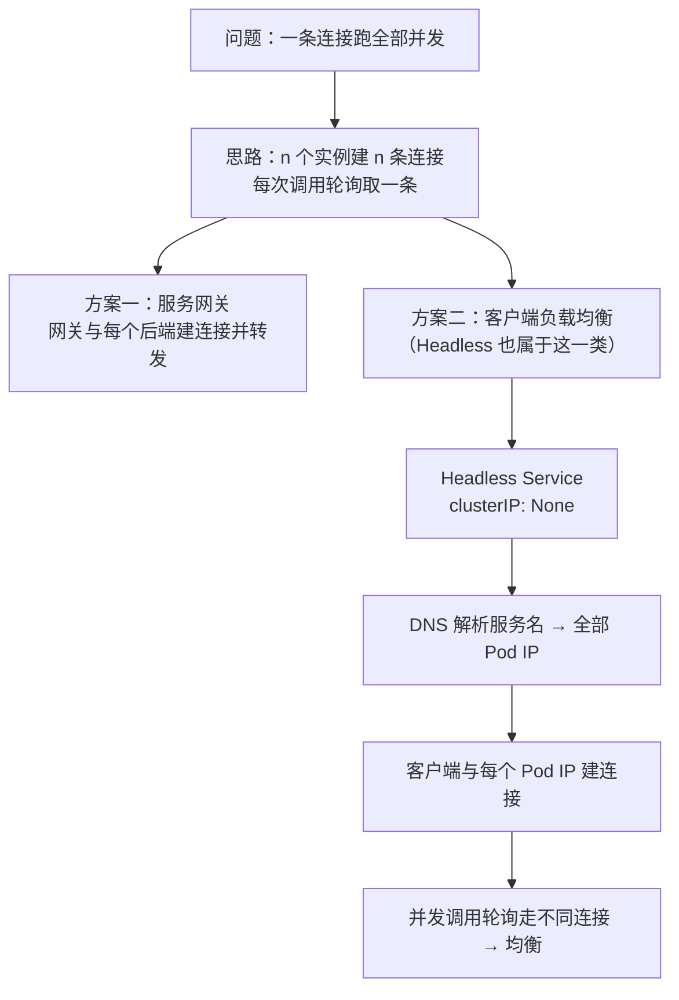

# Kubernetes 认证考点: Headless 解决 K8s 负载均衡失效的问题 —— 客户端侧负载均衡与两种绕开方案

**上一节已经分析过 gRPC 服务在 K8s 中负载均衡失效的原因，知道了原因要解决它也就不那么难了。**

结论先给：**既然是因为建立连接后并发调用导致的不均衡，那就在客户端多建立几个连接 —— gRPC 服务有 n 个后端实例，客户端就建立 n 个连接，每次调用都轮询拿到一个连接来进行调用，这样并发调用也就均衡了。两种实现方案：引入服务网关做负载均衡，或者由客户端做负载均衡（客户端通过服务发现得到全部实例的 Pod IP，与每一个后端实例建立连接）。本节讲的 Headless 方法其实就是客户端实现的负载均衡 —— Headless Service 不分配 ClusterIP，DNS 解析服务名能直接拿到全部后端实例的 Pod IP，拿到之后就可以自己做负载均衡，不需要额外的转发，性能和可控性也会更好。**

## 纲要

- 解题思路：n 个实例就建 n 条连接
- 方案一：引入服务网关
- 方案二：客户端做负载均衡
- 两者都是绕开 ClusterIP
- K8s 的四种 Service 类型
- Headless Service 的关键：clusterIP: None
- 服务名的域名格式
- 用 Headless 后的调用流程
- 代价与适用场景
- 另一个思路：gRPC 连接池
- 四种 Service 对比表
- API 速览、Demo 示例与总结

## 解题思路：n 个实例就建 n 条连接



```text
两种方案的共同点：绕开 ClusterIP 的连接级负载均衡
├── 服务网关方案
│   ├── 客户端 → 网关
│   └── 网关与每个后端实例建连接，每次调用用不同的连接
└── 客户端方案（本节重点）
    ├── 客户端服务发现拿到全部 Pod IP
    ├── 与每个 Pod IP 各建一条连接
    └── 并发调用时用不同的连接发送
```

## 方案一：引入服务网关

**第一种是引入服务网关来做负载均衡 —— 我们的客户端直接连接到服务网关，所有的调用都是由服务网关来转发。在服务网关做负载均衡时，它会对每一个后端 server 实例都建立连接，那么每次调用请求时就可以使用不同的连接来完成，保证并发调用的负载均衡。**

## 方案二：客户端做负载均衡

**另外一个方案是由客户端来做负载均衡 —— 客户端通过服务发现可以得到服务的全部实例 Pod IP，这样也就可以在客户端与每一个后端实例建立连接了，后续的并发调用也就可以使用不同的连接来发送。这样也就实现了并发调用的负载均衡。**

**它们的实现都是绕开了 K8s 原来的 ClusterIP 做负载均衡的方式，把负载均衡放在了服务网关或者客户端。可见，这都是需要有额外的开发工作的 —— 引入服务网关，就需要自己开发和维护网关这个服务；那客户端来实现负载均衡，也意味着需要增加客户端的工作。**

| 方案 | 谁做负载均衡 | 额外成本 |
| --- | --- | --- |
| **服务网关** | **网关（对每一个后端实例建连接）** | **自己开发和维护网关服务** |
| **客户端（Headless）** | **客户端（拿到全部 Pod IP 后自己建连接）** | **增加客户端的工作量** |
| **普通 Service（默认）** | **K8s（ClusterIP，连接级）** | **无，但 gRPC 下会失效** |

**我们这里介绍的 Headless 方法，其实也就是客户端实现的负载均衡。**

## K8s 的四种 Service 类型

**在 K8s 中 Service 有四种类型 —— 不同的 Service 会统一地提供一个入口地址，也就是会给 Service 生成一个虚拟的 ClusterIP，这种类型用得最多；还有 NodePort Service 和 LoadBalancer Service：NodePort Service 会在集群中给服务分配一个唯一的端口号，访问集群中的任何 IP 地址加上这个端口号都可以调用到这个服务；LoadBalancer Service 主要是暴露给外部使用，通过这个服务来做集群内服务的负载均衡。**

## Headless Service 的关键

**那我们要讲的 Headless Service —— 它不会分配一个 ClusterIP。通过服务名（每个服务都会有一个域名，格式为 `<service>.<namespace>.svc.cluster.local`），经过 DNS 解析，能够得到全部的后端实例的 Pod IP。拿到了全部后端实例的 Pod IP 就可以自己来做负载均衡了 —— 不需要额外的转发，性能和可控性也会更好。当然也会增加开发工作量，复杂度也会高一些。**

```yaml
apiVersion: v1
kind: Service
metadata:
  name: usergrowth-headless
  namespace: usergrowth
spec:
  clusterIP: None          # ★ Headless 的关键：不分配 ClusterIP
  selector:
    app: usergrowth
  ports:
    - name: grpc
      port: 80
      targetPort: 80
```

| Service 类型 | 是否分配 ClusterIP | 特点 |
| --- | --- | --- |
| **ClusterIP（默认）** | **是** | **用得最多，K8s 做连接级负载均衡** |
| **NodePort** | **是** | **集群中分配唯一端口，任何节点 IP + 该端口都能访问** |
| **LoadBalancer** | **是** | **主要暴露给外部使用** |
| **Headless** | **否（`clusterIP: None`）** | **DNS 直接返回全部 Pod IP** |

## 服务名的域名格式

**通过服务名，每个服务都会有一个域名，格式为 `<service>.<namespace>.svc.cluster.local`；经过 DNS 解析，能够得到全部的后端实例的 Pod IP。**

```bash
# Headless Service：DNS 返回的是全部 Pod IP，而不是一个 ClusterIP
nslookup usergrowth-headless.usergrowth.svc.cluster.local
# Name:   usergrowth-headless.usergrowth.svc.cluster.local
# Address: 10.244.1.5
# Address: 10.244.2.7
# Address: 10.244.2.8

# 对比普通 Service：只返回一个 ClusterIP
nslookup usergrowth.usergrowth.svc.cluster.local
# Address: 10.96.3.232   ← 虚拟 IP
```

## 用 Headless 后的调用流程

**拿到了全部后端实例的 Pod IP 就可以自己来做负载均衡了 —— 不需要额外的转发，性能和可控性也会更好。**

```text
Headless + 客户端负载均衡的调用流程
├── ① 客户端解析 <service>.<ns>.svc.cluster.local
├── ② DNS 返回全部 Pod IP（10.244.1.5 / 10.244.2.7 / ...）
├── ③ 客户端与每一个 Pod IP 各建一条 gRPC 连接
├── ④ 每次调用轮询（或其他策略）取一条连接发送
└── ⑤ 实例变化时重新解析 DNS，更新连接集合
   └── 好处：没有额外的转发（ClusterIP → Pod 的 DNAT），性能与可控性更好
```

## 代价与适用场景

**当然也会增加开发工作量，复杂度也会高一些。所以大部分情况下还是用普通的 Service 用 K8s 来做负载均衡 —— 调用方不需要额外的开发工作量。**

**大家以后开发 gRPC 服务，如果没有服务网关来做负载均衡，就可以考虑使用 Headless 服务由调用方来实现负载均衡。**

| 场景 | 建议 |
| --- | --- |
| **普通 HTTP/1.1 服务** | **普通 Service 就够，K8s 做负载均衡** |
| **gRPC + 已有服务网关** | **走网关，网关与每个后端建连接** |
| **gRPC + 无网关** | **Headless Service + 客户端负载均衡** |
| **追求最少开发量** | **普通 Service（但要接受 gRPC 下可能不均衡）** |

## 另一个思路：gRPC 连接池

**这里再提一个可行的解决方案，大家自己也可以考虑一下它的可行性 —— 使用 gRPC 连接池（这是上一章讲过的内容）。在连接池中会有很多的 gRPC 连接，每一个调用都会从连接池中获取一个连接，那么它的并发调用也就是在不同的 gRPC 连接上请求的，这样也可以避免 gRPC 并发调用的不均衡。gRPC 连接池具体的实现肯定还是需要优化的地方，大家也可以再思考思考。**

```text
连接池方案为什么也能缓解
├── 池中维护多条 gRPC 连接（最好每条对应一个 Pod）
├── 每次调用从池中取一条 → 并发调用分散在不同连接上
└── 注意：连接要真的分散到不同 Pod 才有效（配合 Headless 更稳）
```

## API 速览

| 能力 | 做法 | 关键点 |
| --- | --- | --- |
| **建 Headless** | **`spec.clusterIP: None`** | **不分配虚拟 IP** |
| **解析** | **`nslookup <svc>.<ns>.svc.cluster.local`** | **返回全部 Pod IP** |
| **客户端建连接** | **对每个 Pod IP `grpc.Dial`** | **n 个实例 n 条连接** |
| **分发调用** | **每次调用轮询取一条连接** | **并发调用因此均衡** |
| **实例变化** | **定期重新解析 DNS，更新连接集合** | **Pod IP 会变** |
| **对比普通 Service** | **`kubectl get svc` 看 CLUSTER-IP** | **Headless 显示 `None`** |
| **服务网关方案** | **客户端连网关，网关与每个后端建连接** | **需自研维护网关** |
| **连接池方案** | **池里放多条 gRPC 连接** | **每条连接最好对应不同 Pod** |

## Demo 示例

「解析出全部 Pod IP → 每个 IP 建一条连接 → 轮询分发」这套客户端负载均衡逻辑，用标准库就能完整跑一遍：

```go
package main

import (
	"fmt"
	"sync"
)

// ---------- 模拟 Headless DNS 解析 ----------

// LookupHeadless 对应解析 <svc>.<ns>.svc.cluster.local
// Headless 的特点是返回全部 Pod IP，而不是一个 ClusterIP
func LookupHeadless(service string) []string {
	return map[string][]string{
		"usergrowth-headless.usergrowth.svc.cluster.local": {
			"10.244.1.5:80", "10.244.2.7:80", "10.244.2.8:80",
		},
	}[service]
}

// LookupNormal 普通 Service：只返回一个 ClusterIP（虚拟 IP）
func LookupNormal(service string) []string {
	return []string{"10.96.3.232:80"}
}

// ---------- 模拟一条 gRPC 连接 ----------

type Conn struct {
	target string
	calls  int
	mu     sync.Mutex
}

func Dial(target string) *Conn { return &Conn{target: target} }

func (c *Conn) Invoke() {
	c.mu.Lock()
	c.calls++
	c.mu.Unlock()
}

// ---------- 客户端负载均衡器 ----------

type ClientLB struct {
	conns []*Conn
	idx   int
	mu    sync.Mutex
}

// NewClientLB 服务发现 → 与每一个 Pod IP 建立连接
func NewClientLB(addrs []string) *ClientLB {
	conns := make([]*Conn, 0, len(addrs))
	for _, a := range addrs {
		conns = append(conns, Dial(a)) // ★ 每个后端实例一条连接
	}
	return &ClientLB{conns: conns}
}

// Call 每次调用轮询取一条连接 → 并发调用因此分散到不同实例
func (l *ClientLB) Call() *Conn {
	l.mu.Lock()
	c := l.conns[l.idx%len(l.conns)]
	l.idx++
	l.mu.Unlock()
	c.Invoke()
	return c
}

func (l *ClientLB) Report(total int) {
	for _, c := range l.conns {
		c.mu.Lock()
		pct := float64(c.calls) / float64(total) * 100
		fmt.Printf("  %s 调用数=%d 占比=%.1f%%\n", c.target, c.calls, pct)
		c.mu.Unlock()
	}
}

func main() {
	const total = 3000

	// ① 普通 Service：只解析出一个 ClusterIP → 一条连接扛起全部并发
	fmt.Println("== 普通 Service（ClusterIP）==")
	normal := NewClientLB(LookupNormal("usergrowth.usergrowth.svc.cluster.local"))
	fmt.Printf("  解析到 %d 个地址（虚拟 IP）\n", len(normal.conns))
	var wg sync.WaitGroup
	for i := 0; i < total; i++ {
		wg.Add(1)
		go func() { defer wg.Done(); normal.Call() }()
	}
	wg.Wait()
	normal.Report(total)

	// ② Headless Service：解析出全部 Pod IP → 每个实例一条连接
	fmt.Println("\n== Headless Service（clusterIP: None）==")
	addrs := LookupHeadless("usergrowth-headless.usergrowth.svc.cluster.local")
	fmt.Printf("  解析到 %d 个 Pod IP\n", len(addrs))
	headless := NewClientLB(addrs)
	for i := 0; i < total; i++ {
		wg.Add(1)
		go func() { defer wg.Done(); headless.Call() }()
	}
	wg.Wait()
	headless.Report(total)

	fmt.Println("\n结论：Headless 让客户端拿到全部 Pod IP，每个实例一条连接，")
	fmt.Println("并发调用被轮询分散 → 绕开了 ClusterIP 连接级负载均衡的失效问题。")
}
```

命令行侧的自查：

```bash
# ① 建一个 Headless Service
kubectl apply -f usergrowth-headless.yaml

# ② 确认 CLUSTER-IP 是 None
kubectl get svc -n usergrowth
# NAME                  TYPE        CLUSTER-IP   EXTERNAL-IP   PORT(S)
# usergrowth            ClusterIP   10.96.3.232  <none>        80/TCP
# usergrowth-headless   ClusterIP   None         <none>        80/TCP

# ③ 解析对比：Headless 返回全部 Pod IP
kubectl run dns-test --rm -it --image=busybox:1.28 -- \
  nslookup usergrowth-headless.usergrowth.svc.cluster.local

# ④ 客户端侧：对每个 Pod IP 建连接（伪代码见上文骨架）
```

## 总结

1. **知道原因就不难解决**：**上一节已经分析过 gRPC 服务在 K8s 中负载均衡失效的原因，知道了原因要解决它也就不那么难了**；
2. **思路是 n 个实例建 n 条连接**：**既然是因为建立连接后并发调用导致的不均衡，那是不是在客户端多建立几个连接？比如我们的 gRPC 服务有 n 个后端实例，那么在客户端就建立 n 个连接，然后每次调用都轮询拿到一个连接来进行调用 —— 这样是不是就可以做到并发调用也均衡呢？解题思路有了**；
3. **方案一：服务网关**：**客户端直接连接到服务网关，所有的调用都是由服务网关来转发；在服务网关做负载均衡时，它会对每一个后端 server 实例都建立连接，那么每次调用请求时就可以使用不同的连接来完成，保证并发调用的负载均衡**；
4. **方案二：客户端负载均衡**：**客户端通过服务发现可以得到服务的全部实例 Pod IP，这样也就可以在客户端与每一个后端实例建立连接了，后续的并发调用也就可以使用不同的连接来发送 —— 这样也就实现了并发调用的负载均衡**；
5. **两者都绕开了 ClusterIP**：**它们的实现都是绕开了 K8s 原来的 ClusterIP 做负载均衡的方式，把负载均衡放在了服务网关或者客户端；可见这都是需要有额外的开发工作的 —— 引入服务网关就需要自己开发和维护网关这个服务，客户端来实现负载均衡也意味着需要增加客户端的工作**；
6. **Headless 属于客户端方案**：**这里介绍的 Headless 方法，其实也就是客户端实现的负载均衡**；
7. **四种 Service 类型**：**在 K8s 中 Service 有四种类型 —— 不同的 Service 会统一提供一个入口地址，也就是给 Service 生成一个虚拟的 ClusterIP，这种类型用得最多；NodePort Service 会在集群中给服务分配一个唯一的端口号，访问集群中的任何 IP 地址加上这个端口号都可以调用到这个服务；LoadBalancer Service 主要是暴露给外部使用，通过这个服务来做集群内服务的负载均衡**；
8. **Headless 不分配 ClusterIP**：**我们要讲的 Headless Service —— 它不会分配一个 ClusterIP**；
9. **域名格式与解析结果**：**通过服务名（每个服务都会有一个域名，格式为 `<service>.<namespace>.svc.cluster.local`），经过 DNS 解析，能够得到全部的后端实例的 Pod IP**；
10. **拿到 Pod IP 自己均衡**：**拿到了全部后端实例的 Pod IP 就可以自己来做负载均衡了 —— 不需要额外的转发，性能和可控性也会更好；当然也会增加开发工作量，复杂度也会高一些**；
11. **大部分情况还是用普通 Service**：**所以大部分情况下还是用普通的 Service 用 K8s 来做负载均衡 —— 调用方不需要额外的开发工作量**；
12. **gRPC 没网关时的建议**：**大家以后开发 gRPC 服务，如果没有服务网关来做负载均衡，就可以考虑使用 Headless 服务由调用方来实现负载均衡**；
13. **连接池也是一条思路**：**这里再提一个可行的解决方案，大家也可以考虑一下它的可行性 —— 使用 gRPC 连接池（上一章讲过的内容）；在连接池中会有很多的 gRPC 连接，每一个调用都会从连接池中获取一个连接，那么它的并发调用也就是在不同的 gRPC 连接上请求的，这样也可以避免 gRPC 并发调用的不均衡；gRPC 连接池具体的实现肯定还是需要优化的地方，大家也可以再思考思考。**

