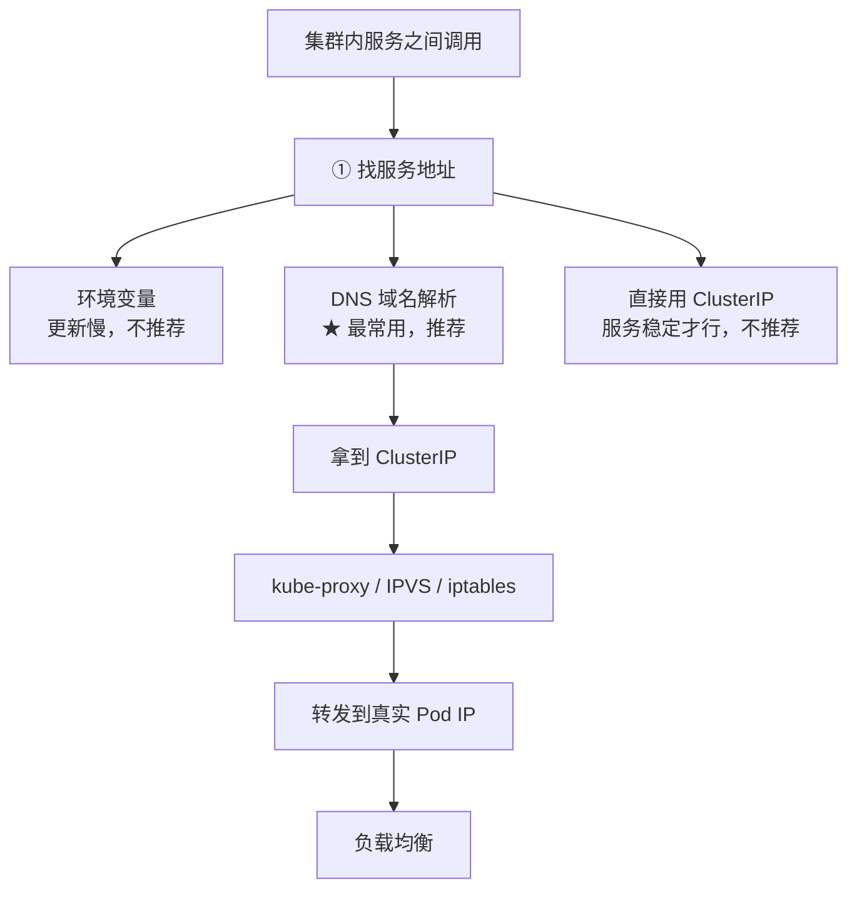

# Kubernetes 认证考点: 集群内服务之间的调用 —— 服务发现的三种方式与 Node IP / ClusterIP / Pod IP

**这一节讲一讲 K8s 集群内的服务之间的调用 —— 集群外调用集群内的服务，可以通过 NodePort、LoadBalancer 和 Ingress 来实现（这里暂时先不讲），这里还是进一步来细化，讲一讲集群内的服务之间的调用。毕竟大部分的服务还是后端调用，暴露出去给外网调用的接口比较少。**

结论先给：**集群内调用首先需要找到服务的地址，有三种方式 —— 环境变量（更新太慢，只能重启 Pod 才可能更新，容易出现异常的配置信息）、DNS 域名解析（最常用，推荐使用）、直接用 ClusterIP（服务很稳定时用也行，但不推荐）。一句话总结：集群内服务之间调用优先使用服务的域名吧，其他方式还是不建议使用了。** 另外一定要分清集群内的三个 IP：**Node IP（物理节点）、ClusterIP（Service 的虚拟 IP）、Pod IP（后端实例实际运行的 IP）。**

## 纲要

- 集群外 vs 集群内调用的入口差异
- 方式一：环境变量（不推荐）
- 方式二：DNS 域名解析（最常用）
- 方式三：直接用 ClusterIP（不推荐）
- 域名与 ClusterIP 的分工：IP 会变，端口不变
- 集群内三个 IP 的区分
- Node IP：谁需要关注
- ClusterIP：怎么找到它
- Pod IP：真正要调到的地址
- 三种 IP 对照表
- 调用方式取舍
- API 速览、Demo 示例与总结

## 集群外 vs 集群内调用的入口差异

**集群外调用集群内的服务，可以通过 NodePort、LoadBalancer 和 Ingress 来实现（这里暂时先不讲）。这里还是进一步来细化，讲一讲集群内的服务之间的调用 —— 毕竟大部分的服务还是后端调用，暴露出去给外网调用的接口比较少。**



```text
集群内调用的地址层次
├── 调用方记住：服务域名 <svc>.<ns>.svc.cluster.local
│   └── 不必关心 IP，IP 变化由 K8s 维护
├── 解析结果：ClusterIP（虚拟 IP）
│   └── 由 kube-proxy / DNS 组件维护它与 Pod IP 的关系
└── 最终目标：Pod IP（后端实例实际运行的地址）
   └── 具体转发到哪个 Pod IP = 负载均衡
```

## 方式一：环境变量（不推荐）

**集群内调用首先需要找到服务的地址，这里有几种方法 —— 环境变量中可以读取到集群服务的配置信息，从服务的配置信息中，也就可以拿到服务的访问地址。但是这种方式也有不足：它的更新太慢了，只能是重启 Pod 之后才可能更新环境变量，这样就难以做到实时的服务发现，会出现异常的配置信息。**

| 维度 | 环境变量方式 |
| --- | --- |
| **怎么拿** | **Pod 启动时注入，从环境变量读** |
| **更新时机** | **只有重启 Pod 才可能更新** |
| **问题** | **难以做到实时服务发现，会出现异常的配置信息** |
| **结论** | **不推荐** |

## 方式二：DNS 域名解析（最常用）

**最常用的还是通过 DNS 来实现服务发现 —— 通过服务名的域名解析获取到服务的访问地址。**

| 维度 | DNS 方式 |
| --- | --- |
| **怎么拿** | **解析 `<svc>.<ns>.svc.cluster.local`** |
| **更新时机** | **服务变更时 DNS 记录同步更新（见服务注册那一节）** |
| **好处** | **实时性好，调用方只记域名** |
| **结论** | **★ 最常用，推荐** |

## 方式三：直接用 ClusterIP（不推荐）

**如果你的服务很稳定，不会出现删除又重新创建的话，直接使用 ClusterIP 也行 —— 只是不推荐这种方法。使用最多的还是用域名解析。**

| 场景 | 是否可行 | 说明 |
| --- | --- | --- |
| **服务稳定、不会删除重建** | **可行** | **ClusterIP 不变** |
| **服务会重建** | **不可行** | **ClusterIP 可能变化，写死就访问不到** |
| **通用建议** | **用域名** | **不用关心 IP 会不会变** |

## 域名与 ClusterIP 的分工

**调用集群内服务，直接用服务的域名来调用。无论是通过域名还是 ClusterIP，实际调用还是需要获取到目标服务的 IP 和端口。**

**通过域名解析，只需要记住服务的域名，不需要关心它的 IP —— 如果服务的 IP 有变化，咱们也不用担心，这些都会由 K8s 来维护得到正确的地址。**

**而服务的端口号这是由容器暴露出来的，也是由程序决定的 —— 这个一般不会变。所以调用方拿到后，自己就可以保存起来，一直使用。**

**所以集群内服务之间的调用，最关注的还是服务的 IP。**

| 要素 | 会不会变 | 谁维护 | 调用方怎么用 |
| --- | --- | --- | --- |
| **服务域名** | **不变** | **K8s** | **记住它，直接用** |
| **ClusterIP / Pod IP** | **可能变** | **K8s 自动维护正确地址** | **不用关心，交给 DNS** |
| **端口** | **一般不变** | **容器暴露、程序决定** | **拿到后可以保存复用** |

## 集群内三个 IP 的区分

**在 K8s 集群内有三个 IP，大家一定要能区分。**

## Node IP

**Node IP 是 K8s 集群中物理节点服务器的 IP —— 我们的服务一般不会关注到这个 IP；运维和管理员需要关注（K8s 集群的核心组件内需要关注，增加或者减少节点，也就会影响 Node IP）。**

## ClusterIP

**ClusterIP 大家已经熟悉了 —— K8s 中每一个普通 Service 都会分配一个虚拟的、唯一的 ClusterIP；通过服务名就可以找到这个 ClusterIP —— 具体找的方法可以从环境变量找，也可以通过 DNS 域名解析获取。**

## Pod IP

**最后 Pod IP —— 也是服务的后端实例实际运行的 IP 地址，真正的程序需要调用到 Pod IP 才可以访问到；前面的 ClusterIP 也是需要通过 kube-proxy 组件或者 DNS 扩展组件来维护它与 Pod IP 的关系，这样才可以通过 ClusterIP 转发到具体的 Pod IP。当然具体转发到哪个 Pod IP 就涉及到负载均衡了（这些在前面的章节中有详细的讲解）。**

## 三种 IP 对照表

| IP | 是什么 | 谁关注 | 会不会变 |
| --- | --- | --- | --- |
| **Node IP** | **物理节点服务器的 IP** | **运维/管理员、K8s 核心组件（增删节点会影响）** | **增删节点时变** |
| **ClusterIP** | **每个普通 Service 分配的虚拟唯一 IP** | **调用方（通过服务名找到它）** | **Service 重建可能变** |
| **Pod IP** | **后端实例实际运行的 IP** | **真正的程序要调到它** | **实例数量变化、重启都会变** |

## 调用方式取舍

| 方式 | 推荐度 | 理由 |
| --- | --- | --- |
| **服务域名** | **★ 优先** | **不用关心 IP，K8s 维护正确地址** |
| **DNS 解析** | **★ 同上（实现手段）** | **实时性好** |
| **环境变量** | **不推荐** | **重启才更新，容易出现异常配置** |
| **直接 ClusterIP** | **不推荐** | **服务重建就失效** |

## API 速览

| 能力 | 做法 | 关键点 |
| --- | --- | --- |
| **看服务域名** | **`<svc>.<ns>.svc.cluster.local`** | **跨命名空间要带全名** |
| **DNS 解析** | **`nslookup <svc>.<ns>.svc.cluster.local`** | **返回 ClusterIP（Headless 返回全部 Pod IP）** |
| **看 ClusterIP** | **`kubectl get svc`** | **CLUSTER-IP 列** |
| **看 Pod IP** | **`kubectl get pod -o wide`** | **IP 列** |
| **看 Node IP** | **`kubectl get node -o wide`** | **INTERNAL-IP 列** |
| **看环境变量** | **`kubectl exec <pod> -- env \| grep <SVC>`** | **只在 Pod 启动时注入** |
| **看后端实例** | **`kubectl get endpoints <svc>`** | **ClusterIP 关联的 Pod IP 列表** |

## Demo 示例

「环境变量只在 Pod 启动时注入、DNS 每次解析都能拿到最新地址」这个差异，用标准库就能跑出来对比：

```go
package main

import (
	"fmt"
	"os"
)

// ---------- 模拟集群里的服务地址 ----------

// 真实的服务地址：服务重建后 ClusterIP 会变
var currentClusterIP = "10.96.3.232"

func currentServiceAddr() string { return currentClusterIP + ":80" }

// ---------- 方式一：环境变量（Pod 启动时注入，之后不再更新） ----------

func injectEnvAtPodStart() {
	// 类比 K8s 在 Pod 启动时把当时服务的地址写进环境变量
	os.Setenv("USERGROWTH_SERVICE_HOST", currentClusterIP)
	os.Setenv("USERGROWTH_SERVICE_PORT", "80")
}

func lookupByEnv() string {
	host := os.Getenv("USERGROWTH_SERVICE_HOST")
	port := os.Getenv("USERGROWTH_SERVICE_PORT")
	if host == "" {
		return "<未注入>"
	}
	return host + ":" + port
}

// ---------- 方式二：DNS 域名解析（每次解析都拿最新的） ----------

func lookupByDNS() string {
	// 类比解析 <svc>.<ns>.svc.cluster.local，DNS 记录由 K8s 维护
	return currentServiceAddr()
}

func main() {
	// Pod 启动时注入环境变量，此时服务地址是 10.96.3.232
	injectEnvAtPodStart()
	fmt.Printf("Pod 启动时注入的环境变量: %s\n", lookupByEnv())
	fmt.Printf("此时 DNS 解析结果:         %s\n", lookupByDNS())

	// 服务被删除又重建 → ClusterIP 变了
	currentClusterIP = "10.96.7.51"
	fmt.Println("\n-- 服务被删除并重建，ClusterIP 变为 10.96.7.51 --")

	envAddr := lookupByEnv()
	dnsAddr := lookupByDNS()
	fmt.Printf("环境变量方式拿到的地址:   %s  ← 还是旧的，调用会失败\n", envAddr)
	fmt.Printf("DNS 域名方式拿到的地址:   %s  ← 已同步，调用正常\n", dnsAddr)

	fmt.Println("\n结论：环境变量只有重启 Pod 才可能更新，容易出现异常的配置信息；")
	fmt.Println("      DNS 域名解析由 K8s 维护，调用方只记域名、不用关心 IP → 优先使用域名。")
}
```

命令行侧的三种 IP 与调用自查：

```bash
# ① 三种 IP 分别在哪看
kubectl get node -o wide      # Node IP（物理节点，运维关注）
kubectl get svc -A            # ClusterIP（Service 的虚拟 IP）
kubectl get pod -o wide       # Pod IP（后端实例真实地址）

# ② 域名解析：跨命名空间要带全名
kubectl run dns-test --rm -it --image=busybox:1.28 -- \
  nslookup usergrowth.usergrowth.svc.cluster.local

# ③ 同命名空间下可以简写服务名
curl http://usergrowth:80

# ④ 看环境变量方式注入了什么（只有 Pod 启动时才有）
POD=$(kubectl get pod -l app=usergrowth -o jsonpath='{.items[0].metadata.name}')
kubectl exec "$POD" -- env | grep USERGROWTH

# ⑤ 确认 ClusterIP 关联的后端实例
kubectl get endpoints usergrowth
```

## 总结

1. **分两类入口**：**集群外调用集群内的服务，可以通过 NodePort、LoadBalancer 和 Ingress 来实现（这里暂时先不讲）；这一节进一步细化，讲一讲集群内的服务之间的调用 —— 毕竟大部分的服务还是后端调用，暴露出去给外网调用的接口比较少**；
2. **集群内调用先要找到服务地址**：**集群内调用首先需要找到服务的地址，这里有几种方法**；
3. **方式一：环境变量，更新太慢**：**环境变量中可以读取到集群服务的配置信息，从服务的配置信息中也可以拿到服务的访问地址；但是这种方式也有不足 —— 它的更新太慢了，只能是重启 Pod 之后才可能更新环境变量，这样就难以做到实时的服务发现，会出现异常的配置信息**；
4. **方式二：DNS 域名解析，最常用**：**最常用的还是通过 DNS 来实现服务发现 —— 通过服务名的域名解析获取到服务的访问地址**；
5. **方式三：直接用 ClusterIP，不推荐**：**如果你的服务很稳定，不会出现删除又重新创建的话，直接使用 ClusterIP 也行 —— 只是不推荐这种方法；使用最多的还是用域名解析**；
6. **直接调用就用域名**：**调用集群内服务，直接用服务的域名来调用。无论是通过域名还是 ClusterIP，实际调用还是需要获取到目标服务的 IP 和端口**；
7. **IP 交给 K8s，端口可以自己存**：**通过域名解析，只需要记住服务的域名，不需要关心它的 IP —— 如果服务的 IP 有变化也不用担心，这些都会由 K8s 来维护得到正确的地址；而服务的端口号这是由容器暴露出来的，也是由程序决定的，这个一般不会变 —— 所以调用方拿到后自己就可以保存起来，一直使用**；
8. **最关注的还是 IP**：**所以集群内服务之间的调用，最关注的还是服务的 IP**；
9. **集群内有三个 IP 要分清**：**在 K8s 集群内有三个 IP，大家一定要能区分**；
10. **Node IP 是物理节点的**：**Node IP 是 K8s 集群中物理节点服务器的 IP —— 我们的服务一般不会关注到这个 IP；运维和管理员需要关注（K8s 集群的核心组件内需要关注，增加或者减少节点也就会影响 Node IP）**；
11. **ClusterIP 是 Service 的虚拟 IP**：**ClusterIP 大家已经熟悉了 —— K8s 中每一个普通 Service 都会分配一个虚拟的、唯一的 ClusterIP；通过服务名就可以找到这个 ClusterIP —— 具体找的方法可以从环境变量找，也可以通过 DNS 域名解析获取**；
12. **Pod IP 才是真正要调到的**：**最后 Pod IP —— 也是服务的后端实例实际运行的 IP 地址，真正的程序需要调用到 Pod IP 才可以访问到；前面的 ClusterIP 也是需要通过 kube-proxy 组件或者 DNS 扩展组件来维护它与 Pod IP 的关系，这样才可以通过 ClusterIP 转发到具体的 Pod IP；当然具体转发到哪个 Pod IP 就涉及到负载均衡了（这些在前面的章节中有详细的讲解，这里就不做更多赘述）**；
13. **一句话总结**：**集群内服务之间调用优先使用服务的域名吧，其他方式还是不建议使用了。**

