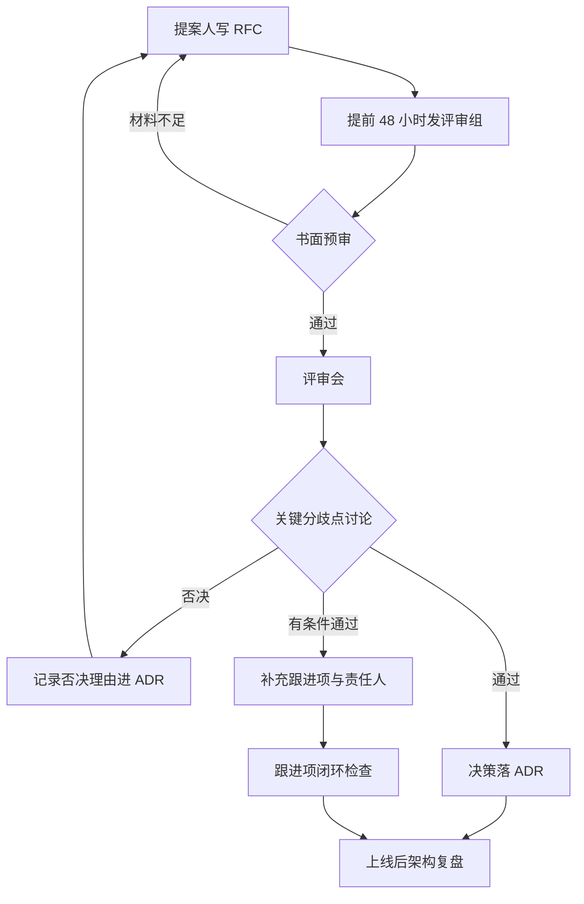

## ARC-004：架构评审应该走什么流程？如何避免评审变成走过场？
**答**：
- 流程：提案人提前 48h 发 RFC → 评审会过"目标/非目标/方案对比/风险"四件事 → 结论必须落 ADR → 上线后做架构复盘。
- 避免走过场的关键：评审前有书面材料、评审时只争"关键分歧点"、有明确的否决权与升级路径。
- 评审不追求一次通过，可以给出"有条件通过 + 跟进项"。

```mermaid
flowchart TD
  A[提案人写 RFC] --> B[提前 48 小时发评审组]
  B --> C{书面预审}
  C -->|材料不足| A
  C -->|通过| D[评审会]
  D --> E{关键分歧点讨论}
  E -->|否决| F[记录否决理由进 ADR]
  E -->|有条件通过| G[补充跟进项与责任人]
  E -->|通过| H[决策落 ADR]
  G --> I[跟进项闭环检查]
  H --> J[上线后架构复盘]
  I --> J
  F --> A
```
