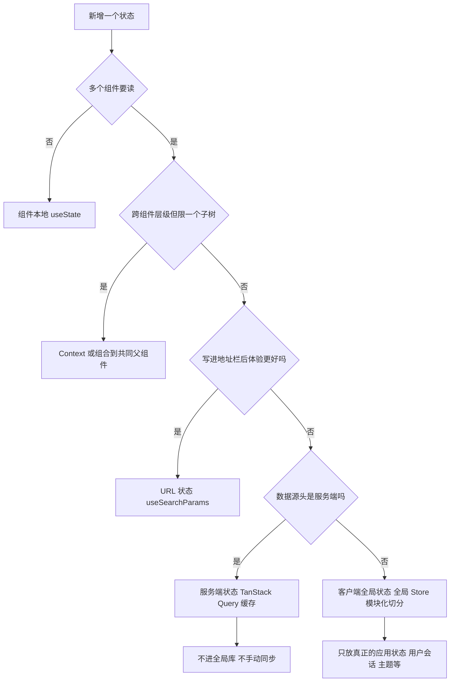

## ARC-051：前端状态如何分类？每类状态应该放在哪里？
**答**：
- 四分类：服务端状态（缓存的远端数据）、客户端全局状态（跨页面共享）、URL 状态（可分享可刷新）、本地 UI 状态（组件内部）。
- 架构核心思想：先"分流"再"选库"——大量全局状态库的滥用源于把服务端状态塞进了 Redux。
- 分类决策树是日常落地工具：每新增一个状态先问归属，再定存储位置与生命周期。

```mermaid
flowchart TD
  A[新增一个状态] --> B{多个组件要读}
  B -->|否| C[组件本地 useState]
  B -->|是| D{跨组件层级但限一个子树}
  D -->|是| E[Context 或组合到共同父组件]
  D -->|否| F{写进地址栏后体验更好吗}
  F -->|是| G[URL 状态 useSearchParams]
  F -->|否| H{数据源头是服务端吗}
  H -->|是| I[服务端状态 TanStack Query 缓存]
  H -->|否| J[客户端全局状态 全局 Store 模块化切分]
  I --> K[不进全局库 不手动同步]
  J --> L[只放真正的应用状态 用户会话 主题等]
```
