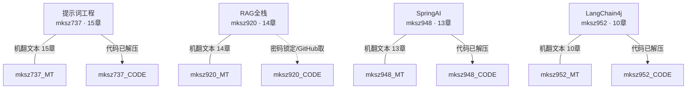

# 四门 AI 课 · 代码/资料关联总图

> 每个课程节点下挂「机翻文本章节」与「代码/资料源」。实线=已解压可用；虚线=需密码/待取。

```mermaid
graph TD
    mksz737["提示词工程<br/>mksz737 · 15章"]
    mksz920["RAG全栈<br/>mksz920 · 14章"]
    mksz948["SpringAI<br/>mksz948 · 13章"]
    mksz952["LangChain4j<br/>mksz952 · 10章"]
    mksz737 ---|机翻文本 15章| mksz737_MT[mksz737_MT]
    mksz920 ---|机翻文本 14章| mksz920_MT[mksz920_MT]
    mksz948 ---|机翻文本 13章| mksz948_MT[mksz948_MT]
    mksz952 ---|机翻文本 10章| mksz952_MT[mksz952_MT]
    mksz737 -->|代码已解压| mksz737_CODE[mksz737_CODE]
    mksz920 -.->|密码锁定/GitHub取| mksz920_CODE[mksz920_CODE]
    mksz948 -->|代码已解压| mksz948_CODE[mksz948_CODE]
    mksz952 -->|代码已解压| mksz952_CODE[mksz952_CODE]
```