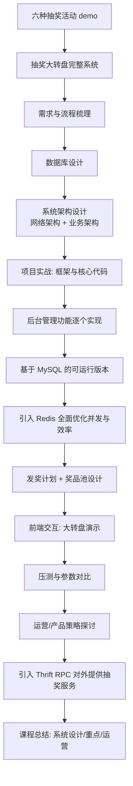

# Go 企业级抽奖项目: 课程导学与系统难点剖析

## 纲要

- 课程目标与范围：从六种抽奖活动入手，最终落地一个完整的企业级抽奖大转盘系统
- 业务难点：活动多变、奖品类型多样、概率与公平性、发奖安全
- 技术挑战：高并发、并发安全、缓存优化、性能压测
- 技术选型：为什么用 Go（协程、编译型、IO 多路复用）
- 课程路线图：活动 demo → 完整系统 → MySQL → Redis 优化 → 发奖计划/奖品池 → 前端演示 → 压测 → Thrift RPC → 复盘
- 前置知识与开发环境

## 课程定位与范围

抽奖是生活中极常见的运营手段：年会抽奖、刮刮乐、双色球、微信/支付宝的摇一摇集福卡、抢红包等。本课程的目标不是逐个复刻这些活动，而是**抽取共性、构建一个可扩展的完整抽奖系统**。

课程先用六种代表性活动（年会抽奖、彩票、刮刮乐、集福卡、抢红包、大转盘）做代码模拟，帮助建立直觉；但这些只是 **demo**，代码并不完善。真正的主线是**抽奖大转盘**——它与"摇一摇"复杂度相近、灵活性高，对后台管理与架构设计的要求也最高，因此被选作完整系统的载体。

## 业务难点

抽奖系统本质是一个**既复杂又多变**的运营系统，业务侧难点集中在四点：

- **活动差异大**：每次运营活动规则、玩法都可能不同，系统必须面向变化设计。
- **奖品类型多样**：虚拟币、积分、优惠券、实物、外部合作产品等，模型要能容纳异构奖品。
- **概率设置敏感**：中奖概率直接影响成本与体验，需要专门设计。
- **公平与安全**：如何保证公平抽奖、如何安全发奖，是对系统信任度的核心考验。

## 技术挑战

技术侧同样不轻松：

- **高并发**：抢红包等场景是典型的瞬时高并发，涉及并发安全（同一人不能重复中奖、红包数量不能多也不能少）。
- **并发读写安全**：大量用户同时操作时，数据读写必须无竞争。
- **缓存优化**：Redis 是常用手段，但"如何把 Redis 用对、用好"有大量门道，课程会用大篇幅解决。
- **性能可观测**：需要通过压测对比"合理设置"与"不合理设置"在性能上的差异。

## 为什么选 Go

课程选用 Go 实现，核心来自 Go 的语言特性与抽奖场景的高度契合：

- **并发模型**：Go 的**协程（goroutine）**天然优于 PHP 的多进程、Java 的多线程，能以极低开销利用多核，轻松支撑高并发。
- **执行效率**：Go 编译为本地二进制，执行效率显著优于 PHP 解释执行与 Java 的 JVM 运行。
- **IO 模型**：Web 应用是典型 IO 密集型，Go 基于 **epoll 的 IO 多路复用、非阻塞模型**，效率远超 PHP 的阻塞 IO 与 Java 的 NIO。

> 结论：Go 非常适合"高并发 + 高性能 + IO 密集型"的抽奖类 Web 应用。

## 课程路线图

## 前置知识与环境

学习本课程建议具备：

- **Go 基础语法**熟练，有基础系统设计与项目实践经验
- 对抽奖/运营活动**业务**有基本了解（至少分析过类似活动）
- 了解**网络并发编程**与**分布式集群**设计开发基础
- 会配置与部署 Go 开发环境

环境要求：

| 组件 | 版本/说明 |
| --- | --- |
| Go | 1.10+（建议较新版本） |
| Web 框架 | Iris（`github.com/kataras/iris/v12`） |
| ORM | XORM（`github.com/go-xorm/xorm`） |
| RPC | Thrift（`github.com/apache/thrift`） |
| 存储 | MySQL、Redis（基础特性即可） |
| 开发机 | 课程演示在 macOS，Windows 仅命令行略有差异 |

推荐先修：讲师在慕课网的免费课（系统讲解 Iris 与 XORM 两个框架），本课程不再赘述二者基础用法。

## 学习方法建议

- **学前自问**：我对这部分内容已有怎样的理解？有哪些疑问？想学到什么？
- **学后复盘**：课程学完做了哪些事、学到哪些点、能否串联成知识网；做笔记与心得分享可显著提升效果。

相关度：100%。是否需要继续：[是]。代码是否可运行：[否]。
