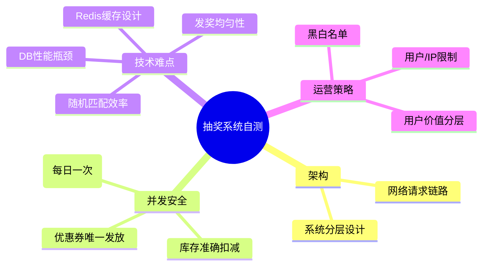

# Go 企业级抽奖项目: 课程复盘问题与思考

## 纲要

- 课程结尾的四类自测问题
- 架构类：网络请求链路、系统分层
- 并发安全类：防重入、库存扣减、优惠券唯一发放
- 难点类：DB 性能瓶颈、Redis 缓存设计、随机匹配效率、发奖均匀性
- 运营策略类：用户/IP 限制、黑白名单、用户价值分层

## 为什么用「问题」收尾

课程结尾先抛出自测问题，用于检验是否真正掌握内容。能清晰回答以下问题，说明知识体系已经闭环。

## 架构类问题

- **网络链路**：从用户访问到拿到抽奖返回，请求会经过哪些服务与处理？（负载均衡 → 应用服务 → Redis/MySQL）
- **系统分层**：架构分层设计分为哪几层、各层内容是什么？（业务层 / 框架层 / 服务层 / 资源层）

## 并发安全类问题

- **防重入**：一个用户每天只有一次抽奖机会，如何保证不超过唯一一次？（答案：Redis 原子计数 / 唯一约束 + 分布式锁）
- **库存扣减**：大量并发中奖后，奖品库存扣减如何保证不多扣、不少扣？（答案：Redis `DECR` 原子操作或数据库乐观锁 / 事务）
- **优惠券唯一性**：不同优惠券如何保证一个只发给一个用户，不重复？（答案：领取记录唯一索引 + 原子抢占）

## 技术难点类问题

- **DB 瓶颈**：基于数据库的抽奖在性能上的瓶颈在哪里？如何用 Redis 优化？
- **缓存边界**：什么场景适合用缓存、什么不适合？（读多写少适合；写远多于读不适合）
- **随机效率**：中奖概率随机匹配如何提升效率？（用随机数与奖品数字区间匹配，O(1) 命中）
- **发奖均匀**：为保证公平、各时段均匀发奖，如何设计与实现？（奖品池 + 发奖计划控制节奏）

## 运营策略类问题

- 针对用户与请求，要考虑哪些限制规则？
- 黑名单 / 白名单的作用与目的？
- 为区分用户价值，如何设计运营策略与规则？

## 小结

以上四类问题覆盖了「架构—并发—难点—运营」全维度。课程互动区可继续提出更细的疑问。

相关度：100%。是否需要继续：[否]。代码是否可运行：[否]。
