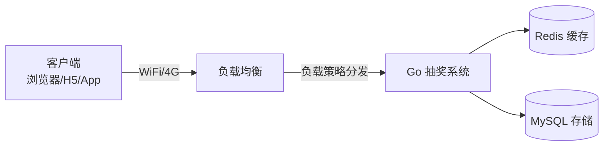

# Go 企业级抽奖项目: 课程总结（架构/难点/运营策略）

## 纲要

- 网络架构：客户端 → 负载均衡 → 应用服务 → Redis/MySQL
- 系统分层：业务层 / 框架层 / 服务层 / 资源层
- 难点总结：后台工作量、多份数据维护、缓存边界、随机匹配、发奖公平性
- 运营策略：用户限制、IP 限制、黑名单、用户等级（未实现）
- 扩展性：通过 Thrift RPC 把抽奖能力开放给其他产品

## 网络架构

最外层是用户客户端（浏览器、H5 或 App），经 WiFi/4G 访问服务端；服务端最外层是**负载均衡**，按策略把请求分发到后端应用服务器（即本次开发的抽奖系统）；抽奖系统依赖的数据来自 **Redis**（缓存）与 **MySQL**（存储），二者处于架构最底层。

## 系统分层

| 层 | 内容 |
| --- | --- |
| 业务层 | 抽奖系统的业务逻辑代码 |
| 框架层 | Web 框架（Iris）、RPC 框架（Thrift）等公共代码库 |
| 服务层 | 本次未调用第三方服务，故为空缺 |
| 资源层 | 底层数据库、缓存等资源 |

> 经验法则：**业务千差万别，架构差异却很小**。不必过早引入复杂先进架构，应优先选择"合适"的架构；过度设计代价大、效果未必好。

## 难点总结

- **后台工作量**：完整系统后台管理工作量较大。
- **多份数据维护**：同时引入数据库与缓存，多份数据的维护增加了系统复杂度与开发/运维成本。
- **缓存边界**：读多写少的数据适合引入 Redis；写远多于读则不适合。
- **随机匹配效率**：用随机数字 + 奖品的**数字区间**做获奖区间匹配，O(1) 命中，方法极简。
- **发奖公平性**：设计**奖品池**，通过控制池中奖品数量来控制发奖节奏，需要配套的填充服务与发奖计划。

## 运营策略总结

抽奖系统本质是一类**活动型产品**，需要极强的运营灵活性：

- 一天内单用户最多抽奖次数限制
- 大奖不重复发给同一人
- 同一 IP 增加类似限制
- 每日参与次数限制与黑名单限制
- **用户等级限制**（本次未实现）：可用于把奖品更多倾向新用户或老用户，更好达成运营目的

## 扩展性与结语

基于现有抽奖系统可实现更多活动；其他产品只需通过 **Thrift RPC 接口**调用抽奖服务，即可在自身产品中引入抽奖能力，无需重写逻辑。

上线后运营侧工作相对简单：日常维护奖品信息、更新奖品数量即可。

相关度：100%。是否需要继续：[否]。代码是否可运行：[否]。
