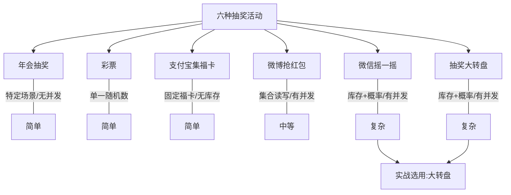

# Go 企业级抽奖项目: 抽奖大转盘活动分析

## 纲要

- 抽奖大转盘是六类活动中最后一种，也是课程实战最终选用的完整项目形态。
- 抽奖前用户即可看到全部奖品信息；后台可维护奖品、设置各奖品的中奖概率与数量限制——这一点与微信摇一摇高度相似。
- 更新奖品库存时存在并发安全性问题，同样与微信摇一摇类似。
- 横向对比：年会抽奖属特定场景、人数与奖品有限，无并发问题；彩票、集福卡、抢红包形式单一、实现简单；大转盘与微信摇一摇复杂度、灵活性最高。
- 正是因为大转盘对后台管理与系统设计的要求最高，掌握它即可全面理解抽奖活动，故被选为实战项目。

## 活动规则

一个完整的大转盘抽奖系统，奖品可以在后台维护，运营能够设置：

- 每个奖品的名称与展示信息；
- 每个奖品的中奖概率；
- 每个奖品的数量限制（无限量或有限量）。

用户进入活动页即可看到全部奖品与（或）概率，点击转动后由系统判定中奖结果。

## 与其他活动的对比

- **年会抽奖**：参与人数和奖品都有限，不存在并发安全问题，属特定场景应用。
- **彩票**：只需最后确定一个随机数，形式单一。
- **支付宝集福卡**：只有固定的五个福字，无库存概念，实现简单。
- **微博抢红包**：限定特定金额与发放个数，形式单一但有集合并发问题。
- **微信摇一摇 / 大转盘**：复杂度与灵活性都高，需要后台管理、库存扣减与并发控制，对系统设计的要求最高。

## 为什么选大转盘作为实战

大转盘与微信摇一摇在核心难点上一致（概率区间、库存扣减、并发安全），但它更直观地体现了"完整抽奖系统"的要素：可视化奖品、可调概率、可限量发奖、后台运营。能够独立设计与开发大转盘，就意味着已经掌握抽奖活动的通用方法论，因此课程把它作为后续完整项目的主线。

## 小结

六种活动共性很多，差异主要在"是否有库存、是否有共享状态、形式是否单一"。大转盘因复杂度与完整度最高被选为实战载体，后续将动手实现其奖品建模、抽奖接口与并发安全改造。

相关度：90%。是否需要继续：是。代码是否可运行：否。
