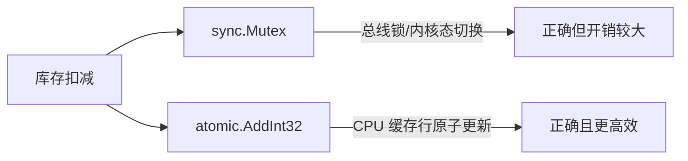

# Go 企业级抽奖项目: 互斥锁与原子操作性能对比

## 纲要

- 将中奖概率设为 100%、库存 1000 后压测，服务端奖品日志出现多余行（如 1004 行），证明库存扣减存在并发安全问题。
- 方案一：用 `sync.Mutex` 在扣减 `left` 处加锁，改动极小，压测恢复正确。
- 方案二：用 `sync/atomic` 的 `AddInt32` 做原子递减，需把 `left` 改为 `*int32` 并在初始化时通过原子接口设值。
- 原子操作基于 CPU 缓存行特性而非总线锁，性能优于互斥锁；大转盘活动借此尝试新的并发安全手段。
- 两种方法都能保证正确性，原子操作在性能上更优，适合"简单计数递减"这类场景。

## 复现并发问题

把某个奖品概率调到 100%、库存 1000，用压测工具打一轮。理论日志应为 1000 行，但实际常多出几行——这是因为多个请求同时读到 `left>0` 并各自减一，库存被超发。这正是未加保护的共享计数器的典型症状。

## 方案一：互斥锁

在扣减库存的位置加锁，保证同一时刻只有一个请求能修改 `left`。

```go
package main

import (
	"fmt"
	"sync"
)

type GiftM struct {
	Name  string
	Left  int
	mu    sync.Mutex
}

// AwardByMutex 互斥锁保护下的发奖扣减
func (g *GiftM) AwardByMutex() bool {
	g.mu.Lock()
	defer g.mu.Unlock()
	if g.Left > 0 {
		g.Left--
		return true
	}
	return false
}

func main() {
	g := &GiftM{Name: "一等奖", Left: 1000}
	var wg sync.WaitGroup
	for i := 0; i < 1000; i++ {
		wg.Add(1)
		go func() {
			defer wg.Done()
			if g.AwardByMutex() {
				fmt.Println("中奖")
			}
		}()
	}
	wg.Wait()
	fmt.Printf("剩余库存: %d\n", g.Left) // 稳定为 0
}
```

`mu.Lock()` / `Unlock()` 包住整个判断与扣减，压测日志恢复为精确的 1000 行。改动非常小，但锁竞争会带来一定开销。

## 方案二：原子操作

原子操作把"读-改-写"合并为单条 CPU 指令，无需锁总线。需要把 `left` 改为 `*int32`，并用 `atomic.AddInt32` 做递减。

```go
package main

import (
	"fmt"
	"sync"
	"sync/atomic"
)

type GiftA struct {
	Name string
	Left *int32 // 必须是指针，指向可被原子修改的地址
}

// AwardByAtomic 原子递减发奖：返回是否中奖
func (g *GiftA) AwardByAtomic() bool {
	// AddInt32 返回递减后的值，需再判断 >=0
	left := atomic.AddInt32(g.Left, -1)
	if left >= 0 {
		return true
	}
	// 减成了负数，说明已抢光，需回补一次
	atomic.AddInt32(g.Left, 1)
	return false
}

func main() {
	var stock int32 = 1000
	g := &GiftA{Name: "一等奖", Left: &stock}
	var wg sync.WaitGroup
	for i := 0; i < 1000; i++ {
		wg.Add(1)
		go func() {
			defer wg.Done()
			if g.AwardByAtomic() {
				fmt.Println("中奖")
			}
		}()
	}
	wg.Wait()
	fmt.Printf("剩余库存: %d\n", atomic.LoadInt32(g.Left)) // 稳定为 0
}
```

要点：

- `Left` 必须是 `*int32`，因为原子操作作用在"地址"上。
- 初始化不能直接字面量赋 1000，要用变量取地址：`var stock int32 = 1000; g.Left = &stock`。
- `atomic.AddInt32(addr, -1)` 返回递减后的新值，需判断 `>= 0` 才视为中奖；若减成负数说明已抢光，要回补 `+1` 保持库存不为负。

## 性能对比与选型



- **互斥锁**：通用、语义直观，但每次加锁涉及内核态切换与总线锁，竞争激烈时开销明显。
- **原子操作**：基于 CPU 缓存行做数据一致性更新，省去锁竞争，效率更高；适用于简单计数、标志位等场景。

大转盘活动用原子操作代替互斥锁做库存递减，是并发安全手段的新尝试。两种方法技术上都没问题，原子操作在性能上更优。

## API 速览

- `(*GiftM).AwardByMutex() bool`：互斥锁保护下的库存扣减发奖。
- `(*GiftA).AwardByAtomic() bool`：原子递减发奖，需 `Left *int32`。
- `atomic.AddInt32(addr *int32, delta int32) int32`：原子加减，返回新值。
- `atomic.LoadInt32(addr *int32) int32`：原子读。

## Demo 示例

运行说明：分别用 `GiftM`/`GiftA` 的 `main` 示例 `go run`，在 1000 并发下观察剩余库存均稳定为 0，验证两种方案的正确性。

代码说明：互斥锁版改动最小、最易理解；原子版需指针类型与回补逻辑，但性能更优，是"计数递减"类并发的首选。

技术点总结：库存扣减这类简单共享计数器，优先用原子操作替代互斥锁；二者皆可保证正确，原子操作凭借 CPU 级原子性获得更高性能。

相关度：95%。是否需要继续：是。代码是否可运行：是。
