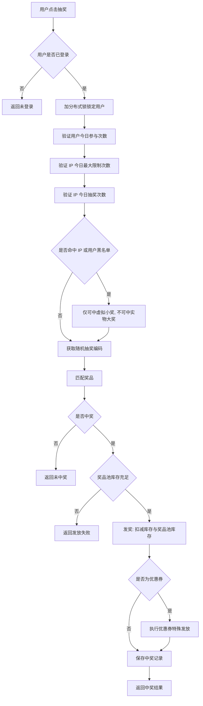

# Go 企业级抽奖项目: 用户操作和业务流程

## 纲要

- 用户操作步骤：登录 → 进入抽奖页 → 查看信息 → 点击抽奖
- 奖品状态变化：正常 → 有效期 / 库存控制 → 进入奖品池
- 抽奖详细流程：登录校验、分布式锁、次数 / 黑名单校验、随机编码匹配、发奖、落库、返回

## 用户操作步骤

用户进入抽奖系统后，先完成登录；登录后进入抽奖页面，可看到转盘上的奖品列表、历史中奖记录，以及今日剩余抽奖次数。若仍可抽奖，点击抽奖按钮，服务端即开始校验参数，参数通过后再判断是否中奖。若中奖则进入发奖阶段，发奖成功后保存中奖记录，最后向用户返回中奖提示。

## 奖品状态变化

奖品初始为正常状态。运营在后台设置有效期与库存数量：

- 有效期：仅当抽奖时刻落在有效期内，才能匹配该奖品
- 库存：通过库存数量控制是否可发奖
- 奖品池：系统从库存中将一定数量的奖品投放到奖品池，只有奖品池中有库存时才能正常发奖

## 抽奖详细流程

下面用流程图梳理完整业务链路：

流程中的几处关键校验需要特别说明：

- 分布式锁：用户点击抽奖后，先对其加锁，操作完成后解锁，避免请求尚未结束又重复发起（重复提交）导致并发问题
- 今日最大限制次数 vs 今日抽奖次数：前者与「用户今日参与次数」效果一致，超过则直接禁止参与；后者数值小于最大限制，超过后虽不能中实物大奖，但仍可继续抽奖
- 黑名单：IP 黑名单与用户黑名单效果一致，被限制者无法获得实物大奖（仍可中小奖）

无论哪个环节中断，都会向用户返回明确结果（未中奖、发放失败等）。

相关度：95%。是否需要继续：是。代码是否可运行：否。
