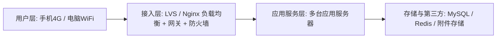
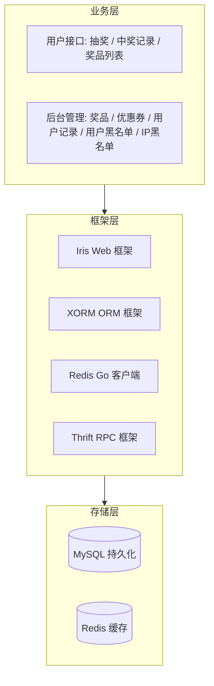

# Go 企业级抽奖项目: 系统架构设计

## 纲要

- 网络架构：用户层 → 接入层 → 应用层 → 存储 / 第三方服务
- 系统分层架构：存储层、框架层、业务层
- 技术选型：Iris（Web）、XORM（ORM）、Redis 客户端、Thrift（RPC）
- 架构理念：分层清晰、方案可对比取舍、贴合独立系统少依赖第三方

## 架构设计的本质

系统架构图之间具有高度相似性，难点不在于画图，而在于让开发人员理解「为什么选择当前方案，而非其他方案」。优秀的设计方案往往只呈现一个最终结论，但背后应有多个被对比否决的备选。

## 网络架构

- 用户层：通过 4G 或 WiFi 访问
- 接入层：LVS 或 Nginx 做负载均衡，外挂网关、防火墙，统一作为最外层接入
- 应用服务层：一个负载均衡后可挂载多台应用服务器（少则 3–5 台，多则 20+ 台）
- 存储 / 第三方：应用依赖数据库、缓存等；本抽奖系统后端依赖简单，第三方服务少

用户端请求尽量少的在中间层中转，以保证访问效率。

## 系统分层架构

- 存储层：MySQL 做持久化存储，Redis 做缓存（此处将二者归入存储层以简化视图）
- 框架层：Iris（Web 框架）、XORM（ORM 框架）、Redis Go 客户端，以及 Thrift（RPC 框架，用于生成 RPC 代码）
- 业务层：核心开发工作，分为用户接口（抽奖、中奖记录、奖品列表）与后台管理（奖品、优惠券、用户记录、用户黑名单、IP 黑名单）

本系统作为一套独立的完整系统，对第三方服务依赖较少，因此架构图相对简洁。若换成其他系统，可能还会引入消息队列、图片处理、用户中心登录等服务，但分层骨架大体一致。

相关度：95%。是否需要继续：是。代码是否可运行：否。
