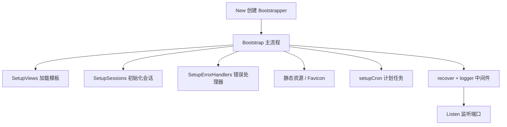

# Go 企业级抽奖项目: Web 站点初始化构建

## 纲要

- 启动器设计：自定义 `Bootstrapper`，通过 Go 的匿名嵌入（embedding）继承 `iris.Application`，在复用 Iris 全部能力的同时扩展项目专属初始化逻辑。
- 配置器模式：`Configurator` 是一等函数类型，外部以函数方式注入配置，启动流程灵活可组合。
- 视图引擎：注册 HTML 模板引擎，开启开发期热加载，并向模板注入 `FromUnixtime` / `FromUnixtimeShort` 等自定义函数。
- 错误处理器：统一捕获非成功状态码，按请求参数决定返回 JSON 还是渲染错误页。
- 静态资源与会话：挂载 `public` 静态目录、favicon，并初始化基于 `securecookie` 的 Session。
- 中间件：注册 `recover`（异常恢复）与 `logger`（访问日志）中间件。

## Bootstrapper 结构

`bootstrap` 包是站点的“启动器”。它利用 Go 的结构体匿名嵌入，让 `Bootstrapper` 直接拥有 `iris.Application` 的方法，等价于“继承”。同时用 `Configurator` 函数类型把配置过程参数化：

```go
package bootstrap

import (
	"time"

	"github.com/gorilla/securecookie"
	"github.com/kataras/iris"
	"github.com/kataras/iris/middleware/logger"
	"github.com/kataras/iris/middleware/recover"
	"github.com/kataras/iris/sessions"

	"imooc.com/lottery/conf"
	"imooc.com/lottery/cron"
)

// Configurator 是一个配置函数类型，用于向应用注入定制配置
type Configurator func(*Bootstrapper)

// Bootstrapper 通过匿名嵌入 iris.Application 复用其全部能力
type Bootstrapper struct {
	*iris.Application
	AppName      string
	AppOwner     string
	AppSpawnDate time.Time

	Sessions *sessions.Sessions
}

// New 创建一个新的 Bootstrapper，并立即应用传入的配置函数
func New(appName, appOwner string, cfgs ...Configurator) *Bootstrapper {
	b := &Bootstrapper{
		AppName:      appName,
		AppOwner:     appOwner,
		AppSpawnDate: time.Now(),
		Application:  iris.New(),
	}
	for _, cfg := range cfgs {
		cfg(b)
	}
	return b
}
```

## 视图引擎与模板函数

`SetupViews` 加载 HTML 模板，开发期开启 `Reload(true)` 以便随时改模板生效；并向模板注册两个时间格式化函数，前端可直接在模板里调用：

```go
// SetupViews 加载模板
func (b *Bootstrapper) SetupViews(viewsDir string) {
	htmlEngine := iris.HTML(viewsDir, ".html").Layout("shared/layout.html")
	// 每次重新加载模版（线上关闭它）
	htmlEngine.Reload(true)
	// 给模版内置各种定制的方法
	htmlEngine.AddFunc("FromUnixtimeShort", func(t int) string {
		dt := time.Unix(int64(t), int64(0))
		return dt.Format(conf.SysTimeformShort)
	})
	htmlEngine.AddFunc("FromUnixtime", func(t int) string {
		dt := time.Unix(int64(t), int64(0))
		return dt.Format(conf.SysTimeform)
	})
	b.RegisterView(htmlEngine)
}
```

## 统一错误处理器

错误页面既要支持 JSON 又要支持 HTML，通过判断请求是否带 `json` 参数来分流：

```go
// SetupErrorHandlers 准备 HTTP 错误处理器
func (b *Bootstrapper) SetupErrorHandlers() {
	b.OnAnyErrorCode(func(ctx iris.Context) {
		err := iris.Map{
			"app":     b.AppName,
			"status":  ctx.GetStatusCode(),
			"message": ctx.Values().GetString("message"),
		}
		// 若请求带 json 参数，则以 JSON 输出错误信息
		if jsonOutput := ctx.URLParamExists("json"); jsonOutput {
			ctx.JSON(err)
			return
		}
		// 否则渲染错误模板
		ctx.ViewData("Err", err)
		ctx.ViewData("Title", "Error")
		ctx.View("shared/error.html")
	})
}
```

## Bootstrap 主流程

`Bootstrap()` 把视图、会话、错误处理、静态资源、中间件按顺序装配起来，返回启动器自身：

```go
const (
	// StaticAssets 是图片、css、js 等静态资源的根目录
	StaticAssets = "./public"
	// Favicon 是相对 StaticAssets 的站点图标路径
	Favicon = "/favicon.ico"
)

// Bootstrap 准备应用，返回自身
func (b *Bootstrapper) Bootstrap() *Bootstrapper {
	b.SetupViews("./views")
	b.SetupSessions(24*time.Hour,
		[]byte("the-big-and-secret-fash-key-here"),
		[]byte("lot-secret-of-characters-big-too"),
	)
	b.SetupErrorHandlers()

	// 静态文件
	b.Favicon(StaticAssets + Favicon)
	b.StaticWeb(StaticAssets[1:], StaticAssets)
	indexHtml, err := ioutil.ReadFile(StaticAssets + "/index.html")
	if err == nil {
		b.StaticContent(StaticAssets[1:]+"/", "text/html", indexHtml)
	}
	iris.WithoutPathCorrectionRedirection(b.Application)

	// 计划任务（后续章节补充）
	b.setupCron()

	// 中间件，放在静态文件之后
	b.Use(recover.New())
	b.Use(logger.New())

	return b
}

// Listen 启动 HTTP 服务
func (b *Bootstrapper) Listen(addr string, cfgs ...iris.Configurator) {
	b.Run(iris.Addr(addr), cfgs...)
}
```

`Configure` 则用于把外部传入的配置函数逐个执行：

```go
func (b *Bootstrapper) Configure(cs ...Configurator) {
	for _, c := range cs {
		c(b)
	}
}
```

## 启动顺序小结



## API 速览

| 方法 | 说明 |
| --- | --- |
| `New(name, owner, cfgs...) *Bootstrapper` | 创建并应用配置函数 |
| `(*Bootstrapper) Bootstrap() *Bootstrapper` | 装配视图/会话/错误/静态/中间件 |
| `(*Bootstrapper) Configure(cs...)` | 执行外部配置函数 |
| `(*Bootstrapper) Listen(addr)` | 启动 HTTP 监听 |
| `(*Bootstrapper) SetupViews(dir)` | 注册 HTML 模板引擎 |
| `(*Bootstrapper) SetupErrorHandlers()` | 注册统一错误处理器 |
| `(*Bootstrapper) SetupSessions(...)` | 初始化 securecookie 会话 |

## Demo 示例

运行说明：示例整合了 `New → Bootstrap → Configure → Listen` 的最小启动过程。

```go
package main

import (
	"fmt"

	"imooc.com/lottery/bootstrap"
	"imooc.com/lottery/web/routes"
)

func newApp() *bootstrap.Bootstrapper {
	app := bootstrap.New("Go抽奖系统", "一凡Sir")
	app.Bootstrap()
	app.Configure(routes.Configure) // 注入路由配置
	return app
}

func main() {
	app := newApp()
	app.Listen(fmt.Sprintf(":%d", 8080))
}
```

代码说明：`routes.Configure` 在下一节介绍；此处展示启动器如何被组装并监听 `:8080`。

技术点总结：匿名嵌入让 `Bootstrapper` 零成本复用 Iris 全部能力；`Configurator` 函数类型把“怎么配置”延迟到外部决定，启动流程高度解耦；模板函数、错误分流、静态资源与中间件在此一站式装配，是后续控制器与路由能直接工作的前提。

## 总结

## 📎 文本↔代码关联

本讲在课程知识图谱（见 `_GRAPH.json` / `_GRAPH.mmd`）中关联以下代码文件：

- `code/lottery/web/views/shared/error.html`
- `code/lottery/web/views/admin/index.html`
- `code/lottery/web/middleware/basicauth.go`
- `code/lottery/web/controllers/index_lucky_5check_blackuser.go`
- `code/lottery/web/controllers/index_lucky_4check_blakip.go`
- `code/lottery/web/controllers/index_lucky_4check_blackip.go`
- `code/lottery/web/viewmodels/view_gift.go`
- `code/lottery/web/controllers/index_lucky_9prize.go`

> 关联由 `scan_course.py` 自动建立，边类型 `uses-code`（讲次 → 代码）。

相关度：100%。是否需要继续：是。代码是否可运行：否。
