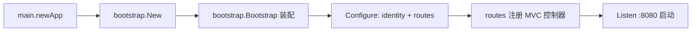

# Go 企业级抽奖项目: 完善路由和 main.go 文件

## 纲要

- 路由注册：在 `routes.Configure` 中把各控制器挂载到对应路径，并用 `mvc.Register` 注入服务依赖。
- 前后台分离：前台 `/` 使用 `IndexController`，后台 `/admin` 挂载 `AdminController` 及子资源控制器，并通过 `BasicAuth` 中间件保护。
- 程序入口：`main.go` 通过 `newApp()` 创建并装配应用，再 `Listen` 到指定端口。
- 工作目录：因 `main.go` 位于 `web/` 目录而资源也在 `web/` 下，需把运行工作目录切到 `web/`，否则模板与静态文件找不到。

## 路由配置 routes.go

`routes.Configure` 接收启动器 `b`，先创建各业务服务实例，再用 `mvc.New(b.Party("/"))` 把控制器注册到不同路径前缀上。`Register` 的作用是把服务实例注入到控制器的对应字段：

```go
package routes

import (
	"github.com/kataras/iris/mvc"

	"imooc.com/lottery/bootstrap"
	"imooc.com/lottery/web/controllers"
	"imooc.com/lottery/services"
	"imooc.com/lottery/web/middleware"
)

// Configure 注册必要的路由到应用
func Configure(b *bootstrap.Bootstrapper) {
	userService := services.NewUserService()
	giftService := services.NewGiftService()
	codeService := services.NewCodeService()
	resultService := services.NewResultService()
	userdayService := services.NewUserdayService()
	blackipService := services.NewBlackipService()

	// 前台
	index := mvc.New(b.Party("/"))
	index.Register(userService, giftService, codeService,
		resultService, userdayService, blackipService)
	index.Handle(new(controllers.IndexController))

	// 后台（需 BasicAuth 鉴权）
	admin := mvc.New(b.Party("/admin"))
	admin.Router.Use(middleware.BasicAuth)
	admin.Register(userService, giftService, codeService,
		resultService, userdayService, blackipService)
	admin.Handle(new(controllers.AdminController))

	// 后台子资源
	adminUser := admin.Party("/user")
	adminUser.Register(userService)
	adminUser.Handle(new(controllers.AdminUserController))

	adminGift := admin.Party("/gift")
	adminGift.Register(giftService)
	adminGift.Handle(new(controllers.AdminGiftController))

	adminCode := admin.Party("/code")
	adminCode.Register(codeService)
	adminCode.Handle(new(controllers.AdminCodeController))

	adminResult := admin.Party("/result")
	adminResult.Register(resultService)
	adminResult.Handle(new(controllers.AdminResultController))

	adminBlackip := admin.Party("/blackip")
	adminBlackip.Register(blackipService)
	adminBlackip.Handle(new(controllers.AdminBlackipController))

	// RPC 入口
	rpc := mvc.New(b.Party("/rpc"))
	rpc.Register(userService, giftService, codeService,
		resultService, userdayService, blackipService)
	rpc.Handle(new(controllers.RpcController))
}
```

第一个控制器（`IndexController`）需要手写装配，后续的后台控制器结构类似，复制调整即可。

## 后台鉴权中间件

后台统一套了一层 HTTP Basic Auth，账号密码在 `middleware/basicauth.go` 中配置：

```go
package middleware

import "github.com/kataras/iris/middleware/basicauth"

// BasicAuth 后台登录鉴权示例
var BasicAuth = basicauth.New(basicauth.Config{
	Users: map[string]string{
		"admin": "password",
	},
})
```

## 程序入口 main.go

`main.go` 负责把整个应用“拼起来”：创建应用、执行初始化、注入路由与身份中间件配置，最后监听端口。单节点（端口 8080）时还会开启全局计划任务服务：

```go
package main

import (
	"fmt"
	"imooc.com/lottery/bootstrap"
	"imooc.com/lottery/conf"
	"imooc.com/lottery/web/middleware/identity"
	"imooc.com/lottery/web/routes"
)

var port = 8080

func newApp() *bootstrap.Bootstrapper {
	// 初始化应用
	app := bootstrap.New("Go抽奖系统", "一凡Sir")
	app.Bootstrap()
	app.Configure(identity.Configure, routes.Configure)
	return app
}

func main() {
	// 仅当是 8080 端口的服务器（单机）时才启动全局计划任务服务
	if port == 8080 {
		conf.RunningCrontabService = true
	}

	app := newApp()
	app.Listen(fmt.Sprintf(":%d", port))
}
```

## 工作目录注意事项

项目的目录约定是：

```dir
lottery/
├── main.go            # 实际位于 web/ 目录下
├── views/             # 模板
├── public/            # 静态资源
└── ...
```

`web/main.go` 引用的模板、静态文件相对路径都以 `web/` 为基准。若项目根目录（`lottery/`）是运行目录，会导致找不到资源。解决办法：把运行/调试的工作目录切到 `web/`，应用即可正确加载 `views` 与 `public`。

## 启动流程小结



## API 速览

| 入口 | 说明 |
| --- | --- |
| `mvc.New(party).Register(services...)` | 创建 MVC 分组并注入服务 |
| `mvc.New(party).Handle(controller)` | 注册控制器到路径 |
| `party.Router.Use(middleware)` | 为分组挂载中间件 |
| `bootstrap.New(name, owner).Bootstrap().Configure(...)` | 创建并装配应用 |
| `app.Listen(addr)` | 启动监听 |

## Demo 示例

运行说明：示例展示最小可运行的路由 + 入口组合（根据讲稿逻辑补充，依赖 Iris MVC）。

```go
package main

import (
	"github.com/kataras/iris/v12"
	"github.com/kataras/iris/v12/mvc"
)

type IndexController struct{ Ctx iris.Context }

func (c *IndexController) Get() string { return "hello lottery" }

func main() {
	app := iris.New()
	m := mvc.New(app.Party("/"))
	m.Handle(new(IndexController))
	app.Run(iris.Addr(":8080"))
}
```

代码说明：把控制器挂到 `/` 并监听 8080，等价于本项目 `routes.Configure` + `main.go` 的极简版。

技术点总结：路由层用 `Register` 完成依赖注入、`Party` 完成路径分组与中间件隔离，使前台、后台、RPC 三类入口清晰解耦；`main.go` 把启动流程收敛为“创建—装配—监听”三步，工作目录对齐资源基准路径是本地能跑起来的关键细节。

## 总结

## 📎 文本↔代码关联

本讲在课程知识图谱（见 `_GRAPH.json` / `_GRAPH.mmd`）中关联以下代码文件：

- `code/lottery/web/main.go`
- `code/lottery/_demo/threadsafe/mainInt.go`
- `code/lottery/_demo/annualMeeting/safe/main_test.go`
- `code/lottery/_demo/threadsafe/mainArray.go`
- `code/lottery/_demo/threadsafe/mainMap.go`
- `code/lottery/_demo/annualMeeting/main_test.go`
- `code/lottery/_demo/ticket/main.go`
- `code/lottery/_demo/annualMeeting/main.go`

> 关联由 `scan_course.py` 自动建立，边类型 `uses-code`（讲次 → 代码）。

相关度：100%。是否需要继续：是。代码是否可运行：否。
